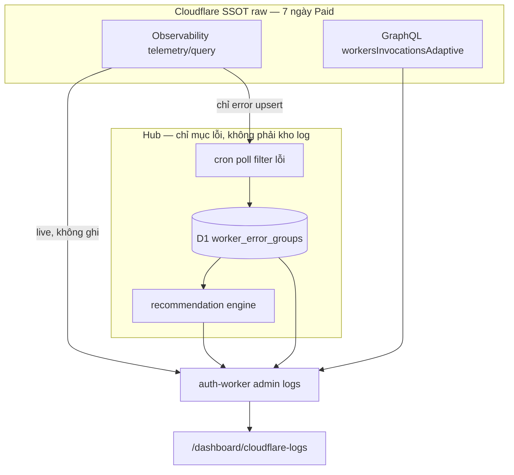

# Spec: Admin — lỗi Worker Cloudflare (chỉ mục + khuyến nghị sửa, không kho log)

> **Trạng thái:** Draft v1.1 — sẵn sàng code  
> **Phiên bản:** 1.1  
> **Ngày:** 2026-09-21  
> **Phạm vi:** Màn admin nội bộ **đọc** log/trace/exception từ Cloudflare Observability (SSOT 7 ngày), **chỉ persist** chỉ mục lỗi + trạng thái sửa + khuyến nghị ổn định — không phải kho log thứ hai, không phải log usage khách hàng  
> **v1.1:** cấm sao chép raw Workers Logs / Logpush / Tail-warehouse; Hub chỉ lưu lỗi đã rút gọn để khuyến nghị admin  
> **Bổ sung, không thay thế:** FinOps hạ tầng → [`admin-cloudflare-usage-spec.md`](./admin-cloudflare-usage-spec.md); sức khoẻ luồng DO→D1→R2 → [`admin-data-pipeline-health-spec.md`](./admin-data-pipeline-health-spec.md); economics khách hàng → [`business-model-one-credit-spec.md`](./business-model-one-credit-spec.md)  
> **Không thay thế:** Monitor Logs (`service_usages`) → `/dashboard/monitor/logs`; Cloudflare Dashboard Observability; `wrangler tail`

Nguyên tắc giữ từ spec Credit / Cloudflare usage:

- Khách hàng **không** thấy log kỹ thuật Worker, stack, path nội bộ, token, hay PII trong log.
- Màn này là **Ops nội bộ** (SRE / on-call admin). Usage FinOps đo *bao nhiêu log event đã viết*; màn này đọc *nội dung* để sửa bug.
- Workers Logs **tốn** `workers.logs_events` (Paid: 20M/tháng included, $0.60/M overage, giữ **7 ngày**). Query phải tôn sampling đã có trên màn Cloudflare usage. **Cấm** persist thêm một bản raw trên D1/R2.

Coding bám spec này. **Không** nhúng API token Cloudflare vào browser. Client chỉ nhận DTO đã redaction.

---

## 0. Hiện trạng repo và bất cập phải vá

Hub chạy 5 Worker, `observability.enabled = true`, **không** `head_sampling_rate` (100%). Admin **không** có chỗ nào trong Hub xem lỗi runtime Cloudflare.

| Cần thấy | Hiện có |
|----------|---------|
| Exception / 5xx / exceededCpu theo script | Phải vào Cloudflare Dashboard → Worker → Observability |
| Nhóm lỗi giống nhau (fingerprint) | Không. Mỗi dòng log rời |
| Drill-down 1 invocation (request → console → exception) | `wrangler tail` (live) hoặc Query Builder trên CF |
| Lịch sử raw > 7 ngày | **Không persist.** CF Paid giữ 7 ngày; Hub chỉ nhớ fingerprint + last excerpt để biết lỗi còn lặp |
| Phân biệt warn vận hành vs bug | Code đã có (`http-errors.ts`) nhưng UI không đọc |
| DLQ queue thành incident | Queue ghi `queue.dlq_*` / `consumer.dlq_*`; không inbox |
| Alert khi burst lỗi | Cloudflare usage chỉ alert *overage allotment*, không alert exception |
| Vòng lặp sửa: ack → đang sửa → resolved | Không |

File liên quan, **không** làm việc này:

| File | Việc đang làm |
|------|----------------|
| [`/dashboard/monitor/logs`](../workers/web/src/app/(main)/dashboard/monitor/logs/page.tsx) | `service_usages` — log **gọi API dịch vụ** của member (billing). Không phải Worker crash |
| [`admin-cloudflare-usage-spec.md`](./admin-cloudflare-usage-spec.md) | FinOps: included, overage, sampling. Explicit non-goal: “logs raw, tail, deploy” |
| [`cloudflare-usage/sampling.ts`](../workers/auth-worker/src/features/admin/cloudflare-usage/sampling.ts) | Apply `head_sampling_rate` queue/consumer/cron — **ảnh hưởng** volume log màn này đọc |
| [`shared/logger.ts`](../workers/auth-worker/src/shared/logger.ts) | JSON `{ ts, level, service, component?, event }` — đã tương thích Workers Logs / Logpush |
| [`shared/http-errors.ts`](../workers/auth-worker/src/shared/http-errors.ts) | `log.warn` cho lỗi vận hành (4xx); `log.error` cho infra / 5xx bất ngờ |
| [`cloudflare-usage/alerts.ts`](../workers/auth-worker/src/features/admin/cloudflare-usage/alerts.ts) | In-app + email khi metric **projected_over** — tái dùng kênh, không tái dùng predicate |

### 0.1 Inventory Worker (SSOT)

Khớp [`inventory.ts`](../workers/auth-worker/src/features/admin/cloudflare-usage/inventory.ts):

| Script | Handler chính | Nguồn lỗi điển hình |
|--------|----------------|---------------------|
| `aiagents-hub-auth-worker` | fetch, WS (UserDO / UserShardDO / BroadcastServiceDO), cron `20 17 * * *` UTC, produce queue, consume `workflow-cron-queue` | `handler.request_error`, PayPal, eKYC, workflow executor, DO hibernation, cron contribution |
| `aiagents-hub-trading-sto` | OpenNext SSR, `cpu_ms = 300000`, static assets | SSR 5xx, CPU timeout, RSC/asset mismatch. Logger Hub **chưa** thống nhất |
| `aiagents-hub-queue-worker` | consume `input-part-0` + `error-queue-dlq`; AE `aiagents-hub-queue-analytics` | `queue.chunk_failed`, `queue.dlq_*`, D1 insert |
| `aiagents-hub-consumer-worker` | WS broadcast queue + DLQ; `SHARD_COUNT = 1000` | `consumer.message_failed`, `consumer.dlq_entry` |
| `aiagents-hub-d1tor2-cron` | cron `59 16 * * *` UTC; Pipelines / R2 lakehouse | `cron.pipeline_failed`, `cron.failed` |

Queue DLQ (tín hiệu lỗi, không phải Workers Logs):

- `aiagents-hub-error-queue-dlq`
- `aiagents-hub-ws-broadcast-dlq`
- `aiagents-hub-workflow-cron-dlq`

### 0.2 Logger Hub đã có (hợp đồng bắt buộc khi code)

Auth / queue / consumer / d1tor2 dùng `createLogger`. Một dòng JSON:

```json
{
  "ts": "2026-09-21T03:14:15.123Z",
  "level": "error",
  "service": "auth-worker",
  "component": "paypal-sub",
  "event": "paypal.sub.create_failed",
  "errorName": "TypeError",
  "errorMessage": "...",
  "stack": "..."
}
```

Redaction sẵn: key khớp `password|secret|token|api[_-]?key|authorization|cookie|credential|sessionid|private` → `[REDACTED]`. Màn admin **không** nới redaction. Stack cắt 8 dòng ở logger — UI không yêu cầu stack đầy đủ.

**Lệch phải vá (phase 1, nhỏ):** `aiagents-hub-trading-sto` (OpenNext) không đi `createLogger`. v1 vẫn đọc invocation log CF (`$cloudflare.$metadata.type = "cf-worker-event"`) + `$workers.outcome` / `$workers.event.response.status`. Phase 2 mới bọc logger web nếu khả thi (OpenNext middleware) — **không** chặn ship v1.

### 0.3 Quyết định vá (bắt buộc khi code)

1. Màn **admin-only**, step-up như Cloudflare usage / Contribution. Member không thấy sidebar, URL redirect.
2. Browser **không** gọi `api.cloudflare.com`. Auth-worker proxy Observability API bằng token Secrets Store.
3. **SSOT raw log = Cloudflare Workers Logs.** Hub **không** copy `console.*`, invocation body, hay `workers_trace_events`. Chi tiết 7 ngày → query telemetry lúc admin mở. Nguồn **tỉ lệ lỗi / CPU**: GraphQL `workersInvocationsAdaptive` (tái dùng client usage). Nguồn **inbox / khuyến nghị bền**: D1 chỉ mục fingerprint (cron poll **chỉ** event lỗi). **Cấm** Tail Worker làm warehouse. **Cấm** Logpush raw vào R2 lakehouse (trùng CF + tốn Class A/storage).
4. UI mặc định là **Error inbox + khuyến nghị sửa**, không phải dump `console.log`. Explorer = proxy live CF, filter mặc định **chỉ lỗi** (`$metadata.error EXISTS` **hoặc** outcome crash **hoặc** HTTP ≥ 500 **hoặc** `level=error`). Warn vận hành **không** ghi D1.
5. `outcome = "ok"` **không** nghĩa user OK. HTTP 5xx từ handler bắt exception vẫn `ok`. Filter kép: outcome ∈ `{exception, exceededCpu, exceededMemory}` **hoặc** `$workers.event.response.status >= 500` **hoặc** custom log `level = error`.
6. Fingerprint **rule-based**. v1 **cấm** gọi Workers AI / gateway `unitoken` để tóm tắt từng dòng (tốn neuron). v2: 1 lần paraphrase / fingerprint sau khi nhóm.
7. Tôn sampling: nếu usage admin hạ `head_sampling_rate` trên queue/consumer/cron, inbox **ghi** `sampled: true` và không tuyên bố “0 lỗi”. Auth + web giữ 100% trừ khi admin đổi tay trên CF.
8. Token: tái dùng `CLOUDFLARE_USAGE_API_TOKEN` **nếu** đã có Workers Observability Read (+ query). Thiếu quyền → 503 `observability_unreadable`, fail closed, không giả empty-success. **Không** Workers Edit / Account Write. Query API đôi khi đòi scope Observability Write — nếu CF bắt Write, token chỉ thêm đúng permission Observability, **không** Script Edit.
9. Không in token, cookie, sessionId, raw request headers, eKYC image URL, PayPal webhook body đầy đủ ra client. Adapter redaction lần 2 trên DTO (phòng log cũ chưa redact).
10. Không tự deploy / rollback Worker từ UI v1. Link “mở file” là path repo + event name, không auto-PR.
11. Persist Hub **chỉ** hàng lỗi (exception / 5xx / exceededCpu|Memory / `log.error` infra / DLQ). Mỗi fingerprint: 1 excerpt ≤ 512 byte (ghi đè last), counter, status, runbook. Không bảng `worker_error_samples`. Cap 500 group open; `resolved`/`ignored` xóa sau 90 ngày.

---

## 1. Mục tiêu / non-goals

### 1.1 Mục tiêu

Admin mở một màn, cache hit < 3 giây, thấy:

1. **Sức khỏe 5 Worker** — requests, errors GraphQL, % error, P50/P99 CPU (nếu có), outcome mix, 5xx vs exception, DLQ pending nếu API queues đủ quyền.
2. **Inbox lỗi** — nhóm fingerprint, count 1h / 24h / 7d, first/last seen, worker, component, severity, status (new / ack / investigating / resolved / ignored).
3. **Khoan invocation** — query **live** CF cùng invocation id (trong cửa sổ 7 ngày). Hub không lưu full stream.
4. **Explorer** — proxy live CF; đóng tab là hết, không ghi D1.
5. **Khuyến nghị sửa** — rule Hub: lỗi nào đang phá ổn định, file nào, hành động gì (advisory).
6. **Vòng sửa** — status + note trên fingerprint (đây là dữ liệu **chỉ Hub mới có**, không trùng CF).
7. **Cảnh báo burst** (phase 2) — từ **counter D1** sau cron poll, không cần Tail trên mọi request.

### 1.2 Non-goals

- Log usage dịch vụ khách (`service_usages`) — giữ `/dashboard/monitor/logs`.
- FinOps log volume / overage USD — giữ Cloudflare usage (`workers.logs_events`).
- Datadog / Sentry / Axiom SaaS (v1 ở trong Cloudflare + Hub).
- Live multiplex `wrangler tail` trong browser.
- **Kho log thứ hai:** Tail Worker persist payload, Logpush `workers_trace_events` → R2, D1 full events, Analytics Engine copy mọi request.
- Tự patch code, auto-deploy, auto-sampling từ màn logs (sampling đã có màn usage).
- Traces 100% / OpenTelemetry collector (tốn span + trùng Workers Logs).
- Multi-account Cloudflare.
- Hiển thị log cho member / creator workflow (workflow run log là sản phẩm khác).
- Persist `log.warn` vận hành (4xx, captcha, session) — chỉ xem live trên CF nếu admin bật filter tạm.

---

## 2. Chống trùng lặp: CF giữ raw, Hub giữ lỗi đã rút

### 2.1 Đánh giá chồng (bắt buộc khi code)

Cloudflare **đã** thu và index mọi `console.*` + invocation log vì 5 Worker `observability.enabled` (100% sample). Paid: 7 ngày, đã tính vào `workers.logs_events`. Query Builder / Telemetry API đọc được.

| Lưu trên Hub | Trùng CF? | Quyết định |
|--------------|-----------|------------|
| Raw events / invocation body / stack đầy đủ | **Có** — cùng bytes CF giữ 7 ngày | **Cấm** |
| Logpush `workers_trace_events` → R2 lakehouse | **Có** + R2 Class A + storage | **Cấm** (không phải “backup an toàn”, là double-bill) |
| Tail Worker ghi sample D1 | **Có** (7 ngày đầu) + **mọi** request producer kích hoạt tail = thêm `workers.requests` + CPU | **Cấm** warehouse. Không gắn `tail_consumers` để lưu log |
| Analytics Engine copy mọi request | Gần trùng GraphQL invocations | **Cấm** thêm dataset logs; AE queue hiện tại giữ nguyên việc queue, không nhét obs |
| Fingerprint + count + last_seen + status + note | **Không** — CF không có vòng sửa / khuyến nghị Hub | **Cho phép** |
| Excerpt ≤ 512 byte last error (ghi đè) | Trùng một phần, cố ý: đủ để khuyến nghị sau khi CF hết 7 ngày | **Cho phép 1 dòng / group** |
| Warn/info/debug | CF đã có | **Không persist**; explorer live nếu admin bật |

Kết luận: kho log Hub = **lãng phí** (D1 rows, R2, Tail request, PII surface) mà **không** thêm khả năng debug trong 7 ngày — telemetry CF làm tốt hơn. Giá trị Hub = **nhóm lỗi + khuyến nghị sửa để hệ thống ổn định**, sống lâu hơn raw log.

### 2.2 Hai lớp dữ liệu (bắt buộc tách trên UI)



| Lớp | Độ trễ | Retention | Dùng cho |
|-----|---------|-----------|----------|
| A. Telemetry live | giây–phút | 7 ngày CF | Explorer, invocation, excerpt mới |
| B. GraphQL | ~phút | analytics CF | Health / error rate — **không** lưu time-series Hub |
| C. D1 chỉ mục | sau cron (≤ 1h; refresh tay) | 90 ngày **group**, không raw | Inbox, status, khuyến nghị, burst |

UI badge: `live_cf` | `hub_index` | `dlq`. Không badge `hub_tail` / `r2_logpush`.

Chú thích UI: GraphQL `sum.errors` ≠ số `console.error`. Raw 7 ngày ở CF; sau 7 ngày Hub chỉ còn fingerprint + excerpt + “vẫn open → cần sửa”.

---

## 3. API Cloudflare (adapter, không hard-code field lạ im lặng)

Nguồn docs 2026-09: [Workers Logs](https://developers.cloudflare.com/workers/observability/logs/workers-logs/), [Query Builder](https://developers.cloudflare.com/workers/observability/query-builder/), [Telemetry query](https://developers.cloudflare.com/api/resources/workers/subresources/observability/subresources/telemetry/methods/query/), [Errors](https://developers.cloudflare.com/workers/observability/errors/), [Tail Workers](https://developers.cloudflare.com/workers/observability/logs/tail-workers/), [Workers Logpush](https://developers.cloudflare.com/workers/observability/logs/logpush/).

### 3.1 Telemetry REST

```
POST https://api.cloudflare.com/client/v4/accounts/{ACCOUNT_ID}/workers/observability/telemetry/query
POST .../telemetry/keys
POST .../telemetry/values
```

`timeframe.from` / `to` = Unix **milliseconds**. Limit mặc định Hub 100, max 500 / request. Time window mặc định 1 giờ; max 7 ngày — window > 24h bắt buộc thêm filter script hoặc level (tránh query nặng + sample ẩn).

`view`:

| view | Màn |
|------|-----|
| `calculations` | Health / timeseries count group by script, outcome, status, event |
| `events` | Explorer dòng |
| `invocations` | Drill-down 1 request |
| `traces` | **Không bật** mặc định (span bill + trùng logs). Hub không persist span |

`parameters.datasets`: `["cloudflare-workers"]`. Discover field bằng `/telemetry/keys` lúc sync (cache KV 6 giờ). Map nội bộ; field CF đổi → hàng `unmapped`, không 500 cả trang.

Filter seed ( Hub ):

| Ý định | Filter gợi ý |
|--------|----------------|
| Có exception | `{ key: "$metadata.error", operation: "exists", type: "string" }` — docs: `$metadata.error EXISTS` |
| Outcome crash | `$workers.outcome` `in` `exception`, `exceededCpu`, `exceededMemory` |
| HTTP 5xx | `$workers.event.response.status` `gte` 500 |
| Script | `$workers.scriptName` `eq` một trong 5 tên §0.1 |
| Custom error JSON | needle hoặc key từ structured log: `level` / `event` / `service` sau khi CF index JSON |
| Invocation | `$cloudflare.$metadata.type` `eq` `cf-worker-event` |

Pagination: `offset` = `$metadata.id` của event cuối (theo docs query). Hub DTO `nextCursor`. Không infinite scroll > 5 trang không filter.

### 3.2 GraphQL (tái dùng client usage)

Dataset: `workersInvocationsAdaptive` — `sum.requests`, `sum.errors`, `quantiles.cpuTimeP50/P99`, dimension `scriptName` (+ `datetimeHour` sparkline 24h).

Lọc `accountTag = ACCOUNT_ID`. Chỉ 5 script Hub — script lạ trên account → card “orphan script” (link inventory usage), không trộn vào health Hub.

### 3.3 Queues REST (optional, swallow)

`GET /accounts/{id}/queues` đã nằm inventory usage. Thêm message count / DLQ nếu field có. Fail → card DLQ `unavailable`, không chặn inbox.

### 3.4 Tail Worker — không dùng để lưu log

Gắn `tail_consumers` trên 5 producer = **một invocation Tail cho mọi request thành công**, kể cả khi filter bỏ 99%. Đó là nhân `workers.requests` + CPU, trùng việc CF đã ghi Workers Logs.

**Cấm** Worker `aiagents-hub-obs-tail` cho warehouse / sample D1 / export HTTP.

Burst: cron poll telemetry **chỉ filter lỗi** (limit nhỏ) + so count D1. Đủ cho on-call; không cần Tail real-time v1/v2.

Ngoại lệ **không** mở trong spec này: Tail chỉ forward lỗi ra PagerDuty — vẫn tốn 100% producer tails. Nếu sau này cần sub-phút, thiết kế lại (sample tail **hoặc** queue error từ `createLogger` trên đường `log.error` sẵn có — zero extra CF log copy). Không làm trong PR logs.

### 3.5 Logpush → R2 — cấm mặc định

Logpush `workers_trace_events` = **sao nguyên** dataset CF đang query được 7 ngày, cộng R2. Lakehouse đã dùng cho `service_usages` / orders (d1tor2) — **không** nhét obs raw vào đó.

Compliance cần raw > 7 ngày = quyết định riêng (legal), **không** phải mục tiêu ổn định hệ thống. Khuyến nghị sửa **không** cần raw lịch sử.

---

## 4. Mô hình lỗi thông minh

### 4.1 Fingerprint

```
fingerprint = sha256_12(
  scriptName
  + '|' + handlerKind          // fetch | cron | queue | alarm | ws | rpc | unknown
  + '|' + eventOrException
  + '|' + pathOrQueue
  + '|' + stackTop             // first non-workerd frame, optional
)
```

`eventOrException`:

1. Structured `event` (vd `paypal.sub.create_failed`) nếu parse được JSON Hub.
2. Không thì `errorName + normalize(errorMessage)` — strip UUID, số id, email.
3. Không thì `http_{status}_{method}_{routeBucket}`.
4. Fallback `outcome`.

`pathOrQueue`: pathname không query (không session id); queue name; `cron`; `ws`.

Cùng fingerprint = cùng bug. Đổi message động (user id) không tách group.

### 4.2 Severity

| Severity | Khi |
|----------|-----|
| `critical` | `exceededCpu` / `exceededMemory` / cron `d1tor2` fail / DLQ mới / error rate script ≥ 5% (10 phút, GraphQL hoặc calc) |
| `high` | `outcome=exception` hoặc HTTP 5xx hoặc `log.error` infra (`http-errors` INFRA substrings) |
| `medium` | `log.error` khác; PayPal/catalog fail |
| `low` | `log.warn` vận hành (4xx, session not found, captcha) |
| `info` | không vào inbox mặc định |

Inbox **không persist** `low`. Toggle “Hiện warn vận hành” = query live CF, không upsert D1.

### 4.3 Status vòng sửa

`new` → `ack` → `investigating` → `resolved` | `ignored`.

Resolved tự **reopen** nếu cron poll thấy cùng fingerprint (count tăng) trong cửa sổ 1h sau `resolved`. Ignored không reopen trừ admin “unignore”.

Chỉ admin. `actor` = identifier session. Audit D1.

### 4.4 Runbook Hub (rule, không LLM)

Mỗi runbook: `id`, `match` (event prefix / fingerprint pattern / script), `title`, `checks[]`, `files[]`, `severityHint`.

Bắt buộc có (bảng match `event` / script):

| id | Match | Checks / files |
|----|-------|----------------|
| `auth.handler_500` | `handler.request_error` + status 500 | `http-errors.ts`, route prefix từ ctx; xem operational vs infra |
| `auth.paypal` | `paypal.sub.*_failed` / `paypal.catalog.*` | secrets PayPal, webhook verify, `subscriptions.ts` |
| `auth.workflow` | executor fail / `Unknown node type` | `workflows/engine/executor.ts`, node catalog |
| `auth.cron` | cron contribution / usage_sync / credit_lots | `auth-worker/src/index.ts` scheduled |
| `queue.chunk` | `queue.chunk_failed` | D1 schema drift, `queue-worker` insert path |
| `queue.dlq` | `queue.dlq_*` | `error-queue-dlq`, max_retries, poison message |
| `consumer.ws` | `consumer.message_failed` / `dlq_entry` | UserShardDO, hibernation, `SHARD_COUNT` |
| `cron.pipeline` | `cron.pipeline_failed` | d1tor2 `pipeline-manager.ts`, R2 catalog |
| `web.ssr` | script `aiagents-hub-trading-sto` + 5xx | OpenNext, `cpu_ms`, asset vs dynamic |
| `do.cpu` | outcome `exceededCpu` + DO class | UserDO I/O trong `webSocketMessage` |
| `obs.sampled_gap` | group biến mất sau apply sampling | link `/dashboard/cloudflare-usage` sampling panel |

UI card runbook trên group detail. Không nút “Apply fix”.

### 4.6 Engine khuyến nghị ổn định (rule, không LLM)

Mục đích persist Hub: **nói admin cần sửa gì**, không lưu log. Mỗi card:

- `id`, `fingerprint?`, `when` (predicate trên groups + GraphQL health)
- `because` (số: count 24h, error rate, last_seen)
- `actions[]` + `files[]` (từ runbook)
- `effort` S/M/L, `severity`
- `status`: `advisory`

`priorityScore = severityWeight * recencyWeight * volumeWeight / effortWeight`.

Rules bắt buộc:

| id | Khi | Admin làm gì |
|----|-----|----------------|
| `stab.cpu_exceeded` | bất kỳ `exceededCpu` 24h | Giảm CPU path: web `cpu_ms`, DO WS I/O, cron concurrency d1tor2 |
| `stab.exception_open` | group `exception`/`high` status `new`, count24h ≥ 3 | Sửa theo runbook; ack khi đang xem |
| `stab.http5xx_hot` | 5xx fetch cùng path ≥ N/1h | Chặn regress; xem invocation live CF |
| `stab.cron_fail` | `cron.pipeline_failed` / contribution scan fail | Archive/cron phải xanh trước ngày hôm sau — ảnh hưởng lakehouse + billing van |
| `stab.dlq` | DLQ event hoặc `*.dlq_*` | Poison message; đừng retry vô hạn (max_retries đã 1 trên DLQ) |
| `stab.paypal` | `paypal.sub.*` / catalog fail | Thanh toán gói — ưu tiên trước feature khác |
| `stab.error_rate` | GraphQL error rate script ≥ 2% (1h) | Incident: đừng đợi inbox từng dòng |
| `stab.recurring` | fingerprint `resolved` rồi reopen ≥ 2 lần / 7 ngày | Fix gốc; không ignore |

USD không gắn (không FinOps). Link “Overage logs” sang usage nếu `workers.logs_events` nóng — **không** khuyến nghị “lưu thêm log”.

v1 **cấm** LLM. Không paraphrase bằng Workers AI.

### 4.7 Correlation

DTO event cố gắng lấy:

- `invocationId` / `$metadata.id`
- `rayId` nếu CF index
- structured `messageId` (queue), `userId` **hash/redact** (không email)
- `workflowId` / `runId` nếu log có

Nút “Mọi event cùng invocation” → **telemetry live**, không cache D1. Không join `service_usages` v1.

---

## 5. Màn hình UI

### 5.1 Chỗ gắn

| Hạng mục | Giá trị |
|----------|---------|
| Route | `/dashboard/cloudflare-logs` |
| Sidebar | nhóm Dashboards, **sau** Cloudflare usage, `adminOnly: true`, icon `ScrollText` (hoặc `Bug`) |
| i18n | `CloudflareLogsAdmin` trong `en-US.json` / `vi-VN.json` |
| Guard | `useRequireAdmin` + prefix `/dashboard/cloudflare-logs` trong `ADMIN_MANAGEMENT_PREFIXES` |
| Layout | giống Cloudflare usage: title, chips, cards, tabs |

Link chéo: usage page → “Nhật ký lỗi Worker”; logs page → “Overage log events”.

Monitor Logs **đổi copy** (nhỏ): subtitle “Log gọi dịch vụ (Credit) — không phải crash Worker” + link admin logs nếu `role=admin`. Không đổi data member.

### 5.2 Cấu trúc trang

**A. Header**

- Title VI: “Lỗi Worker”. EN: “Worker errors”.
- Sub: “Raw log ở Cloudflare 7 ngày · Hub chỉ lưu chỉ mục lỗi · `{cachedAt}`”
- Chip gói Workers (đọc overview usage cache nếu có — không gọi billing lại nếu đắt; fallback ẩn chip)
- Chip “Sampling: auth/web 100% · queue/consumer/cron {rate}”
- Range: 1h / 6h / 24h / 7d (default 1h)
- Refresh (rate-limit 1 / 30s explorer; overview 1 / 2 phút)

**B. Health cards (5 Worker + 1 tổng)**

Mỗi Worker: sparkline 24h error rate, requests, errors GraphQL, 5xx telemetry (nếu calc OK), status `ok` / `watch` / `incident`.

Màu: error rate < 0.5% `ok`; 0.5–2% `watch`; > 2% hoặc critical group open `incident`.

Card tổng: open groups, new 1h, DLQ (nếu có), telemetry truncated / query sampled warning.

**C. Tabs**

1. **Inbox** (default) — fingerprint cần sửa  
2. **Khuyến nghị** — cards §4.6  
3. **Explorer (live CF)** — không persist  
4. **Invocation (live CF)** — `?invocation=`  
5. **DLQ** — phase 2 tín hiệu queue, không copy body message đầy đủ

**D. Inbox columns**

1. Severity  
2. Fingerprint (rút 12 hex) + title (`event` hoặc exception name)  
3. Worker + component  
4. Count 1h / 24h  
5. Last seen (relative)  
6. Status  
7. Nguồn  
8. Runbook chip nếu match  

Sort: severity, rồi last seen, rồi count 1h. Filter: worker, status, severity, search event.

Expand / click → panel: **1 excerpt** (≤ 512 byte, đã redact) + nút “Xem invocation trên CF (live)” + runbook + khuyến nghị + status/note. Không gallery 5 payload.

**E. Explorer**

- Combobox worker (multi)  
- Level: default **error only** (crash + 5xx + `level=error`). Warn/info = opt-in live, banner “không lưu trên Hub”  
- Outcome, status HTTP, needle (regex off mặc định)  
- Table: time, script, level, event/message truncated 200, invocation link  
- JSON viewer bên phải, keys sensitive đã mask  

**F. Empty / error**

| State | UI |
|-------|----|
| Load, chưa cache | skeleton cards |
| Token thiếu Observability | 503 banner + checklist permission; không bảng rỗng giả “hệ thống khỏe” |
| Partial (GraphQL OK, telemetry fail) | health hiện; inbox `unavailable` |
| Window 7d trống thật | “Không event khớp filter” + gợi ý nới level / tắt sampling gap |
| Rate limit | toast, giữ cache |

---

## 6. API Hub

Mount: `routes.route('/dashboard/admin/cloudflare-logs', createAdminCloudflareLogsRoutes())` cạnh `/dashboard/admin/cloudflare`.

Mọi route: `requireAdmin`. Không public.

| Method | Path | Việc |
|--------|------|------|
| `GET` | `/overview?range=1h` | health 5 worker + openCounts + sampling digest + `cachedAt` |
| `GET` | `/groups?range=&script=&status=&severity=` | inbox fingerprints (D1 index) |
| `GET` | `/groups/:fingerprint` | detail + **một** excerpt + runbook + notes |
| `PATCH` | `/groups/:fingerprint` | `{ status, note? }` |
| `GET` | `/recommendations` | list §4.6 sort priority |
| `GET` | `/events?...` | explorer **proxy live** telemetry — không ghi D1 |
| `GET` | `/invocations/:id?from=&to=` | live CF |
| `POST` | `/refresh` | poll lỗi 1h + bỏ KV overview; 429 nếu < 2 phút |
| `GET` | `/dlq` | phase 2 counts/metadata, không dump payload |

Overview KV: `cloudflare-logs-overview:{range}` TTL 60s. Events **không** cache dài (PII residual) — TTL 20s max, key hash filter.

DTO:

```ts
type WorkerHealth = {
  scriptName: string;
  requests: number;
  graphqlErrors: number;
  errorRatePct: number | null;
  http5xx: number | null;
  outcomes: Partial<Record<'ok' | 'exception' | 'exceededCpu' | 'exceededMemory' | 'unknown', number>>;
  cpuMsP50: number | null;
  cpuMsP99: number | null;
  status: 'ok' | 'watch' | 'incident' | 'unavailable';
  sampled: boolean;
};

type ErrorGroup = {
  fingerprint: string;
  title: string;
  scriptName: string;
  component: string | null;
  event: string | null;
  severity: 'critical' | 'high' | 'medium' | 'low';
  status: 'new' | 'ack' | 'investigating' | 'resolved' | 'ignored';
  count1h: number;
  count24h: number;
  countRange: number;
  firstSeen: string;
  lastSeen: string;
  source: 'hub_index' | 'live_cf' | 'dlq';
  runbookId: string | null;
  excerpt: string | null; // <= 512 chars, redacted, last seen only
  sampled: boolean;
};

type LogEventDto = {
  id: string;
  ts: string;
  scriptName: string;
  level: 'debug' | 'info' | 'warn' | 'error' | 'unknown';
  outcome: string | null;
  httpStatus: number | null;
  event: string | null;
  message: string; // truncated, redacted
  invocationId: string | null;
  payload: Record<string, unknown>; // redacted JSON — **chỉ DTO live, không INSERT**
};
```

`payload` max 16 KB / event **trên response live**. Không lưu. `$workers.event.request.headers` **drop** trừ `cf-ray` / `content-type`.

---

## 7. Schema D1 — chỉ mục lỗi, không kho event

Migration auth-worker. **Không** tạo `worker_error_samples`.

```sql
CREATE TABLE IF NOT EXISTS worker_error_groups (
  fingerprint TEXT PRIMARY KEY,
  script_name TEXT NOT NULL,
  component TEXT,
  event TEXT,
  title TEXT NOT NULL,
  severity TEXT NOT NULL,
  status TEXT NOT NULL DEFAULT 'new',
  first_seen INTEGER NOT NULL,
  last_seen INTEGER NOT NULL,
  count_1h INTEGER NOT NULL DEFAULT 0,
  count_24h INTEGER NOT NULL DEFAULT 0,
  count_total INTEGER NOT NULL DEFAULT 0,
  excerpt TEXT,                      -- last error, <= 512 chars, redacted
  runbook_id TEXT,
  updated_at INTEGER NOT NULL,
  updated_by TEXT
);

CREATE INDEX IF NOT EXISTS idx_worker_err_last ON worker_error_groups (last_seen DESC);
CREATE INDEX IF NOT EXISTS idx_worker_err_status ON worker_error_groups (status, last_seen DESC);

CREATE TABLE IF NOT EXISTS worker_error_notes (
  id INTEGER PRIMARY KEY AUTOINCREMENT,
  fingerprint TEXT NOT NULL,
  at INTEGER NOT NULL,
  actor TEXT NOT NULL,
  status TEXT,
  note TEXT
);

CREATE INDEX IF NOT EXISTS idx_worker_err_notes ON worker_error_notes (fingerprint, at DESC);
```

Cron / refresh: telemetry filter **chỉ lỗi**, upsert group (cộng count, ghi đè excerpt). Cap **500** hàng `status IN (new, ack, investigating)`. LRU: `resolved`/`ignored` last_seen > 90 ngày DELETE. `low`/warn **không** INSERT.

Không lưu token, headers, payload JSON, invocation stream. Notes = chữ admin, không phải log CF.

Ước lượng: 500 × ~1 KB ≪ D1; **không** đụng retention 96 ngày của `service_usages`.

---

## 8. Cron, cache, rate limit

| Việc | Khi | Ghi chú |
|------|-----|---------|
| Merge telemetry 1h → groups | Kèm usage sync **hoặc** `27 17 * * *` UTC | Timeout: chỉ 5 script × filter error, limit 200 |
| Overview KV | TTL 60s | |
| Refresh tay | 2 phút | |
| Explorer | 30s / admin | |
| Burst notify | phase 2 từ **count D1** sau poll | Dedupe KV `cloudflare-logs-alert:{fingerprint}:{yyyy-mm-dd-hh}` — không Tail |

Không poll telemetry mỗi request UI full 7d.

---

## 9. Bảo mật

- `requireAdmin` + step-up.
- Token: Observability Read (và Write nếu CF bắt cho `/telemetry/query`), Analytics Read. Không Script Edit.
- Redaction 2 lớp: logger + DTO.
- Audit PATCH status.
- Response không echo token / raw CF error chứa credential.
- `ACCOUNT_ID` wrangler vars — OK.
- Rate limit bảo vệ bill Observability query (rows read).
- Member tool assistant `get-monitor-logs-tool` **không** được trỏ sang API này.

---

## 10. Liên hệ màn khác

| Màn | Ranh giới |
|-----|-----------|
| Cloudflare usage | Volume / $ log events / apply sampling. Logs = nội dung lỗi. Sampling apply **xong** phải hiện banner trên logs |
| Monitor Logs | `service_usages` Credit. Copy tách bạch |
| Contribution / User Economics | Không mix exception Worker vào P&L |
| Notify / UserDO broadcast | Tái dùng kênh alert admin (như usage `kind: cloudflare_logs_burst`) |
| System config | Không nhét query log vào KV config |

---

## 11. Phases

### Phase 1 — chỉ mục lỗi + khuyến nghị (ship trước)

- Token + adapter telemetry (filter **error only**) + GraphQL health tái dùng
- GET overview / groups / recommendations / events (live) / invocations (live)
- D1 `worker_error_groups` + notes — **không** samples table
- UI health + inbox + khuyến nghị + explorer live
- Runbook §4.4 + rules §4.6
- **Không** Tail Worker, **không** Logpush, **không** LLM, **không** persist warn/info

### Phase 2 — tín hiệu bền, vẫn không kho log

- Burst in-app + email từ counter D1
- Tab DLQ (count / queue name, không body)
- Reopen khi poll thấy fingerprint đã resolved
- Logger web nếu làm được mà không nhân `console.log` volume

### Phase 3 — không làm “lạnh raw”

- Deep link sampling trên Cloudflare usage khi volume nóng
- **Cấm** Logpush obs → lakehouse trừ khi có yêu cầu legal riêng (spec khác)
- Optional LLM paraphrase 1 lần / fingerprint — default **off**

Không Logpush / Tail warehouse trong bất kỳ PR logs nào.

---

## 12. File sẽ đụng khi code

Backend (`auth-worker`):

- `src/features/admin/cloudflare-logs/domain.ts` — types, fingerprint, severity, runbooks
- `src/features/admin/cloudflare-logs/telemetry-client.ts` — query/keys/values
- `src/features/admin/cloudflare-logs/redact.ts`
- `src/features/admin/cloudflare-logs/fingerprint.ts`
- `src/features/admin/cloudflare-logs/groups.ts` — poll lỗi → upsert index
- `src/features/admin/cloudflare-logs/recommendations.ts`
- `src/features/admin/cloudflare-logs/infrastructure.ts` — KV cache
- `src/features/admin/cloudflare-logs/presentation.ts` — Hono
- `src/features/admin/cloudflare-logs/*.test.ts`
- `src/index.ts` — mount
- D1 migration tables §7
- Cron: hook scheduled hiện có **hoặc** phút offset mới
- `wrangler.jsonc` — secret đã có `CLOUDFLARE_USAGE_API_TOKEN` (document thêm permission)

Frontend (`web`):

- `src/app/(main)/dashboard/cloudflare-logs/page.tsx`
- `_components/` health, inbox, explorer, invocation, group-detail
- `sidebar-items.ts`, `sensitive-step-up.ts`, `sidebar-translations.ts`
- `messages/en-US.json`, `vi-VN.json` — `CloudflareLogsAdmin`
- Monitor logs description keys

Không thêm `workers/obs-tail/`. Không `logpush = true` vì màn này. Không sửa catalog giá usage. Không đổi `createLogger` (không thêm `console.log` “cho đủ”).

---

## 13. Test plan

### 13.1 Đơn vị

- [ ] Fingerprint ổn định khi message chứa UUID/email khác nhau, cùng `event`
- [ ] Fingerprint đổi khi `event` đổi
- [ ] HTTP 500 + `outcome=ok` → group `high`, không bỏ
- [ ] `log.warn` session not found → `low`, ẩn inbox mặc định
- [ ] `exceededCpu` → `critical`
- [ ] Redact: `authorization`, `sessionId`, `token` trong payload lồng nhau
- [ ] Telemetry field lạ → bỏ qua / `unmapped`, không throw overview
- [ ] Runbook `auth.paypal` match `paypal.sub.create_failed`
- [ ] Warn vận hành **không** INSERT D1
- [ ] Upsert group: excerpt cắt 512, payload đầy đủ không có trong SQL
- [ ] Resolved + poll thấy count tăng → reopen
- [ ] Token thiếu → code `observability_unreadable`, không `{ groups: [] }` giả healthy
- [ ] Không có code path Tail / Logpush obs trong PR phase 1

### 13.2 Tích hợp (dev)

- [ ] Mock telemetry/query (không gọi production trong unit test)
- [ ] PATCH status 403 member
- [ ] Refresh 429
- [ ] Overview TTL: lần 2 không hit CF (mock counter)

### 13.3 Production (Safari session — cookie httpOnly)

Theo hook prod Safari: **không** tin screenshot Cursor browser.

1. `.cursor/hooks/prod-safari-session.sh open` rồi `me` — 200 admin.
2. `GET /dashboard/admin/cloudflare-logs/overview?range=1h` — 200, 5 script, không 401.
3. Safari `/dashboard/cloudflare-logs`: cards 5 Worker; inbox không crash.
4. Explorer default **error only**; mở 1 invocation **live** nếu còn trong 7 ngày CF.

5. So 1 exception với Cloudflare Dashboard → Observability cùng script/thời điểm (sai số sampling chấp nhận).
6. Member: sidebar ẩn, URL redirect.
7. Không in token / sessionId ra chat.

---

## 14. Copy i18n (cốt lõi)

Namespace `CloudflareLogsAdmin`: `page_title`, `page_description`, `range_1h`, `range_24h`, `range_7d`, `inbox`, `recommendations`, `explorer`, `invocation`, `open_groups`, `error_rate`, `sampled_warning`, `outcome_ok_not_success`, `status_new`, `status_ack`, `status_resolved`, `runbook`, `token_missing`, `partial_data`, `no_events`, `refresh`, `redacted`, `not_usage_logs`, `live_cf_raw`, `hub_index_only`, `excerpt`.

VI title: “Lỗi Worker”. EN: “Worker errors”.


MonitorLogsPage: thêm `not_worker_crash` (VI: “Đây là log gọi dịch vụ tính Credit, không phải lỗi kỹ thuật Worker.”).

---

## 15. Rủi ro

| Rủi ro | Xử lý |
|--------|--------|
| Telemetry `/query` đổi schema / token regression (đã từng `rows_read: 0`) | Banner `telemetry_empty_with_health`; GraphQL vẫn hiện; không tuyên bố 0 bug |
| Query 7 ngày không filter → chậm / sample | Max window + bắt filter; limit 500 |
| 100% sampling × invocation × console → overage `workers.logs_events` | Banner usage; **không** copy log sang Hub “cho chắc” |
| `outcome=ok` làm admin bỏ qua 500 | Copy §5 + filter kép §0.3.5 |
| PII trong OpenNext log | Redact DTO live; **không** persist payload |
| Muốn raw > 7 ngày | Từ chối mặc định; excerpt + fingerprint đủ khuyến nghị |
| Nhầm Monitor Logs | Copy + route riêng |

---

## 16. Definition of done (phase 1)

1. Admin Safari thấy 5 Worker health (requests + error rate GraphQL hoặc `unavailable` từng nguồn, không im lặng).
2. Inbox fingerprint từ poll lỗi; detail = 1 excerpt + khuyến nghị; **không** bảng samples.
3. HTTP 500 `outcome=ok` vẫn vào inbox.
4. D1 không chứa raw invocation/console; explorer live không INSERT.
5. Member không vào được. Token không lộ. Không LLM. Không Tail/Logpush.
6. Test fingerprint + redact + no-warn-persist + fail-closed token — pass.
7. Monitor Logs không đổi ý nghĩa dữ liệu; chỉ thêm copy phân biệt.

Spec này **không** tự implement. Khi code: bám chỉ mục lỗi (không kho log), fingerprint, fail-closed Observability, Safari production check, và **không** trộn `service_usages`.
