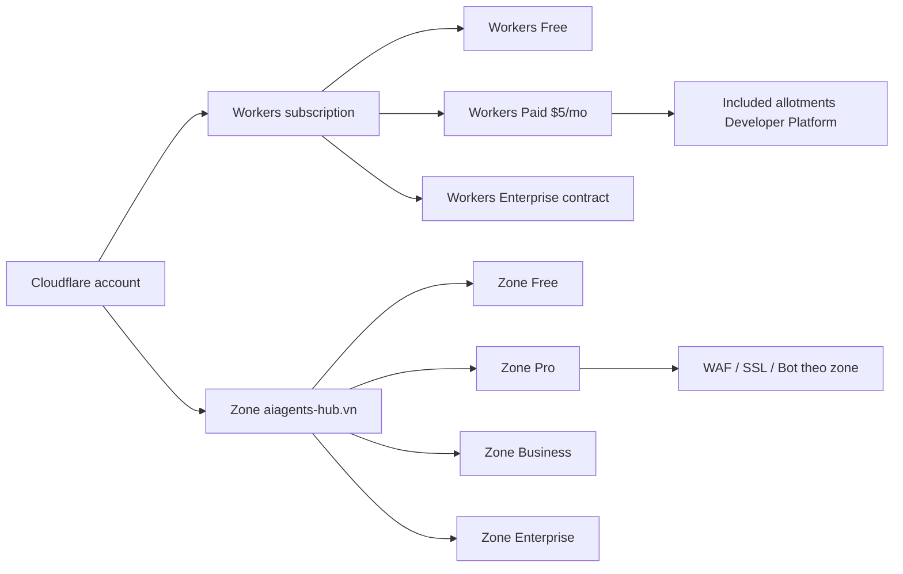
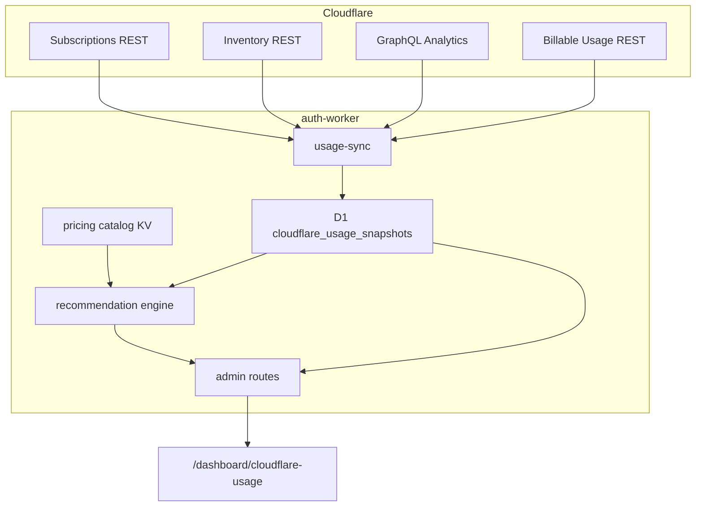

# Spec: Admin — tài nguyên Cloudflare, vượt gói, chi phí overage, khuyến nghị tối ưu

> **Trạng thái:** Draft v1.0 — sẵn sàng code  
> **Phiên bản:** 1.0  
> **Ngày:** 2026-09-19  
> **Phạm vi:** Màn admin nội bộ xem inventory + usage hạ tầng Cloudflare của Hub; dự báo khi nào vượt included allotment theo **gói Cloudflare đang gắn trên account**; nếu đã vượt thì overage từng metric; khuyến nghị tối ưu dựa trên usage thật  
> **Bổ sung, không thay thế:** economics khách hàng → [`business-model-one-credit-spec.md`](./business-model-one-credit-spec.md); van hệ số Credit → admin Contribution; per-user P&L → admin User Economics  
> **Không thay thế:** catalog gói khách hàng Hub → [`subscription-packages-spec.md`](./subscription-packages-spec.md)

Nguyên tắc giữ từ spec Credit:

- Khách hàng **không** thấy USD Cloudflare. D1 / R2 / Workers / Queue / Vectorize / log **không** thành line-item bán ra.
- Màn này là **FinOps nội bộ** (COGS hạ tầng thật). Contribution hiện ước `infra_buffer` 12%. Màn này đo số thật để sau này calibrate buffer — **không** đổi `creditPriceUsd` / giá gói Hub.
- Workers Paid **độc lập** zone plan (Free / Pro / Business / Enterprise trên `aiagents-hub.vn`). Cả hai đều phải hiện.

Coding bám spec này. **Không** hard-code giá / included allotment rải rác trên UI. Catalog giá versioned trong KV; UI chỉ render DTO.

---

## 0. Hiện trạng repo và bất cập phải vá

Hub chạy 100% trên Cloudflare. Admin **không** có chỗ nào xem:

| Cần thấy | Hiện có |
|----------|---------|
| Account đang Workers Free hay Paid, zone Free/Pro/Business | Không. `ACCOUNT_ID` hard-code trong wrangler |
| Included allotment kỳ này vs usage MTD | Không. Contribution chỉ có `cogsInfraUsdEst` (buffer) |
| Khi nào metric sẽ vượt included | Không |
| Overage USD từng tài nguyên nếu đã vượt | Không |
| Inventory Worker / D1 / R2 / KV / DO / Queue / Vectorize / AI / Images / Pipelines | Wrangler rải 5 file; không gom |
| Khuyến nghị tối ưu theo usage Hub | Không |

File liên quan, **không** làm việc này:

| File | Việc đang làm |
|------|----------------|
| [`contribution.ts`](../workers/auth-worker/src/features/admin/billing/contribution.ts) | GM Credit theo lớp model; `cogsInfraUsdEst` |
| [`user-economics.ts`](../workers/auth-worker/src/features/admin/billing/user-economics.ts) | P&L theo user |
| [`scan-cloudflare.ts`](../workers/auth-worker/src/features/admin/service/scan-cloudflare.ts) | Scan **model catalog** vào pending services — không phải usage bill |
| [`d1tor2-cron`](../workers/d1tor2-cron/) | Archive D1 → R2; đã có `CLOUDFLARE_API_TOKEN` |
| [`workers-ai.ts`](../workers/auth-worker/src/features/member/workflows/ai/workers-ai.ts) | AI Gateway `unitoken` + retry neuron cap |

### 0.1 Inventory thật trong repo (SSOT lúc viết spec)

Nguồn: wrangler của 5 Worker. Màn hình phải **đối chiếu** inventory này với REST Cloudflare (phát hiện resource orphan / lệch binding).

| Loại | Tên / binding | Worker gắn |
|------|----------------|------------|
| Worker | `aiagents-hub-auth-worker` | API + WS + cron contribution; custom domain `api.aiagents-hub.vn` |
| Worker | `aiagents-hub-trading-sto` | OpenNext web; custom domain `aiagents-hub.vn`; `cpu_ms = 300000` |
| Worker | `aiagents-hub-queue-worker` | Consumer `input-part-0` + DLQ |
| Worker | `aiagents-hub-consumer-worker` | Consumer WS broadcast + DLQ; `SHARD_COUNT = 1000` |
| Worker | `aiagents-hub-d1tor2-cron` | Cron D1 → R2 / Pipelines; `D1_RETENTION_DAYS = 96` |
| D1 | `aiagents-hub-db` (`1c4b5c9d-…`) | auth, queue, d1tor2 |
| R2 | `aiagents-hub-version-backup-bucket` | auth |
| R2 | `aiagents-hub-ekyc-storage-bucket` | auth |
| R2 | `aiagents-hub-lakehouse` | d1tor2 (+ Data Catalog / Iceberg) |
| KV | `NONCE_KV` `dfbfc6ec-…` | auth |
| KV | `SYSTEM_CONFIG_KV` `e80315e1-…` | auth |
| KV | `SYSTEM_CONFIG_KV` `529353fc-…` | queue-worker **và** d1tor2 — **namespace thứ hai** |
| DO SQLite | `UserDO`, `UserShardDO`, `BroadcastServiceDO` | auth (class); queue bind `UserDO`; consumer bind `UserShardDO` |
| Queue | `aiagents-hub-input-part-0` | queue-worker consume; auth produce |
| Queue | `aiagents-hub-error-queue-dlq` | queue-worker |
| Queue | `aiagents-hub-ws-broadcast-queue` + `-dlq` | consumer |
| Queue | `aiagents-hub-workflow-cron-queue` + `-dlq` | auth consume |
| Vectorize | `ask-ai-semantic` | auth |
| Workers AI + AI Gateway | binding `AI`, gateway id `unitoken` | auth (agent, RAG, eKYC, chat) |
| Images | binding `IMAGES` | auth eKYC merge |
| Analytics Engine | `aiagents-hub-queue-analytics` | queue-worker |
| Observability | `enabled: true` **không** `head_sampling_rate` | cả 5 Worker |
| Pipelines / R2 Data Catalog | auto-create từ d1tor2 | d1tor2 |
| Secrets Store | `8fe9cf5e-…` | auth + d1tor2 |
| Turnstile | site key trên web + auth | zone |
| Cron | auth `20 17 * * *` UTC; d1tor2 `59 16 * * *` UTC | |
| Service binding | auth → `QUEUE_WORKER` | không tính thêm request (Standard) |

### 0.2 Quyết định vá (bắt buộc khi code)

1. Màn **admin-only**, step-up như Contribution / User Economics. Không hiện với member.
2. Nguồn usage **gần real-time** = GraphQL Analytics. Nguồn **chi phí hóa đơn** = Billable Usage API (`GET /accounts/{id}/billable/usage`). GraphQL **không** phải billing — UI phải ghi rõ.
3. Included allotment lấy theo **gói đang active trên account**, không giả định Paid. Token thiếu quyền Billing → **fail closed** (không giả Paid).
4. Catalog giá / included **một file SSOT** versioned; UI không nhúng số. Refresh catalog không đợi deploy nếu admin bấm “Cập nhật bảng giá” (fetch docs snapshot + confirm).
5. Không tự sửa wrangler / sampling / retention từ UI ở v1. Khuyến nghị **advisory**. v2 mới có “apply an toàn” (log sampling).
6. Snapshot daily vào D1 (cron contribution hiện tại hoặc cron riêng) để forecast không phụ thuộc 1 lần gọi CF lúc mở trang.
7. Token: Secrets Store `CLOUDFLARE_USAGE_API_TOKEN` trên **auth-worker** (Billing Read + Analytics Read + read inventory). **Không** tái sử dụng `CF_AI_API_TOKEN`. Có thể cùng secret với d1tor2 nếu scope đủ; nếu d1tor2 token hẹp thì tạo token riêng.
8. Không in token, không log raw FOCUS dump ra client. Client chỉ nhận DTO đã gộp.

---

## 1. Mục tiêu / non-goals

### 1.1 Mục tiêu

Admin mở một màn, trong < 3 giây (cache hit) thấy:

1. **Gói Cloudflare đang dùng** — Workers Free | Workers Paid ($5) | Workers Enterprise; zone Free | Pro | Business | Enterprise; add-on (Images, …).
2. **Chu kỳ billing** — `current_period_start` / `end`, ngày còn lại.
3. **Từng metric hạ tầng Hub dùng** — usage MTD, included, % đã dùng, projected EOM, ngày dự kiến cạn included, overage USD **đã phát sinh**, overage USD **dự kiến cuối kỳ**.
4. **Chi phí từng tài nguyên** khi đã vượt (và luôn hiện $0 included nếu chưa vượt) + phí subscription Workers Paid nếu có.
5. **Khuyến nghị** ưu tiên theo USD tiết kiệm ước tính × độ tin cậy, bám usage **của Hub** (không generic blog).
6. Drill-down theo Worker / bucket / queue / DO class.

### 1.2 Non-goals

- Bán / hiện Cloudflare cost cho khách hàng.
- Đổi hệ số Credit / `infra_buffer` tự động (chỉ **gợi ý** calibrate ở khuyến nghị; confirm nằm màn Contribution).
- Multi-account Cloudflare, Workers for Platforms, Containers (Hub chưa dùng).
- Thay Cloudflare dashboard (logs raw, tail, deploy).
- Tối ưu zone CDN/WAF sâu (Bot Fight ruleset editor). Chỉ cảnh báo nếu zone plan đang trả tiền mà traffic gần như chỉ qua Workers.

---

## 2. Hai lớp gói Cloudflare (bắt buộc tách)

Cloudflare Fine Print: Workers Paid **không** dính zone plan.



| Lớp | API phát hiện | Ảnh hưởng màn này |
|-----|----------------|-------------------|
| Workers | `GET /accounts/{account_id}/subscriptions` → `rate_plan.id === "workers_paid"` (scope account) | Bảng included Workers / KV / D1 / DO / Queues / Vectorize / Logs / … |
| Zone | `GET /zones/{zone_id}/subscription` cho `aiagents-hub.vn` (và zone của `api.aiagents-hub.vn` nếu khác) | Phí zone cố định + feature. **Không** đổi included Developer Platform |
| Add-on | Cùng list subscriptions + Images / Stream nếu `state` Paid | Images unique transformations, … |

`workersPlan`:

```ts
type WorkersPlanId = 'workers_free' | 'workers_paid' | 'workers_enterprise';
type ZonePlanId = 'free' | 'lite' | 'pro' | 'pro_plus' | 'business' | 'enterprise' | 'unknown';

type CloudflarePlans = {
  workers: {
    planId: WorkersPlanId;
    publicName: string;
    subscriptionUsdPerMonth: number; // 0 | 5 | contract
    periodStart: string; // ISO
    periodEnd: string;
    state: string;
    source: 'subscriptions_api';
  };
  zones: Array<{
    zoneName: string;
    zoneId: string;
    planId: ZonePlanId;
    publicName: string;
    subscriptionUsdPerMonth: number;
    periodStart?: string;
    periodEnd?: string;
  }>;
  addOns: Array<{ ratePlanId: string; publicName: string; usdPerMonth: number }>;
};
```

Nếu token thiếu `#billing:read` / Account Settings Read: HTTP 503 `plans_unreadable` — **cấm** fallback giả Paid. Banner: “Cấp token Billing Read rồi Refresh”.

---

## 3. Catalog giá và included (SSOT)

Key KV: `cloudflare-pricing-catalog` (namespace `SYSTEM_CONFIG_KV` của auth-worker).

```ts
type PricingCatalog = {
  version: string;          // semver nội bộ, vd "2026.09.19"
  asOf: string;             // ngày lấy từ docs
  currency: 'USD';
  sourceUrls: string[];
  workersPlan: Record<WorkersPlanId, MetricAllotment[]>;
};

type MetricAllotment = {
  metricId: string;         // 'workers.requests'
  included: number;         // per billing period; Free daily → quy đổi * ngày trong kỳ khi forecast
  includedPeriod: 'month' | 'day';
  overageUsdPerUnit: number;
  unit: string;             // 'request' | 'cpu_ms' | 'million_rows' | ...
  unitScale: number;        // 1 hoặc 1_000_000 tùy cách CF niêm yết
  hardStopWhenExceeded: boolean; // Free D1/KV: query fail; Paid: bill
};
```

### 3.1 Bảng included + overage — Workers Paid vs Free

Số **as-of 2026-09-19** từ docs Cloudflare. Code **seed** catalog này; khi docs đổi, admin “Cập nhật bảng giá” (hoặc deploy catalog mới). UI luôn hiện `asOf`.

Nguồn: [Workers pricing](https://developers.cloudflare.com/workers/platform/pricing/), [D1](https://developers.cloudflare.com/d1/platform/pricing/), [R2](https://developers.cloudflare.com/r2/pricing/), [KV](https://developers.cloudflare.com/kv/platform/pricing/), [Vectorize](https://developers.cloudflare.com/vectorize/platform/pricing/), [Workers AI](https://developers.cloudflare.com/workers-ai/platform/pricing/), [Pipelines](https://developers.cloudflare.com/pipelines/platform/pricing/).

| metricId | Free | Paid included / tháng | Overage Paid | Hard-stop Free? |
|----------|------|------------------------|--------------|-----------------|
| `workers.subscription` | $0 | $5 phẳng | — | — |
| `workers.requests` | 100k / ngày | 10M | $0.30 / M | có (ngày) |
| `workers.cpu_ms` | 10 ms / invocation (cap) | 30M CPU-ms | $0.02 / M CPU-ms | cap invocation |
| `workers.static_assets` | unlimited $0 | unlimited $0 | $0 | — |
| `workers.logs_events` | 200k / ngày; giữ 3 ngày | 20M; giữ 7 ngày | $0.60 / M | — |
| `kv.reads` | 100k / ngày | 10M | $0.50 / M | có |
| `kv.writes` / `deletes` / `lists` | 1k / ngày mỗi loại | 1M mỗi loại | $5.00 / M | có |
| `kv.storage_gb` | 1 GB | 1 GB | $0.50 / GB-mo | có |
| `d1.rows_read` | 5M / ngày | 25B | $0.001 / M | có |
| `d1.rows_written` | 100k / ngày | 50M | $1.00 / M | có |
| `d1.storage_gb` | 5 GB tổng | 5 GB | $0.75 / GB-mo | có |
| `do.requests` | 100k / ngày | 1M | $0.15 / M | có |
| `do.duration_gb_s` | 13k GB-s / ngày | 400k GB-s | $12.50 / M GB-s | có |
| `do.sqlite.rows_read` | 5M / ngày | 25B | $0.001 / M | có |
| `do.sqlite.rows_written` | 100k / ngày | 50M | $1.00 / M | có |
| `do.sqlite.storage_gb` | 5 GB | 5 GB | $0.20 / GB-mo | có |
| `queues.operations` | 10k / ngày | 1M | $0.40 / M | có |
| `r2.storage_gb` (Standard) | 10 GB-mo | 10 GB-mo (free tier, **không** gộp Workers Paid) | $0.015 / GB-mo | không (bill) |
| `r2.class_a` | 1M | 1M | $4.50 / M | không |
| `r2.class_b` | 10M | 10M | $0.36 / M | không |
| `r2.ia.*` | không có free tier | — | storage $0.01 / GB-mo; A $9 / M; B $0.90 / M; retrieval $0.01 / GB | — |
| `vectorize.queried_dims` | 30M / tháng | 50M | $0.01 / M | — |
| `vectorize.stored_dims` | 5M | 10M | $0.05 / 100M | — |
| `workers_ai.neurons` | 10k / ngày rồi **chặn** | 10k / ngày rồi bill | $0.011 / 1k neurons | Free: chặn; Paid: bill |
| `images.unique_transformations` | 5k / tháng | 5k | $0.50 / 1k | — |
| `images.stored` | — | — | $5.00 / 100k | — |
| `images.delivered` | — | — | $1.00 / 100k | — |
| `ae.datapoints_written` | 100k / ngày | 100k / ngày rồi bill | $0.25 / M | — |
| `ae.reads` | 10k / ngày | 10k / ngày rồi bill | $1.00 / M | — |
| `pipelines.sql_gb` | — (Paid) | 50 GB | $0.04 / GB | — |
| `pipelines.sink_json_gb` | — | 50 GB (shared sink included) | $0.03 / GB JSON | — |
| `pipelines.sink_parquet_gb` | — | (cùng 50 GB sink) | $0.06 / GB Parquet/Iceberg | — |
| `turnstile` | thường $0 self-serve | $0 | — | — |
| `zone.subscription` | $0 | theo zone plan | phẳng / tháng | — |

Ghi chú catalog:

- R2 free tier **chung account**, không tăng vì đã mua Workers Paid.
- Service binding: request Worker B **không** cộng `workers.requests`; CPU A+B **có** cộng `workers.cpu_ms`.
- Queue: ~3 operations / message thành công (write + read + delete); retry = thêm read; DLQ = thêm write.
- DO WebSocket: 1 request lúc `Upgrade`; incoming messages tính request theo tỉ lệ 20:1; **duration** chạy suốt lúc WS mở nếu không hibernate.
- Static assets trên `aiagents-hub-trading-sto` = $0 request.
- Workers Enterprise: included/overage **không đoán**. `planId = workers_enterprise` → hiện “theo hợp đồng”; vẫn show usage GraphQL; cost USD chỉ khi Billable Usage trả `ContractedCost` / `BilledCost`.

### 3.2 Công thức overage và forecast

Kỳ billing Workers = `periodStart` … `periodEnd` từ subscription (fallback: ngày đăng ký không biết → **tháng UTC** + banner `period_assumed_utc`).

Với mỗi metric `includedPeriod = month`:

```
usageMtd          = sum(consumed) trong [periodStart, now]
daysElapsed       = max(1, now - periodStart)  // ngày lịch, UTC
daysInPeriod      = periodEnd - periodStart
dailyRate         = usageMtd / daysElapsed
projectedEom      = dailyRate * daysInPeriod
remainingIncluded = max(0, included - usageMtd)
overageNow        = max(0, usageMtd - included)
overageProjected  = max(0, projectedEom - included)

overageUsdNow        = overageNow        / unitScale * overageUsdPerUnit
overageUsdProjected  = overageProjected  / unitScale * overageUsdPerUnit

if dailyRate <= 0:
  exhaustAt = null
else if usageMtd >= included:
  exhaustAt = timestamp khi cumulative vượt included (từ snapshot daily; fallback periodStart)
else:
  daysUntil = remainingIncluded / dailyRate
  exhaustAt = now + daysUntil
  if exhaustAt >= periodEnd: exhaustAt = null  // không vượt kỳ này
```

Free `includedPeriod = day`: tính **hôm nay UTC** (hard-stop) **và** quy đổi `included * daysInPeriod` chỉ để so sánh “nếu lên Paid thì MTD này có vượt included tháng không”.

`subscriptionUsd` Workers Paid cộng **một lần** vào tổng kỳ, không nhân metric.

Làm tròn theo Cloudflare: overage billable **làm tròn lên đơn vị** (1M ops, 1 GB-mo, …) trước khi nhân giá — ghi `rounded = true` trên DTO.

Độ tin cậy forecast:

| Điều kiện | `confidence` |
|-----------|----------------|
| < 3 ngày trong kỳ hoặc không có snapshot | `low` |
| 3–13 ngày | `medium` |
| ≥ 14 ngày + snapshot daily | `high` |
| Weekend-only / cron burst (d1tor2 1 lần/ngày) | `medium` dù đủ ngày — flag `burstPattern: true` |

---

## 4. Nguồn dữ liệu



### 4.1 Inventory REST (read)

Gọi song song, timeout 8s/call, swallow từng nguồn (partial OK):

| Resource | Endpoint (v4) |
|----------|----------------|
| Workers | `GET /accounts/{id}/workers/scripts` |
| D1 | `GET /accounts/{id}/d1/database` |
| R2 | `GET /accounts/{id}/r2/buckets` |
| KV | `GET /accounts/{id}/storage/kv/namespaces` |
| Queues | `GET /accounts/{id}/queues` |
| Vectorize | `GET /accounts/{id}/vectorize/indexes` |
| DO | namespaces từ script bindings / `workers/durable_objects/namespaces` |
| AI Gateway | `GET /accounts/{id}/ai-gateway/gateways` (id `unitoken`) |
| Pipelines | như d1tor2 đã dùng |
| Zones | `GET /zones?name=aiagents-hub.vn` |

So khớp wrangler inventory (§0.1). Resource trên CF **không** có trong wrangler → badge `orphan`. Binding wrangler **không** thấy trên CF → `missing`.

### 4.2 GraphQL Analytics (usage gần real-time)

`POST https://api.cloudflare.com/client/v4/graphql`

Dataset tối thiểu (tên schema CF có thể lệch minor — adapter map; test bằng introspection lúc sync):

| Metric | Dataset / field gợi ý |
|--------|------------------------|
| Worker requests, errors, CPU | `workersInvocationsAdaptive` — `sum.requests`, `sum.errors`, `quantiles.cpuTimeP50/P99`; dimension `scriptName` |
| D1 rows / storage | `d1AnalyticsAdaptiveGroups` / storage groups |
| KV ops | `kvOperationsAdaptiveGroups` |
| R2 class A/B + storage | `r2OperationsAdaptiveGroups`, `r2StorageAdaptiveGroups` |
| DO requests / duration | `durableObjectsInvocationsAdaptive`, `durableObjectsPeriodicGroups` |
| Queues | `queueOperationsAdaptiveGroups` hoặc metrics REST queues |
| Vectorize | vectorize analytics groups |
| Workers AI neurons | workers AI graphql / REST usage |
| Images | images analytics |
| Logs events | observability / workers logs dataset nếu có; fallback Billable Usage |

Lọc `accountTag = ACCOUNT_ID`. Không tin GraphQL để **in hóa đơn**.

### 4.3 Billable Usage (chi phí)

`GET /accounts/{account_id}/billable/usage?from=&to=`

- Max 31 ngày / lần. Kỳ > 31 ngày → ghép 2 call.
- Gộp theo `x_BillableMetricId` / `x_BillableMetricName`.
- `ConsumedQuantity` = usage (kể cả trong included).
- `BilledCost` / `EffectiveCost` / `ContractedCost` khi CF populate. Docs 2026-09: cost field **có thể trống** (alpha). Fallback: tự tính từ catalog §3.1 + `ConsumedQuantity`. Flag `costSource: 'invoice' | 'catalog_estimate'`.
- Data **trễ ~1 ngày**. UI: “Hóa đơn cập nhật đến {maxChargePeriodEnd}”.

Map `x_BillableMetricId` → `metricId` nội bộ (bảng map trong code + test). Metric lạ → vẫn hiện dòng `unmapped` với raw name, không im lặng nuốt.

### 4.4 Cache và snapshot

| Lớp | TTL | Nơi |
|-----|-----|-----|
| Live overview (mở trang) | 15 phút KV `cloudflare-usage-overview` | SYSTEM_CONFIG_KV auth |
| Snapshot daily | 1 hàng / ngày UTC | D1 `cloudflare_usage_snapshots` |
| Manual Refresh | bỏ TTL, rate-limit 1 lần / 2 phút / admin | |

Cron: **tái sử dụng** `20 17 * * *` UTC (sau contribution) **hoặc** thêm `25 17 * * *` để khỏi kéo dài CPU cron hiện tại. Job: GraphQL MTD + billable yesterday + ghi snapshot. Timeout Worker cron: chia theo product nếu cần (subrequest).

---

## 5. Màn hình UI

### 5.1 Chỗ gắn

| Hạng mục | Giá trị |
|----------|---------|
| Route | `/dashboard/cloudflare-usage` |
| Sidebar | nhóm Dashboards, sau **Contribution**, `adminOnly: true`, icon `Cloud` |
| i18n | `CloudflareUsageAdmin` trong `en-US.json` / `vi-VN.json` |
| Guard | `useRequireAdmin` + thêm prefix vào `ADMIN_MANAGEMENT_PREFIXES` (step-up) |
| Layout | giống User Economics: title + mô tả + cards + charts + tables |

### 5.2 Cấu trúc trang (top → bottom)

**A. Header**

- Title: “Cloudflare usage”
- Sub: “Hạ tầng account `{accountId masked 6…4}` · catalog giá `{asOf}`”
- Chip gói Workers, chip từng zone plan, chip “Paid $5” / “Free (hard-stop)”
- Billing period + progress bar ngày
- Nút Refresh (rate-limit)
- Nút “Cập nhật bảng giá” (confirm dialog, ghi audit)

**B. Summary cards (6)**

| Card | Nội dung |
|------|----------|
| Gói | Workers plan + zone + add-on USD/tháng phẳng |
| Included còn lại | Số metric còn dưới included / tổng metric theo dõi |
| Overage hiện tại | USD (invoice hoặc estimate) |
| Dự kiến cuối kỳ | USD phẳng + overage projected |
| Ngày cạn included gần nhất | metric đầu tiên `exhaustAt` trong kỳ; hoặc “Không vượt kỳ này” |
| Độ lệch vs `infra_buffer` | `overageUsdProjected / creditRevenueMtd` so 12% — **chỉ cảnh báo**, không sửa coeff |

Màu: `ok` (projected < 80% included), `watch` (80–100%), `over` (đã vượt hoặc projected vượt).

**C. Timeline “khi nào vượt”**

Một hàng thời gian kỳ billing. Marker:

- hôm nay
- từng metric `exhaustAt` (màu theo severity)
- period end

Tooltip: usage hiện tại, daily rate, projected EOM, overage USD.

**D. Bảng tài nguyên (mặc định sort: overageUsdProjected DESC, rồi % included DESC)**

Cột:

1. Tài nguyên (Workers requests, D1 rows read, …)
2. Gói / included
3. Usage MTD (progress bar)
4. % included
5. Dự kiến EOM
6. Cạn included lúc (relative + absolute UTC)
7. Overage USD hiện tại
8. Overage USD dự kiến
9. `costSource` badge
10. Trạng thái: `under` / `projected_over` / `over` / `hard_stop_today` (Free)

Expand row → breakdown theo script / database / bucket / queue / DO class (GraphQL dimensions).

Filter: family (Compute / Storage / Data / AI / Observability / Zone), status, search.

**E. Inventory**

Tab hoặc card dưới bảng: 5 Worker, D1, 3 R2, 3 KV, 3 DO class, 6 queue, Vectorize, AI Gateway, Images, AE, Pipelines, crons. Badge orphan/missing. Ghi chú Hub:

- 2 KV `SYSTEM_CONFIG_KV` khác id
- `SHARD_COUNT = 1000`
- `D1_RETENTION_DAYS = 96`
- Observability full, không sampling
- Web `cpu_ms = 300000`

**F. Khuyến nghị**

List card, sort `priorityScore` DESC. Mỗi card:

- Title + severity (`critical` / `high` / `medium` / `low`)
- Metric liên quan + USD/tháng ước tiết kiệm (khoảng min–max)
- “Vì sao” (số usage Hub, không văn chung)
- Hành động cụ thể (file / binding / setting)
- Effort S / M / L
- Status v1: `advisory` — không nút Apply

**G. Ghi chú pháp lý / kế toán**

Một dòng muted: không phải hóa đơn Cloudflare; hóa đơn nguồn `billable/usage` + dashboard CF Billing. GraphQL có thể gồm traffic không bill.

### 5.3 Empty / error / partial

| State | UI |
|-------|----|
| Đang load, chưa cache | skeleton cards |
| Token thiếu quyền | 503 banner + checklist quyền |
| Partial (R2 GraphQL fail) | bảng vẫn hiện metric khác; hàng R2 `unavailable` |
| Account Enterprise không có list price | usage OK, cột USD `contract` |
| Rate limit Refresh | toast, giữ cache cũ |

---

## 6. API Hub

Mount: `routes.route('/dashboard/admin/cloudflare', createAdminCloudflareUsageRoutes())` cạnh billing.

Mọi route: `requireAdmin`. Không query public.

| Method | Path | Việc |
|--------|------|------|
| `GET` | `/overview` | plans + summary cards + exhaust timeline + `asOf` + `costSource` + `cachedAt` |
| `GET` | `/metrics?family=&status=` | bảng metric + breakdown |
| `GET` | `/inventory` | inventory vs wrangler expected |
| `GET` | `/recommendations` | list đã sort |
| `POST` | `/refresh` | bỏ cache, sync; 429 nếu < 2 phút |
| `POST` | `/pricing-catalog/refresh` | ghi catalog mới (body `{ confirm: true, catalog? }` — nếu không gửi catalog, dùng seed built-in) |

`GET /overview` đọc KV cache; miss thì sync (có thể > 3s — UI hiện stale snapshot D1 ngay, rồi revalidate).

DTO metric:

```ts
type UsageMetricRow = {
  metricId: string;
  family: 'compute' | 'storage' | 'data' | 'ai' | 'observability' | 'zone' | 'other';
  label: string;
  planId: WorkersPlanId;
  included: number;
  includedPeriod: 'month' | 'day';
  unit: string;
  usageMtd: number;
  usageToday?: number;
  pctOfIncluded: number | null; // null nếu included = 0 (always-bill)
  projectedEom: number;
  exhaustAt: string | null;
  overageNow: number;
  overageProjected: number;
  overageUsdNow: number;
  overageUsdProjected: number;
  rounded: boolean;
  hardStopWhenExceeded: boolean;
  status: 'under' | 'watch' | 'projected_over' | 'over' | 'hard_stop_today' | 'unavailable';
  confidence: 'low' | 'medium' | 'high';
  burstPattern: boolean;
  costSource: 'invoice' | 'catalog_estimate';
  breakdown?: Array<{ key: string; label: string; usage: number; unit: string }>;
};
```

Tổng:

```
flatUsd = workers.subscription + sum(zone.subscription) + sum(addOns)
variableUsdNow = sum(overageUsdNow)
variableUsdProjected = sum(overageUsdProjected)
totalUsdNow = flatUsd + variableUsdNow
totalUsdProjected = flatUsd + variableUsdProjected
```

---

## 7. Schema D1

Migration auth-worker (và queue chỉ đọc nếu không cần):

```sql
CREATE TABLE IF NOT EXISTS cloudflare_usage_snapshots (
  id INTEGER PRIMARY KEY AUTOINCREMENT,
  captured_at INTEGER NOT NULL,          -- ms UTC
  period_start TEXT NOT NULL,
  period_end TEXT NOT NULL,
  workers_plan_id TEXT NOT NULL,
  catalog_version TEXT NOT NULL,
  payload TEXT NOT NULL,                 -- JSON: metrics[] + plans + inventory digest
  UNIQUE (period_start, captured_at)
);

CREATE INDEX IF NOT EXISTS idx_cf_usage_captured ON cloudflare_usage_snapshots (captured_at DESC);

CREATE TABLE IF NOT EXISTS cloudflare_usage_audit (
  id INTEGER PRIMARY KEY AUTOINCREMENT,
  at INTEGER NOT NULL,
  actor TEXT NOT NULL,
  action TEXT NOT NULL,                  -- refresh | pricing_catalog_refresh
  detail TEXT
);
```

Không lưu API token. `payload` không chứa secret. Retention: 400 ngày (khớp d1tor2 96 ngày **operational** D1 khác bảng này — snapshot nhỏ; nếu D1 storage căng, archive snapshot > 90 ngày sang R2 lakehouse cùng pipeline).

---

## 8. Engine khuyến nghị (rule-based, v1 không LLM)

Mỗi rule: `id`, `when` (predicate trên metrics + inventory + wrangler facts), `because` (template số), `actions[]`, `usdSavedPerMonth: { min, max }`, `effort`, `severity`.

`priorityScore = usdSavedMid * confidenceWeight * severityWeight / effortWeight`.

### 8.1 Rules bắt buộc (Hub-specific)

| id | Khi | Vì sao / hành động |
|----|-----|---------------------|
| `obs.unsampled` | `workers.logs_events` ≥ 50% included hoặc projected_over | 5 Worker `observability.enabled` không `head_sampling_rate`. Sampling 1–10% queue/consumer/cron; giữ 100% auth nếu debug. Tiết kiệm ≈ overage logs. |
| `kv.split_system_config` | 2 namespace SYSTEM_CONFIG | **Correctness, không phải tiết kiệm storage.** Admin System Config ghi `aiagents-hub-system-config` vào KV auth `e80315e1`; queue-worker + d1tor2 đọc cùng key từ `529353fc` nên `BATCH_SIZE` / `D1_RETENTION_DAYS` không bao giờ tới. Trỏ wrangler 2 worker kia về id auth, deploy, rồi xóa namespace thừa. **Cấm** copy `529353fc` đè lên auth. USD tiết kiệm = $0 (không gắn overage). Severity high. |
| `kv.hot_config_reads` | `kv.reads` watch/over | `SYSTEM_CONFIG_KV` đọc trên đường nóng (royalty, FX, queue config). Cache memory TTL 30–60s trong Worker isolate. |
| `d1.retention_96` | `d1.storage_gb` watch/over **hoặc** rows_read watch | `D1_RETENTION_DAYS = 96`. Hạ 30–45 ngày nếu lakehouse đã tin cậy; index `created_at` trên bảng scan lớn (`service_usages`). |
| `d1.full_scan` | rows_read / rows_written > 100 | Cảnh báo query không index (không tự EXPLAIN). Link Contribution scan / queue sync tables. |
| `r2.lakehouse_standard` | R2 storage projected_over và lakehouse chiếm phần lớn | Lifecycle lakehouse + version-backup → Infrequent Access nếu đọc ít; **không** IA cho eKYC hot path. Nhắc min 30 ngày IA. |
| `do.ws_duration` | `do.duration_gb_s` watch/over | UserDO/UserShardDO WS: duration tính khi socket mở. Đã có hibernation comment — verify `webSocketMessage` path không giữ I/O; auto-response ping. |
| `do.shard_1000` | duration over **và** shard idle thấp | `SHARD_COUNT = 1000` không đắt nếu hibernate; đắt nếu pre-warm / alarm giữ object. Không giảm shard khi duration thấp. |
| `queue.retry_amplify` | `queues.operations` watch/over | 3 ops/msg; retry và DLQ nhân. Tăng `max_batch_size` nơi an toàn; giảm `max_retries` DLQ (đã 1). |
| `queue.ae_write` | AE datapoints gần daily cap | `AE_BATCH_SIZE` / `writeDataPoint` mỗi message. Sample AE hoặc batch. |
| `cpu.web_300s` | `workers.cpu_ms` projected_over, breakdown web cao | `cpu_ms = 300000` trên OpenNext. Tách SSR nặng; cache; static assets đã $0 — đảm bảo asset không đi dynamic. |
| `cpu.cron_d1tor2` | CPU spike đúng `59 16 UTC` | Pipeline concurrency 5. Hạ `PIPELINE_CONCURRENCY_LIMIT` nếu CPU over nhưng latency archive chấp nhận được. |
| `ai.neurons_daily` | neurons today ≥ 8k / 10k | Gateway `unitoken` đã retry 3 lần — retry **tốn neuron**. Cache AI Gateway; 3036 không retry (code đã có). Ưu tiên model tiny cho RAG embed. |
| `ai.gateway_cache` | Workers AI overageUsd > 0 | Bật cache trên gateway `unitoken` (provider cache) cho embed/lặp. |
| `images.ekyc` | images transformations watch | eKYC merge: unique transformations. Tránh re-transform cùng hash; lưu output R2. |
| `pipelines.unfiltered` | pipelines SQL/sink GB projected_over | Filter SQL sớm trước Iceberg ($0.06/GB). Ingress stream $0. |
| `workers.requests_auth` | requests projected_over, breakdown auth | Cache GET công khai; đừng biến asset thành Worker. WS Upgrade = 1 request (OK). Service binding queue không cộng request — giữ pattern. |
| `vectorize.small` | luôn under 20% | Rule **negative**: “đừng đổi index / đừng lo” — tránh khuyến nghị rác. |
| `zone.paid_unused` | zone Pro/Business **và** almost all traffic Workers | Cân nhắc hạ zone plan nếu không dùng WAF/Bot trả phí. **Không** auto. Severity low; cần người xác nhận DNS/SSL. |
| `plan.free_hardstop` | `workers_free` | Nâng Workers Paid **trước** khi D1/KV/Queue đụng daily cap (sản xuất Hub gần như **phải** Paid). Nếu đã Paid, ẩn rule. |
| `infra_buffer.recalibrate` | `totalUsdProjected` lệch > 2× so với `sum(cogsInfraUsdEst)` 30 ngày | Gợi ý mở Contribution; **không** tự đổi buffer. |

USD tiết kiệm: `min = 0.3 * overageUsdProjected` (conservative), `max = overageUsdProjected` của metric rule nhắm tới. Rule không gắn metric overage → `$0` nếu là correctness (vd `kv.split_system_config`); rule cost không có overage thì `max` catalog.

v1 **cấm** LLM gọi Workers AI chỉ để viết khuyến nghị (tốn neuron). v2 optional: paraphrase `because` sau khi rule đã chốt số.

---

## 9. Bảo mật và quyền token

Token Secrets Store `CLOUDFLARE_USAGE_API_TOKEN`:

- Account: Billing Read, Account Settings Read, Account Analytics Read
- Workers Scripts Read, Workers KV Storage Read, D1 Read, Workers R2 Storage Read, Queues Read, Vectorize Read, Workers AI Read, Images Read (nếu có)
- Zone Read (zone Hub)
- **Không** Account Write / Workers Edit / Billing Write

Route admin + step-up. Audit `refresh` / `pricing-catalog`. Response không echo token, không full account billing address.

`ACCOUNT_ID` đã nằm wrangler vars — không cần secret. Không commit token.

---

## 10. Liên hệ màn admin khác

| Màn | Ranh giới |
|-----|-----------|
| Contribution | Van hệ số Credit; COGS AI + **buffer**. Cloudflare-usage = COGS hạ tầng **đo**. Khuyến nghị `infra_buffer.recalibrate` trỏ sang Contribution, không apply ở đây |
| User Economics | P&L user. Không mix Cloudflare account bill vào per-user (không allocate v1) |
| Finance | Doanh thu Hub (orders). Có thể card “Cloudflare COGS projected” link sang màn này — **phase 2** |
| System config | Không nhét bảng usage vào system-config |
| Service scan Cloudflare | Catalog model — giữ nguyên |

Allocate Cloudflare COGS per user = **non-goal v1** (cần khóa phân bổ: request Worker theo tenant — chưa có).

---

## 11. Phases

### Phase 1 — nhìn thấy và dự báo (ship trước)

- Token + catalog seed + subscriptions/zone plan
- Snapshot daily + GET overview/metrics/inventory
- UI cards + timeline + bảng metric (không cần mọi breakdown)
- Billable Usage nếu token đủ; không thì catalog_estimate
- Rules: `plan.free_hardstop`, `obs.unsampled`, `kv.split_system_config`, `d1.retention_96`, `do.ws_duration`, `ai.neurons_daily`

### Phase 2 — breakdown và khuyến nghị đủ bộ

- Breakdown script/bucket/queue/DO
- Đủ rules §8.1
- Finance card link
- Archive snapshot cũ → R2

### Phase 3 — apply an toàn + calibrate

- Apply `head_sampling_rate` (wrangler hoặc API) với confirm + rollback
- Đề xuất số `infra_buffer` từ `totalUsdProjected / aiCost` — admin confirm trên Contribution
- Alert in-app / email admin khi metric `projected_over` trước ≥ 5 ngày

Không làm phase 3 trong PR đầu.

---

## 12. File sẽ đụng khi code

Backend (`auth-worker`):

- `src/features/admin/cloudflare-usage/domain.ts` — types, catalog seed, công thức
- `src/features/admin/cloudflare-usage/cloudflare-client.ts` — REST + GraphQL + billable
- `src/features/admin/cloudflare-usage/inventory.ts` — expected wrangler list
- `src/features/admin/cloudflare-usage/forecast.ts`
- `src/features/admin/cloudflare-usage/recommendations.ts`
- `src/features/admin/cloudflare-usage/infrastructure.ts` — KV cache, D1 snapshot
- `src/features/admin/cloudflare-usage/presentation.ts` — Hono routes
- `src/features/admin/cloudflare-usage/*.test.ts` — forecast làm tròn, Free vs Paid, map billable ids
- `src/index.ts` — mount routes
- `wrangler.jsonc` — secret binding `CLOUDFLARE_USAGE_API_TOKEN`
- D1 migration snapshot tables
- Cron: gọi sync từ scheduled handler hiện có **hoặc** cron mới

Frontend (`web`):

- `src/app/(main)/dashboard/cloudflare-usage/page.tsx`
- `_components/` overview cards, timeline, metrics table, inventory, recommendation list
- `src/navigation/sidebar/sidebar-items.ts`
- `src/app/(main)/dashboard/_components/sensitive-step-up.ts`
- `messages/en-US.json`, `vi-VN.json` — `CloudflareUsageAdmin`

Không sửa màn Contribution trừ link “Cloudflare COGS” (phase 2).

---

## 13. Test plan

### 13.1 Đơn vị

- [ ] Paid: usage 4M requests / 10 ngày trong kỳ 30 ngày → projected 12M, exhaustAt ngày ~25, overageProjected 2M → $0.60 requests (làm tròn lên 1M nếu CF round million — fixture khóa hành vi catalog)
- [ ] Paid: usage 12M requests → status `over`, exhaustAt trong quá khứ, overageNow 2M
- [ ] Paid: dailyRate 0 → exhaustAt null
- [ ] Free: D1 rows_read hôm nay ≥ 5M → `hard_stop_today` dù MTD thấp
- [ ] Free token thiếu billing → không giả `workers_paid`
- [ ] Làm tròn: 1 ops overage KV write → bill 1M × $5 (nếu catalog `roundUpBlock = 1e6`)
- [ ] Tổng USD = $5 + sum overage, không nhân $5 theo metric
- [ ] Queue: 100k messages success ≈ 300k ops; included 1M → under
- [ ] Map billable id lạ → row `unmapped`, không throw cả overview
- [ ] Recommendation `kv.split_system_config` fire khi inventory có 2 SYSTEM_CONFIG id
- [ ] `vectorize.small` không fire nếu queried_dims > 20% included

### 13.2 Tích hợp (dev)

- [ ] Mock CF API (không gọi production từ unit test)
- [ ] Snapshot insert unique (period_start, captured_at)
- [ ] Refresh rate-limit 2 phút
- [ ] requireAdmin 403 member

### 13.3 Production (Safari session — cookie httpOnly)

Theo hook prod Safari: **không** tin screenshot Cursor browser.

1. `.cursor/hooks/prod-safari-session.sh open` rồi `me` — 200 admin.
2. `get /dashboard/admin/cloudflare/overview` — plans khớp dashboard CF (Paid/Free), không 401.
3. Mở `/dashboard/cloudflare-usage` trên Safari: cards + bảng; metric chính (Workers requests, D1, R2, KV, DO) không `unavailable` hàng loạt.
4. So 1 metric với Cloudflare Dashboard → Billing / Workers usage (sai số GraphQL vs bill chấp nhận; `costSource` đúng).
5. Refresh: lần 2 trong 2 phút → 429, UI giữ số cũ.
6. Member login: route ẩn sidebar, URL redirect.

Không in `sessionId` / API token ra chat hay repo.

---

## 14. Copy i18n (cốt lõi)

Key namespace `CloudflareUsageAdmin`: `page_title`, `page_description`, `plan_workers`, `plan_zone`, `period`, `included_remaining`, `overage_now`, `projected_eom`, `next_exhaust`, `no_exhaust_this_period`, `refresh`, `catalog_as_of`, `cost_invoice`, `cost_estimate`, `status_over`, `status_projected_over`, `recommendations`, `advisory_only`, `token_missing`, `partial_data`, `orphan_resource`, `load_error`.

VI title: “Tài nguyên Cloudflare”. EN: “Cloudflare usage”.

---

## 15. Rủi ro

| Rủi ro | Xử lý |
|--------|--------|
| Billable Usage alpha, cost field trống | `catalog_estimate` + badge |
| GraphQL schema đổi | adapter + test; hàng `unavailable` |
| Cron sync ăn CPU/subrequest | tách product, snapshot partial |
| Giá CF đổi im lặng | `asOf` hiện rõ; admin refresh catalog |
| Gán nhầm zone plan vào included Workers | UI tách 2 chip; test |
| Admin tưởng số này là hóa đơn | footnote §5.2 G |

---

## 16. Definition of done (phase 1)

1. Admin Safari thấy gói Workers + zone đang dùng, kỳ billing, bảng metric với % included, projected EOM, `exhaustAt` hoặc “không vượt kỳ này”.
2. Metric đã vượt: cột overage USD > 0 (estimate hoặc invoice).
3. Ít nhất 5 khuyến nghị Hub-specific hiện đúng khi predicate thỏa; không hiện vectorize panic khi usage nhỏ.
4. Member không vào được. Token không lộ. Catalog giá không hard-code trên React.
5. Test đơn vị forecast + Free hard-stop + không fallback Paid khi thiếu quyền — pass.

Spec này **không** tự implement. Khi code: bám DTO, catalog, fail-closed plan detection, và Safari production check.
