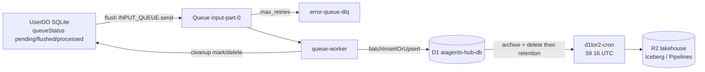
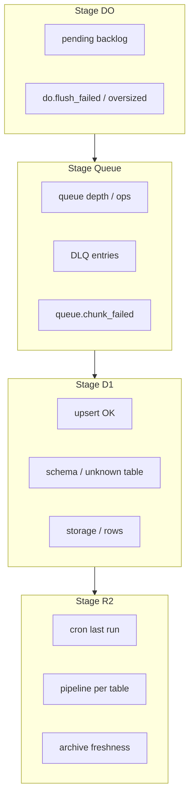

# Spec: Admin — sức khoẻ DO / D1 / R2 và lỗi luồng queue DO → D1 → R2

> **Trạng thái:** Draft v1.0 — Phase 1 + Phase 2 implemented  
> **Phiên bản:** 1.1  
> **Ngày:** 2026-09-23  
> **Phạm vi:** Màn admin nội bộ theo dõi **sức khoẻ vận hành** Durable Objects (UserDO / UserShardDO / BroadcastServiceDO), D1, R2 lakehouse, và **lỗi / tắc nghẽn** trên luồng đồng bộ `UserDO → Queue → D1 → d1tor2 → R2`  
> **Bổ sung, không thay thế:** FinOps hạ tầng → [`admin-cloudflare-usage-spec.md`](./admin-cloudflare-usage-spec.md); inbox lỗi Worker → [`admin-cloudflare-logs-spec.md`](./admin-cloudflare-logs-spec.md); an toàn quy mô triệu user → [`scale-safety-million-users-spec.md`](./scale-safety-million-users-spec.md); system config queue/d1tor2 → `/dashboard/system-config`  
> **Không thay thế:** Monitor Logs (`service_usages`); Cloudflare Dashboard; `wrangler tail`

Nguyên tắc giữ từ spec Credit / Cloudflare:

- Khách hàng **không** thấy backlog DO, queueId, schema drift, path nội bộ, hay PII trong record sync.
- Màn này là **Ops data-plane** (SRE / on-call admin): “dữ liệu có đang chảy đúng không?”, không phải “bao nhiêu USD”, không phải “Worker crash nói chung”.
- Coding bám spec. Client chỉ nhận DTO đã gộp / redaction. **Không** dump raw queue body hay full DO row ra browser.

---

## 0. Hiện trạng repo và bất cập phải vá

Hub đã có đường sync đầy đủ, nhưng admin **không** có một chỗ xem end-to-end:



| Cần thấy | Hiện có |
|----------|---------|
| Backlog `pending` / `flushed` theo user / bảng trên DO | `UserDO` `/queue/health`, `/queue/stats` — **chỉ nội bộ**, không UI admin gom |
| Lag flush (pending già, stuck `flushed` chưa processed) | Không aggregate |
| Queue depth, DLQ count, retry amplify | Inventory usage + logs DLQ tab phase 2 — **không** gắn stage pipeline |
| D1 insert fail / schema drift / unknown table | `queue.chunk_failed`, `queue.parse_unknown_table` — chỉ Workers Logs |
| Cron archive xanh / đỏ từng pipeline | `cron.pipeline_failed` log — không inbox theo bảng |
| R2 lakehouse freshness (ngày xa nhất đã archive?) | Không |
| Lag end-to-end: DO write → D1 visible → R2 visible | Không |
| Hành động an toàn: force flush 1 user, re-run 1 pipeline | `/queue/flush` trên DO, `/trigger` trên d1tor2 — **không** expose admin có audit |

File liên quan, **không** làm việc này:

| File / màn | Việc đang làm |
|------------|----------------|
| [`admin-cloudflare-usage-spec.md`](./admin-cloudflare-usage-spec.md) | FinOps: included, overage, khuyến nghị $ |
| [`admin-cloudflare-logs-spec.md`](./admin-cloudflare-logs-spec.md) | Fingerprint Worker error + explorer live CF |
| [`/dashboard/system-config`](../workers/web/src/app/(main)/dashboard/system-config/) | Sửa `auth_worker` / `queue_worker` / `d1tor2_cron` KV — không health |
| [`UserDO.ts`](../workers/auth-worker/src/features/ws/infrastructure/UserDO.ts) | Flush, cleanup, `/queue/health` per-DO |
| [`queue-worker/src/index.ts`](../workers/queue-worker/src/index.ts) | Consume → D1; DLQ log-only |
| [`d1tor2-cron`](../workers/d1tor2-cron/) | Archive D1 → Pipelines → R2; retention 96 ngày |

### 0.1 Inventory data-plane (SSOT)

| Stage | Thành phần | Binding / tên |
|-------|------------|---------------|
| Hot write | `UserDO` (SQLite) | auth-worker class; queue-worker bind `USER_DO` |
| Fan-out WS | `UserShardDO`, `BroadcastServiceDO` | auth / consumer — **không** trên luồng D1 sync; chỉ health phụ (WS duration) |
| Produce | `INPUT_QUEUE` | `aiagents-hub-input-part-0` |
| Consume | `aiagents-hub-queue-worker` | batch insert D1 + cleanup DO |
| DLQ | `aiagents-hub-error-queue-dlq` | log `queue.dlq_entry`; **không** auto-replay |
| Hot query | D1 `aiagents-hub-db` | auth, queue, d1tor2, CRM/finance/monitor đọc |
| Cold archive | `aiagents-hub-d1tor2-cron` → Pipelines → `aiagents-hub-lakehouse` | cron `59 16 * * *` UTC; `D1_RETENTION_DAYS` (default 96) |
| Config | `SYSTEM_CONFIG_KV` key `aiagents-hub-system-config` | `auth_worker.*`, `queue_worker.*`, `d1tor2_cron.*` |

**Bảng sync** (queue-worker `SYNC_TABLE_NAMES` — phải khớp UI):

- Queue/cleanup (xoá sau sync): `service_usages`, `orders`, `payments`, `refunds`, `commissions`, `workflow_royalties`, `workflow_user_stars`, `workflow_comments`
- Sync giữ trên DO theo lifecycle: `services`, `vouchers`, `versions`, `users`, `sessions`, `connections`, `subscriptions`, `api_tokens`, `pending_messages`, `user_mfa`, `user_ekyc`, `user_did`, `passkey_credentials`, `backup_codes`, `commission_policies`, `agent_workflows`, `payout_beneficiary`, `earnings_payouts`

**Không sync D1** (out of scope màn này nhưng ghi rõ để tránh nhầm): `workflow_executions` (DO-local — xem [`workflow-execution-logging-spec.md`](./workflow-execution-logging-spec.md)); credentials decrypt trên DO.

### 0.2 Trạng thái `queueStatus` trên UserDO (hợp đồng)

| Status | Nghĩa | Ai đổi |
|--------|--------|--------|
| `pending` | Chờ flush lên Queue | Insert/update trên bảng sync |
| `flushed` | Đã `INPUT_QUEUE.send` thành công | UserDO sau send |
| `processed` | Queue-worker đã insert D1 + cleanup mark | queue-worker → DO `/queue/cleanup` |

Lỗi điển hình theo status:

| Hiện tượng | Ý nghĩa |
|------------|---------|
| `pending` tăng mãi, `flushed` không tăng | Flush fail (`do.flush_failed`, payload too large, queue send) |
| `flushed` cũ, D1 chưa có row | Consumer chậm / `queue.chunk_failed` / poison → DLQ |
| `processed` trên DO nhưng D1 thiếu | Cleanup mark trước khi insert ổn? (bug) hoặc user đọc wrong shard |
| D1 có row, R2 thiếu ngày cũ | Cron fail / pipeline endpoint / retention chưa tới ngày archive |

### 0.3 Quyết định vá (bắt buộc khi code)

1. Màn **admin-only**, step-up như Cloudflare usage / logs. Member không thấy.
2. Browser **không** gọi Cloudflare REST / GraphQL trực tiếp; **không** gọi stub DO từ client. Auth-worker proxy mọi probe.
3. **Không** quét toàn bộ UserDO trên account mỗi lần mở trang (CPU/DO bill). Probe theo **mẫu** + **hot list** (users có backlog từ tín hiệu queue/AE/D1) + drill-down 1 `userId` khi admin tìm.
4. Tái dùng tín hiệu đã có: GraphQL/queues REST (client usage), telemetry events `do.flush_*` / `queue.*` / `cron.pipeline_*` (client logs), D1 metadata queries, AE `aiagents-hub-queue-analytics` nếu đã ghi. **Không** tạo kho log thứ hai.
5. Persist Hub chỉ **chỉ mục sức khoẻ + sự cố pipeline** (snapshot daily + incident fingerprint stage), không raw message.
6. Hành động nguy hiểm (force flush user, re-run pipeline, replay DLQ) — phase 2+, confirm + audit; v1 **advisory + link** system-config / runbook.
7. Token: tái dùng `CLOUDFLARE_USAGE_API_TOKEN` (Analytics + Queues Read + Observability Read). D1/DO probe qua binding Worker — không cần token thêm. Fail closed từng nguồn → `unavailable`, không giả “healthy”.
8. Redaction: không trả email/plaintext eKYC/definition workflow đầy đủ. `userId` = DO id string OK; identifier map chỉ khi admin search có sẵn CRM pattern.

---

## 1. Mục tiêu / non-goals

### 1.1 Mục tiêu

Admin mở một màn, cache hit < 3 giây, thấy:

1. **Pipeline status tổng** — `healthy` / `watch` / `incident` theo stage DO → Queue → D1 → R2.
2. **Backlog & lag** — pending/flushed ước lượng, queue depth, DLQ, tuổi record pending già nhất (khi probe được).
3. **Sức khoẻ D1** — size gần đúng (usage snapshot hoặc `PRAGMA`/CF), bảng sync row count MTD / ngày, dấu hiệu schema drift.
4. **Sức khoẻ R2 lakehouse** — storage/ops từ usage cache; **freshness archive** (cron last success / last fail theo pipeline table).
5. **Inbox sự cố theo stage** — không trùng 1:1 Worker logs inbox; mỗi item gắn `stage` + `table?` + runbook sync.
6. **Khuyến nghị vận hành** — tắc ở đâu, chỉnh config nào (link system-config), không tự apply v1.
7. Drill-down: 1 user DO health; 1 bảng sync; 1 cron pipeline result.

### 1.2 Non-goals

- FinOps overage USD (usage page).
- Inbox exception Worker chung (logs page) — màn này **deep-link** fingerprint liên quan `queue.*` / `do.flush_*` / `cron.pipeline_*`, không duplicate explorer đầy đủ.
- Sửa KV system-config tại chỗ (giữ màn System config).
- Multi-tenant “health cho member”.
- Quét 100% UserDO mỗi phút.
- Replay DLQ tự động / xóa dữ liệu production không confirm.
- Health eKYC bucket / version-backup bucket (chỉ badge “khác lakehouse”; chi tiết phase 3 nếu cần).
- BroadcastServiceDO / UserShardDO ngoài card phụ “WS fan-out” (không trên path D1).

---

## 2. Mô hình stage và tín hiệu

### 2.1 Bốn stage (UI bắt buộc tách)



| Stage id | Nguồn chính | Status rules (v1) |
|----------|-------------|-------------------|
| `do` | Sample DO `/queue/health` + telemetry `do.flush_*` + D1 proxy “users với pending cao” nếu có bảng index | `incident` nếu flush fail rate ≥ ngưỡng hoặc unhealthyTables sample > 0 và pending già; `watch` nếu pendingTotal sample cao |
| `queue` | Queues REST + GraphQL queue ops + DLQ count + events `queue.chunk_failed` / `queue.dlq_*` | `incident` nếu DLQ tăng trong 1h hoặc chunk_failed burst; `watch` nếu depth / ops bất thường vs baseline snapshot |
| `d1` | D1 SQL aggregate + usage `d1.*` + parse_unknown_table / chunk_failed schema | `incident` nếu insert fail liên tục; `watch` nếu storage gần cap (link usage) |
| `r2` | d1tor2 last run store + `cron.pipeline_failed` + usage `r2.*` / pipelines | `incident` nếu cron failed hoặc ≥1 pipeline fail lần chạy gần nhất; `watch` nếu freshness > retention window + 2 ngày |

Overall = max severity bốn stage.

### 2.2 Lag metrics (DTO)

```ts
type PipelineLag = {
  /** Ước lượng từ sample DO + AE; null nếu không đo được */
  doPendingP50: number | null;
  doPendingP95: number | null;
  doFlushedStuckOverMin: number | null; // records flushed > N phút chưa processed (sample)
  queueDepthApprox: number | null;
  dlqPendingApprox: number | null;
  /** Phút từ DO write → D1 visible — chỉ khi có AE/watermark; else null */
  e2eDoToD1Minutes: number | null;
  /** Giờ từ ngày đủ điều kiện archive → xuất hiện sink — từ cron stats */
  e2eD1ToR2Hours: number | null;
  confidence: 'low' | 'medium' | 'high';
};
```

Không bịa số: thiếu nguồn → `null` + badge `unavailable`.

### 2.3 Taxonomy lỗi theo luồng (inbox pipeline)

| code | Stage | Match tín hiệu | Severity |
|------|-------|----------------|----------|
| `do.flush_failed` | do | event `do.flush_failed` | high |
| `do.flush_oversized` | do | `do.flush_record_oversized` / pullFromDo path | medium |
| `do.pending_stuck` | do | pending với `queueId <= lastFlushedId` (unhealthy) | critical |
| `do.alarm_gap` | do | pending > 0 mà không flush trong interval × 3 (infer) | high |
| `queue.parse_invalid` | queue | `queue.parse_*` | medium |
| `queue.unknown_table` | queue | `queue.parse_unknown_table` — **schema drift catalog** | high |
| `queue.pull_from_do_failed` | queue | `queue.pull_from_do_failed` | high |
| `queue.chunk_failed` | queue→d1 | `queue.chunk_failed` | critical |
| `queue.cleanup_failed` | d1→do | `queue.cleanup_*` — D1 OK, DO dirty | high |
| `queue.dlq` | queue | `queue.dlq_entry` / DLQ depth | critical |
| `d1.schema_drift` | d1 | SQLITE no such column / ensureSchema fail | critical |
| `d1.hard_stop` | d1 | usage Free cap / rows fail (từ usage status) | critical |
| `cron.pipeline_failed` | r2 | `cron.pipeline_failed` + table | critical |
| `cron.failed` | r2 | `cron.failed` toàn bộ | critical |
| `r2.endpoint_missing` | r2 | pipeline endpoint cache miss / API create fail | high |
| `r2.freshness_stale` | r2 | không archive trong N ngày khi còn rows đủ tuổi | high |

Fingerprint pipeline:

```
sha256_12(stage + '|' + code + '|' + tableOrQueue + '|' + normalize(message))
```

Khác fingerprint Worker logs (không gộp `handler.request_error`). Có thể **link** `relatedWorkerFingerprint` nếu cùng event name đã có trên logs page.

### 2.4 Runbook (rule, không LLM)

| id | Khi | Checks / files | Hành động admin |
|----|-----|----------------|-----------------|
| `pipe.do_flush` | flush_failed / oversized | `queue-flush.ts` budget 120KB; `pullFromDo` | Xem user drill-down; tăng split; không tăng message size |
| `pipe.pending_stuck` | unhealthyTables | UserDO `handleQueueHealth`; alarm | Force flush (phase 2); reset table-state nếu lastFlushedId lệch |
| `pipe.queue_chunk` | chunk_failed | `queue-worker` `batchInsertOrUpsert`; D1 schema | So Zod DO vs D1 manager; migration |
| `pipe.unknown_table` | unknown_table | `SYNC_TABLE_NAMES` vs DO sync list | Đồng bộ catalog bảng; **không** ack nuốt im |
| `pipe.dlq` | dlq | max_retries; poison | Đọc excerpt; sửa schema; **không** retry vô hạn |
| `pipe.cleanup` | cleanup_failed | DO `/queue/cleanup` | D1 đã có data — reconcile mark thủ công phase 2 |
| `pipe.cron_table` | pipeline_failed | `pipeline-manager.ts`, endpoint, token | Re-run 1 pipeline (phase 2); check CATALOG_TOKEN |
| `pipe.retention` | freshness / D1 size | `D1_RETENTION_DAYS` KV | Link system-config; đừng hạ retention khi cron đỏ |
| `pipe.config_kv` | queue/d1tor2 config không ăn | cùng `SYSTEM_CONFIG_KV` e80315e1 | Khớp rule usage `kv.split_system_config` |

---

## 3. Nguồn dữ liệu và thu thập

### 3.1 Không quét hết DO

Chiến lược probe:

| Tầng | Cách | Chi phí |
|------|------|---------|
| A. Global signals | Queues API depth/DLQ; GraphQL queue + D1 + R2 + DO; telemetry filter error pipeline 1h | Thấp — tái dùng usage/logs clients |
| B. Hot users | Từ AE (nếu có dimensions userId) **hoặc** D1 bảng chỉ mục `pipeline_hot_users` cập nhật khi queue-worker gặp fail **hoặc** admin search | Trung bình |
| C. Sample | Mỗi sync health: tối đa **K=20** UserDO stubs (hot + random từ recent `users` D1) gọi `/queue/health` song song, timeout 2s/stub | Giới hạn cứng |
| D. On-demand | `GET /users/:userId` → `/queue/health` + `/queue/stats` đầy đủ | 1 DO |

Kết quả sample **không** suy ra “0 pending toàn hệ thống”. UI: “Sampled N users · confidence low|med”.

### 3.2 Watermark / cron run store (Hub D1)

Mỗi lần d1tor2 chạy xong (hoặc auth cron poll đọc log + optional HTTP nội bộ), ghi:

```sql
CREATE TABLE IF NOT EXISTS pipeline_cron_runs (
  id INTEGER PRIMARY KEY AUTOINCREMENT,
  started_at INTEGER NOT NULL,
  finished_at INTEGER NOT NULL,
  success INTEGER NOT NULL,              -- 0|1
  total_pipelines INTEGER NOT NULL,
  successful INTEGER NOT NULL,
  failed INTEGER NOT NULL,
  payload TEXT NOT NULL                  -- JSON: results[] { pipelineName, tableName, success, recordsProcessed, error? }
);

CREATE INDEX IF NOT EXISTS idx_pipeline_cron_finished ON pipeline_cron_runs (finished_at DESC);

CREATE TABLE IF NOT EXISTS pipeline_stage_snapshots (
  id INTEGER PRIMARY KEY AUTOINCREMENT,
  captured_at INTEGER NOT NULL,
  overall_status TEXT NOT NULL,
  payload TEXT NOT NULL,                 -- JSON: stages + lag + sample digest
  UNIQUE (captured_at)
);

CREATE INDEX IF NOT EXISTS idx_pipeline_snap ON pipeline_stage_snapshots (captured_at DESC);

CREATE TABLE IF NOT EXISTS pipeline_incidents (
  fingerprint TEXT PRIMARY KEY,
  stage TEXT NOT NULL,
  code TEXT NOT NULL,
  table_name TEXT,
  title TEXT NOT NULL,
  severity TEXT NOT NULL,
  status TEXT NOT NULL DEFAULT 'new',    -- new|ack|investigating|resolved|ignored
  first_seen INTEGER NOT NULL,
  last_seen INTEGER NOT NULL,
  count_1h INTEGER NOT NULL DEFAULT 0,
  count_24h INTEGER NOT NULL DEFAULT 0,
  excerpt TEXT,                          -- <= 512, redacted
  runbook_id TEXT,
  related_worker_fingerprint TEXT,
  updated_at INTEGER NOT NULL,
  updated_by TEXT
);

CREATE INDEX IF NOT EXISTS idx_pipeline_inc_stage ON pipeline_incidents (stage, status, last_seen DESC);

CREATE TABLE IF NOT EXISTS pipeline_hot_users (
  user_id TEXT PRIMARY KEY,
  reason TEXT NOT NULL,                 -- flush_fail|chunk_fail|pending_high|dlq
  pending_approx INTEGER,
  last_signal_at INTEGER NOT NULL,
  last_table TEXT
);

CREATE TABLE IF NOT EXISTS pipeline_health_audit (
  id INTEGER PRIMARY KEY AUTOINCREMENT,
  at INTEGER NOT NULL,
  actor TEXT NOT NULL,
  action TEXT NOT NULL,                  -- refresh|force_flush|rerun_pipeline|status_patch|dlq_replay
  detail TEXT
);

CREATE TABLE IF NOT EXISTS pipeline_dlq_entries (
  id INTEGER PRIMARY KEY AUTOINCREMENT,
  message_id TEXT NOT NULL,
  user_id TEXT,
  table_name TEXT,
  queue_id INTEGER,
  pull_from_do INTEGER NOT NULL DEFAULT 0,
  attempts INTEGER,
  body_bytes INTEGER,
  status TEXT NOT NULL DEFAULT 'logged', -- logged|replayed|discarded
  received_at INTEGER NOT NULL,
  replayed_at INTEGER,
  replayed_by TEXT,
  excerpt TEXT,                          -- metadata only, no PII body
  UNIQUE (message_id, user_id, table_name, queue_id)
);

CREATE TABLE IF NOT EXISTS pipeline_watermarks (
  id INTEGER PRIMARY KEY AUTOINCREMENT,
  captured_at INTEGER NOT NULL,
  table_name TEXT NOT NULL,
  user_id TEXT,
  records INTEGER NOT NULL DEFAULT 0,
  lag_ms INTEGER,                        -- approx DO flush → D1 insert
  source TEXT NOT NULL DEFAULT 'queue_insert'
);
```

**Ghi `pipeline_cron_runs`:** ưu tiên sửa `d1tor2-cron` sau `runAllPipelines` → insert D1 (cùng `D1DB`). Không phụ thuộc parse log. Nếu PR tách: auth poll chỉ dùng khi cron chưa ship insert.

**Hot users:** queue-worker khi `chunk_failed` / `dlq_entry` / `pull_from_do_failed` → upsert `pipeline_hot_users` (best-effort). Tránh AE bắt buộc.

**DLQ inbox:** queue-worker `processErrorQueue` persist metadata → `pipeline_dlq_entries` rồi ack (vẫn không auto-replay). Admin `GET /dlq` + `POST /actions/replay-dlq` gửi `pullFromDo` pointer.

**Watermark:** sau insert D1 thành công, queue-worker ghi `pipeline_watermarks` từ `flushedAt`/`createdAt` trên record (không migration cột `syncedAt`).

Cap: 500 incidents open; hot_users 200 LRU; cron_runs giữ 90 ngày; snapshots 400 ngày (nhỏ).

### 3.3 Cache

| Key | TTL | Nội dung |
|-----|-----|----------|
| KV `pipeline-health-overview` | 60s | stages + lag + open incidents count |
| Refresh tay | 2 phút rate-limit | |

---

## 4. Màn hình UI

### 4.1 Chỗ gắn

| Hạng mục | Giá trị |
|----------|---------|
| Route | `/dashboard/pipeline-health` |
| Sidebar | nhóm Dashboards, **sau** Worker errors, `adminOnly: true`, icon `Database` hoặc `GitBranch` |
| i18n | `PipelineHealthAdmin` trong `en-US.json` / `vi-VN.json` |
| Guard | `useRequireAdmin` + prefix trong `ADMIN_MANAGEMENT_PREFIXES` |
| Layout | giống Cloudflare usage: title, chips, cards, tabs |

Link chéo:

- Usage → “Sức khoẻ luồng DO→D1→R2” khi `d1`/`r2`/`queues` watch|over  
- Logs → filter gợi ý `queue.` / `do.flush` / `cron.pipeline`  
- System config → từ khuyến nghị BATCH_SIZE / retention  
- Monitor Logs → copy: “đây là usage Credit, không phải backlog sync”

### 4.2 Cấu trúc trang

**A. Header**

- Title VI: “Sức khoẻ luồng dữ liệu”. EN: “Data pipeline health”.
- Sub: “UserDO → Queue → D1 → R2 lakehouse · sample {N} DO · `{cachedAt}`”
- Chip overall status; chip retention `D1_RETENTION_DAYS`; chip cron next/`lastFinishedAt`
- Range: 1h / 24h / 7d (cho incident counts)
- Refresh

**B. Stage strip (4 cards ngang)**

Mỗi card: tên stage, status màu, 2–3 số chính, sparkline nếu có.

| Card | Số chính |
|------|----------|
| DO | pending sample sum, unhealthyTables, flush fails 1h |
| Queue | depth, DLQ, chunk_failed 1h |
| D1 | rows written proxy / storage status từ usage, schema incidents |
| R2 | last cron OK/FAIL, pipelines failed, freshness |

**C. Lag panel**

Một hàng: DO→D1, D1→R2, confidence. Tooltip giải thích nguồn hoặc “chưa đo”.

**D. Tabs**

1. **Incidents** (default) — inbox §2.3  
2. **Tables** — từng `SYNC_TABLE_NAMES`: signals (fail counts), last cron result nếu thuộc PIPELINE_CONFIGS  
3. **Cron / R2** — lịch sử `pipeline_cron_runs`, expand results[]  
4. **Hot users** — list drill-down  
5. **Recommendations** — §5  
6. **DO probe** — search userId / email→id (tái dùng CRM resolve nếu có) → health+stats JSON rút gọn  

**E. Incident columns**

Severity · code · stage · table · counts · last seen · status · runbook · link “Worker error” nếu có.

**F. Empty / error**

Giống logs: token/partial/`unavailable` từng stage; **cấm** overall `healthy` khi stage critical `unavailable` vì thiếu quyền — dùng `unknown` + banner.

### 4.3 Hành động (phase)

| Action | Phase | Guard |
|--------|-------|-------|
| Refresh / ack incident | 1 | admin + audit note |
| Mở system-config | 1 | link |
| Force flush 1 user (+ optional table) | 2 | confirm; gọi DO `/queue/flush`; audit |
| Re-run d1tor2 all / one table | 2 | confirm; service binding hoặc signed internal; audit |
| Replay 1 DLQ message | 3 | cực hạn chế; default off |

v1 không nút phá dữ liệu.

---

## 5. Engine khuyến nghị (rule, không LLM)

`priorityScore = severityWeight * recency * volume / effort`.

| id | Khi | Admin làm gì |
|----|-----|----------------|
| `pipe.stab.dlq` | DLQ > 0 hoặc dlq events 1h | Xử lý poison; xem unknown_table / schema |
| `pipe.stab.chunk` | chunk_failed ≥ 3 / 1h | D1 schema vs Zod; migration queue-worker |
| `pipe.stab.cron_red` | last cron failed > 0 pipelines | Sửa endpoint/token trước khi hạ retention |
| `pipe.stab.pending_high` | sample pending sum cao hoặc hot users nhiều | Tăng flush frequency / BATCH; kiểm alarm DO |
| `pipe.stab.cleanup_skew` | cleanup_failed trong khi D1 insert OK | Reconcile mark; tránh duplicate anxiety |
| `pipe.stab.retention_vs_fail` | cron đỏ **và** d1 storage watch | **Không** giảm `D1_RETENTION_DAYS` |
| `pipe.stab.oversized` | flush_oversized / pullFromDo spike | Kỳ vọng agent_workflows lớn — OK nếu pull OK; fail nếu pull_failed |
| `pipe.stab.config` | queue config KV lệch inventory | Một SYSTEM_CONFIG id |

Không gắn USD (FinOps đã có). Có thể deep-link usage metric liên quan.

---

## 6. API Hub

Mount: `routes.route('/dashboard/admin/pipeline-health', createAdminPipelineHealthRoutes())`.

Mọi route: `requireAdmin`.

| Method | Path | Việc |
|--------|------|------|
| `GET` | `/overview?range=1h` | overall + 4 stages + lag + cron summary + `cachedAt` |
| `GET` | `/incidents?stage=&status=&severity=` | inbox D1 |
| `GET` | `/incidents/:fingerprint` | detail + excerpt + runbook |
| `PATCH` | `/incidents/:fingerprint` | `{ status, note? }` |
| `GET` | `/tables` | SYNC tables + cron join |
| `GET` | `/cron-runs?limit=30` | lịch sử |
| `GET` | `/hot-users` | list |
| `GET` | `/users/:userId` | proxy DO health+stats (redact) |
| `GET` | `/recommendations` | §5 |
| `POST` | `/refresh` | re-sample + merge incidents; 429 < 2 phút |
| `POST` | `/actions/force-flush` | phase 2 `{ userId, table?, confirm: true }` |
| `POST` | `/actions/rerun-pipeline` | phase 2 `{ table?\|all, confirm: true }` |

DTO cốt lõi:

```ts
type StageHealth = {
  stage: 'do' | 'queue' | 'd1' | 'r2';
  status: 'healthy' | 'watch' | 'incident' | 'unknown' | 'unavailable';
  summary: string;
  metrics: Record<string, number | string | null>;
  sampled?: boolean;
};

type PipelineIncident = {
  fingerprint: string;
  stage: StageHealth['stage'];
  code: string;
  tableName: string | null;
  title: string;
  severity: 'critical' | 'high' | 'medium' | 'low';
  status: 'new' | 'ack' | 'investigating' | 'resolved' | 'ignored';
  count1h: number;
  count24h: number;
  firstSeen: string;
  lastSeen: string;
  runbookId: string | null;
  excerpt: string | null;
  relatedWorkerFingerprint: string | null;
};

type UserDoHealthDto = {
  userId: string;
  status: string;
  pendingTotal: number;
  processedTotal: number;
  unhealthyTables: number;
  tables?: Array<{ table: string; pending: number; flushed: number; processed: number }>;
};
```

---

## 7. Thay đổi worker hỗ trợ (tối thiểu)

### 7.1 Phase 1 (bắt buộc)

| Worker | Đổi |
|--------|-----|
| `d1tor2-cron` | Sau `runAllPipelines`, `INSERT` `pipeline_cron_runs` (fail insert → log, không fail cron stats) |
| `queue-worker` | Best-effort upsert `pipeline_hot_users` trên fail path; **không** đổi ack semantics |
| `auth-worker` | Feature `admin/pipeline-health/*`; cron merge incidents từ telemetry filter event prefix `do.flush_`, `queue.`, `cron.pipeline` / `cron.failed` (tái dùng logs telemetry client, filter hẹp) |
| `UserDO` | **Không** đổi contract `/queue/health` / `/queue/stats` — chỉ document + dùng |

### 7.2 Phase 2

- Service binding auth → d1tor2 `POST /trigger` (hiện có) với admin gate — **không** public internet không auth.
- `force-flush` qua `USER_DO` stub từ auth (đã bind).
- Optional: AE dimensions chuẩn hoá `blobs: [table, result]` nếu chưa có — chỉ khi AE còn room (xem usage).

### 7.3 Phase 3

| Worker | Đổi |
|--------|-----|
| `queue-worker` | Persist `pipeline_dlq_entries` (metadata) trước ack; ghi `pipeline_watermarks` sau insert OK |
| `auth-worker` | `GET /dlq`, `POST /actions/replay-dlq` (pullFromDo + confirm + 10/day), `GET /aux-buckets`, overview lag DO→D1 từ watermark |
| `web` | Tab DLQ + Aux R2 |

### 7.4 Cấm

- Tail Worker warehouse.
- Logpush raw queue body → R2.
- Admin API trả full `agent_workflows.definition` / eKYC images.
- Quét `idFromName` mọi user.

---

## 8. Bảo mật

- `requireAdmin` + step-up.
- Audit mọi PATCH/action.
- Rate-limit refresh và DO probe (max 30 user probes / 5 phút / admin).
- Token CF: không Script Edit.
- Member tools **không** trỏ API này.
- `userId` path: chỉ DO id hex/string hợp lệ; từ chối probe id không parse được.

---

## 9. Liên hệ màn khác

| Màn | Ranh giới |
|-----|-----------|
| Cloudflare usage | $ / included. Pipeline-health = chảy dữ liệu. Link khi D1/R2/Queue nóng |
| Worker errors | Exception chung. Pipeline-health = stage + bảng + backlog; deep-link fingerprint |
| System config | Tham số BATCH/retention. Health chỉ đọc + link |
| Monitor Logs | Credit `service_usages` — **là** một bảng trên luồng; health nói sync, monitor nói billing content |
| Contribution / Finance | Không mix backlog vào P&L |

---

## 10. Phases

### Phase 1 — nhìn thấy tắc nghẽn (ship trước)

- Overview 4 stage + lag nullable + incidents từ telemetry + cron_runs từ d1tor2  
- Tables tab + cron history + hot users + DO probe on-demand  
- Recommendations §5  
- D1 schema §3.2  
- **Không** force-flush / rerun / DLQ replay  

### Phase 2 — hành động có audit

- Force flush user  
- Re-run pipeline (all / one table)  
- Reopen incident khi signal lặp  
- Burst alert in-app (tái dùng kênh usage/logs) khi overall `incident`  

### Phase 3 — sâu hơn ✅

- DLQ inspect metadata (không full PII body) + replay có kiểm soát (`pullFromDo`, confirm + audit + 10/admin/ngày)
- e2e latency watermark từ queue-worker (`pipeline_watermarks.lag_ms` ← `flushedAt`/`createdAt`) — không cần cột `syncedAt` trên bảng nghiệp vụ
- Health phụ R2 eKYC / version-backup (`list({limit:1})` qua binding)

---

## 11. File sẽ đụng khi code

Backend:

- `workers/auth-worker/src/features/admin/pipeline-health/{domain,infrastructure,overview,incidents,recommendations,do-probe,presentation}.ts` + tests  
- `workers/auth-worker/src/index.ts` — mount routes  
- D1 migration tables §3.2 (auth hoặc shared migration path đang dùng)  
- `workers/d1tor2-cron/src/index.ts` (+ nhỏ infrastructure insert run)  
- `workers/queue-worker/src/index.ts` — hot_users upsert  

Frontend:

- `workers/web/src/app/(main)/dashboard/pipeline-health/page.tsx` + `_components/`  
- `sidebar-items.ts`, `sensitive-step-up.ts`, i18n `PipelineHealthAdmin`  
- Links từ cloudflare-usage / cloudflare-logs headers  

Không sửa FinOps catalog. Không đổi `SYNC_TABLE_NAMES` semantics trừ khi phát hiện lệch — nếu lệch, incident `unknown_table` + PR riêng đồng bộ list.

---

## 12. Test plan

### 12.1 Đơn vị

- [ ] Overall = max(stage severities); `unavailable` + `incident` khác stage → overall `incident`
- [ ] Fingerprint ổn định khi message đổi UUID
- [ ] `unknown_table` → severity high + runbook `pipe.unknown_table`
- [ ] Cron payload insert → GET cron-runs đọc đúng failed pipelines
- [ ] Sample K=20 không gọi thêm DO khi cache hit
- [ ] Probe userId invalid → 400
- [ ] Member → 403
- [ ] Recommendation `retention_vs_fail` chỉ khi cron đỏ và d1 storage watch/over
- [ ] Redact excerpt 512; không có `definition` JSON trong DTO hot path

### 12.2 Tích hợp (dev)

- [ ] Mock Queues/GraphQL/telemetry; không gọi prod trong unit
- [ ] Refresh 429
- [ ] Hot user upsert từ fake chunk_failed

### 12.3 Production (Safari session — cookie httpOnly)

1. `.cursor/hooks/prod-safari-session.sh open` rồi `me` — admin 200.  
2. `GET /dashboard/admin/pipeline-health/overview` — 4 stage, không 401.  
3. Safari `/dashboard/pipeline-health`: strip stage; cron last run khớp d1tor2 gần nhất (hoặc `unavailable` rõ).  
4. Nếu có DLQ thật: incident `queue.dlq` hoặc depth > 0.  
5. Probe 1 user test: health JSON pending/flushed/processed.  
6. Member: ẩn sidebar, redirect.  
7. Không in token / sessionId.

---

## 13. Copy i18n (cốt lõi)

Namespace `PipelineHealthAdmin`: `page_title`, `page_description`, `stage_do`, `stage_queue`, `stage_d1`, `stage_r2`, `overall_healthy`, `overall_incident`, `lag`, `incidents`, `tables`, `cron_runs`, `hot_users`, `recommendations`, `sample_confidence`, `retention_days`, `refresh`, `token_partial`, `do_probe`, `not_finops`, `not_worker_logs`, `link_system_config`, `link_usage`, `link_logs`.

VI title: “Sức khoẻ luồng dữ liệu”. EN: “Data pipeline health”.

---

## 14. Rủi ro

| Rủi ro | Xử lý |
|--------|--------|
| Sample DO thiên lệch → báo healthy giả | Confidence + banner sampled; hot_users bắt buộc khi có fail |
| Cron insert D1 fail im lặng | Log + stage r2 `unavailable` nếu không có run mới > 36h |
| Trùng inbox với cloudflare-logs | Fingerprint khác namespace; UI deep-link, không copy explorer |
| Force flush làm tăng queue storm | Phase 2 rate-limit 1 user / 5 phút; không “flush all” |
| PII trong DLQ body | Không trả body; chỉ metadata table/queueId |
| Nhầm Monitor Logs | Copy phân biệt |

---

## 15. Definition of done (phase 1)

1. Admin Safari thấy 4 stage với status thật hoặc `unavailable` từng nguồn — không im lặng “healthy”.  
2. Incidents phản ánh ít nhất DLQ / chunk_failed / cron.pipeline_failed khi tín hiệu tồn tại.  
3. Cron history có hàng sau deploy d1tor2 (hoặc banner chưa ghi được).  
4. DO probe 1 user trả pending/flushed/processed.  
5. Member chặn; không LLM; không quét toàn bộ DO; không raw queue body.  
6. Unit tests severity + fingerprint + retention_vs_fail — pass.

Spec này **không** tự implement. Khi code: bám stage model, sample-bounded DO probe, cron_runs SSOT từ d1tor2, và ranh giới rõ với usage / logs / system-config.
`)