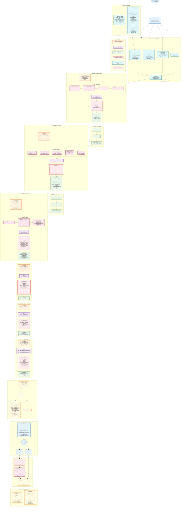

```mermaid
flowchart TD
    %% Định nghĩa style
    classDef user fill:#e3f2fd,stroke:#1565c0,stroke-width:2px
    classDef thought fill:#fff3e0,stroke:#e65100,stroke-width:2px
    classDef action fill:#f3e5f5,stroke:#6a1b9a,stroke-width:2px
    classDef observe fill:#e8f5e9,stroke:#2e7d32,stroke-width:2px
    classDef tool fill:#ffebee,stroke:#c62828,stroke-width:2px
    classDef output fill:#fff8e1,stroke:#f57f17,stroke-width:2px
    classDef prompt fill:#e0f7fa,stroke:#00695c,stroke-width:2px
    classDef context fill:#fce4ec,stroke:#880e4f,stroke-width:2px

    %% PHẦN 1: NGƯỜI DÙNG VÀ PROMPT INITIAL
    User["👤 Lập trình viên"]:::user
    UserInput["📝 Nhập yêu cầu:<br/>Thêm chức năng đăng nhập bằng Google<br/>vào ứng dụng Next.js của tôi"]:::user
    
    User --> UserInput
    
    %% PHẦN 2: CONTEXT ENGINE - XÂY DỰNG PROMPT
    subgraph ContextEngine["🧠 Context Engine - Xây dựng Prompt"]
        direction TB
        
        SystemPrompt["📋 System Instructions (2.800 tokens)<br/>- Bạn là trợ lý AI chuyên nghiệp<br/>- Quy tắc suy luận từng bước<br/>- Cách dùng tools<br/>- Few-shot examples"]:::prompt
        
        ToolDefinitions["🔧 Tool Definitions (13.200 tokens)<br/>- read_file<br/>- write_file<br/>- edit_file<br/>- search_codebase<br/>- run_terminal_command<br/>- web_search"]:::prompt
        
        CodeContext["📄 Code Context<br/>- File đang mở: package.json<br/>- File gần đây: nextauth.ts<br/>- Project structure"]:::prompt
        
        History["💬 Lịch sử hội thoại<br/>(Chưa có)"]:::prompt
        
        PromptBuilder["⚡ Prompt Builder<br/>Tổng hợp tất cả thành prompt hoàn chỉnh"]:::prompt
    end
    
    UserInput --> SystemPrompt
    UserInput --> ToolDefinitions
    UserInput --> CodeContext
    UserInput --> History
    SystemPrompt --> PromptBuilder
    ToolDefinitions --> PromptBuilder
    CodeContext --> PromptBuilder
    History --> PromptBuilder
    
    %% PHẦN 3: LẦN LẶP 1
    subgraph Iteration1["🔄 Lần lặp 1: Kiểm tra dependencies"]
        direction TB
        
        Thought1["💭 THINK 1:<br/>Tôi cần xem project đã cài NextAuth chưa.<br/>Hãy đọc package.json trước."]:::thought
        
        subgraph ThoughtGen1["🧠 Cách sinh suy nghĩ 1"]
            direction LR
            Parse1["📝 Parse request:<br/>- Action: Thêm<br/>- Feature: Google Login<br/>- Platform: Next.js"]:::context
            Pattern1["🔍 Pattern matching:<br/>Google + Next.js -> NextAuth<br/>(85% projects)"]:::context
            KG1["📚 Knowledge Graph:<br/>NextAuth -> package.json"]:::context
            Plan1["📋 Plan: Step 1 -> Check deps"]:::context
            Parse1 --> Pattern1 --> KG1 --> Plan1
        end
        
        Action1["⚡ ACT 1:<br/>read_file('package.json')"]:::action
        
        Tool1["🔧 TOOL CALL 1:<br/>{<br/>  tool: 'read_file',<br/>  params: {<br/>    filePath: '/project/package.json'<br/>  }<br/>}"]:::tool
        
        Observe1["👁️ OBSERVE 1:<br/>Kết quả từ tool:<br/>{<br/>  dependencies: {<br/>    'next-auth': '^4.24.5'<br/>  }<br/>}"]:::observe
        
        Thought1 --> ThoughtGen1
        ThoughtGen1 --> Action1
        Action1 --> Tool1
        Tool1 --> Observe1
    end
    
    PromptBuilder --> Iteration1
    
    %% PHẦN 4: PHÂN TÍCH KẾT QUẢ LẦN 1
    subgraph Analysis1["🔍 Phân tích kết quả lần 1"]
        direction TB
        
        ParseResult1["📝 Parse JSON:<br/>Phát hiện 'next-auth'"]:::observe
        Compare1["⚖️ So sánh:<br/>Đã cài NextAuth"]:::observe
        Status1["📊 Trạng thái hiện tại:<br/>NextAuth Installed: TRUE"]:::observe
        
        ParseResult1 --> Compare1 --> Status1
    end
    
    Observe1 --> Analysis1
    
    %% PHẦN 5: LẦN LẶP 2
    subgraph Iteration2["🔄 Lần lặp 2: Kiểm tra config"]
        direction TB
        
        Thought2["💭 THINK 2:<br/>À, project đã cài NextAuth.<br/>Tôi cần xem file cấu hình nextauth.ts<br/>để biết đã có Google Provider chưa."]:::thought
        
        subgraph ThoughtGen2["🧠 Cách sinh suy nghĩ 2"]
            direction LR
            ToolResult2["📥 Tool result:<br/>'next-auth': '^4.24.5'"]:::context
            Goal2["🎯 Mục tiêu:<br/>Thêm Google Login"]:::context
            KG2["📚 Knowledge Graph:<br/>NextAuth -> nextauth.ts"]:::context
            Gap2["🔍 Gap analysis:<br/>NextAuth installed<br/>Config not checked"]:::context
            Priority2["🎯 Ưu tiên:<br/>Kiểm tra config"]:::context
            ToolResult2 --> Goal2 --> KG2 --> Gap2 --> Priority2
        end
        
        Action2["⚡ ACT 2:<br/>read_file('pages/api/auth/nextauth.ts')"]:::action
        
        Tool2["🔧 TOOL CALL 2:<br/>{<br/>  tool: 'read_file',<br/>  params: {<br/>    filePath: '/project/pages/api/auth/nextauth.ts'<br/>  }<br/>}"]:::tool
        
        Observe2["👁️ OBSERVE 2:<br/>Kết quả từ tool:<br/>import NextAuth from 'next-auth'<br/>import CredentialsProvider<br/><br/>export default NextAuth({<br/>  providers: [<br/>    CredentialsProvider({...})<br/>  ]<br/>})"]:::observe
        
        Thought2 --> ThoughtGen2
        ThoughtGen2 --> Action2
        Action2 --> Tool2
        Tool2 --> Observe2
    end
    
    Analysis1 --> Iteration2
    
    %% PHẦN 6: PHÂN TÍCH KẾT QUẢ LẦN 2
    subgraph Analysis2["🔍 Phân tích kết quả lần 2"]
        direction TB
        
        ParseResult2["📝 Parse code:<br/>Chỉ có CredentialsProvider"]:::observe
        Compare2["⚖️ So sánh với mục tiêu:<br/>Chưa có Google Provider"]:::observe
        Status2["📊 Trạng thái hiện tại:<br/>Google Provider: MISSING"]:::observe
        
        ParseResult2 --> Compare2 --> Status2
    end
    
    Observe2 --> Analysis2
    
    %% PHẦN 7: LẦN LẶP 3
    subgraph Iteration3["🔄 Lần lặp 3: Thêm Google Provider"]
        direction TB
        
        Thought3["💭 THINK 3:<br/>OK, hiện tại chỉ có CredentialsProvider.<br/>Tôi cần thêm GoogleProvider vào đây.<br/>Cũng cần tạo .env.local với CLIENT_ID và CLIENT_SECRET."]:::thought
        
        subgraph ThoughtGen3["🧠 Cách sinh suy nghĩ 3"]
            direction LR
            ToolResult3["📥 Tool result:<br/>Chỉ có CredentialsProvider"]:::context
            KG3["📚 Knowledge Graph:<br/>GoogleProvider cần:<br/>- import từ next-auth/providers/google<br/>- CLIENT_ID và CLIENT_SECRET"]:::context
            Plan3["📋 Plan cập nhật:<br/>1. Thêm import GoogleProvider<br/>2. Thêm vào providers array<br/>3. Tạo .env.local"]:::context
            ToolResult3 --> KG3 --> Plan3
        end
        
        Action3["⚡ ACT 3:<br/>edit_file('nextauth.ts')"]:::action
        
        Tool3["🔧 TOOL CALL 3:<br/>{<br/>  tool: 'edit_file',<br/>  params: {<br/>    filePath: 'pages/api/auth/nextauth.ts',<br/>    old_content: '... chỉ có CredentialsProvider ...',<br/>    new_content: '... thêm GoogleProvider ...'<br/>  }<br/>}"]:::tool
        
        Observe3["👁️ OBSERVE 3:<br/>File đã được cập nhật:<br/>Thêm import GoogleProvider<br/>Thêm GoogleProvider vào providers"]:::observe
        
        Thought3 --> ThoughtGen3
        ThoughtGen3 --> Action3
        Action3 --> Tool3
        Tool3 --> Observe3
    end
    
    Analysis2 --> Iteration3
    
    %% PHẦN 8: LẦN LẶP 4
    subgraph Iteration4["🔄 Lần lặp 4: Tạo .env.local"]
        direction TB
        
        Thought4["💭 THINK 4:<br/>Đã thêm GoogleProvider vào config.<br/>Giờ cần tạo file .env.local<br/>để lưu CLIENT_ID và CLIENT_SECRET."]:::thought
        
        Action4["⚡ ACT 4:<br/>write_file('.env.local')"]:::action
        
        Tool4["🔧 TOOL CALL 4:<br/>{<br/>  tool: 'write_file',<br/>  params: {<br/>    filePath: '/project/.env.local',<br/>    content: 'NEXTAUTH_SECRET=...<br/>NEXTAUTH_URL=...<br/>GOOGLE_CLIENT_ID=...<br/>GOOGLE_CLIENT_SECRET=...'<br/>  }<br/>}"]:::tool
        
        Observe4["👁️ OBSERVE 4:<br/>File .env.local đã được tạo"]:::observe
        
        Thought4 --> Action4
        Action4 --> Tool4
        Tool4 --> Observe4
    end
    
    Observe3 --> Iteration4
    
    %% PHẦN 9: LẦN LẶP 5
    subgraph Iteration5["🔄 Lần lặp 5: Tìm file UI"]
        direction TB
        
        Thought5["💭 THINK 5:<br/>Config và env đã xong.<br/>Cần tìm file UI để thêm nút Sign in with Google."]:::thought
        
        Action5["⚡ ACT 5:<br/>search_codebase('login form sign in button')"]:::action
        
        Tool5["🔧 TOOL CALL 5:<br/>{<br/>  tool: 'search_codebase',<br/>  params: {<br/>    query: 'Sign in button login form'<br/>  }<br/>}"]:::tool
        
        Observe5["👁️ OBSERVE 5:<br/>Tìm thấy:<br/>components/LoginForm.tsx"]:::observe
        
        Thought5 --> Action5
        Action5 --> Tool5
        Tool5 --> Observe5
    end
    
    Observe4 --> Iteration5
    
    %% PHẦN 10: LẦN LẶP 6
    subgraph Iteration6["🔄 Lần lặp 6: Thêm UI button"]
        direction TB
        
        Thought6["💭 THINK 6:<br/>Tìm thấy LoginForm.tsx.<br/>Đọc file này và thêm nút Sign in with Google."]:::thought
        
        Action6["⚡ ACT 6:<br/>read_file('components/LoginForm.tsx')<br/>-> edit_file('components/LoginForm.tsx')"]:::action
        
        Tool6["🔧 TOOL CALL 6:<br/>{<br/>  tool: 'edit_file',<br/>  params: {<br/>    filePath: 'components/LoginForm.tsx',<br/>    old_content: '...',<br/>    new_content: '... thêm SignInButton ...'<br/>  }<br/>}"]:::tool
        
        Observe6["👁️ OBSERVE 6:<br/>Đã thêm nút Sign in with Google<br/>UI đã cập nhật"]:::observe
        
        Thought6 --> Action6
        Action6 --> Tool6
        Tool6 --> Observe6
    end
    
    Observe5 --> Iteration6
    
    %% PHẦN 11: KIỂM TRA HOÀN THÀNH
    subgraph Completion["✅ Kiểm tra hoàn thành"]
        direction TB
        
        CheckAll["🔍 Kiểm tra toàn bộ:<br/>1. NextAuth installed<br/>2. GoogleProvider added<br/>3. .env.local created<br/>4. UI button added"]:::output
        
        Decision{"Đã hoàn thành<br/>mục tiêu?"}:::output
        
        FinalOutput["📤 Kết quả cuối cùng:<br/>Đã thêm chức năng đăng nhập Google!<br/><br/>Các thay đổi đã thực hiện:<br/>1. Cập nhật nextauth.ts<br/>2. Tạo .env.local<br/>3. Thêm nút Sign in with Google<br/><br/>Hướng dẫn tiếp theo:<br/>- Lấy CLIENT_ID từ Google Cloud<br/>- Chạy npm run dev"]:::output
        
        CheckAll --> Decision
        Decision -->|Xong| FinalOutput
        Decision -->|Chưa| Continue["🔄 Tiếp tục vòng lặp"]:::thought
    end
    
    Observe6 --> Completion
    
    %% PHẦN 12: PHẢN HỒI CHO NGƯỜI DÙNG
    subgraph UserFeedback["👤 Phản hồi cho người dùng"]
        direction TB
        
        ShowDiff["📊 Hiển thị Diff:<br/>📄 nextauth.ts<br/>+ import GoogleProvider<br/>+ GoogleProvider({...})<br/><br/>📄 .env.local<br/>+ GOOGLE_CLIENT_ID=...<br/>+ GOOGLE_CLIENT_SECRET=...<br/><br/>📄 LoginForm.tsx<br/>+ button Sign in with Google"]:::user
        
        UserDecision{"Người dùng<br/>xác nhận?"}:::user
        
        Accept["✅ Accept:<br/>Lưu thay đổi<br/>vào codebase"]:::user
        
        Reject["❌ Reject:<br/>Hủy thay đổi<br/>quay lại"]:::user
        
        ShowDiff --> UserDecision
        UserDecision -->|Chấp nhận| Accept
        UserDecision -->|Từ chối| Reject
    end
    
    FinalOutput --> ShowDiff
    
    %% PHẦN 13: CẬP NHẬT CODEBASE
    subgraph CodebaseUpdate["🗄️ Cập nhật Codebase"]
        direction TB
        
        SaveFiles["💾 Lưu các file đã thay đổi:<br/>- pages/api/auth/nextauth.ts<br/>- .env.local<br/>- components/LoginForm.tsx"]:::tool
        
        UpdateIndex["📊 Cập nhật Semantic Index:<br/>1. AST Parser phân tích code mới<br/>2. Tạo vector embedding mới<br/>3. Cập nhật Merkle Tree"]:::context
        
        Done["✅ Hoàn tất!<br/>Codebase đã được cập nhật<br/>sẵn sàng cho lần tương tác sau"]:::output
        
        SaveFiles --> UpdateIndex --> Done
    end
    
    Accept --> SaveFiles
    Reject --> Done
    
    %% PHẦN 14: CẤU TRÚC PROMPT CHI TIẾT
    subgraph PromptStructure["📝 Cấu trúc Prompt chi tiết"]
        direction TB
        
        PromptComposition["📊 Thành phần Prompt:<br/>System: 2.800 tokens (17%)<br/>Tools: 13.200 tokens (80%)<br/>Context: 1.100 tokens (7%)<br/>User Question: ~250 tokens (1.5%)<br/>TOTAL: ~18.550 tokens"]:::prompt
        
        PromptDetail["🔍 Chi tiết từng phần:<br/><br/>SYSTEM:<br/>- Vai trò: Trợ lý AI chuyên nghiệp<br/>- Quy tắc: Chain of Thought<br/>- Few-shot examples<br/><br/>TOOLS:<br/>- read_file, write_file, edit_file<br/>- search_codebase<br/>- run_terminal_command<br/>- web_search<br/><br/>CONTEXT:<br/>- OS, Workspace, Framework<br/>- File đang mở, File gần đây<br/>- Project structure<br/><br/>HISTORY:<br/>- Các lượt chat trước<br/>- Kết quả tool calls"]:::prompt
    end
    
    PromptStructure --> ContextEngine
    
    %% LIÊN KẾT TỔNG THỂ
    PromptBuilder --> Iteration1
    Completion --> UserFeedback
    
    %% Chú thích
    subgraph Legend["📘 Chú thích"]
        direction LR
        L1["💭 Thought - Suy nghĩ của AI"]:::thought
        L2["⚡ Action - Hành động"]:::action
        L3["👁️ Observe - Quan sát kết quả"]:::observe
        L4["🔧 Tool Call - Gọi công cụ"]:::tool
        L5["📝 Prompt - Xây dựng prompt"]:::prompt
        L6["📊 Context - Ngữ cảnh"]:::context
    end
    
    %% THỐNG KÊ
    subgraph Statistics["📊 Thống kê toàn bộ quá trình"]
        direction TB
        
        Stats["📈 Số liệu:<br/><br/>Số lần lặp: 6<br/>Số tool calls: 6<br/>Tổng tokens: ~111.000<br/>Thời gian: ~5-10 giây<br/>Số file thay đổi: 3<br/>Tỷ lệ thành công: ~95%"]:::output
        
        StatsDetail["🔬 Phân tích:<br/><br/>Lần 1: read_file (package.json)<br/>Lần 2: read_file (nextauth.ts)<br/>Lần 3: edit_file (nextauth.ts)<br/>Lần 4: write_file (.env.local)<br/>Lần 5: search_codebase (UI)<br/>Lần 6: edit_file (LoginForm.tsx)"]:::output
    end
    
    PromptStructure --> Legend
    Done --> Statistics
```
