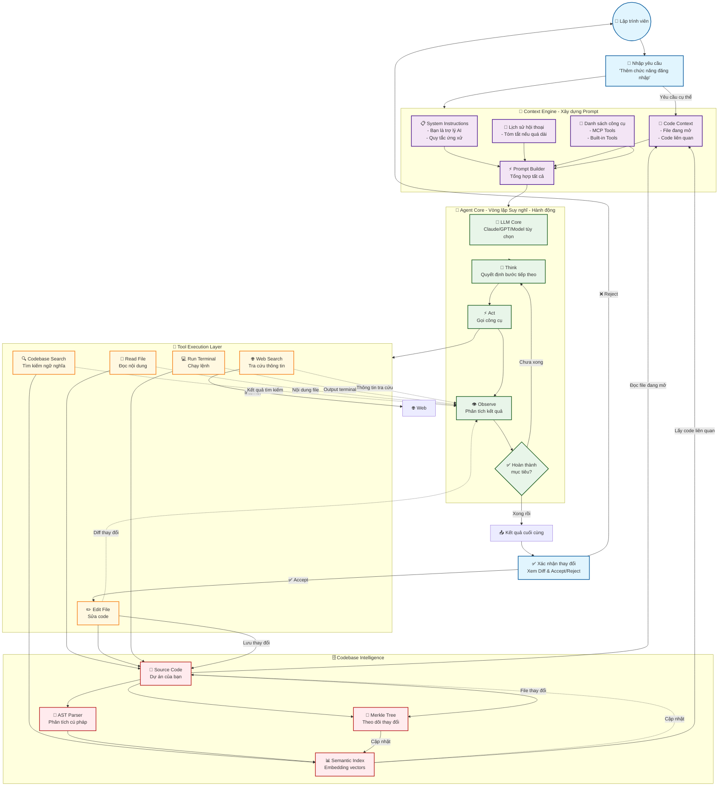

```mermaid
flowchart TD
    %% Định nghĩa style cho các nhóm
    classDef user fill:#e1f5fe,stroke:#01579b,stroke-width:2px
    classDef agent fill:#fff3e0,stroke:#e65100,stroke-width:2px
    classDef context fill:#f3e5f5,stroke:#4a148c,stroke-width:2px
    classDef llm fill:#e8f5e9,stroke:#1b5e20,stroke-width:2px
    classDef tools fill:#fff8e1,stroke:#f57f17,stroke-width:2px
    classDef codebase fill:#ffebee,stroke:#b71c1c,stroke-width:2px

    %% === LỚP NGƯỜI DÙNG ===
    User((👤 Lập trình viên)):::user
    UserInput["📝 Nhập yêu cầu<br/>'Thêm chức năng đăng nhập'"]:::user
    Approval["✅ Xác nhận thay đổi<br/>Xem Diff & Accept/Reject"]:::user

    %% === LỚP CONTEXT ENGINE ===
    subgraph ContextEngine["🧠 Context Engine - Xây dựng Prompt"]
        direction TB
        SystemPrompt["📋 System Instructions<br/>- Bạn là trợ lý AI<br/>- Quy tắc ứng xử"]:::context
        History["💬 Lịch sử hội thoại<br/>- Tóm tắt nếu quá dài"]:::context
        CodeContext["📄 Code Context<br/>- File đang mở<br/>- Code liên quan"]:::context
        ToolsList["🔧 Danh sách công cụ<br/>- MCP Tools<br/>- Built-in Tools"]:::context
        
        PromptBuilder["⚡ Prompt Builder<br/>Tổng hợp tất cả"]:::context
    end

    %% === LỚP AGENT (LLM + VÒNG LẶP) ===
    subgraph AgentLoop["🔄 Agent Core - Vòng lặp Suy nghĩ - Hành động"]
        direction LR
        LLM["🤖 LLM Core<br/>Claude/GPT/Model tùy chọn"]:::llm
        
        Think["💭 Think<br/>Quyết định bước tiếp theo"]:::llm
        Act["⚡ Act<br/>Gọi công cụ"]:::llm
        Observe["👁️ Observe<br/>Phân tích kết quả"]:::llm
        
        LoopDecision{"✅ Hoàn thành<br/>mục tiêu?"}:::llm
    end

    %% === LỚP TOOLS ===
    subgraph ToolsLayer["🔌 Tool Execution Layer"]
        direction TB
        SearchTool["🔍 Codebase Search<br/>Tìm kiếm ngữ nghĩa"]:::tools
        ReadTool["📖 Read File<br/>Đọc nội dung"]:::tools
        EditTool["✏️ Edit File<br/>Sửa code"]:::tools
        TerminalTool["💻 Run Terminal<br/>Chạy lệnh"]:::tools
        WebTool["🌐 Web Search<br/>Tra cứu thông tin"]:::tools
    end

    %% === LỚP CODEBASE ===
    subgraph CodebaseLayer["🗄️ Codebase Intelligence"]
        direction TB
        ASTParser["🔬 AST Parser<br/>Phân tích cú pháp"]:::codebase
        SemanticIndex["📊 Semantic Index<br/>Embedding vectors"]:::codebase
        MerkleTree["🌳 Merkle Tree<br/>Theo dõi thay đổi"]:::codebase
        
        CodeFiles["📁 Source Code<br/>Dự án của bạn"]:::codebase
    end

    %% === KẾT NỐI LUỒNG ===
    User --> UserInput
    UserInput --> ContextEngine
    
    SystemPrompt --> PromptBuilder
    History --> PromptBuilder
    CodeContext --> PromptBuilder
    ToolsList --> PromptBuilder
    
    PromptBuilder --> AgentLoop
    
    %% Vòng lặp Agent
    AgentLoop --> Think --> Act --> Observe --> LoopDecision
    LoopDecision -->|Chưa xong| Think
    LoopDecision -->|Xong rồi| AgentOutput["📤 Kết quả cuối cùng"]
    
    %% Kết nối Tools
    Act --> ToolsLayer
    SearchTool --> SemanticIndex
    ReadTool --> CodeFiles
    EditTool --> CodeFiles
    TerminalTool --> CodeFiles
    WebTool -->|Internet| WebSearch["🌐 Web"]
    
    %% Phản hồi từ Tools về Observe
    SearchTool -.->|Kết quả tìm kiếm| Observe
    ReadTool -.->|Nội dung file| Observe
    EditTool -.->|Diff thay đổi| Observe
    TerminalTool -.->|Output terminal| Observe
    WebTool -.->|Thông tin tra cứu| Observe
    
    %% Kết nối Codebase
    CodeFiles --> ASTParser
    ASTParser --> SemanticIndex
    CodeFiles --> MerkleTree
    SemanticIndex -.->|Cập nhật| CodeFiles
    
    %% Kết nối với Context
    SemanticIndex -->|Lấy code liên quan| CodeContext
    UserInput -->|Yêu cầu cụ thể| CodeContext
    CodeFiles -->|Đọc file đang mở| CodeContext
    
    %% Output
    AgentOutput --> Approval
    Approval -->|✅ Accept| EditTool
    Approval -->|❌ Reject| User
    EditTool -->|Lưu thay đổi| CodeFiles
    
    %% Luồng cập nhật Codebase
    CodeFiles -->|File thay đổi| MerkleTree
    MerkleTree -->|Cập nhật| SemanticIndex
```
