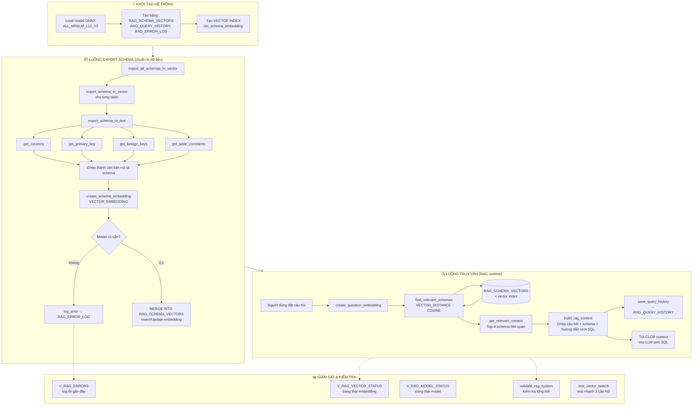

```mermaid
flowchart TD
    subgraph SETUP["🔧 KHỞI TẠO HỆ THỐNG"]
        A1[Load model ONNX<br/>ALL_MINILM_L12_V2] --> A2[Tạo bảng: RAG_SCHEMA_VECTORS<br/>RAG_QUERY_HISTORY, RAG_ERROR_LOG]
        A2 --> A3[Tạo VECTOR INDEX<br/>idx_schema_embedding]
    end

    subgraph EXPORT["📦 LUỒNG EXPORT SCHEMA (chuẩn bị dữ liệu)"]
        B1[export_all_schemas_to_vector] --> B2[export_schema_to_vector<br/>cho từng table]
        B2 --> B3[export_schema_to_text]
        B3 --> B4[get_columns]
        B3 --> B5[get_primary_key]
        B3 --> B6[get_foreign_keys]
        B3 --> B7[get_table_comments]
        B4 & B5 & B6 & B7 --> B8[Ghép thành văn bản mô tả schema]
        B8 --> B9[create_schema_embedding<br/>VECTOR_EMBEDDING]
        B9 --> B10{Model có sẵn?}
        B10 -->|Không| B11[log_error → RAG_ERROR_LOG]
        B10 -->|Có| B12[MERGE INTO RAG_SCHEMA_VECTORS<br/>Insert/Update embedding]
    end

    subgraph QUERY["🔍 LUỒNG TRUY VẤN (RAG runtime)"]
        C1[Người dùng đặt câu hỏi] --> C2[create_question_embedding]
        C2 --> C3[find_relevant_schemas<br/>VECTOR_DISTANCE COSINE]
        C3 --> C4[(RAG_SCHEMA_VECTORS<br/>+ vector index)]
        C4 --> C3
        C3 --> C5[get_relevant_context<br/>Top-K schema liên quan]
        C5 --> C6[build_rag_context<br/>Ghép câu hỏi + schema + hướng dẫn sinh SQL]
        C6 --> C7[save_query_history<br/>→ RAG_QUERY_HISTORY]
        C6 --> C8[Trả CLOB context<br/>cho LLM sinh SQL]
    end

    subgraph MONITOR["📊 GIÁM SÁT & KIỂM TRA"]
        D1[V_RAG_VECTOR_STATUS<br/>trạng thái embedding]
        D2[V_RAG_ERRORS<br/>log lỗi gần đây]
        D3[V_RAG_MODEL_STATUS<br/>trạng thái model]
        D4[validate_rag_system<br/>kiểm tra tổng thể]
        D5[test_vector_search<br/>test nhanh 1 câu hỏi]
    end

    SETUP --> EXPORT
    EXPORT --> QUERY
    B11 -.-> D2
    QUERY -.-> D1
    QUERY -.-> D4
```
