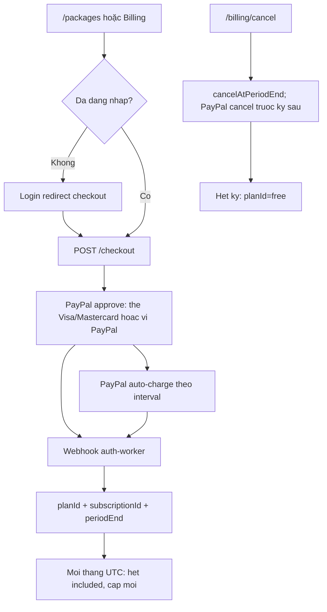

# Spec: Subscription packages (nâng cấp gói)

> **Trạng thái:** Draft v1.1 — sẵn sàng code  
> **Phiên bản:** 1.1  
> **Ngày:** 2026-09-18  
> **Phạm vi:** Catalog 4 gói, PayPal Subscriptions (Visa/Mastercard), chiết khấu nhiều tháng, nạp Credit khi hết quota, hủy gói, always-on grace, creator `minPlanId`, marketing/billing UX  
> **Bổ sung, không thay thế:** nguyên tắc Credit → [`business-model-one-credit-spec.md`](./business-model-one-credit-spec.md)  
> **Không thay thế:** luồng workflow → [`workflow-how-it-works.md`](./workflow-how-it-works.md)

**v1.1:** mua 4 gói mặc định **bật**. Hai cửa: **PayPal Subscriptions** (Visa/Mastercard hoặc ví khai trên PayPal, tự gia hạn) **hoặc** Casso / PayPal Orders như nạp Credit (trả kỳ này, không tự gia hạn). **Không** Stripe. Nạp Credit vẫn Orders/Casso/VNPay.

Nguyên tắc giữ từ spec Credit:

- **Subscription** = quyền nền tảng (lãi bền). Giá gói ổn định; không nhảy vì catalog Cloudflare.
- **Credit** = van COGS. Credit tặng **hết tháng UTC là hết**, không cộng dồn — kể cả khi user trả trước 3/6/12 tháng.
- **Enterprise hợp đồng** = SLA / SSO / BYOK / quota custom — **không** là gói thứ 5 trên `/packages`.

Coding bám spec này. **Không** hard-code giá / included credits rải rác trên UI. Marketing đọc `GET /public/plans`.

---

## 0. Hiện trạng repo và bất cập phải vá

Hai lớp lệch nhau:

| Lớp | Giá trị | Sự thật trong code |
|-----|---------|-------------------|
| Marketing `/packages` | Free $0 / Pro **$49** / Enterprise custom | Copy tĩnh, CTA → login, **không checkout** |
| Engine `planId` | `free \| pro \| enterprise` | Entitlement trong `plan.ts`; **không bán** |

File SSOT entitlement hiện tại: [`workers/auth-worker/src/features/member/workflows/billing/plan.ts`](../workers/auth-worker/src/features/member/workflows/billing/plan.ts).

**Không có checkout gói. Không hủy gói. Không auto-renew. Không webhook subscription.**

PayPal **đã có** nhưng chỉ **Orders one-shot** (nạp Credit USD): [`workers/auth-worker/src/features/member/paypal/`](../workers/auth-worker/src/features/member/paypal/). Capture xong gọi `recordTopUpAndUpgradeTier` (loyalty VND) — **không** đổi `planId`. Không Billing Plans, không `createSubscription`, không verify webhook PayPal.

Thanh toán ví Credit (giữ): Casso/VietQR mặc định, PayPal Orders nếu secret, VNPay sau flag. Subscription + Visa/Mastercard + charge đầu kỳ = **PayPal Subscriptions** (chưa có).

### 0.1 Lỗ hổng đã rà (live + code)

| # | Bất cập | File / route |
|---|---------|--------------|
| 1 | Nút Free/Pro trên `/packages` và home preview đều `/auth/v3/login` — không mở thanh toán, không `redirect` checkout | [`packages.tsx`](../workers/web/src/app/(external)/pages/packages.tsx), [`packages-preview.tsx`](../workers/web/src/app/(external)/components/home/packages-preview.tsx) |
| 2 | Billing Free: alert “nâng cấp để mua Credit” **không có nút Upgrade** | [`billing/page.tsx`](../workers/web/src/app/(main)/dashboard/control/billing/page.tsx) |
| 3 | Free không thấy top-up; Overview wallet “View billing” / “Explore packages” quay marketing, không thanh toán | `wallet-card.tsx`, `subscriptions-card.tsx` |
| 4 | `inferPlanId` suy luận Pro từ top-up / purchased lots / USD wallet, rồi stamp `'free'` → khóa mua Credit (gà–trứng) | `plan.ts` `inferPlanId` |
| 5 | Admin không có UI gán `planId` | — |
| 6 | FAQ Support: “Đổi gói ở Dashboard > Billing” — Billing không đổi được gói | `SupportPage.faq.change_plan` |
| 7 | Sharing / webhook / cron ghi Pro trên marketing, **code không enforce** | executor / triggers |
| 8 | Overview “Active subscriptions” = **API services**, không phải gói workspace; `limit: 0` | [`overview/infrastructure.ts`](../workers/auth-worker/src/features/member/overview/infrastructure.ts) |
| 9 | `/dashboard` (Next) = “Coming Soon”; login/navbar vẫn đổ vào đó nếu không có `redirect` hợp lệ | `dashboard/page.tsx`, `login-form.tsx` `navigateAfterLogin` |
| 10 | Settings/notifications trong sidebar bị ẩn, không có page | `HIDDEN_NAV_URLS` |
| 11 | Không chiết khấu nhiều tháng, không auto-renew, không cancel-at-period-end | — |
| 12 | Workflow không có `minPlanId` / `graceWhenExhausted` | [`AgentWorkflowSchema`](../workers/auth-worker/src/features/member/workflows/domain/domain.ts), settings sheet |
| 13 | Giá `$49` / `5,000` Credit hard-code UI, lệch engine (Free 200 / Pro 5_000 / Ent 25_000) | packages + `DEFAULT_PLAN_ENTITLEMENTS` |
| 14 | VNPay off (`NEXT_PUBLIC_ENABLE_VNPAY_BILLING`); PayPal Credit hiện “unavailable” nếu `/dashboard/paypal/config` fail | `payment-dialog-constants.ts`, `billing-api.ts` |
| 15 | Login `sanitizeHubRedirect` **chỉ** nhận URL tuyệt đối `*.aiagents-hub.vn` — path `/packages?checkout=…` bị bỏ, user về Coming Soon | `login-form.tsx` |
| 16 | CTA gói không truyền `?redirect=` (param thật của login, không phải `next`) | packages + auth |
| 17 | Capture PayPal Credit **không** tạo quyền gói; nhầm loyalty tier với subscription | `paypal/infrastructure.ts` `recordTopUpAndUpgradeTier` |
| 18 | Không endpoint webhook PayPal; Workers chưa verify `PAYPAL-TRANSMISSION-*` | — |
| 19 | Trang tĩnh `/packages` 3 card (Free/Pro/Enterprise); i18n `PackagesPage` còn key chết (`claw_api`, `search_placeholder`, `coming_soon`, “API calls”) | `en-US.json` / `vi-VN.json` |
| 20 | Terms/Privacy nói “Paid Subscriptions” + PayPal nhưng không mô tả auto-renew, hủy cuối kỳ, Visa/Mastercard trên PayPal | `TermsPage.fees`, Privacy payment |
| 21 | Support FAQ + AI canned answers: “Pro can buy more”; không Starter/Business, không hủy gói | `support.tsx` |
| 22 | External mock [`pages/dashboard.tsx`](../workers/web/src/app/(external)/pages/dashboard.tsx) = “APIHub” + fake Pro/Basic API calls — dễ lẫn với Billing thật | React Router leftover |
| 23 | About/home CTA “Start free” → login, không nêu 4 gói / chiết khấu | `cta-section.tsx`, `about.tsx` |
| 24 | Profile DTO / Billing UI type `free \| pro \| enterprise` — thiếu starter/business, status, period end | `billing-api.ts`, `UserSchema` |
| 25 | Overview Quick links chỉ “Billing history”, không “Nâng cấp gói” / “Hủy gói” | `quick-links-card.tsx` |
| 26 | Auth marketing copy “Enterprise APIs” | `pages/auth.tsx` |

### 0.2 Quyết định vá (bắt buộc khi code)

1. `planId` **chỉ** đến từ PayPal subscription (`ACTIVE` / `APPROVED`), đơn prepaid Casso/PayPal Orders (`planSource=order`, còn hạn), admin grant, hoặc `free`. **Xóa** suy luận từ top-up Credit / lots / USD wallet / membership tier.
2. `canBuyCredits = planRank >= 1` (Starter+).
3. CTA gói: chưa login → `/auth/v3/login?redirect={absolute /packages?checkout=…}`. Đã login → ưu tiên PayPal Subscriptions (Visa/Mastercard); không được thì (và luôn có lựa chọn) Casso / PayPal Orders. Mở rộng `sanitizeHubRedirect` cho path nội bộ `/…`.
4. Billing Free: nút **Nâng cấp gói** → `/packages` hoặc checkout sheet.
5. Share / webhook / cron production: enforce entitlement gói (Free không bật).
6. Overview: tách **Gói workspace** khỏi danh sách dịch vụ đang dùng.
7. Feature flag `PAYPAL_BILLING_ENABLED`: **mặc định bật**. Chỉ `"false"` thì tắt PayPal Subscriptions (auto-renew). Mua gói vẫn được bằng Casso / PayPal Orders (trả kỳ này, không tự gia hạn).
8. **Không** thêm Stripe. Subscription + renew + hủy = PayPal; nạp Credit = Orders/Casso/VNPay như hiện tại.

---

## 1. Catalog 4 gói self-serve

`planId`: `free | starter | pro | business`.

Enterprise hợp đồng (SLA, SSO, BYOK, invoice, quota custom) **không** lên card `/packages` — footer “Cần SLA / hóa đơn công ty? Liên hệ”. Admin có thể stamp `business` + `enterpriseContract: true` sau này.

### 1.1 Rank

```ts
export const PLAN_IDS = ['free', 'starter', 'pro', 'business'] as const;
export type PlanId = (typeof PLAN_IDS)[number];

export const PLAN_RANK: Record<PlanId, number> = {
  free: 0,
  starter: 1,
  pro: 2,
  business: 3,
};

export function planRank(id: PlanId): number {
  return PLAN_RANK[id];
}

/** Legacy rows: enterprise → business khi đọc. Không ghi `enterprise` mới. */
export function parsePlanId(raw: unknown): PlanId {
  const s = String(raw ?? '').toLowerCase();
  if (s === 'starter' || s === 'pro' || s === 'business') return s;
  if (s === 'enterprise') return 'business';
  return 'free';
}
```

### 1.2 Entitlement SSOT (copy vào `plan.ts`)

Giá niêm yết / tháng USD: Free $0 · Starter **$4.90** · Pro **$19.90** (phổ biến) · Business **$99.90**.

Tỷ lệ bám gói $49 cũ (5_000 Credit / 500 run): Starter ~1/10, Pro ~2/5, Business ~2×. Credit tặng vẫn nhỏ so với subscription.

```ts
export type PlanEntitlement = {
  planId: PlanId;
  /** USD list price per month before interval discount. Free = 0. */
  listPriceUsdPerMonth: number;
  includedCredits: number;
  includedCogsUsdCap: number;
  maxCreditBalance?: number;
  canBuyCredits: boolean;
  /** 0 = unlimited — không dùng cho 4 gói self-serve. */
  workflowRunsPerDay: number;
  maxCronJobs: number;
  canShareWorkflows: boolean;
  canUseWebhooks: boolean;
  canUseCron: boolean;
  /** Always-on grace (mục 5). Mọi gói trả phí đều có, trần tăng dần. */
  canGraceWhenExhausted: boolean;
  graceCreditsPerMonth: number;
  graceRunsPerDay: number;
  graceCogsUsdCap: number;
  graceMinIntervalSec: number;
  /** Creator được set minPlanId tối đa = gói của họ. */
  maxAssignableMinPlanId: PlanId;
  /** Hiện model family trên UI (quyền cũ Enterprise marketing). */
  showModelFamily: boolean;
  coeffNotifyLeadDays: number;
};

export const DEFAULT_PLAN_ENTITLEMENTS: Record<PlanId, PlanEntitlement> = {
  free: {
    planId: 'free',
    listPriceUsdPerMonth: 0,
    includedCredits: 150,
    includedCogsUsdCap: 0.4,
    canBuyCredits: false,
    workflowRunsPerDay: 15,
    maxCronJobs: 0,
    canShareWorkflows: false,
    canUseWebhooks: false,
    canUseCron: false,
    canGraceWhenExhausted: false,
    graceCreditsPerMonth: 0,
    graceRunsPerDay: 0,
    graceCogsUsdCap: 0,
    graceMinIntervalSec: 0,
    maxAssignableMinPlanId: 'free',
    showModelFamily: false,
    coeffNotifyLeadDays: 0,
  },
  starter: {
    planId: 'starter',
    listPriceUsdPerMonth: 4.9,
    includedCredits: 500,
    includedCogsUsdCap: 1.2,
    maxCreditBalance: 20_000,
    canBuyCredits: true,
    workflowRunsPerDay: 50,
    maxCronJobs: 3,
    canShareWorkflows: true,
    canUseWebhooks: true,
    canUseCron: true,
    canGraceWhenExhausted: true,
    graceCreditsPerMonth: 30,
    graceRunsPerDay: 5,
    graceCogsUsdCap: 0.3,
    graceMinIntervalSec: 120,
    maxAssignableMinPlanId: 'starter',
    showModelFamily: false,
    coeffNotifyLeadDays: 7,
  },
  pro: {
    planId: 'pro',
    listPriceUsdPerMonth: 19.9,
    includedCredits: 2_000,
    includedCogsUsdCap: 4,
    maxCreditBalance: 50_000,
    canBuyCredits: true,
    workflowRunsPerDay: 200,
    maxCronJobs: 15,
    canShareWorkflows: true,
    canUseWebhooks: true,
    canUseCron: true,
    canGraceWhenExhausted: true,
    graceCreditsPerMonth: 100,
    graceRunsPerDay: 15,
    graceCogsUsdCap: 1,
    graceMinIntervalSec: 60,
    maxAssignableMinPlanId: 'pro',
    showModelFamily: false,
    coeffNotifyLeadDays: 7,
  },
  business: {
    planId: 'business',
    listPriceUsdPerMonth: 99.9,
    includedCredits: 10_000,
    includedCogsUsdCap: 25,
    maxCreditBalance: 200_000,
    canBuyCredits: true,
    workflowRunsPerDay: 1_000,
    maxCronJobs: 100,
    canShareWorkflows: true,
    canUseWebhooks: true,
    canUseCron: true,
    canGraceWhenExhausted: true,
    graceCreditsPerMonth: 300,
    graceRunsPerDay: 40,
    graceCogsUsdCap: 3,
    graceMinIntervalSec: 30,
    maxAssignableMinPlanId: 'business',
    showModelFamily: true,
    coeffNotifyLeadDays: 30,
  },
};
```

### 1.3 Bảng quyền lợi (marketing + engine)

| | Free | Starter | Pro | Business |
|---|------|---------|-----|----------|
| Giá / tháng | $0 | $4.90 | $19.90 | $99.90 |
| Credit tặng / tháng UTC | 150 | 500 | 2_000 | 10_000 |
| Trần COGS included | $0.40 | $1.20 | $4 | $25 |
| Run / ngày | 15 | 50 | 200 | 1_000 |
| Mua Credit | Không | Có | Có | Có |
| Trần ví Credit | — | 20_000 | 50_000 | 200_000 |
| Share marketplace | Không | Có | Có | Có |
| Webhook production | Không | Có | Có | Có |
| Cron | 0 | 3 | 15 | 100 |
| Always-on grace (workflow đánh dấu) | Không | Có (trần chặt) | Có | Có (rộng hơn) |
| Creator `minPlanId` tối đa | `free` | `starter` | `pro` | `business` |
| Hiện model family | Không | Không | Không | Có |
| Support copy | Community | Standard | Priority | Priority + lead 30 ngày hệ số |
| Ý nghĩa | Trial | Vào cửa trả phí | Phổ biến | Team / power |

Free: builder + chạy workflow của mình. Không phải sản phẩm chính. Hết quota → nâng gói, không nạp Credit, không grace.

`entitlementFor()`: giữ override `maxCreditBalancePro` → đổi tên thành per-plan (`maxCreditBalanceStarter` / `Pro` / `Business`) hoặc map `eco.maxCreditBalance[planId]`. Không còn nhánh `planId === 'enterprise'`.

### 1.4 Nguồn `planId` (thay `inferPlanId`)

```ts
export function resolvePlanId(user: Record<string, unknown>): PlanId {
  const explicit = user.planId ?? user.plan_id;
  if (explicit != null && String(explicit).trim() !== '') return parsePlanId(explicit);
  return 'free';
}
```

**Cấm** coi `monthlyTopUpVnd > 0`, purchased lots, USD wallet còn dư, hoặc membership tier (silver/gold/…) là Pro.

Admin grant: `PUT /dashboard/admin/users/:id/plan` `{ planId, reason }` — ghi audit, không tạo PayPal sub (complimentary). User complimentary không bị webhook PayPal downgrade; `planSource = 'admin' | 'paypal'`.

---

## 2. Chiết khấu nhiều tháng

Chu kỳ thanh toán PayPal: **1 / 3 / 6 / 12 tháng**.

Credit tặng **vẫn reset mỗi tháng UTC** dù user trả trước cả năm (Cursor / ChatGPT). PayPal charge theo `interval_count` của Billing Plan — không trừ thẻ mỗi tháng nếu user chọn 3/6/12.

### 2.1 Hệ số chiết khấu

| `planInterval` | Chiết khấu trên tổng | Hệ số trả | Copy UI |
|----------------|----------------------|-----------|---------|
| 1 | 0% | 1.00 | “Thanh toán mỗi tháng” |
| 3 | 10% | 0.90 | “Tiết kiệm 10%” |
| 6 | 15% | 0.85 | “Tiết kiệm 15%” |
| 12 | 20% | 0.80 | “Tiết kiệm 20% — tốt nhất” |

```ts
export const PLAN_INTERVALS = [1, 3, 6, 12] as const;
export type PlanInterval = (typeof PLAN_INTERVALS)[number];

export const INTERVAL_DISCOUNT: Record<PlanInterval, number> = {
  1: 0,
  3: 0.1,
  6: 0.15,
  12: 0.2,
};

export function prepaidUsd(listPerMonth: number, interval: PlanInterval): number {
  const factor = 1 - INTERVAL_DISCOUNT[interval];
  return Math.round(listPerMonth * interval * factor * 100) / 100;
}

export function effectiveUsdPerMonth(listPerMonth: number, interval: PlanInterval): number {
  return Math.round((prepaidUsd(listPerMonth, interval) / interval) * 100) / 100;
}
```

### 2.2 PayPal Billing Plan matrix (tạo một lần trên PayPal Dashboard / API, map env)

Số tiền charge = `prepaidUsd` (USD, 2 chữ số). Không tin UI — PayPal Plan `regular.pricing_scheme` là số thu thật.

Mỗi gói trả phí = 1 **Catalog Product** + 4 **Billing Plans** (`frequency.interval_unit = MONTH`, `interval_count = 1|3|6|12`, `tenure_type = REGULAR`, `total_cycles = 0` = vô hạn đến khi hủy). Currency `USD`.

| Env key | planId | interval | List × months | Charge USD | ~USD/tháng |
|---------|--------|----------|---------------|------------|------------|
| `PAYPAL_PLAN_STARTER_1` | starter | 1 | 4.90 × 1 | **4.90** | 4.90 |
| `PAYPAL_PLAN_STARTER_3` | starter | 3 | 14.70 × 0.90 | **13.23** | 4.41 |
| `PAYPAL_PLAN_STARTER_6` | starter | 6 | 29.40 × 0.85 | **24.99** | 4.17 |
| `PAYPAL_PLAN_STARTER_12` | starter | 12 | 58.80 × 0.80 | **47.04** | 3.92 |
| `PAYPAL_PLAN_PRO_1` | pro | 1 | 19.90 × 1 | **19.90** | 19.90 |
| `PAYPAL_PLAN_PRO_3` | pro | 3 | 59.70 × 0.90 | **53.73** | 17.91 |
| `PAYPAL_PLAN_PRO_6` | pro | 6 | 119.40 × 0.85 | **101.49** | 16.92 |
| `PAYPAL_PLAN_PRO_12` | pro | 12 | 238.80 × 0.80 | **191.04** | 15.92 |
| `PAYPAL_PLAN_BUSINESS_1` | business | 1 | 99.90 × 1 | **99.90** | 99.90 |
| `PAYPAL_PLAN_BUSINESS_3` | business | 3 | 299.70 × 0.90 | **269.73** | 89.91 |
| `PAYPAL_PLAN_BUSINESS_6` | business | 6 | 599.40 × 0.85 | **509.49** | 84.92 |
| `PAYPAL_PLAN_BUSINESS_12` | business | 12 | 1_198.80 × 0.80 | **959.04** | 79.92 |

Metadata / naming trên PayPal Plan (description + bootstrap map):

```
planId=starter|pro|business
planInterval=1|3|6|12
```

UI: toggle 1/3/6/12 · hiện **$X/tháng** (effective) · badge “tiết kiệm Y%” · “Thanh toán $Z bây giờ, gia hạn tự động”.

Free không có PayPal Plan.

`payment_preferences.auto_bill_outstanding = true`, `setup_fee = 0`. Kỳ đầu charge ngay khi user approve (`user_action: SUBSCRIBE_NOW`).

---

## 3. Hết quota thì nạp thêm (không chạy miễn phí vô hạn)

Hai đồng hồ độc lập (giữ):

| Đồng hồ | Ý nghĩa | Reset | Khi hết |
|---------|---------|-------|---------|
| `workflowRunsToday` | Hạ tầng | UTC daily | Chặn run (trừ grace 5) |
| Credit lots | AI COGS | included = cuối tháng UTC; purchased = 365 ngày FIFO | Chặn AI node |

File lots: [`credit-wallet.ts`](../workers/auth-worker/src/features/member/workflows/billing/credit-wallet.ts). `syncPlanPeriod` vẫn grant included khi `planPeriodYm` đổi — **không** phụ thuộc ngày PayPal charge (user trả 12 tháng vẫn grant 12 lần, mỗi tháng UTC). Credit tặng không dùng hết **vẫn mất**.

Khi included = 0 **hoặc** chạm `includedCogsUsdCap`:

1. Banner Billing + chặn node AI trừ khi còn **purchased lots** hoặc grace mục 5.
2. CTA **Nạp Credit** (Starter+): giữ Casso / PayPal Orders / VNPay. **Không** dùng PayPal Subscriptions cho pack Credit.
3. **Tự nạp** opt-in, mặc định **tắt**: khi included remaining < ngưỡng (mặc định 5% included hoặc 20 Credit, lấy max), tạo PayPal Order pack cố định **$5 / $20 / $50**. Chỉ chạy được nếu user đã vault thẻ (mục 4.6). Thông lệ Twilio/SendGrid — không tặng run.
4. Free: CTA **Nâng cấp gói**, không top-up.

Hết run/ngày: đợi UTC mới, hoặc grace-run nếu workflow `graceWhenExhausted` và gói trả phí.

Pack Credit (PayPal Orders one-shot, **không** subscription):

| Pack | USD | Credits ≈ `usd / creditPriceUsd` @ 0.0077 |
|------|-----|-------------------------------------------|
| credits_5 | 5 | ~649 |
| credits_20 | 20 | ~2_597 |
| credits_50 | 50 | ~6_494 |

Vẫn tôn trọng `maxCreditBalance`. `assertCanBuyCredits` giữ. Tái sử dụng `POST /dashboard/paypal/create_order` + `capture_order`.

---

## 4. PayPal subscription lifecycle

Hai đồng hồ — **không gộp**:

| Đồng hồ | Việc | Mốc |
|---------|------|-----|
| Credit tặng + grace tháng | Hết / cấp mới | **Tháng UTC** (`planPeriodYm`) |
| Tiền gói | Charge Visa/Mastercard hoặc ví PayPal | **Kỳ PayPal** (`billing_info.next_billing_time`) — ngày subscribe, không bắt buộc mùng 1 |

Copy user: “Credit tặng reset mỗi tháng, không cộng dồn. Gói tự gia hạn khi tới hạn thanh toán PayPal.” Gói 3/6/12 tháng: PayPal **không** trừ thẻ mỗi tháng; trừ một lần đầu kỳ đã chiết khấu.



### 4.1 Secrets / env

Tái sử dụng secret PayPal Orders. Thêm:

| Key | Vai trò |
|-----|---------|
| `PAYPAL_CLIENT_ID` | Đã có (Secrets Store) — JS SDK + REST |
| `PAYPAL_CLIENT_SECRET` | Đã có |
| `PAYPAL_API_BASE` | Optional; mặc định `https://api-m.paypal.com` |
| `PAYPAL_WEBHOOK_ID` | Verify `POST /v1/notifications/verify-webhook-signature` |
| `PAYPAL_PLAN_*` | 12 Billing Plan id (bảng 2.2) |
| `PAYPAL_BILLING_ENABLED` | Opt-out. Mặc định bật. `"false"` tắt auto-renew PayPal; vẫn mua gói bằng Casso/PayPal Orders |
| `FRONTEND_URL` | Return/cancel URL |

Merchant PayPal (ops, không code): bật **Pay with Debit or Credit Card** (guest / card on file) trên business account. Không lưu PAN trên Hub — PayPal giữ thẻ.

Workers: REST fetch như [`paypal/infrastructure.ts`](../workers/auth-worker/src/features/member/paypal/infrastructure.ts) (`/v1/oauth2/token`). Webhook: **raw JSON** + verify signature endpoint. Không tin event khi `verification_status !== SUCCESS`.

### 4.2 Tạo subscription + approve

`POST /dashboard/billing/subscriptions/checkout`

```ts
{
  planId: 'starter' | 'pro' | 'business',
  interval: 1 | 3 | 6 | 12,
  method?: 'subscription' | 'order', // order = Casso / PayPal Orders, không auto-renew
}
```

Backend: `method !== 'order'` và flag bật và có Billing Plan id → tạo PayPal Subscription. Thiếu id / lỗi / `method=order` / flag `"false"` → tạo đơn prepaid (notes `plan:{planId}:{interval}`) → `/dashboard/control/billing?payOrder=`.

```
POST {PAYPAL_API_BASE}/v1/billing/subscriptions
{
  plan_id: PAYPAL_PLAN_*,
  custom_id: userId,
  application_context: {
    brand_name: "AI Agents Hub",
    locale: "en-US" | "vi-VN",
    shipping_preference: "NO_SHIPPING",
    user_action: "SUBSCRIBE_NOW",
    return_url: "{FRONTEND_URL}/dashboard/control/billing?subscription=success",
    cancel_url: "{FRONTEND_URL}/packages?checkout=cancelled",
  }
}
```

Response UI: `{ approvalUrl, paypalSubscriptionId }`. Frontend `window.location = approvalUrl` (hosted — Visa/Mastercard trên trang PayPal, đáng tin hơn JS SDK trên React Router `/packages`).

Sau approve: PayPal redirect `return_url` kèm `subscription_id` + `ba_token`. Frontend gọi `POST /dashboard/billing/subscriptions/sync` `{ paypalSubscriptionId }` để kéo `GET /v1/billing/subscriptions/{id}` nếu webhook chậm. **Nguồn sự thật vẫn webhook.**

Chưa login: `/auth/v3/login?redirect={encodeURIComponent('https://aiagents-hub.vn/packages?checkout=pro&interval=1')}`. Sau login, `/packages` đọc query và gọi checkout. `sanitizeHubRedirect` phải nhận:

- URL tuyệt đối `http(s)://*.aiagents-hub.vn/...`
- Path tương đối bắt đầu `/` (không `//`), ví dụ `/packages?checkout=pro&interval=1`

JS SDK `paypal.Buttons({ createSubscription })` **optional** trên Billing sheet khi đã login; không bắt buộc phase 1.

Không trộn `create_order` (Credit) với `billing/subscriptions`.

### 4.3 Webhook events

`POST /dashboard/paypal/webhook` — public, verify, idempotent theo `event.id` (bảng `paypal_events` trên UserDO hoặc D1).

Map `resource.plan_id` → `planId` + `planInterval` bằng env (không parse description).

| Event | Hành vi |
|-------|---------|
| `BILLING.SUBSCRIPTION.ACTIVATED` | Gắn `paypalSubscriptionId`, `paypalPayerId`; `planSource='paypal'`; `planId`/`planInterval`; `planStatus='active'`; `planCurrentPeriodEnd` từ `billing_info.next_billing_time` |
| `BILLING.SUBSCRIPTION.UPDATED` | Cập nhật plan/interval/status/`cancelAtPeriodEnd` local |
| `BILLING.SUBSCRIPTION.CANCELLED` / `EXPIRED` | **Không** hạ Free ngay nếu còn trong kỳ đã trả. Set `planStatus='canceled'`, giữ `planId` đến `planCurrentPeriodEnd`, rồi `free` |
| `BILLING.SUBSCRIPTION.SUSPENDED` | `planStatus='past_due'` hoặc `suspended`; banner dunning |
| `BILLING.SUBSCRIPTION.PAYMENT.FAILED` | `past_due`; PayPal retry theo merchant setting (thường vài ngày) |
| `PAYMENT.SALE.COMPLETED` (related subscription) | Đảm bảo entitlement khớp; **không** grant included sớm |

`custom_id` = user id. Nếu thiếu, lookup `paypalSubscriptionId` đã lưu.

**Không** grant included credits trong webhook ngày PayPal charge nếu khác ngày 1 UTC — `syncPlanPeriod` lo khi user hit API / cron tháng.

Upgrade (rank tăng): `POST /v1/billing/subscriptions/{id}/revise` sang Plan mới. Nếu PayPal trả `approve_link` → user approve (chênh giá). Hiệu lực khi `UPDATED`/`ACTIVATED`. Proration: PayPal **không** mạnh như Stripe — chấp nhận charge Plan mới từ kỳ revise; copy “đổi gói có hiệu lực sau khi PayPal xác nhận”.

Downgrade (rank giảm): `proration` không làm. `pendingPlanId` local; cron/webhook cuối kỳ mới `revise` hoặc hủy + tạo sub mới. UI: “Hạ cấp cuối kỳ”.

Fail dunning hết retries → `SUSPENDED`/`CANCELLED` → hết kỳ thì Free. Purchased lots **không** xóa. `canBuyCredits` mất.

### 4.4 Cancel / resume / thẻ

PayPal **không** có `cancel_at_period_end` kiểu Stripe. Hủy REST là cắt charge tương lai. Hub mô phỏng cuối kỳ:

| Endpoint | Hành vi |
|----------|---------|
| `POST /dashboard/billing/subscriptions/cancel` | Set `cancelAtPeriodEnd=true`. **Chưa** gọi PayPal cancel nếu `next_billing_time` > 36h. Body optional `{ reason?: string }` audit. User **giữ gói đến hết kỳ đã trả** |
| Cron (daily) | Nếu `cancelAtPeriodEnd` và `now + 36h >= next_billing_time` → `POST /v1/billing/subscriptions/{id}/cancel` `{ reason }` để PayPal **không** charge kỳ sau |
| `POST /dashboard/billing/subscriptions/resume` | Nếu PayPal vẫn `ACTIVE` và chưa gửi cancel: xóa flag. Nếu đã CANCELLED trên PayPal: **không** uncancel — CTA “Đăng ký lại” → checkout mới |
| `GET /dashboard/billing/subscriptions/me` | Snapshot gói cho UI |
| Đổi thẻ | Deep-link PayPal (`https://www.paypal.com/myaccount/autopay/` copy) + hướng dẫn “Cập nhật Visa/Mastercard trong PayPal”. Không build card form trên Hub |

Hủy **immediate** (mất quyền ngay, không hoàn tiền kỳ đã trả): chỉ admin / support.

Màn hình cancel: mục 9.2.

### 4.5 Public catalog API

`GET /public/plans` — không auth. SSOT cho [`packages.tsx`](../workers/web/src/app/(external)/pages/packages.tsx) và preview.

```ts
{
  billingEnabled: boolean,
  gateway: 'paypal',
  creditPriceUsd: number,
  intervals: [1, 3, 6, 12],
  discounts: { 1: 0, 3: 0.1, 6: 0.15, 12: 0.2 },
  plans: Array<{
    planId: PlanId,
    listPriceUsdPerMonth: number,
    prices: Record<'1' | '3' | '6' | '12', { chargeUsd: number, usdPerMonth: number } | null>,
    includedCredits: number,
    includedCogsUsdCap: number,
    workflowRunsPerDay: number,
    maxCronJobs: number,
    canBuyCredits: boolean,
    canShareWorkflows: boolean,
    canUseWebhooks: boolean,
    canGraceWhenExhausted: boolean,
    showModelFamily: boolean,
    popular: boolean  // pro
  }>
}
```

Free: `prices` toàn `null`.

### 4.6 Vault cho auto top-up Credit (phase sau Checkout)

PayPal Subscriptions **không** cấp token để Hub tự tạo Order Credit off-session.

Phase 5: PayPal Vault / Payment Method Tokens + merchant-initiated transaction (cần Reference Transactions trên tài khoản). Nếu ops chưa bật: ẩn toggle tự nạp, copy “Bật sau khi liên kết thẻ”. Không block ship gói.

---

## 5. Always-on khi hết quota

### 5.1 Thông lệ (trả lời câu 5)

Sản phẩm agent / automation **không** cho chạy miễn phí vô hạn khi hết hạn mức — COGS (model + Workers) vẫn cháy, webhook/cron loop là vector lỗ:

| Hãng | Khi hết quota | Ghi chú |
|------|----------------|---------|
| Zapier / Make / n8n Cloud | **Hard stop** task | Task pause; user nạp hoặc đợi kỳ mới |
| GitHub Actions | Hard stop minutes | |
| OpenAI / Anthropic prepaid | 402 / hard stop | |
| Cursor | Hard stop included | Mua usage thêm |
| Twilio / SendGrid | **Overage bill** | Chạy tiếp **nhưng vẫn thu tiền** |
| AWS | Overage / throttle | Không tặng compute |

**Không** làm “workflow đánh dấu = chạy forever không trừ tiền”. Đó là lỗ COGS + abuse.

Spec chọn **hai lớp**, thứ tự bắt buộc:

**A. Chính (Starter+):** tiếp tục chạy nếu còn **Credit đã mua** hoặc **auto top-up** thành công. Hết included ≠ hết sản phẩm. User vẫn trả COGS. Đây là thông lệ Twilio, không phải tặng run.

**B. An toàn nhiệm vụ (gói trả phí, workflow đánh dấu):** owner bật `graceWhenExhausted`. Trần + rate limit + cấm frontier. Chỉ khi A thất bại. Free **không** có B.

Starter có B nhưng trần rất chặt ($0.30 COGS/tháng, 5 run/ngày, 120s/workflow) vì biên gói $4.90 mỏng. Pro/Business rộng hơn vì họ đã trả nhiều hơn cho “đừng chết webhook lúc nửa đêm”.

### 5.2 Điều kiện vào grace

Production trigger **webhook hoặc cron** (không editor test, không Execute tay trên dashboard).

Runner phải:

- `planRank >= 1` và entitlement `canGraceWhenExhausted`
- `planStatus` là `active` (không `past_due` / `canceled` đã hết kỳ / `suspended`)
- Workflow `graceWhenExhausted === true`
- Daily run quota **hoặc** included credits/COGS đã hết **và** không còn purchased lots (A đã fail)
- Chưa vượt account grace caps tháng/ngày
- Cách lần grace trước của **cùng workflow** ≥ `graceMinIntervalSec`
- Graph không chứa node cấm (mục 5.4)

Nếu fail: webhook **HTTP 402** + header `Retry-After` (giây đến ngày UTC mới hoặc đến khi user nạp). Body `{ code: 'PAYMENT_REQUIRED', upgradePath, topUpPath }`. Không trả 200 giả.

### 5.3 Trần grace (account, reset tháng UTC + ngày UTC)

| | Starter | Pro | Business |
|---|--------|-----|----------|
| Credit grace / tháng | 30 | 100 | 300 |
| Grace-run / ngày | 5 | 15 | 40 |
| Trần COGS grace USD / tháng | $0.30 | $1.00 | $3.00 |
| Min interval / workflow | 120s | 60s | 30s |

Free: không vào B.

Credit grace là lot `source: 'grace'` hết cuối tháng — **không** cộng vào included marketing. Trừ FIFO khi đang grace: **chỉ** lot grace (purchased/included đã hết mới vào nhánh này).

Circuit breaker: `graceCogsUsdMonth >= graceCogsUsdCap` **hoặc** `graceCreditsUsedMonth >= graceCreditsPerMonth` → hết grace đến khi có purchased top-up hoặc tháng UTC mới. Không tự bật lại flag workflow.

### 5.4 Cấm trong grace

- Model lớp `frontier`
- RAG ingest / Vectorize write
- Code node unbounded (timeout giữ cứng; cấm loop tool không trần)
- Graph > **N = 40** node executed (cùng cap nên có cho run thường; grace siết nếu cần)

Ước lượng trước: nếu estimated credits > remaining grace → 402, không chạy dở.

Cron trong grace: vẫn đếm `graceRunsToday`; nếu cron 1 phút/lần, `graceMinIntervalSec` chặn stampede.

### 5.5 UX

- Settings workflow: “Giữ chạy khi hết hạn mức (có trần an toàn)” + copy **không miễn phí — chỉ webhook/cron, có trần, hết trần thì dừng**. Disable nếu user Free.
- Banner in-app + email (nếu đã có mail): “Đang chạy grace — nạp Credit hoặc workflow sẽ dừng”.
- Billing hiện `graceCreditsUsed` / cap.

Owner **test** trên editor: luôn trừ quota + credit thật, không grace.

---

## 6. Creator gắn gói tối thiểu

### 6.1 Schema workflow

[`AgentWorkflowSchema`](../workers/auth-worker/src/features/member/workflows/domain/domain.ts) thêm:

```ts
minPlanId: z.enum(['free', 'starter', 'pro', 'business']).default('free'),
graceWhenExhausted: z.boolean().default(false),
```

D1 `agent_workflows` + sync queue-worker:

```sql
ALTER TABLE agent_workflows ADD COLUMN minPlanId TEXT DEFAULT 'free';
ALTER TABLE agent_workflows ADD COLUMN graceWhenExhausted INTEGER DEFAULT 0;
```

### 6.2 UI

[`workflow-editor-settings-sheet.tsx`](../workers/web/src/app/(main)/dashboard/build/workflows/_components/editor/workflow-editor-settings-sheet.tsx):

- Select “Người chạy cần gói tối thiểu” (options ≤ `maxAssignableMinPlanId` của **owner**)
- Switch grace (disable + tooltip nếu Free)
- Hint: marketplace ẩn definition nếu caller thiếu gói

PUT workflow: server **clamp** `minPlanId` ≤ owner plan; `graceWhenExhausted` force `false` nếu `!canGraceWhenExhausted`.

Owner hạ gói mà workflow `minPlanId` cao hơn gói mới: clamp xuống `maxAssignableMinPlanId` lúc save / lúc `subscription.updated`. Không để Pro-gated workflow treo khi owner về Starter.

### 6.3 Enforce

`resolveWorkflow` / `execute` / `actorForPublicTrigger`:

| Ai | Rule |
|----|------|
| Owner xem / sửa / test | Luôn; trừ quota/credit của owner |
| Consumer marketplace / shared production | `planRank(runner) >= planRank(workflow.minPlanId)` |
| Không đủ gói | `403` `{ code: 'PLAN_REQUIRED', minPlanId, checkoutPath }` |
| Free bật share / webhook / cron | `403` `{ code: 'PLAN_FEATURE' }` — CTA upgrade Starter |
| Cron count | `activeCron <= maxCronJobs` |

Marketplace list: badge gói; filter; **không** trả `definition` nếu caller thiếu `minPlanId`. Detail view: CTA nâng cấp.

Gợi ý mặc định creator: workflow miễn phí cộng đồng → `minPlanId=free`; workflow nặng COGS / commercial → `starter` hoặc `pro`.

---

## 7. Hợp đồng dữ liệu UserDO / D1

### 7.1 User (bổ sung `UserSchema`)

Giữ: `planId`, `planPeriodYm`, `workflowRunsToday`, `workflowRunsOn`, wallet/lots.

Đổi `planId` enum: `free | starter | pro | business` (đọc legacy `enterprise` → `business`).

Thêm:

```ts
planSource: z.enum(['free', 'paypal', 'admin']).optional(), // default free
paypalSubscriptionId: z.string().max(64).optional(),
paypalPayerId: z.string().max(64).optional(),
paypalPlanId: z.string().max(64).optional(), // PayPal Billing Plan P-…
planInterval: z.union([z.literal(1), z.literal(3), z.literal(6), z.literal(12)]).optional(),
planCurrentPeriodEnd: z.string().optional(), // ISO = next_billing_time khi ACTIVE
planStatus: z.enum(['active', 'approval_pending', 'past_due', 'suspended', 'canceled', 'none']).optional(),
cancelAtPeriodEnd: z.boolean().optional(),
pendingPlanId: z.enum(['free', 'starter', 'pro', 'business']).optional(),
enterpriseContract: z.boolean().optional(),
autoTopUpEnabled: z.boolean().optional(),
autoTopUpUsd: z.union([z.literal(5), z.literal(20), z.literal(50)]).optional(),
graceCreditsUsedMonth: z.number().min(0).optional(),
graceCogsUsdMonth: z.number().min(0).optional(),
graceMonthYm: z.string().optional(),
graceRunsToday: z.number().int().min(0).optional(),
graceRunsOn: z.string().optional(),
```

Không thêm `stripe*` columns.

Migration D1 (sau `013_plan_entitlements.sql`): `014_subscription_paypal.sql` — ALTER các cột trên.

```sql
CREATE TABLE IF NOT EXISTS paypal_events (
  id TEXT PRIMARY KEY,
  type TEXT NOT NULL,
  user_id TEXT,
  created_at TEXT NOT NULL
);
```

### 7.2 Profile DTO (`GET /dashboard/auth/profile/me`)

Thêm: `planRank`, `planInterval`, `planCurrentPeriodEnd`, `planStatus`, `cancelAtPeriodEnd`, `canShareWorkflows`, `canUseWebhooks`, `canUseCron`, `canGraceWhenExhausted`, `maxCronJobs`, `graceCreditsRemaining`, `autoTopUpEnabled`, `showModelFamily`, `billingEnabled`, `gateway: 'paypal'`.

### 7.3 Orders

Top-up Credit: giữ order hiện tại (Casso/PayPal Orders/VNPay). Subscription **không** tạo `orders` kiểu ví — nguồn sự thật là PayPal subscription + sale id. Optional: ghi `payments` `{ gateway: 'paypal', paymentDetails: { subscriptionId, saleId } }` để finance list.

Capture Credit **cấm** đụng `planId`.

---

## 8. API map (auth-worker)

Prefix subscription: `/dashboard/billing/subscriptions` (auth session).

| Method | Path | Ghi chú |
|--------|------|---------|
| GET | `/public/plans` | Catalog marketing |
| GET | `/dashboard/billing/subscriptions/me` | Gói hiện tại |
| POST | `/dashboard/billing/subscriptions/checkout` | Tạo sub + `approvalUrl` |
| POST | `/dashboard/billing/subscriptions/sync` | Kéo PayPal GET nếu webhook chậm |
| POST | `/dashboard/billing/subscriptions/cancel` | Cuối kỳ (flag + cron) |
| POST | `/dashboard/billing/subscriptions/resume` | Bỏ flag nếu PayPal còn ACTIVE |
| POST | `/dashboard/billing/subscriptions/auto-topup` | `{ enabled, usd?: 5\|20\|50 }` — 503 nếu chưa vault |
| POST | `/dashboard/paypal/webhook` | Public, verify |
| PUT | `/dashboard/admin/users/:id/plan` | Admin grant |

Giữ `/dashboard/paypal/config`, `create_order`, `capture_order` cho Credit.

Mount cạnh `/dashboard/order`, `/dashboard/vnpay`, `/dashboard/paypal` trong [`index.ts`](../workers/auth-worker/src/index.ts).

---

## 9. Màn hình / i18n (trang tĩnh + dashboard)

### 9.1 `/packages` + home preview

File: [`packages.tsx`](../workers/web/src/app/(external)/pages/packages.tsx), [`packages-preview.tsx`](../workers/web/src/app/(external)/components/home/packages-preview.tsx).

Layout:

1. Badge + title “Bốn gói. Credit tặng hết tháng. Trả trước càng lâu càng rẻ.”
2. Toggle chu kỳ **1 / 3 / 6 / 12 tháng** (sticky). Card hiện effective `$X/tháng`, gạch giá tháng lẻ nếu interval > 1, badge tiết kiệm, dòng “Thanh toán $Z · gia hạn PayPal”.
3. **4 card** (không 3): Free / Starter / Pro (Phổ biến) / Business. Grid `lg:grid-cols-4`. Bỏ Enterprise-as-card.
4. CTA:
   - Free: Start free → login hoặc `/dashboard/control/overview` nếu đã login
   - Paid, chưa login → login + `redirect` checkout
   - Paid, đã login, rank thấp hơn → “Nâng cấp — thanh toán PayPal”
   - Cùng gói + cùng interval → “Gói hiện tại”
   - Rank cao hơn → “Hạ cấp (cuối kỳ)”
5. Dưới card: một dòng “Visa / Mastercard hoặc ví PayPal. Hủy bất cứ lúc nào, dùng đến hết kỳ đã trả.”
6. Bảng so sánh: Credit tặng, mua thêm, run/ngày, share, webhook, cron, grace, min-plan creator.
7. Footer: “Cần SLA / SSO / hóa đơn công ty? Liên hệ” → `/contact` — **không** CTA chính của Business.
8. Fetch `/public/plans` (fallback entitlement **cùng module**; không copy `$49`).

Home preview: 4 giá (hoặc 3 gói nổi + link “So sánh đủ 4 gói”); CTA Pro không còn `/auth/v3/login` trần.

`?checkout=cancelled`: toast “Chưa thanh toán — chọn lại gói khi sẵn sàng.”

### 9.2 Dashboard Billing + cancel

[`/dashboard/control/billing`](../workers/web/src/app/(main)/dashboard/control/billing/page.tsx):

- Card **Gói workspace**: tên, effective giá, interval, `planCurrentPeriodEnd`, `cancelAtPeriodEnd`, `planStatus`
- Nút Nâng cấp → `/packages`
- Nạp Credit (Starter+)
- Tự nạp toggle (ẩn nếu chưa vault)
- Free alert **có** nút Nâng cấp gói
- `past_due` / `suspended`: banner + link cập nhật thẻ trên PayPal
- Query `subscription=success`: toast + `sync`

**`/dashboard/control/billing/cancel`** (trang riêng, bắt buộc):

- Gói hiện tại và ngày còn dùng được
- Mất quyền gì khi về Free (bullet: mua Credit, share, webhook, cron, grace, minPlan đã gán)
- Credit tặng còn lại **vẫn hết cuối tháng UTC**; purchased lots giữ
- Không charge kỳ sau sau khi xác nhận
- Lý do optional (select: giá / không dùng / thiếu tính năng / khác + text)
- Nút xác nhận hủy cuối kỳ
- Nếu đang pending cancel: nút **Hoàn tác** (`resume`) + ngày cắt

Overview:

- Wallet Free → nút **Nâng cấp gói** (`/packages`), không chỉ “View billing”
- Wallet paid → Top up
- Thay card “Active subscriptions” (services) bằng **Gói của bạn** + (tuỳ) “Dịch vụ đang dùng”
- Quick links: Nâng cấp / Hủy gói / Lịch sử nạp

### 9.3 Trang tĩnh khác

| Trang | Việc |
|-------|------|
| `/support` | FAQ đổi gói = `/packages` + PayPal; hủy = `/billing/cancel`; Credit hết tháng; 4 tên gói. Quick action Upgrade → `/packages`. Sửa canned AI “Pro can buy more” |
| `/terms` `fees` | Auto-renew PayPal; thẻ trên PayPal; hủy cuối kỳ; included không roll-over; top-up ≠ nâng gói |
| `/privacy` | PayPal là processor; Hub không lưu PAN; webhook subscription id |
| `/about` + home CTA | 4 gói + “bắt đầu Free không cần thẻ” |
| `/contact` | Form topic “Enterprise / SLA” (không thay Business card) |
| External `pages/dashboard.tsx` | Không link từ navbar. Login không đổ vào mock APIHub |
| `pages/auth.tsx` | Bỏ “Enterprise APIs” |

Login success mặc định: `/dashboard/control/overview` (không `/dashboard` Coming Soon) khi không có `redirect`.

### 9.4 i18n

Đồng bộ `en-US.json` / `vi-VN.json`: `Packages`, `PackagesPage`, `BillingPage`, `SupportPage`, `OverviewPage`, Terms/Privacy, `WorkflowsPage` (min plan + grace), `AboutPage` nếu đụng giá.

Bỏ copy `$49`, `5,000` hardcoded, “API calls” như SKU. Key `PackagesPage` chết (`search_placeholder`, `coming_soon`, `claw_api`, `ai_vision`): xóa hoặc không render.

`BillingPage.plan_free_description`: Starter/Pro/Business được nạp Credit — không còn “Pro và Enterprise”.

---

## 10. Enforce feature gói (code hiện marketing-only)

| Feature | Free | Starter+ | Chỗ chặn |
|---------|------|----------|----------|
| `isShared` | Cấm | OK | `presentation.ts` share toggle |
| Webhook production | Cấm | OK | trigger register + `runTrigger` |
| Cron | Cấm | `count <= maxCronJobs` | `triggers.ts` / cron-alarm |
| Mua Credit | Cấm | OK | `assertCanBuyCredits` (giữ) |
| Model family trên service list | Ẩn | Business (`showModelFamily`) | `toMemberServiceList` — thay `=== 'enterprise'` |
| `minPlanId` | — | Mục 6.3 | execute / marketplace |
| Grace | Cấm | Mục 5 | executor |

---

## 11. Migration dữ liệu

Cutover khi bật `PAYPAL_BILLING_ENABLED`:

| Hàng cũ | Hành vi |
|---------|---------|
| `planId` null / `free` | `free`, `planSource=free` |
| `planId=pro` **không** có `paypalSubscriptionId` | **`free`**. Giữ purchased lots đến hạn. Hết lot → không mua thêm đến khi subscribe |
| `planId=enterprise` | **`free`** mặc định. Admin xác nhận hợp đồng → `business` + `enterpriseContract` |
| Purchased lots / `monthlyTopUpVnd` / membership tier | **Không** nâng gói |

Code: xóa nhánh top-up/lots/USD trong `inferPlanId`. `parsePlanId('enterprise')` → `business` chỉ khi **đọc** hàng đã stamp business; không auto-promote lúc migrate.

Backfill SQL (D1, chạy tay/admin):

```sql
UPDATE users SET planId = 'free' WHERE planId IN ('pro', 'enterprise') OR planId IS NULL;
```

UserDO: migrate lazy trong `loadUserAndSyncPlan` — nếu `planSource` trống và không có PayPal sub id → `planId=free`.

Flag off: không stamp downgrade hàng loạt; UI chưa bán gói.

---

## 12. File map khi implement (phase code)

| Việc | File |
|------|------|
| Entitlement + parsePlanId + resolvePlanId | `workers/auth-worker/src/features/member/workflows/billing/plan.ts` |
| User schema | `workers/auth-worker/src/features/auth/domain.ts` |
| Workflow schema | `workers/auth-worker/src/features/member/workflows/domain/domain.ts` |
| Charge / daily run / grace | `billing.ts`, `executor.ts`, `workflow-runner.ts`, `workflow-context.ts` |
| PayPal Subscriptions | **mới** `workers/auth-worker/src/features/member/paypal/subscriptions.ts` (+ webhook) — cạnh Orders hiện có |
| Mount | `workers/auth-worker/src/index.ts` |
| D1 | `workers/queue-worker/migrations/014_subscription_paypal.sql`, `015_workflow_min_plan.sql` |
| Packages UI | `packages.tsx`, `packages-preview.tsx` |
| Billing + cancel | `workers/web/src/app/(main)/dashboard/control/billing/` |
| Login redirect | `login-form.tsx` `sanitizeHubRedirect` + default overview |
| Workflow settings | `workflow-editor-settings-sheet.tsx` |
| i18n | `workers/web/messages/en-US.json`, `vi-VN.json` |
| Profile | `auth/presentation.ts` |
| Wrangler secrets | `auth-worker` wrangler.toml + Secrets Store + 12 Plan id |

Không đụng: membership loyalty VND, royalty creator, hệ số Credit/COGS, PayPal **payout** earnings.

---

## 13. Feature flag và rollback

`PAYPAL_BILLING_ENABLED === 'false'`:

- `/public/plans` `billingEnabled: false` — không tạo PayPal Subscriptions (Visa/Mastercard auto-renew)
- CTA gói vẫn tạo đơn **trả kỳ này** → Billing Casso / PayPal Orders như nạp Credit
- Engine entitlement 4 gói vẫn chạy (Free default) — **không** suy luận Pro

Mặc định (thiếu flag hoặc khác `"false"`): cả hai cửa — PayPal Subscriptions nếu có Billing Plan id, không thì (và luôn có lựa chọn) Casso / PayPal Orders.

Rollback: set `"false"`; user đã `ACTIVE` trên PayPal vẫn `planId` đến `periodEnd`. PayPal có thể vẫn charge — ops hủy sub trên PayPal Dashboard nếu cần cắt tiền. Prepaid `planSource=order` không auto-renew.

Sandbox: `PAYPAL_API_BASE=https://api-m.sandbox.paypal.com` + Plan sandbox riêng.

---

## 14. Tiêu chí chấp nhận

**Khách**

- [ ] `/packages` 4 gói, giá đúng matrix, toggle 1/3/6/12 hiện tiết kiệm %.
- [ ] Chưa login bấm gói trả phí → login (`redirect` hợp lệ, kể cả path `/packages…`) → PayPal approve Visa/Mastercard hoặc ví, không kẹt login / Coming Soon.
- [ ] Đã login Free: Billing có nút Nâng cấp; Overview không chỉ “Explore packages” chết.
- [ ] Thanh toán thành công → `planId` đổi; included credits đúng gói; PayPal auto-charge kỳ sau theo interval.
- [ ] Hủy trên `/billing/cancel` → dùng đến `planCurrentPeriodEnd` rồi Free; resume được nếu PayPal còn ACTIVE.
- [ ] Credit tặng không dùng hết vẫn mất cuối tháng UTC (kể cả trả 12 tháng).
- [ ] Hết included: Starter+ nạp Credit (Casso/PayPal Orders); Free không nạp, chỉ upgrade.
- [ ] Gói trả phí: workflow đánh dấu always-on có trần; hết grace → webhook 402. Free không có.
- [ ] Shared workflow `minPlanId=pro`: user Starter không chạy, có CTA upgrade.

**Hệ thống**

- [ ] Không hard-code `$49` / `$4.90` rải UI; catalog từ `/public/plans` hoặc module `plan.ts`.
- [ ] `inferPlanId` không nâng Pro vì top-up / loyalty tier.
- [ ] Share/webhook/cron enforce Free.
- [ ] Webhook PayPal verify signature; idempotent `event.id`.
- [ ] 12 Billing Plan khớp bảng 2.2. Orders API Credit không đổi `planId`.
- [ ] Không Stripe SDK / `STRIPE_*`.

**Kinh doanh**

- [ ] Included COGS cap << giá gói (Starter 1.20 < 4.90, …).
- [ ] Grace không dùng frontier, có circuit breaker; không phải unlimited free.
- [ ] Enterprise = liên hệ, không phải card giá custom thay Business.

---

## 15. Phase code gợi ý (sau spec)

1. Domain: `PlanId` 4 giá trị, entitlement, migration User + workflow columns, xóa infer Pro.
2. Public catalog + redesign `/packages` + i18n + login `redirect` (CTA mock nếu chưa PayPal Plans).
3. PayPal Subscriptions checkout + webhook + Billing card + trang cancel + default overview.
4. Enforce share/webhook/cron + minPlan marketplace.
5. Grace-run + (nếu vault) auto top-up Credit.
6. Overview/FAQ/Terms/About/login vá bất cập 6, 8–9, 15–16, 19–26.

---

## 16. Tóm tắt một dòng

Bán **bốn gói** (Free / Starter $4.90 / Pro $19.90 / Business $99.90) qua **PayPal Subscriptions** (Visa/Mastercard hoặc ví PayPal), chiết khấu trả trước 3/6/12 tháng, Credit tặng hết mỗi tháng UTC, hết quota thì nạp Credit (không chạy free vô hạn), hủy cuối kỳ, grace có trần cho workflow đánh dấu trên gói trả phí, creator khóa workflow theo gói — và vá CTA `/packages` đang chỉ dẫn về login / Coming Soon.
