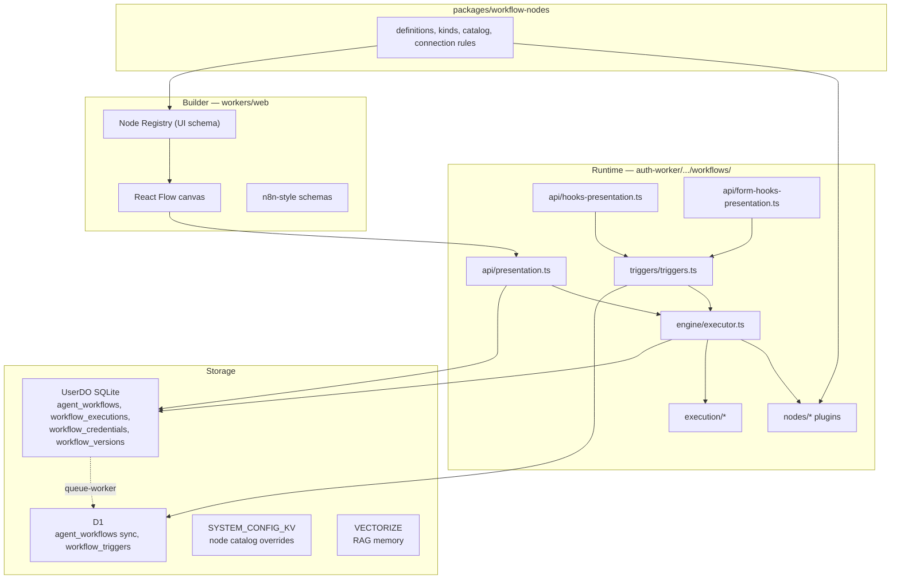
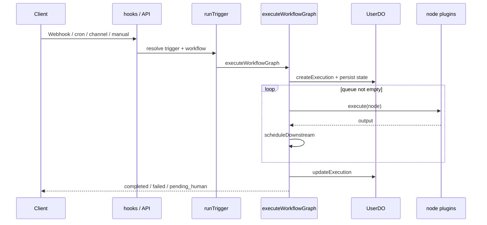

# Kiến trúc Workflow — AIAgents Hub

> **Mục đích:** Mô tả kiến trúc tổng thể của hệ thống workflow (n8n-style) trong monorepo này.  
> **Không thay thế:** luồng vận hành từng bước → [`workflow-how-it-works.md`](./workflow-how-it-works.md); plugin migration → [`workflow-node-plugin-architecture.md`](./workflow-node-plugin-architecture.md).

---

## 1. Tổng quan

**AIAgents Hub** cho phép user thiết kế agent workflow dạng đồ thị (React Flow), lưu trữ, chia sẻ/marketplace, và chạy qua webhook, cron, channel chat, form, hoặc execute thủ công.

Orchestration **không** dùng LangGraph / Temporal / Celery. Runtime là **engine graph tùy chỉnh** chạy trong Cloudflare Worker (`auth-worker`), với pause/resume bền vững qua Durable Object.

| Concern | Triển khai |
|---------|------------|
| Builder UI | Next.js (`workers/web`) + `@xyflow/react` |
| API + executor | Hono trên Cloudflare Worker (`workers/auth-worker`) |
| State theo user | Durable Object `UserDO` (SQLite) |
| Catalog / trigger index | D1 (`agent_workflows`, `workflow_triggers`) |
| LLM / tools | Vercel AI SDK (`ai`) + Cloudflare Workers AI |
| Phong cách UX | n8n (handles, config 3 cột, item shapes) |

---

## 2. Sơ đồ monorepo liên quan workflow

```
aiagents-hub/
├── workers/
│   ├── auth-worker/     # Auth, UserDO, workflow engine, hooks, cron, assistant
│   ├── web/             # Dashboard + workflow builder
│   ├── queue-worker/    # Sync DO → D1 (incl. agent_workflows)
│   ├── consumer-worker/ # WS broadcast (không chạy graph)
│   └── d1tor2-cron/     # Analytics D1 → R2 (không phải agent workflow)
├── packages/
│   ├── workflow-nodes/  # Định nghĩa node / kinds / catalog / connection rules
│   ├── oracle-db/       # Helper Oracle thin-client (introspect)
│   ├── pipelines/       # Cloudflare Pipelines (analytics)
│   └── shared/
├── services/
│   └── oracle-proxy/    # HTTP proxy oracledb cho Workers (get-db-info)
└── docs/                # Spec & kiến trúc workflow
```

| Worker / service | Vai trò với workflow |
|------------------|----------------------|
| **auth-worker** | Nguồn chạy thật: CRUD, execute/resume, hooks, cron. Assistant sống trong `features/assistant/` (không có worker riêng). |
| **web** | Canvas editor; gọi API auth-worker |
| **queue-worker** | Đồng bộ catalog `agent_workflows` từ DO → D1 |
| **consumer-worker** | Fan-out WebSocket; không orchestrate bước graph |
| **d1tor2-cron** | Data lake / analytics — **tách biệt** khỏi agent workflow |
| **oracle-proxy** | Node service — introspect Oracle cho tool `get-db-info` |

---

## 3. Các lớp kiến trúc



| Lớp | Path chính | Trách nhiệm |
|-----|------------|-------------|
| **Builder** | `workers/web/.../build/workflows/` | Vẽ graph, config panel, add-node |
| **UI plugins** | `workers/web/.../workflows/_components/nodes/` | Canvas + custom config per node |
| **Node Registry (FE)** | `workers/web/src/lib/workflow-node-registry/` | Shim → `@aiagents-hub/workflow-nodes` |
| **Shared defs** | `packages/workflow-nodes/` | Types, kinds, builtins, catalog seeds, connection rules |
| **API auth** | `workflows/api/presentation.ts` | CRUD, execute, resume, credentials, versions |
| **Hooks công khai** | `workflows/api/hooks-presentation.ts` | Webhook / channel / `/hooks/echo` |
| **Form hooks** | `workflows/api/form-hooks-presentation.ts` | `/form` và `/form-test` |
| **Triggers** | `workflows/triggers/` | D1 trigger rows + `runTrigger` + cron + form fan-out |
| **Engine** | `workflows/engine/` | executor, graph/flow/loop helpers, HITL, persist |
| **Node plugins** | `workflows/nodes/` | Registry `type` / `type:kind` — **không** switch-case |
| **Execution helpers** | `workflows/execution/` | Context, store, agent-runtime, observability |
| **RAG** | `workflows/rag/` | Embed / query / upsert Vectorize |
| **Domain** | `workflows/domain/domain.ts` | Zod schemas cho graph & execution |

---

## 4. Mô hình dữ liệu graph

Định nghĩa trong `domain/domain.ts`:

- **`WorkflowDefinition`**: `{ nodes[], edges[], viewport? }`
- **Node**: `id`, `type`, `position`, `data` (+ group fields tùy chọn)
- **Edge**: `source` / `target` + optional `sourceHandle` / `targetHandle`

### 4.1 Node types (tóm tắt)

`agent`, `trigger`, `human_review`, `flow`, `core`, `action_in_app`, `data_transformation`, `http_request`, `code`, `service_node`, `memory_node`, `tool_node`, `sticky_note`, `workflow_group`

Variant nằm trong `node.data` (`triggerKind`, `flowKind`, `coreKind`, `toolKind`, `memoryKind`, …).

### 4.2 Hai loại edge

| Loại | Handles điển hình | Vai trò |
|------|-------------------|---------|
| **Data-flow** | `out` / `true` / `false` / `case_N` / `loop` / `done` → `in` | Đường thực thi; đẩy node vào queue engine |
| **Resource** | → Agent `service` / `memory` / `tools` | Wiring cấu hình; resource node thường `skipExecution` |

Logic: `engine/graph-helpers.ts` (backend), `edges/workflow-connection-utils.ts` (frontend).

---

## 5. Runtime engine

### 5.1 Vòng đời thực thi



Các hàm trung tâm (`engine/executor.ts`):

| Hàm | Việc làm |
|-----|----------|
| `executeWorkflowGraph` | Tạo execution, seed queue bằng entry nodes, chạy vòng lặp |
| `runEngine` | Dequeue → gather inputs → execute plugin → schedule downstream |
| `resumeWorkflowExecution` | Load snapshot + human decision, tiếp tục |

State engine gồm: `queue`, `visited`, `skipped`, `outputs`, `steps`, `runContext`, `loopStates`, cost.

### 5.2 Node plugin registry

`nodes/index.ts` — **đã live**. Resolve theo `"type:kind"` rồi fallback `type`, gọi `plugin.execute(ctx)` (hoặc `skipExecution` / `plugin.trigger.handle`).

Thêm node mới (backend):

1. Shared: `packages/workflow-nodes/src/nodes/<name>/definition.ts` (+ `kinds.ts` nếu family)
2. `nodes/<type>/execute.ts` (hoặc `trigger.ts`)
3. Đăng ký trong `nodes/index.ts` (family / factory / override)
4. Bổ sung type trong `domain/domain.ts` nếu runtime type mới

Kind list là single source of truth trong `packages/workflow-nodes/src/nodes/*/kinds.ts` (human review: `channels.ts`). Override kinds (`webhook`, `form`, `http_request`, `code`, `save-rag`, …) có module riêng, không sinh từ factory.

### 5.3 Agent & tools

- Execute: `nodes/agent/execute.ts` — Workers AI / AI SDK `streamText`, billing, RAG, **tool loop** khi có tools
- Resource edges → `resolveAgentResources()`
- Toolset: `execution/agent-runtime.ts` — HTTP `asTool` + RAG `save-rag` / `get-rag` / `get-db-info` (`buildRagToolset`)
- PDF: `nodes/tool/save-rag/pdf-extract.ts` (extract text trước khi agent/save)

### 5.4 Human-in-the-loop

Khi gặp `human_review`, engine **pause**, persist toàn bộ snapshot vào `workflow_executions` (UserDO). Resume qua API với approve/reject.

---

## 6. Triggers & entry points

Tất cả đường vào hội tụ về **`runTrigger` → `executeWorkflowGraph`** (trừ execute thủ công gọi engine trực tiếp).

| Trigger | Ingress |
|---------|---------|
| Webhook | Canonical: `GET/POST /hooks/workflows/:workflowId/:path` (Bearer API token + `X-Client-ID`). Legacy: `/hooks/workflows/:ownerId/:token` |
| Cron | Worker `scheduled` mỗi phút → `runDueCronTriggers` |
| Channels | Telegram / Slack / Discord qua `/hooks/channels/:ch/:ownerId/:token` |
| Form / DB | `/form/:workflowId/:path` (+ `/form-test/...`) → `form-trigger-runner.ts` (fan-out `per_table`) |
| Manual | Authenticated execute trên presentation API |

**Mô hình kép (n8n-like):** config trên canvas (`node.data`) tách khỏi record thật trong D1 `workflow_triggers` (token, path, cron expression).

---

## 7. Lưu trữ & đồng bộ

| Store | Nội dung | Ghi chú |
|-------|----------|---------|
| **UserDO** `agent_workflows` | Definition JSON, metadata | Ghi interactive / owned |
| **D1** `agent_workflows` | Bản sync cho listing / shared / marketplace | Qua `queue-worker` |
| **D1** `workflow_triggers` | Cron / webhook / channel / form | Lookup ingress |
| **UserDO** `workflow_executions` | Snapshot engine để resume | Không sync D1 |
| **UserDO** `workflow_credentials` | Secrets mã hóa | Không sync queue |
| **UserDO** `workflow_versions` | Snapshot publish / manual | Version history |
| **VECTORIZE** | RAG collections | Scope theo owner/workflow |
| **SYSTEM_CONFIG_KV** | Override node catalog (admin) | UI registry |

**Pattern:** DO-first writes; D1 phục vụ query/shared; secrets và execution state ở lại Durable Object.

---

## 8. Phân biệt “queue” trong hệ thống

| Queue | Mục đích |
|-------|----------|
| **Engine queue** | Mảng `nodeId` in-memory (persist giữa chừng khi human review) — **orchestrate bước graph** |
| **INPUT_QUEUE / ERROR_QUEUE** | Sync DO → D1 (`queue-worker`) |
| **WS_BROADCAST_QUEUE** | Fan-out realtime (`consumer-worker`) |
| **Cloudflare Pipelines** | Analytics / D1→R2 — **không** chạy agent workflow |

---

## 9. Luồng thiết kế → chạy (tóm tắt)

1. User mở `/dashboard/build/workflows/[id]/edit` (React Flow).
2. Thêm node từ catalog; nối data-flow / resource edges.
3. Save → definition JSON vào **UserDO** `agent_workflows` (nguồn sự thật editor). D1 nhận bản sync qua `queue-worker` cho listing / shared / marketplace. Save webhook cũng `syncWebhookTriggersForWorkflow`.
4. Tạo trigger → row trong D1 `workflow_triggers` (path/token/cron).
5. Ingress (hook/cron/channel/form/manual) → resolve workflow → `executeWorkflowGraph`.
6. Entry nodes = node executable không có incoming data-flow (hoặc `nodeId` webhook cụ thể).
7. Mỗi node: gather inputs → plugin execute (retry theo `data.retry`) → `outputs[nodeId]`.
8. Branching: IF / switch / loop / merge (`flow-helpers`, `loop-helpers`, `scheduleDownstream`).
9. Human review → pause + snapshot; resume với decision.
10. Kết thúc: `completed` | `failed` | `pending_human` | `cancelled`.

Chi tiết từng bước (ví dụ webhook): [`workflow-how-it-works.md`](./workflow-how-it-works.md).

---

## 10. Patterns quan trọng

1. **Dual model trigger** — Canvas config vs D1 ingress record.
2. **Resource wiring ≠ execution** — Service/memory/tool không vào main queue; agent đọc qua resource edges.
3. **Plugin registry** — Engine chỉ dispatch; logic nằm `nodes/<name>/`. Shared package `@aiagents-hub/workflow-nodes` là SSOT kinds/definitions. Add-node drawer **vẫn** dùng `catalogs/*.ts` (song song `NODE_CATALOG` từ UI plugins).
4. **Durable HITL** — Full engine snapshot trong `workflow_executions.state`.
5. **Marketplace / shared run** — Chạy graph published từ D1; royalty qua `workflow_royalties`.
6. **Branch-aware scheduling** — Edge IF/switch inactive không enqueue; merge có thể `wait_all`.
7. **Loop Over Items** — Revisit subgraph qua `pendingLoopReturn` + reset visited.
8. **Registry FE vs runtime** — Node Registry chỉ phục vụ config UI; runtime dùng plugins + `node.type`/`data`.

---

## 11. Dev & bindings

### Scripts (root)

```bash
npm run dev:auth      # auth-worker (engine + API)
npm run dev:web       # Next.js builder
npm run dev:queue     # DO → D1 sync
npm run dev:consumer  # WS fan-out
```

### Bindings auth-worker (chính)

- `USER_DO` — Durable Object
- `D1DB` — D1 shared
- `INPUT_QUEUE` / `ERROR_QUEUE` / `WS_BROADCAST_QUEUE`
- `VECTORIZE` — RAG
- `SYSTEM_CONFIG_KV` — admin catalog / registry overrides

### Route quan trọng

| Route | Mục đích |
|-------|----------|
| `/dashboard/build/workflows/...` | CRUD + execute (session auth) |
| `/hooks/workflows/:workflowId/:path` | Webhook (API token + `X-Client-ID`) |
| `/hooks/echo` | Echo sink test HTTP Request node |
| `/form/:workflowId/:path` | Form trigger công khai |
| Cron `* * * * *` | `runDueCronTriggers` |

---

## 12. Tài liệu liên quan

| Tài liệu | Nội dung |
|----------|----------|
| [`workflow-how-it-works.md`](./workflow-how-it-works.md) | Luồng end-to-end từng bước (webhook) |
| [`workflow-node-plugin-architecture.md`](./workflow-node-plugin-architecture.md) | Khung plugin (đã live) |
| [`workflow-node-plugin-spec.md`](./workflow-node-plugin-spec.md) | Spec plugin + remaining catalogs |
| [`workflow-nodes/`](./workflow-nodes/README.md) | Spec từng node |
| [`../workers/auth-worker/.../workflows/README.md`](../workers/auth-worker/src/features/member/workflows/README.md) | Cấu trúc thư mục API backend |
| [`../workers/web/.../build/workflows/README.md`](../workers/web/src/app/(main)/dashboard/build/workflows/README.md) | Kiến trúc builder frontend |

---

## 13. Mental model (một câu)

User vẽ graph kiểu n8n trên Next.js; JSON sống trên **UserDO** (mirror **D1** cho listing/shared); trigger/hook khởi chạy **executor queue-based** duyệt node qua **plugin registry**; agent gọi **Workers AI + tools** (HTTP + RAG); pause/resume lưu **snapshot engine** trên Durable Object — trong khi Cloudflare Queues/Pipelines phục vụ **sync platform và analytics**, không orchestrate từng bước workflow.

---

## Changelog

| Version | Date | Changes |
|---------|------|---------|
| 0.4 | 2026-09-11 | Backend `workflows/`: RAG vào `rag/`, xóa re-export shim ở root |
| 0.3 | 2026-09-11 | Khớp repo: oracle-proxy, form hooks, plugin registry live, webhook `/:workflowId/:path` |
