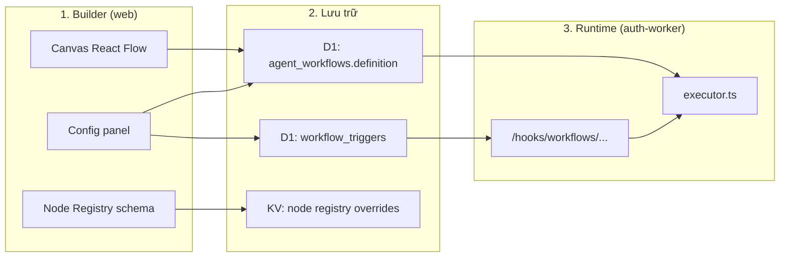
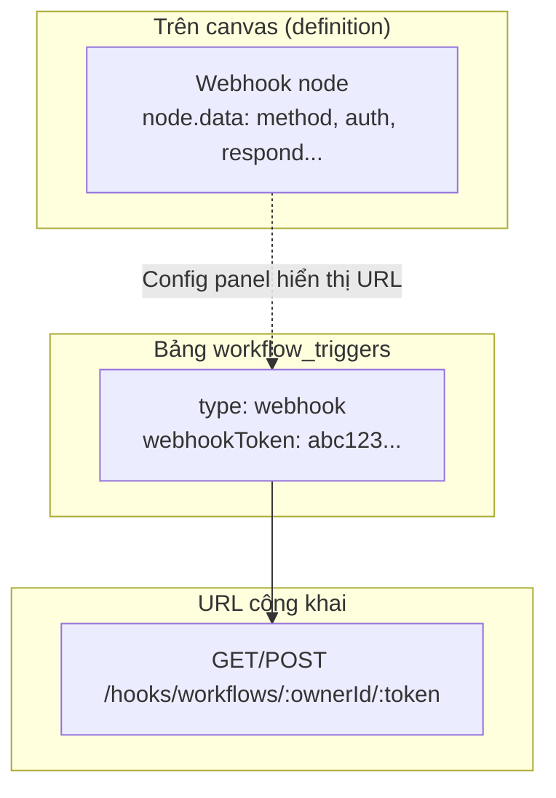
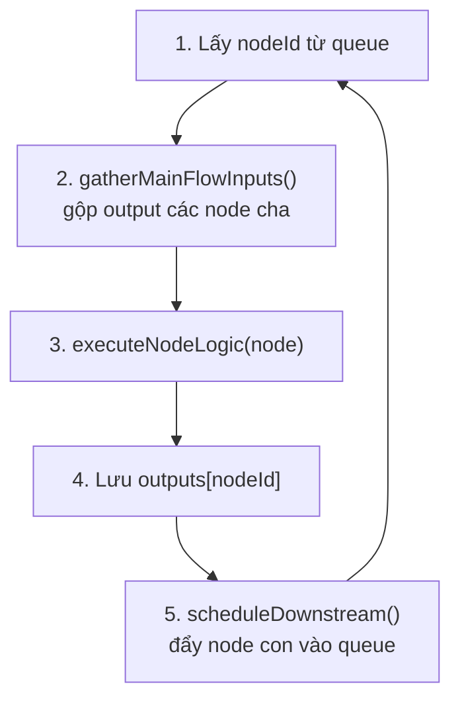
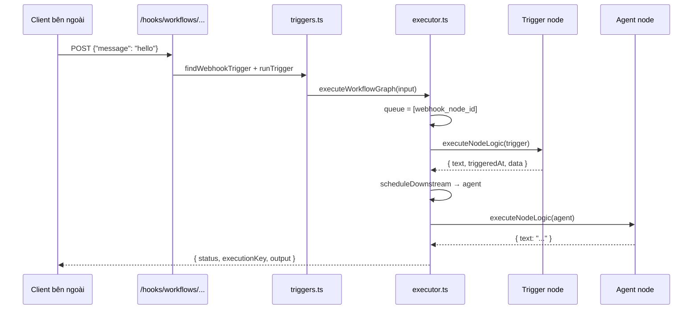
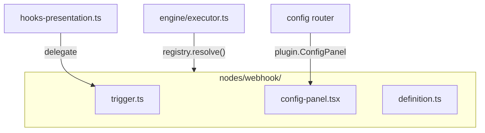

# Workflow — Cách vận hành từng bước

> **Mục đích:** Giải thích luồng end-to-end của hệ thống workflow — từ lúc thiết kế trên editor đến khi graph chạy xong.  
> **Ví dụ chính:** Webhook trigger (node phức tạp nhất hiện tại).

**Liên quan:**

| Tài liệu | Đường dẫn |
|----------|-----------|
| **Spec chính (plugin)** | [`workflow-node-plugin-spec.md`](./workflow-node-plugin-spec.md) |
| Kiến trúc khung (rút gọn) | [`workflow-node-plugin-architecture.md`](./workflow-node-plugin-architecture.md) |
| Spec node webhook | [`workflow-nodes/webhook.md`](./workflow-nodes/webhook.md) |
| README builder | [`workers/web/.../workflows/README.md`](../workers/web/src/app/(main)/dashboard/build/workflows/README.md) |

---

## 1. Bức tranh tổng thể

Hệ thống gồm **3 lớp** hoạt động song song:



| Lớp | Vai trò |
|-----|---------|
| **Builder** | Vẽ graph, cấu hình từng node trên canvas |
| **Lưu trữ** | Graph JSON, trigger records, registry schema |
| **Runtime** | Nhận HTTP/cron → duyệt graph → chạy từng node |

---

## 2. Phần A — Thiết kế workflow trên Editor

### Bước 1: Mở workflow editor

User vào `/dashboard/build/workflows/[id]/edit`.

Frontend load:

- **Definition** từ API: `{ nodes: [...], edges: [...] }`
- **Node Registry** từ `GET /dashboard/admin/workflow-nodes` (defaults + admin overrides trong `SYSTEM_CONFIG_KV`)

Code tham chiếu:

- Canvas: `workers/web/.../build/workflows/_components/workflow-canvas.tsx`
- Registry hook: `workers/web/.../build/workflows/_components/hooks/use-workflow-node-registry.ts`

### Bước 2: Thêm node từ catalog

User mở drawer "Add node" → chọn **Webhook** (trigger).

Frontend tạo node mới trên canvas, ví dụ:

```json
{
  "id": "node_abc",
  "type": "trigger",
  "position": { "x": 100, "y": 200 },
  "data": {
    "label": "Webhook",
    "triggerKind": "webhook",
    "httpMethod": "GET",
    "webhookPath": "node_abc",
    "webhookAuth": "none",
    "webhookRespond": "immediately"
  }
}
```

**Hai khái niệm quan trọng trên mỗi node:**

| Field | Ý nghĩa | Ví dụ |
|-------|---------|-------|
| `type` | Loại node cho React Flow và executor | `trigger`, `agent`, `flow`, `http_request` |
| `*Kind` trong `data` | Sub-variant trong cùng `type` | `triggerKind: "webhook"`, `flowKind: "if"` |

Code tham chiếu:

- Add node: `workflow-add-node-panel.tsx`, `catalogs/workflow-trigger-catalog.ts`
- Defaults webhook: `workflow-canvas.tsx` → `webhookNodeDefaults()`

### Bước 3: Kéo dây nối (edges)

User nối **Webhook** `out` → **Agent** `in`:

```json
{
  "id": "edge_1",
  "source": "node_abc",
  "target": "node_agent",
  "sourceHandle": "out",
  "targetHandle": "in"
}
```

**Hai loại edge:**

| Loại | Handle | Đường trên canvas | Vai trò |
|------|--------|-------------------|---------|
| **Data-flow** | `out`→`in`, `true`/`false`→`in`, `case_N`→`in` | Nét liền | Luồng thực thi chính |
| **Resource** | `service` / `memory` / `tools` → Agent | Nét đứt | Cấu hình agent; **không** chạy như bước riêng |

Validation phía frontend: `workflow-connection-utils.ts`  
Logic phía backend: `graph-helpers.ts`

### Bước 4: Mở config panel (double-click node)

Luồng trong `workflow-node-config-panel.tsx`:

```
1. Đọc node.type + triggerKind / coreKind / flowKind
2. resolveNodeDefinition(runtimeType, kind, registry) → schema 3 cột
3. Nếu webhook → WebhookNodeConfigPanel (custom)
   Ngược lại → panel generic (Input | Parameters | Output)
```

User chỉnh field (vd. `httpMethod`, `webhookAuth`) → `onPatchData` cập nhật `node.data` trên canvas.

**Node Registry chỉ phục vụ UI config** — không tham gia trực tiếp khi executor chạy graph.

### Bước 5: Lưu workflow

User save → API cập nhật `definition` JSON.

Backend ghi vào D1 bảng `agent_workflows.definition` — **đây là nguồn sự thật của graph**.

Code tham chiếu: `workers/auth-worker/.../workflows/presentation.ts`

---

## 3. Phần B — Webhook có hai “mặt”

Webhook dễ nhầm vì có **hai lớp dữ liệu tách biệt**:



| Khía cạnh | Canvas webhook node | D1 `workflow_triggers` |
|-----------|--------------------|-----------------------|
| **Lưu ở đâu** | `definition.nodes[].data` | Bảng `workflow_triggers` |
| **Mục đích** | UI cấu hình trên graph | HTTP entry point thật |
| **URL production** | Hiển thị trong config panel | `/hooks/workflows/:ownerId/:token` |
| **Khi graph chạy** | Pass-through input | `runTrigger()` khởi động cả graph |

**Tạo trigger** (từ Triggers panel hoặc qua config webhook):

```http
POST /dashboard/build/workflows/:id/triggers
Content-Type: application/json

{ "type": "webhook" }
```

Backend (`triggers.ts`):

1. Sinh `webhookToken` ngẫu nhiên
2. Insert row vào D1
3. Trả về `webhookUrl` đầy đủ (`presentation.ts` → `buildTriggerUrl()`)

> HTTP từ bên ngoài **không** đọc trực tiếp `node.data` trên canvas. Nó lookup token trong D1.

Chi tiết webhook: [`workflow-nodes/webhook.md`](./workflow-nodes/webhook.md)

---

## 4. Phần C — HTTP request từ bên ngoài

### Bước 6: Client gọi webhook URL

```http
POST https://your-api/hooks/workflows/user_123/abc-token-xyz
Content-Type: application/json

{"message": "hello"}
```

### Bước 7: Route công khai xử lý

`hooks-presentation.ts` — mounted tại `/hooks` (không cần auth user; bảo mật bằng token trong URL):

```
1. Parse ownerId + token từ URL
2. findWebhookTrigger(db, ownerId, token)
3. Đọc query ?input=... hoặc body raw text làm input
4. runTrigger(env, bindingName, trigger, input)
```

### Bước 8: runTrigger → executeWorkflowGraph

`triggers.ts` → `runTrigger()`:

1. Load workflow từ D1 theo `trigger.workflowId`
2. Parse `definition` JSON
3. Gọi `executeWorkflowGraph({ input, resolved, ... })`

**Graph chỉ bắt đầu chạy tại đây** — không phải khi user save hay mở editor.

---

## 5. Phần D — Executor chạy graph

### Bước 9: Khởi tạo engine

`executeWorkflowGraph` trong `executor.ts` tạo state ban đầu:

```typescript
engine: {
  queue: getWorkflowEntryNodeIds(definition),  // node không có edge data-flow vào
  visited: [],
  skipped: [],
  outputs: {},      // map nodeId → output
  steps: [],        // log từng bước
  runContext: { input, variables, workflowName },
  totalCostVnd: 0,
}
```

**Entry nodes** = node executable không có incoming data-flow edge — thường là trigger (webhook, manual, cron…).

Hàm tìm entry: `graph-helpers.ts` → `getWorkflowEntryNodeIds()`

### Bước 10: Vòng lặp runEngine



Mỗi vòng lặp:

1. Pop `nodeId` từ `queue`
2. Thu **input** từ output node upstream (qua edge `in`)
3. Gọi **logic** theo `node.type`
4. Lưu **output** vào `engine.outputs`
5. **Schedule** node kế tiếp theo edge active

### Bước 11: Logic từng loại node

`executeNodeLogic` trong `executor.ts` — switch theo `node.type`:

| `node.type` | Hành vi runtime |
|-------------|-----------------|
| `trigger` | Pass-through: `{ triggeredAt, text: input, data: ... }` |
| `agent` | Gọi LLM; đọc service/memory/tools từ resource edges |
| `http_request` | Gọi HTTP API (`node-runtime.ts`) |
| `code` | Transform JSON / template |
| `flow` | IF / switch / merge — quyết định nhánh active |
| `human_review` | **Dừng** workflow, chờ approve/reject |
| `data_transformation` | Parse JSON, pick field |
| `service_node`, `memory_node`, `tool_node` | **Bỏ qua** trong main chain |
| `sticky_note` | Bỏ qua (chỉ ghi chú trên canvas) |

**Webhook trigger node** khi tới lượt chỉ forward input — HTTP đã được xử lý ở Bước 7.

### Bước 12: Đi theo edge (scheduleDownstream)

`scheduleDownstream` trong `executor.ts`:

- Duyệt edge ra từ node vừa chạy
- **IF node:** chỉ follow edge `true` hoặc `false` (đánh giá trong `flow-helpers.ts`)
- **Switch:** chỉ follow `case_N` hoặc `default` đang active
- **Merge + wait_all:** đợi đủ parent có output rồi mới enqueue
- Nhánh không active → node không vào queue (bị skip)

### Bước 13: Kết thúc và lưu kết quả

| Kết quả | Ý nghĩa |
|---------|---------|
| `completed` | Queue rỗng; `output` = output node cuối |
| `failed` | Node throw error |
| `pending_human` | Dừng tại human_review; persist state để resume |
| `cancelled` | Human reject |

Execution lưu vào User Durable Object qua `execution-store.ts` (steps, cost, output).

Resume sau human review: `resumeWorkflowExecution()` đọc lại snapshot engine và tiếp tục vòng lặp.

---

## 6. Phần E — Ví dụ end-to-end: Webhook → Agent



**Resource edges (nếu có):** Trước khi agent chạy, `resolveAgentResources()` đọc edge đứt nét `service`/`memory`/`tools` → inject endpoint, collection, tool list vào context agent. Các resource node **không** được enqueue riêng.

---

## 7. Phần F — Node Registry hoạt động khi nào?

Registry mô tả **schema UI** (Input / Parameters / Output), không điều khiển runtime.

```
User mở config panel
  → useWorkflowNodeRegistry()
  → resolveNodeDefinition("trigger", "webhook")
  → render fields: httpMethod, webhookAuth, webhookRespond, ...
```

| Thành phần | Dùng registry? | Dùng executor? |
|------------|:--------------:|:--------------:|
| Config panel | ✅ | ❌ |
| Add-node drawer (`catalogs/*`) | ❌ (hardcoded riêng) | ❌ |
| Chạy workflow | ❌ | ✅ |

Admin có thể override registry qua `/dashboard/workflow/nodes` → lưu KV → merge khi `GET` registry.

Code: `workers/web/src/lib/workflow-node-registry/`

---

## 8. Phần G — Kiến trúc plugin (hướng đi)

**Hiện tại:** logic mỗi node rải nhiều file; `executor.ts` là switch-case lớn.

**Mục tiêu (spec):** mỗi node là module `nodes/<name>/`; executor chỉ dispatch qua registry.



**Luồng runtime giữ nguyên** (queue → execute → schedule) — chỉ thay đổi cách tổ chức code.

Xem: [`workflow-node-plugin-architecture.md`](./workflow-node-plugin-architecture.md)

---

## 9. Các cách khởi chạy workflow khác

Ngoài webhook public URL, workflow có thể start từ:

| Cách | Entry | Code |
|------|-------|------|
| **Manual run** | Nút Run trên editor | `presentation.ts` → `executeWorkflowGraph` |
| **Cron** | Cloudflare `scheduled` | `triggers.ts` → `runDueCronTriggers` |
| **Telegram / Slack / Discord** | `/hooks/channels/:ch/:ownerId/:token` | `hooks-presentation.ts` + `channel-hooks.ts` |
| **Chat agent** | Workflow chat UI | `workflow-chat.ts` |
| **Resume human review** | Approve/reject API | `resumeWorkflowExecution` |

Tất cả đều hội tụ về `executeWorkflowGraph` với `definition` đã lưu trên D1.

---

## 10. Tóm tắt nhanh

| # | Giai đoạn | Điều gì xảy ra |
|---|-----------|----------------|
| 1 | **Design** | User vẽ graph trên React Flow, config `node.data` |
| 2 | **Save** | Definition JSON → D1 `agent_workflows` |
| 3 | **Trigger setup** | Tạo row `workflow_triggers` → có public URL |
| 4 | **HTTP in** | `/hooks/...` lookup token → `runTrigger` |
| 5 | **Execute init** | `executeWorkflowGraph` — queue = entry nodes |
| 6 | **Per node** | Input từ parent → `executeNodeLogic` → output |
| 7 | **Traverse** | `scheduleDownstream` theo edge active |
| 8 | **Done** | Persist execution log + trả response |

---

## 11. File map tham chiếu

| Thành phần | Đường dẫn |
|------------|-----------|
| Workflow API | `workers/auth-worker/src/features/member/workflows/presentation.ts` |
| Public hooks | `workers/auth-worker/src/features/member/workflows/hooks-presentation.ts` |
| Triggers (D1) | `workers/auth-worker/src/features/member/workflows/triggers.ts` |
| Executor | `workers/auth-worker/src/features/member/workflows/executor.ts` |
| Graph helpers | `workers/auth-worker/src/features/member/workflows/graph-helpers.ts` |
| Flow branches | `workers/auth-worker/src/features/member/workflows/flow-helpers.ts` |
| Canvas | `workers/web/.../build/workflows/_components/workflow-canvas.tsx` |
| Node components | `workers/web/.../build/workflows/_components/nodes/workflow-nodes.tsx` |
| Config panel router | `workers/web/.../panels/node-config/workflow-node-config-panel.tsx` |
| Webhook config | `workers/web/.../panels/node-config/webhook-node-config-panel.tsx` |
| Node Registry | `workers/web/src/lib/workflow-node-registry/` |

---

## Changelog

| Version | Date | Changes |
|---------|------|---------|
| 0.1 | 2026-06-12 | Initial — giải thích luồng vận hành từng bước |
