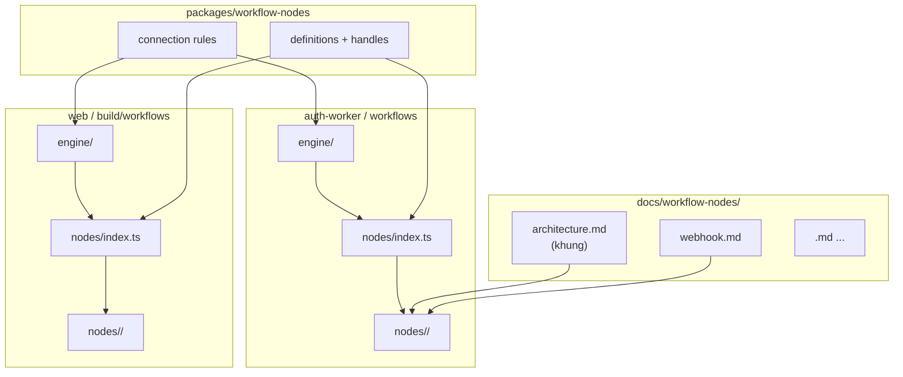

# Workflow Node Plugin — Kiến trúc khung

> **Trạng thái:** Draft  
> **Phiên bản:** 0.2  
> **Ngày:** 2026-06-12  
> **Phạm vi:** Backend (`auth-worker`), Frontend (`web`), Shared package (`packages/workflow-nodes`)

Tài liệu **rút gọn** kiến trúc khung. **Spec chính đầy đủ:** [`workflow-node-plugin-spec.md`](./workflow-node-plugin-spec.md).

**Liên quan:**

| Tài liệu | Đường dẫn |
|----------|-----------|
| **Spec chính** | [`workflow-node-plugin-spec.md`](./workflow-node-plugin-spec.md) |
| Kiến trúc workflow hiện tại | [`workers/web/.../workflows/README.md`](../workers/web/src/app/(main)/dashboard/build/workflows/README.md) |
| **Luồng vận hành từng bước** | [`workflow-how-it-works.md`](./workflow-how-it-works.md) |
| Spec từng node | [`docs/workflow-nodes/`](./workflow-nodes/README.md) |
| Workflow API | `workers/auth-worker/src/features/member/workflows/` |
| Node Registry (frontend) | `workers/web/src/lib/workflow-node-registry/` |

---

## 1. Mục tiêu

### 1.1 Vấn đề cần giải quyết

Logic của một node hiện bị **phân tán** qua nhiều lớp:

| Lớp | Vị trí hiện tại | Vấn đề |
|-----|-----------------|--------|
| Executor | `executor.ts` (~700 dòng) | Thêm node = sửa switch-case lớn |
| Schema / Registry | `default-nodes.ts` × 2 | Duplicate web ↔ auth-worker |
| Add-node catalog | `catalogs/*.ts` | Hardcoded, không đồng bộ registry |
| Canvas UI | `nodes/workflow-nodes.tsx` | Tất cả node trong một file |
| Config panel | `panels/node-config/` + custom | Không có pattern thống nhất |
| Trigger / Hook | `triggers.ts`, `hooks-presentation.ts` | Tách rời khỏi node canvas |
| Connection rules | `graph-helpers.ts` + `workflow-connection-utils.ts` | Node không khai báo handles rõ ràng |

**Hệ quả:** Thêm node mới cần sửa ~12 file ở 4+ thư mục, không có checklist rõ ràng.

### 1.2 Mục tiêu thiết kế

1. **Một node = một module** — schema, runtime, canvas, config, trigger (nếu có) cùng namespace.
2. **Single source of truth** — schema/defaults trong shared package; catalog sinh từ registry.
3. **Engine tách khỏi node** — traversal, scheduling, edge validation là infrastructure.
4. **Spec per node** — mỗi node có file `.md` riêng trong `docs/workflow-nodes/` để hướng dẫn Cursor.
5. **Migration incremental** — giữ backward-compatible re-exports.

### 1.3 Non-goals

- Thay đổi format lưu graph trên D1 (`agent_workflows.definition`).
- Thay đổi Node Registry KV key hoặc admin CRUD API.
- Execute-step thật cho từng node (roadmap riêng).
- Third-party node plugins từ npm.

---

## 2. Tổng quan kiến trúc



### 2.1 Ba tầng

| Tầng | Trách nhiệm | Không làm |
|------|-------------|-----------|
| **Shared** | Types, Zod schema, defaults, handles, connection rules | Import React, Workers, KV/D1 |
| **Engine** | Graph CRUD, traversal, scheduling, billing, collab | Logic nghiệp vụ từng node |
| **Node Plugin** | Execute, trigger, canvas, config, catalog | Tự implement edge traversal |

### 2.2 Tài liệu theo node

```
docs/
├── workflow-node-plugin-architecture.md   ← file này (khung)
└── workflow-nodes/
    ├── README.md                          ← index + template spec node mới
    └── webhook.md                         ← spec node webhook (reference)
    └── <tên-node>.md                      ← thêm khi phát triển node mới
```

**Quy ước:** Trước khi code node mới, tạo hoặc cập nhật `docs/workflow-nodes/<tên-node>.md` theo template trong [`workflow-nodes/README.md`](./workflow-nodes/README.md).

---

## 3. Shared Package — `packages/workflow-nodes`

### 3.1 Cấu trúc thư mục

```
packages/workflow-nodes/
├── package.json
├── tsconfig.json
└── src/
    ├── index.ts
    ├── types/
    │   ├── node-definition.ts
    │   ├── graph.ts
    │   ├── handles.ts
    │   └── connection-rules.ts
    ├── registry/
    │   ├── merge.ts
    │   └── resolve.ts
    └── nodes/
        ├── index.ts
        └── <name>/
            ├── definition.ts
            └── schema.ts
```

### 3.2 Node Definition

```typescript
export interface WorkflowNodeDefinition {
  id: string;                         // "trigger:webhook" | "agent"
  runtimeType: WorkflowNodeType;
  kind?: string;
  category: NodeCategory;
  nameKey: string;
  isBuiltin: true;
  isActive: boolean;
  sections: NodeSection[];            // input | parameters | output
  defaultData?: Record<string, unknown>;
  handles?: HandleDefinition[];
}

export interface HandleDefinition {
  id: string;
  type: 'source' | 'target';
  connectionType: 'main' | 'branch' | 'resource';
  maxConnections?: number;
  position?: 'top' | 'bottom' | 'left' | 'right';
}
```

### 3.3 Connection Rules

Quy tắc kết nối **tập trung**, không nằm trong từng node plugin:

```typescript
export function isValidWorkflowConnection(
  sourceNode: GraphNode,
  sourceHandle: string | null,
  targetNode: GraphNode,
  targetHandle: string | null,
  definitions: Map<string, WorkflowNodeDefinition>,
): boolean;
```

Node plugin chỉ **khai báo handles**; engine validate và render.

---

## 4. Backend — Node Plugin System

### 4.1 Cấu trúc thư mục

```
workers/auth-worker/src/features/member/workflows/
├── engine/
│   ├── executor.ts
│   ├── graph-helpers.ts
│   ├── flow-helpers.ts
│   └── index.ts
├── nodes/
│   ├── index.ts                    # registerAllNodes()
│   ├── types.ts                    # WorkflowNodePlugin, NodeContext
│   ├── _template/
│   │   ├── README.md
│   │   ├── index.ts
│   │   └── execute.ts
│   └── <name>/
│       ├── index.ts
│       ├── execute.ts              # optional
│       └── trigger.ts              # optional
├── presentation.ts
├── hooks-presentation.ts           # delegate → nodes/<name>/trigger.ts
├── triggers.ts
└── domain.ts
```

### 4.2 Plugin Contract

```typescript
export interface WorkflowNodePlugin {
  id: string;
  runtimeType: WorkflowNodeType;
  kind?: string;
  dataSchema?: z.ZodType;
  execute?: (ctx: NodeContext) => Promise<NodeOutput>;
  trigger?: {
    type: string;
    create: (opts: CreateTriggerOpts) => Promise<TriggerRecord>;
    handle: (req: Request, trigger: TriggerRecord) => Promise<TriggerInput>;
    delete?: (trigger: TriggerRecord) => Promise<void>;
  };
  skipExecution?: boolean;
}
```

### 4.3 Executor Dispatch

```typescript
async function executeNodeLogic(node, nodeInput, ctx, onCost) {
  const plugin = nodeRegistry.resolve(node);
  if (!plugin) throw new Error(`Unknown node type: ${node.type}`);
  if (plugin.skipExecution) return nodeInput;
  if (!plugin.execute) throw new Error(`Node ${plugin.id} has no execute handler`);
  return plugin.execute({ node, nodeInput, ...ctx, onCost });
}
```

### 4.4 Trigger Routing

```typescript
const plugin = nodeRegistry.findByTriggerType(trigger.type);
return plugin.trigger.handle(request, trigger);
```

---

## 5. Frontend — Node UI Plugin System

### 5.1 Cấu trúc thư mục

```
workers/web/src/app/(main)/dashboard/build/workflows/
├── _components/
│   ├── engine/                     # canvas, edges, connection handles
│   ├── nodes/
│   │   ├── index.ts                # workflowNodeTypes + NODE_CATALOG
│   │   ├── types.ts
│   │   ├── _template/README.md
│   │   └── <name>/
│   │       ├── index.ts
│   │       ├── canvas.tsx
│   │       ├── config-panel.tsx    # optional
│   │       ├── defaults.ts
│   │       └── n8n-properties.ts   # optional
│   └── panels/node-config/
│       ├── workflow-node-config-panel.tsx   # router
│       └── generic-config-panel.tsx
└── _lib/node-registry.ts
```

**Xóa dần:** `catalogs/workflow-*-catalog.ts` → catalog sinh từ UI plugins.

### 5.2 Plugin Contract

```typescript
export interface WorkflowNodeUIPlugin {
  id: string;
  runtimeType: string;
  kind?: string;
  Canvas: ComponentType<NodeProps>;
  ConfigPanel?: ComponentType<NodeConfigPanelProps>;
  defaults?: () => Record<string, unknown>;
  catalog: {
    category: 'trigger' | 'core' | 'flow' | 'tool' | 'memory' | 'transform';
    labelKey: string;
    descriptionKey?: string;
    icon?: string;
    keywords?: string[];
    visible?: boolean;
  };
  n8nProperties?: INodeProperties[];
  match?: (node: GraphNode) => boolean;
}
```

### 5.3 Registry & Config Router

```typescript
// nodes/index.ts
export const BUILTIN_UI_PLUGINS: WorkflowNodeUIPlugin[] = [/* ... */];
export const NODE_CATALOG = groupBy(plugins, p => p.catalog.category);

// config panel router
const plugin = resolveUIPlugin(selectedNode);
if (plugin?.ConfigPanel) return <plugin.ConfigPanel ... />;
return <GenericConfigPanel ... />;
```

### 5.4 Add Node Flow

```
Catalog pick → resolveUIPlugin(id) → createNode({ type, data: defaults() }) → canvas
```

---

## 6. Quy tắc đặt tên & ID

### 6.1 Node ID

| Pattern | Ví dụ |
|---------|-------|
| `{runtimeType}` | `agent`, `flow` |
| `{runtimeType}:{kind}` | `trigger:webhook`, `core:http_request` |

### 6.2 Kind keys trong `node.data`

| runtimeType | Kind field | Ví dụ |
|-------------|------------|-------|
| `trigger` | `triggerKind` | `webhook`, `schedule` |
| `core` | `coreKind` | `http_request`, `code` |
| `flow` | `flowKind` | `if`, `switch`, `merge` |

**Chuẩn hóa (Phase 5):** Ưu tiên `node.type === runtimeType`, hạn chế `type: "core" + coreKind`.

### 6.3 File naming

| Loại | Pattern |
|------|---------|
| Plugin entry | `index.ts` |
| Execute | `execute.ts` |
| Trigger | `trigger.ts` |
| Canvas | `canvas.tsx` |
| Config | `config-panel.tsx` |
| Defaults | `defaults.ts` |
| n8n props | `n8n-properties.ts` |
| Spec doc | `docs/workflow-nodes/<name>.md` |

---

## 7. Checklist chung — Thêm node mới

> Chi tiết từng node: xem spec riêng trong `docs/workflow-nodes/<name>.md`.

### 7.1 Tài liệu

- [ ] Tạo `docs/workflow-nodes/<name>.md` theo template
- [ ] Cập nhật index trong `docs/workflow-nodes/README.md`

### 7.2 Shared package (Phase 2+)

- [ ] `packages/workflow-nodes/src/nodes/<name>/definition.ts`
- [ ] `packages/workflow-nodes/src/nodes/<name>/schema.ts`
- [ ] Export + handles

### 7.3 Backend

- [ ] `nodes/<name>/execute.ts` (nếu executable)
- [ ] `nodes/<name>/trigger.ts` (nếu external trigger)
- [ ] `nodes/<name>/index.ts` — register plugin
- [ ] Register trong `nodes/index.ts`

### 7.4 Frontend

- [ ] `nodes/<name>/canvas.tsx`
- [ ] `nodes/<name>/defaults.ts`
- [ ] `nodes/<name>/config-panel.tsx` (nếu generic không đủ)
- [ ] Register trong `nodes/index.ts`
- [ ] i18n keys

### 7.5 Verify

- [ ] Add từ catalog → canvas OK
- [ ] Config panel OK
- [ ] Edge validation OK
- [ ] Execute workflow OK
- [ ] Trigger endpoint OK (nếu có)

---

## 8. Lộ trình Migration

| Phase | Mục tiêu | Spec node |
|-------|----------|-----------|
| **1** | Webhook module làm mẫu | [`webhook.md`](./workflow-nodes/webhook.md) |
| **2** | Shared package `packages/workflow-nodes` | — |
| **3** | Backend plugin registry + tách `engine/` | — |
| **4** | Frontend plugin + auto catalog | — |
| **5** | Align `runtimeType` trên graph | — |

---

## 9. Backward Compatibility

1. Re-export shims ở path cũ (`workflow-nodes.tsx` → `./nodes`).
2. Không breaking imports cho đến Phase 4 xong.
3. Graph JSON không đổi format.
4. Admin KV merge logic giữ nguyên.

---

## 10. Testing Strategy

| Layer | Test | Vị trí |
|-------|------|--------|
| Shared | schema, connection rules | `packages/workflow-nodes/**/*.test.ts` |
| Backend | execute per plugin | `nodes/<name>/execute.test.ts` |
| Backend | trigger integration | `nodes/<name>/trigger.test.ts` |
| Frontend | canvas, config panel | Vitest + RTL |
| E2E | add → connect → execute | e2e suite |

---

## 11. Open Questions

| # | Câu hỏi | Đề xuất |
|---|---------|---------|
| 1 | `node-runtime.ts` shared hay per-node? | Shared cho HTTP/code helpers |
| 2 | Một `runtimeType` nhiều Canvas? | Một component, handles dynamic theo kind |
| 3 | Admin custom nodes cần plugin folder? | Không — generic canvas + panel |
| 4 | Package name? | `@aiagents-hub/workflow-nodes` |

---

## 12. So sánh Before / After

| Hành động | Before | After |
|-----------|--------|-------|
| Thêm node | ~12 files, 4+ dirs | ~4–6 files, 1 dir + 1 spec `.md` |
| Hướng dẫn Cursor | Không có | `docs/workflow-nodes/<name>.md` |
| Tìm code node | Grep repo | `nodes/<name>/` |
| Catalog | Sửa `catalogs/*.ts` | `catalog` trong plugin |
| Executor | Switch-case | Registry dispatch |

---

## Changelog

| Version | Date | Changes |
|---------|------|---------|
| 0.1 | 2026-06-12 | Initial draft (monolithic spec) |
| 0.2 | 2026-06-12 | Tách khung; spec node chuyển sang `docs/workflow-nodes/` |
