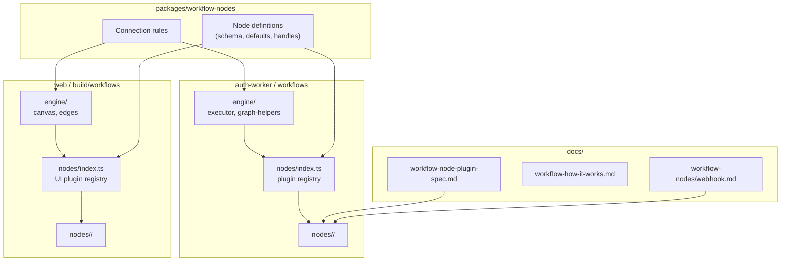

# Workflow Node Plugin Architecture — Spec

> **Trạng thái:** Draft  
> **Phiên bản:** 0.2  
> **Ngày:** 2026-06-12  
> **Phạm vi:** Backend (`auth-worker`), Frontend (`web`), Shared package (`packages/workflow-nodes`)

Tài liệu **spec chính** mô tả kiến trúc **Node Plugin** — cách tổ chức lại workflow system để mỗi node là một module độc lập, dễ phát triển và bảo trì. Webhook node là **reference implementation** đầu tiên.

---

## Bản đồ tài liệu

| Tài liệu | Vai trò |
|----------|---------|
| **File này** (`workflow-node-plugin-spec.md`) | Spec tổng hợp — contracts, cấu trúc, migration |
| [`workflow-node-plugin-architecture.md`](./workflow-node-plugin-architecture.md) | Kiến trúc khung (bản rút gọn, cùng nội dung cốt lõi) |
| [`workflow-how-it-works.md`](./workflow-how-it-works.md) | Luồng vận hành từng bước (editor → trigger → executor) |
| [`workflow-nodes/README.md`](./workflow-nodes/README.md) | Index spec từng node + template tạo node mới |
| [`workflow-nodes/webhook.md`](./workflow-nodes/webhook.md) | Spec chi tiết node webhook (mẫu) |
| [`workers/web/.../workflows/README.md`](../workers/web/src/app/(main)/dashboard/build/workflows/README.md) | Kiến trúc workflow hiện tại (builder, registry, admin) |

**Quy ước phát triển node mới:**

1. Đọc spec này + [`workflow-how-it-works.md`](./workflow-how-it-works.md)
2. Tạo `docs/workflow-nodes/<tên-node>.md` theo template
3. Implement module `nodes/<name>/` (BE + FE)
4. Tham chiếu [`webhook.md`](./workflow-nodes/webhook.md) nếu cần trigger hoặc custom panel

---

## 1. Mục tiêu

### 1.1 Vấn đề cần giải quyết

Logic của một node hiện bị **phân tán** qua nhiều lớp và thư mục:

| Lớp | Vị trí hiện tại | Vấn đề |
|-----|-----------------|--------|
| Executor | `engine/executor.ts` | Thêm node = đăng ký plugin (đang migrate từ switch-case) |
| Schema / Registry | `default-nodes.ts` × 2 (web + auth-worker) | Duplicate, dễ lệch |
| Add-node catalog | `catalogs/*.ts` (hardcoded) | Không đồng bộ registry; nhiều item chưa implement |
| Canvas UI | `nodes/workflow-nodes.tsx` | Tất cả node trong một file |
| Config panel | `panels/node-config/` + custom (webhook) | Không có pattern thống nhất |
| Trigger / Hook | `triggers/triggers.ts`, `api/hooks-presentation.ts` | Tách rời khỏi node canvas |
| Connection rules | `engine/graph-helpers.ts` + `edges/workflow-connection-utils.ts` | Node không khai báo handles rõ ràng |

**Hệ quả:** Thêm node built-in mới cần sửa **~12 file** ở **4+ thư mục**, không có checklist rõ ràng.

### 1.2 Mục tiêu thiết kế

1. **Một node = một module** — schema, runtime, canvas, config, trigger (nếu có) cùng namespace.
2. **Single source of truth** — schema/defaults trong shared package; catalog sinh từ registry.
3. **Engine tách khỏi node** — graph traversal, scheduling, edge validation là infrastructure.
4. **Spec per node** — mỗi node có `.md` riêng trong `docs/workflow-nodes/` để hướng dẫn Cursor.
5. **Migration incremental** — giữ backward-compatible re-exports.

### 1.3 Non-goals

- Thay đổi format lưu workflow graph trên D1 (`agent_workflows.definition`).
- Thay đổi Node Registry KV key hoặc admin CRUD API.
- Implement execute-step thật cho từng node (roadmap riêng).
- Third-party node plugins từ npm (chỉ built-in + admin custom trong repo).

---

## 2. Tổng quan kiến trúc



### 2.1 Ba tầng

| Tầng | Trách nhiệm | Không làm |
|------|-------------|-----------|
| **Shared** (`packages/workflow-nodes`) | Types, Zod schema, defaults, handle metadata, connection rules | Import React, Workers runtime, KV/D1 |
| **Engine** | Graph CRUD, traversal, scheduling, billing, collab | Logic nghiệp vụ từng node |
| **Node Plugin** | Execute, trigger, canvas, config panel, catalog entry | Tự implement edge traversal |

### 2.2 Cấu trúc tài liệu

```
docs/
├── workflow-node-plugin-spec.md           ← spec chính (file này)
├── workflow-node-plugin-architecture.md   ← kiến trúc khung (rút gọn)
├── workflow-how-it-works.md               ← luồng vận hành từng bước
└── workflow-nodes/
    ├── README.md                          ← index + template
    ├── webhook.md                         ← reference node
    └── <tên-node>.md                      ← thêm khi phát triển node mới
```

---

## 3. Shared Package — `packages/workflow-nodes`

### 3.1 Cấu trúc thư mục

```
packages/workflow-nodes/
├── package.json
├── tsconfig.json
└── src/
    ├── index.ts
    ├── types/
    │   ├── node-definition.ts      # WorkflowNodeDefinition, sections, fields
    │   ├── graph.ts                # WorkflowDefinition, Edge, NodeOutput
    │   ├── handles.ts              # HandleDefinition, ConnectionType
    │   └── connection-rules.ts     # isValidConnection, branch handles
    ├── registry/
    │   ├── merge.ts                # Merge KV overrides + builtins
    │   └── resolve.ts              # resolveNodeDefinition(runtimeType, kind)
    └── nodes/
        ├── index.ts                # BUILTIN_NODE_DEFINITIONS
        └── <name>/
            ├── definition.ts       # Registry entry
            └── schema.ts           # Zod cho node.data
```

### 3.2 Node Definition

```typescript
/** ID: "{runtimeType}" hoặc "{runtimeType}:{kind}" */
export interface WorkflowNodeDefinition {
  id: string;                         // "trigger:webhook"
  runtimeType: WorkflowNodeType;      // "trigger"
  kind?: string;                      // "webhook"
  category: NodeCategory;
  nameKey: string;
  isBuiltin: true;
  isActive: boolean;
  sections: NodeSection[];            // input | parameters | output
  defaultData?: Record<string, unknown>;
  handles?: HandleDefinition[];
}

export interface HandleDefinition {
  id: string;                         // "in" | "out" | "true" | "service" | ...
  type: 'source' | 'target';
  connectionType: 'main' | 'branch' | 'resource';
  maxConnections?: number;
  position?: 'top' | 'bottom' | 'left' | 'right';
}
```

### 3.3 Connection Rules

Quy tắc kết nối **tập trung** — không nằm trong từng node plugin:

```typescript
export type ConnectionType = 'main' | 'branch' | 'resource';

export function isValidWorkflowConnection(
  sourceNode: GraphNode,
  sourceHandle: string | null,
  targetNode: GraphNode,
  targetHandle: string | null,
  definitions: Map<string, WorkflowNodeDefinition>,
): boolean;
```

Node plugin chỉ **khai báo handles**; engine (backend + frontend) validate và render.

### 3.4 Consumers

| Consumer | Import |
|----------|--------|
| `workers/web` | definitions, types, connection rules, merge |
| `workers/auth-worker` | definitions, types, connection rules |
| Admin workflow-nodes | definitions làm defaults |

**Migration:** `default-nodes.ts` ở web và auth-worker re-export từ package cho đến khi xóa hẳn.

---

## 4. Backend — Node Plugin System

### 4.1 Cấu trúc thư mục

```
workers/auth-worker/src/features/member/workflows/
├── api/
│   ├── presentation.ts             # CRUD, execute, collab (auth)
│   └── hooks-presentation.ts       # Delegate → nodes/<name>/trigger.ts
├── domain/
│   ├── domain.ts                   # Zod schemas, WorkflowNodeType
│   └── constant.ts
├── execution/
│   ├── workflow-context.ts
│   ├── execution-store.ts
│   ├── execution-observability.ts
│   ├── node-runtime.ts             # Shared helpers (HTTP, code transform)
│   └── agent-runtime.ts
├── engine/
│   ├── executor.ts                 # Orchestration: queue, scheduleDownstream, pause/resume
│   ├── graph-helpers.ts            # Entry nodes, resource edges, merge inputs
│   ├── flow-helpers.ts             # IF/switch/filter branch evaluation
│   └── index.ts
├── nodes/
│   ├── index.ts                    # registerAllNodes() → NodePluginRegistry
│   ├── types.ts                    # WorkflowNodePlugin, NodeContext
│   ├── _template/
│   │   ├── README.md
│   │   ├── index.ts
│   │   └── execute.ts
│   └── <name>/
│       ├── index.ts
│       ├── execute.ts              # optional
│       └── trigger.ts              # optional
├── triggers/
│   ├── triggers.ts                 # Orchestrator: gọi plugin.trigger.*
│   ├── channel-hooks.ts
│   ├── webhook-auth.ts
│   └── webhook-notify.ts
├── billing/                        # Service pricing, royalties
├── collab/                         # Collab, chat, AI authoring
├── storage/                        # Credentials, version snapshots
├── integrations/
├── executor.ts                     # Re-export → engine/executor
├── graph-helpers.ts                # Re-export → engine/graph-helpers
└── flow-helpers.ts                 # Re-export → engine/flow-helpers
```

### 4.2 Plugin Contract

```typescript
export interface NodeContext {
  node: WorkflowDefinition['nodes'][number];
  nodeInput: NodeOutput;
  definition: WorkflowDefinition;
  outputs: Map<string, NodeOutput>;
  runContext: RunContext;
  input?: string;
  userDO: UserDO;
  c: ExecutionContext;
  meta: WorkflowMeta;
  attr: WorkflowAttribution;
  requestMeta?: RequestMeta;
}

export interface WorkflowNodePlugin {
  id: string;
  runtimeType: WorkflowNodeType;
  kind?: string;
  dataSchema?: z.ZodType;
  execute?: (ctx: NodeContext) => Promise<NodeOutput>;
  trigger?: {
    type: string;
    create: (opts: CreateTriggerOpts) => Promise<TriggerRecord>;
    handle: (req: Request, trigger: TriggerRecord) => Promise<TriggerInput>;
    delete?: (trigger: TriggerRecord) => Promise<void>;
  };
  skipExecution?: boolean;
}

export interface NodePluginRegistry {
  get(key: string): WorkflowNodePlugin | undefined;
  resolve(node: GraphNode): WorkflowNodePlugin | undefined;
}
```

### 4.3 Executor Dispatch

```typescript
// engine/executor.ts
async function executeNodeLogic(node, nodeInput, ctx, onCost) {
  const plugin = nodeRegistry.resolve(node);
  if (!plugin) throw new Error(`Unknown node type: ${node.type}`);
  if (plugin.skipExecution) return nodeInput;
  if (!plugin.execute) throw new Error(`Node ${plugin.id} has no execute handler`);
  return plugin.execute({ node, nodeInput, ...ctx, onCost });
}
```

**Trước refactor:** `switch (node.type) { case 'http_request': ... }`  
**Sau refactor:** registry lookup; mỗi node tự register.

### 4.4 Trigger Routing

```typescript
const plugin = nodeRegistry.findByTriggerType(trigger.type);
return plugin.trigger.handle(request, trigger);
```

### 4.5 Mapping file hiện tại → plugin

| Logic hiện tại | File nguồn | Plugin đích |
|----------------|------------|-------------|
| HTTP Request | `engine/executor.ts` + `execution/node-runtime.ts` | `nodes/http-request/execute.ts` |
| Code | `engine/executor.ts` + `execution/node-runtime.ts` | `nodes/code/execute.ts` |
| Agent | `engine/executor.ts` + `execution/agent-runtime.ts` | `nodes/agent/execute.ts` |
| Flow (if/switch/merge) | `engine/executor.ts` + `engine/flow-helpers.ts` | `nodes/flow/execute.ts` |
| Trigger pass-through | `engine/executor.ts` case `trigger` | `nodes/trigger/execute.ts` |
| Webhook HTTP ingress | `api/hooks-presentation.ts`, `triggers/triggers.ts` | `nodes/webhook/trigger.ts` |
| Human review pause | `engine/executor.ts` (engine loop) | `nodes/human-review/` |
| Resource nodes | `engine/graph-helpers.ts` | `nodes/service-node/`, … (`skipExecution`) |

---

## 5. Frontend — Node UI Plugin System

### 5.1 Cấu trúc thư mục

```
workers/web/src/app/(main)/dashboard/build/workflows/
├── _components/
│   ├── canvas/                     # React Flow canvas, controls, theme
│   │   ├── workflow-canvas.tsx
│   │   └── workflow-canvas-ui-context.tsx
│   ├── editor/                     # Shell, header, sidebar, settings
│   ├── add-node/                   # Add-node drawer & panel
│   ├── edges/                      # Edges, handles, connection utils
│   │   ├── workflow-edge-utils.ts
│   │   ├── workflow-connection-utils.ts
│   │   └── connection-handle.tsx
│   ├── layout/                     # Placement, definition JSON
│   │   ├── workflow-definition.ts
│   │   └── workflow-create-connected-node.ts
│   ├── nodes/
│   │   ├── index.ts                # workflowNodeTypes + NODE_CATALOG
│   │   ├── types.ts
│   │   ├── _template/README.md
│   │   └── <name>/
│   │       ├── index.ts
│   │       ├── canvas.tsx
│   │       ├── config-panel.tsx    # optional
│   │       ├── defaults.ts
│   │       └── n8n-properties.ts   # optional
│   ├── panels/
│   │   ├── node-config/
│   │   │   ├── workflow-node-config-panel.tsx   # Router
│   │   │   └── generic-config-panel.tsx
│   │   └── workflow-panels/        # Build, executions, triggers, versions
│   ├── catalogs/                   # Add-node catalog (sẽ xóa dần)
│   ├── hooks/                      # State, undo, collab, integrations
│   └── engine/                     # Re-exports edges & layout helpers
└── _lib/
```

**Xóa dần:** `catalogs/workflow-*-catalog.ts` → catalog sinh từ UI plugins.

### 5.2 Plugin Contract

```typescript
export interface WorkflowNodeUIPlugin {
  id: string;
  runtimeType: string;
  kind?: string;
  Canvas: ComponentType<NodeProps>;
  ConfigPanel?: ComponentType<NodeConfigPanelProps>;
  defaults?: () => Record<string, unknown>;
  catalog: {
    category: 'trigger' | 'core' | 'flow' | 'tool' | 'memory' | 'transform';
    labelKey: string;
    descriptionKey?: string;
    icon?: string;
    keywords?: string[];
    visible?: boolean;
  };
  n8nProperties?: INodeProperties[];
  match?: (node: GraphNode) => boolean;
}
```

### 5.3 Registry & Config Router

```typescript
export const BUILTIN_UI_PLUGINS: WorkflowNodeUIPlugin[] = [/* ... */];
export const NODE_CATALOG = groupBy(
  BUILTIN_UI_PLUGINS.filter(p => p.catalog.visible !== false),
  p => p.catalog.category,
);

const plugin = resolveUIPlugin(selectedNode);
if (plugin?.ConfigPanel) return <plugin.ConfigPanel ... />;
return <GenericConfigPanel ... />;
```

### 5.4 Add Node Flow

```
Catalog pick → resolveUIPlugin(id) → createNode({ type, data: defaults() }) → canvas
```

### 5.5 Mapping file hiện tại → plugin

| File hiện tại | Plugin đích |
|---------------|-------------|
| `panels/node-config/webhook-node-config-panel.tsx` | `nodes/webhook/config-panel.tsx` |
| `lib/n8n-workflow/descriptions/webhook.ts` | `nodes/webhook/n8n-properties.ts` |
| `canvas/workflow-canvas.tsx` → `webhookNodeDefaults()` | `nodes/webhook/defaults.ts` |
| `catalogs/workflow-trigger-catalog.ts` | `nodes/webhook/index.ts` → `catalog` |
| `nodes/workflow-nodes.tsx` | Tách per-node `canvas.tsx` |

---

## 6. Reference node — Webhook

Webhook là node **phức tạp nhất** (trigger + custom panel + dual model canvas/D1). Chi tiết đầy đủ:

→ **[`docs/workflow-nodes/webhook.md`](./workflow-nodes/webhook.md)**

Tóm tắt:

| Khía cạnh | Canvas node | D1 `workflow_triggers` |
|-----------|-------------|------------------------|
| Lưu trữ | `definition.nodes[].data` | Bảng `workflow_triggers` |
| HTTP entry | Không | `/hooks/workflows/:ownerId/:token` |
| Plugin sở hữu | Config UI | `trigger.ts` (create/handle) |

---

## 7. Quy tắc đặt tên & ID

### 7.1 Node ID

| Pattern | Ví dụ | Khi dùng |
|---------|-------|----------|
| `{runtimeType}` | `agent`, `flow` | Không sub-kind |
| `{runtimeType}:{kind}` | `trigger:webhook`, `core:http_request` | Có sub-kind trong `node.data` |

### 7.2 Kind keys trong `node.data`

| runtimeType | Kind field | Ví dụ |
|-------------|------------|-------|
| `trigger` | `triggerKind` | `webhook`, `schedule`, `manual` |
| `core` | `coreKind` | `http_request`, `webhook`, `code` |
| `flow` | `flowKind` | `if`, `switch`, `merge`, `filter` |

**Chuẩn hóa (Phase 5):** Ưu tiên `node.type === runtimeType`; hạn chế `type: "core" + coreKind`.

### 7.3 File naming

| Loại | Pattern | Ví dụ |
|------|---------|-------|
| Plugin entry | `index.ts` | `nodes/webhook/index.ts` |
| Execute | `execute.ts` | `nodes/http-request/execute.ts` |
| Trigger | `trigger.ts` | `nodes/webhook/trigger.ts` |
| Canvas | `canvas.tsx` | `nodes/webhook/canvas.tsx` |
| Config | `config-panel.tsx` | `nodes/webhook/config-panel.tsx` |
| Spec doc | `docs/workflow-nodes/<name>.md` | `webhook.md` |

---

## 8. Checklist — Thêm node built-in mới

> Chi tiết từng node: `docs/workflow-nodes/<name>.md`

### 8.1 Tài liệu

- [ ] Tạo `docs/workflow-nodes/<name>.md` theo template
- [ ] Cập nhật `docs/workflow-nodes/README.md`

### 8.2 Shared package (Phase 2+)

- [ ] `packages/workflow-nodes/src/nodes/<name>/definition.ts`
- [ ] `packages/workflow-nodes/src/nodes/<name>/schema.ts`
- [ ] Export + handles

### 8.3 Backend

- [ ] `nodes/<name>/execute.ts` (nếu executable)
- [ ] `nodes/<name>/trigger.ts` (nếu external trigger)
- [ ] `nodes/<name>/index.ts` — register plugin
- [ ] Register trong `nodes/index.ts`

### 8.4 Frontend

- [ ] `nodes/<name>/canvas.tsx`
- [ ] `nodes/<name>/defaults.ts`
- [ ] `nodes/<name>/config-panel.tsx` (nếu generic không đủ)
- [ ] Register trong `nodes/index.ts`
- [ ] i18n: `messages/en-US.json`, `messages/vi-VN.json`

### 8.5 Verify

- [ ] Add từ catalog → canvas OK
- [ ] Config panel OK
- [ ] Edge validation OK
- [ ] Execute workflow OK
- [ ] Trigger endpoint OK (nếu có)

---

## 9. Lộ trình Migration

### Phase 1 — Webhook module (1–2 tuần)

- [ ] Tạo `nodes/webhook/` backend + frontend
- [ ] Move webhook panels, n8n properties, defaults
- [ ] `nodes/_template/README.md` + checklist
- [ ] Re-export shims (backward compatible)
- [ ] Spec: [`workflow-nodes/webhook.md`](./workflow-nodes/webhook.md)

**Không làm:** Shared package, executor refactor, xóa catalogs.

### Phase 2 — Shared package (1 tuần)

- [ ] Tạo `packages/workflow-nodes`
- [ ] Move types, merge, resolve, builtin definitions
- [ ] Web + auth-worker import từ package
- [ ] `default-nodes.ts` → re-export shim

### Phase 3 — Backend plugin registry (2 tuần)

- [ ] Tách `engine/` từ monolith
- [ ] Migrate: `http_request`, `code`, `agent`, `flow`, `trigger`, `human_review`
- [ ] Executor chỉ dispatch qua registry

### Phase 4 — Frontend plugin + auto catalog (2 tuần)

- [ ] Tách `engine/` (canvas infrastructure)
- [ ] Migrate canvas → `nodes/<name>/canvas.tsx`
- [ ] Config panel router; `NODE_CATALOG` từ plugins
- [ ] Generic `addNode(pluginId)`

### Phase 5 — Align runtimeType (ongoing)

- [ ] Migration graph: `core + coreKind` → `type` trực tiếp
- [ ] Deprecation warnings trong editor

---

## 10. Backward Compatibility

1. **Re-export shims** — file cũ export từ path mới.
2. **Import paths** — không breaking cho đến Phase 4 xong.
3. **Graph JSON** — không đổi format.
4. **Admin KV overrides** — merge logic giữ nguyên.

---

## 11. Testing Strategy

| Layer | Test type | Vị trí |
|-------|-----------|--------|
| Shared | Unit: schema, connection rules | `packages/workflow-nodes/**/*.test.ts` |
| Backend execute | Unit per plugin | `nodes/<name>/execute.test.ts` |
| Backend trigger | Integration | `nodes/<name>/trigger.test.ts` |
| Frontend | Component | Vitest + RTL |
| E2E | add → connect → execute | e2e suite |

---

## 12. Open Questions

| # | Câu hỏi | Đề xuất tạm |
|---|---------|-------------|
| 1 | `execution/node-runtime.ts` shared hay per-node? | Shared cho HTTP/code helpers |
| 2 | Một `runtimeType` nhiều Canvas? | Một component, handles dynamic theo kind |
| 3 | Admin custom nodes cần plugin folder? | Không — generic canvas + panel |
| 4 | Unify webhook canvas ↔ D1 trigger? | Phase 5+ |
| 5 | Package name? | `@aiagents-hub/workflow-nodes` |

---

## 13. So sánh Before / After

| Hành động | Before | After |
|-----------|--------|-------|
| Thêm node built-in | ~12 files, 4+ dirs | ~4–6 files, 1 dir + 1 spec `.md` |
| Hướng dẫn Cursor | Không có | `docs/workflow-nodes/<name>.md` |
| Tìm code node | Grep repo | `nodes/<name>/` |
| Catalog | Sửa `catalogs/*.ts` | `catalog` trong plugin |
| Schema defaults | 2 files duplicate | 1 shared definition |
| Executor | Switch-case | Registry dispatch |

---

## 14. Phụ lục — Cấu trúc hiện tại

<details>
<summary>Backend (hiện tại — sau tổ chức lại thư mục)</summary>

```
workers/auth-worker/src/features/member/workflows/
├── api/                     # presentation, hooks-presentation
├── domain/                  # domain.ts, constant.ts
├── execution/               # context, store, node-runtime, agent-runtime
├── engine/                  # executor, graph-helpers, flow-helpers
├── nodes/                   # plugin registry
├── triggers/                # triggers.ts, channel-hooks, webhook-auth
├── billing/, collab/, storage/, integrations/
├── executor.ts              # re-export → engine/executor
└── README.md
```

</details>

<details>
<summary>Frontend (hiện tại — sau tổ chức lại thư mục)</summary>

```
workers/web/.../build/workflows/_components/
├── canvas/                  # workflow-canvas.tsx, controls, theme
├── editor/                  # shell, header, sidebar
├── add-node/                # drawer, panel
├── edges/                   # connection-handle, edge utils
├── layout/                  # definition, placement
├── nodes/                   # workflow-nodes.tsx + plugin registry
├── panels/
│   ├── node-config/         # config panel router + webhook panels
│   └── workflow-panels/     # executions, triggers, versions, …
├── catalogs/                # add-node catalog (sẽ xóa dần)
└── hooks/                   # canvas state, undo, collab
```

</details>

---

## 15. Hướng dẫn Cursor (prompt gợi ý)

**Implement node mới:**

```
Đọc docs/workflow-node-plugin-spec.md và docs/workflow-nodes/<name>.md.
Implement node theo kiến trúc plugin (nodes/<name>/ BE + FE).
Tham chiếu docs/workflow-nodes/webhook.md nếu cần trigger/custom panel.
Giữ re-export backward compatible.
```

**Phase 1 webhook:**

```
Implement Phase 1 webhook module theo:
- docs/workflow-node-plugin-spec.md
- docs/workflow-nodes/webhook.md
Move code hiện có, không refactor executor monolith.
```

**Hiểu luồng runtime:**

```
Đọc docs/workflow-how-it-works.md trước khi sửa executor hoặc trigger.
```

---

## Changelog

| Version | Date | Changes |
|---------|------|---------|
| 0.1 | 2026-06-12 | Initial draft (monolithic) |
| 0.2 | 2026-06-12 | Tách spec node sang `docs/workflow-nodes/`; thêm `workflow-how-it-works.md` |
| 0.2.1 | 2026-06-12 | Tạo lại file spec chính với bản đồ tài liệu |
