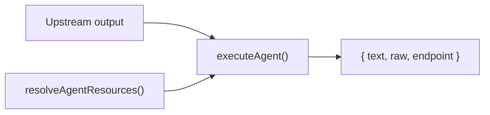

# Node: AI Agent (`agent`)

> **Trạng thái:** Draft (review)  
> **Spec chính:** [`workflow-node-plugin-spec.md`](../workflow-node-plugin-spec.md)  
> **Kiến trúc khung:** [`workflow-node-plugin-architecture.md`](../workflow-node-plugin-architecture.md)  
> **Luồng vận hành:** [`workflow-how-it-works.md`](../workflow-how-it-works.md)

Agent là **bước LLM trung tâm** của workflow — nhận input từ **output node upstream** (handle `in`), gọi model qua **Service** đã đăng ký, trả kết quả cho downstream. Agent **không phải entry point** của graph.

Config panel theo layout **3 cột** (n8n-style): **INPUT** ← output node trước | **Parameters** | **OUTPUT**.

---

## 1. Tóm tắt

| Thuộc tính | Giá trị |
|------------|---------|
| **ID** | `agent` |
| **Category** | `ai` |
| **Vai trò** | Gọi LLM trong graph theo topology data-flow |
| **Loại plugin** | Execute only + resource wiring (service / memory / tools) |
| **Resource nodes** | `service_node`, `memory_node`, `tool_node` — `skipExecution`, nối qua handle đứt nét |
| **Reference cho** | Mọi node có sub-resource handles trên canvas |

**Resource specs (RAG):** [`service.md`](./service.md) · [`vectorize.md`](./vectorize.md) · [`saveRag.md`](./saveRag.md) · [`getRag.md`](./getRag.md) · [`trigger.md`](./trigger.md) · [`getDBInfo.md`](./getDBInfo.md) · [`schema.md`](./schema.md) · [`sqlexample.md`](./sqlexample.md) · [`rag-recipes.md`](./rag-recipes.md) · [`rag-implementation-phases.md`](./rag-implementation-phases.md)

---

## 2. Graph representation

```json
{
  "id": "agent_1",
  "type": "agent",
  "position": { "x": 320, "y": 120 },
  "data": {
    "label": "Summarize news",
    "promptSource": "from_input",
    "prompt": "{{ $json.body.message }}",
    "systemPrompt": "You are a concise news assistant.",
    "serviceEndpoint": "/dashboard/assistant/chat",
    "memoryCollection": "vectorize-default",
    "maxTokens": 1024,
    "requireOutputFormat": false,
    "enableFallbackModel": false,
    "options": {},
    "tools": []
  }
}
```

### Resource edges (ví dụ)

```json
{
  "id": "edge_svc",
  "source": "service_1",
  "target": "agent_1",
  "sourceHandle": "service",
  "targetHandle": "service",
  "style": { "strokeDasharray": "6 4" }
}
```

Resource edge **không** đi theo luồng `out → in`; chỉ inject config vào agent lúc execute.

---

## 3. Handles

| Handle | Type | connectionType | Vị trí canvas | Mô tả |
|--------|------|----------------|---------------|-------|
| `in` | target | main | Trái | Nhận output từ node upstream |
| `out` | source | main | Phải | Gửi output LLM xuống downstream |
| `service` | target | resource | Dưới (diamond) | Bắt buộc — model / billing endpoint |
| `memory` | target | resource | Dưới (diamond) | Tùy chọn — RAG / vector memory |
| `tools` | target | resource | Dưới (diamond) | Tùy chọn — nhiều tool nodes |

**Quy tắc kết nối** (`packages/workflow-nodes/src/types/connection-rules.ts`):

- Main flow: `out` / `true` / `false` / `case_N` → `in`
- Resource: `service`/`memory`/`tools` source phải nối vào cùng tên handle trên **agent**

> **Gap hiện tại:** `AGENT_NODE` trong `builtins.ts` chưa khai báo `handles[]` — canvas hardcode trong `AgentWorkflowNode`; connection rules dùng fallback `out → in`.

---

## 4. Config panel — 3 cột

Layout khi double-click agent node (tham chiếu n8n AI Agent):

```
┌─────────────────────┬──────────────────────────────┬─────────────────────┐
│       INPUT         │   Parameters  │  Settings      │       OUTPUT        │
│  (output node trước)│                              │                     │
├─────────────────────┼──────────────────────────────┼─────────────────────┤
│ Schema │ Table │JSON│  [Execute step]              │ Schema │ Table │JSON │
│                     │                              │                     │
│ ▼ Webhook           │  Source for Prompt ▼         │  No output data     │
│   ▼ headers         │  Prompt (User Message)       │  (chưa execute)     │
│     host            │  {{ $json.body.message }}    │                     │
│     user-agent      │                              │  [Execute step]     │
│   ▼ params          │  Require Specific Output ☐   │  Set mock data      │
│   ▼ query           │  Enable Fallback Model   ☐   │                     │
│   ▼ body            │                              │                     │
│     webhookUrl      │  Options                     │                     │
│     executionMode   │  [Add Option]                │                     │
│                     │                              │                     │
│ Variables and       │  ┌─────────┬────────┬──────┐ │                     │
│ context             │  │ Service*│ Memory │ Tool │ │                     │
│                     │  │   [+]   │  [+]   │ [+]  │ │                     │
└─────────────────────┴──────────────────────────────┴─────────────────────┘
```

### 4.1 INPUT (cột trái)

Hiển thị **output của node upstream** nối vào handle `in` — không phải dữ liệu tự sinh bởi agent.

| Thành phần | Mô tả |
|------------|-------|
| **Nguồn dữ liệu** | Output lần chạy thành công gần nhất của parent node (vd. Webhook → `headers`, `params`, `query`, `body`) |
| **View modes** | **Schema** (cây field) · **Table** (bảng phẳng) · **JSON** (raw object) |
| **Variables and context** | Biến workflow (`$now`, `$vars`, `$execution`, …) — section riêng phía dưới |
| **Refresh** | Ghi chú: *"The fields below come from the last successful execution. Execute node to refresh them."* |

**Ví dụ** — agent nối sau Webhook trigger:

| Path trong INPUT | Nguồn |
|------------------|-------|
| `headers.host` | HTTP header từ request webhook |
| `headers.user-agent` | HTTP header |
| `params` | Path params URL |
| `query` | Query string |
| `body.webhookUrl` | Payload body |
| `body.executionMode` | Payload body |

Runtime: executor gộp parent outputs qua `gatherMainFlowInputs()` → `ctx.nodeInput`. Panel INPUT đọc cùng shape đó (từ execution log / test step upstream).

**Registry section `input`:**

| Field id | Type | UI |
|----------|------|-----|
| `workflowTrigger` | info | Gợi ý nguồn trigger workflow (metadata) |
| `variables` | json | Variables and context — hỗ trợ expression |

### 4.2 Parameters (cột giữa)

Tab **Parameters** (tab **Settings** = field registry chung, vd. `deactivated`).

Nút **Execute step** — chạy thử chỉ node này trong graph (pin output sang cột OUTPUT).

| Field UI | Registry id | `node.data` key | Type | Mô tả |
|----------|-------------|-----------------|------|-------|
| **Source for Prompt (User Message)** | `promptSource` | `promptSource` | select | Cách lấy user message |
| **Prompt (User Message)** | `prompt` | `prompt` | textarea + expression | Instructions gửi model; vd. `{{ $json.body.message }}` |
| **Require Specific Output Format** | `requireOutputFormat` | `requireOutputFormat` | toggle | Bật output parser (n8n-style) — chưa implement runtime |
| **Enable Fallback Model** | `enableFallbackModel` | `enableFallbackModel` | toggle | Fallback service khi model chính lỗi — chưa implement |
| **Options** | `options` | `options` | options-group | Nhóm tham số tùy chọn; **Add Option** |
| **Service** * | `service` | `serviceEndpoint` | resource-link | **Bắt buộc** — nối `service_node` trên canvas (handle `service`) |
| **Memory** | `memory` | `memoryCollection` | resource-link | Tùy chọn — nối `memory_node` |
| **Tool** | `tools` | `tools` | resource-link | Tùy chọn — nối `tool_node`(s) |

**Source for Prompt — options:**

| Label UI | Value | Hành vi runtime |
|----------|-------|-----------------|
| Define below | `define_below` | Dùng text/expression trong field **Prompt** |
| From input | `from_input` | User message = upstream output (text / JSON stringify) |

> **Đổi tên so với n8n:** slot **Chat Model** → **Service** — model lấy từ AI Hub service catalog qua `service_node`, không chọn model trực tiếp trên agent.

**Resource slots (footer Parameters):**

Ba ô **Service** / **Memory** / **Tool** map tới handle đứt nét trên canvas — bấm `[+]` hoặc kéo node resource từ palette. `Service` bắt buộc trước khi execute.

Field ẩn / sidebar (không hiện trên ảnh nhưng có trong runtime):

| Key | Vị trí | Mô tả |
|-----|--------|-------|
| `systemPrompt` | Parameters hoặc Options | System instructions |
| `maxTokens` | Options | Giới hạn output tokens |
| `label` | Settings hoặc header panel | Tên hiển thị canvas |

### 4.3 OUTPUT (cột phải)

Hiển thị kết quả sau **Execute step** hoặc lần chạy workflow gần nhất.

| Thành phần | Mô tả |
|------------|-------|
| **Trạng thái rỗng** | *"No output data"* — chưa execute node |
| **View modes** | **Schema** · **Table** · **JSON** |
| **Execute step** | Nút chạy thử node → populate OUTPUT |
| **Set mock data** | Pin sample output (`mockData`) để thiết kế downstream mà không cần chạy LLM |

**Shape output sau execute:**

```typescript
{
  text: string;      // Text trích từ model response
  raw: unknown;      // Raw AI SDK / provider payload
  endpoint: string;  // Service endpoint đã dùng
}
```

Registry section `output`: `showExecuteStep: true`, field `mockData` (json).

---

## 5. node.data fields

| Field | Type | Default | Mô tả | Panel | Runtime |
|-------|------|---------|-------|-------|:-------:|
| `label` | string | `"Agent"` | Tên canvas | Settings | — |
| `promptSource` | `"define_below"` \| `"from_input"` | `"define_below"` | Source for Prompt | Parameters | ✅ |
| `prompt` | string | `""` | Prompt (User Message), hỗ trợ `{{ $json... }}` | Parameters | ✅ |
| `systemPrompt` | string | `""` | System instructions | Options | ✅ |
| `serviceEndpoint` | string | — | Service — approved AI endpoint | Parameters (Service slot) | ✅ |
| `endpoint` | string | — | Alias legacy của `serviceEndpoint` | — | ✅ |
| `memoryCollection` | string | `"vectorize-default"` | Memory backend | Parameters (Memory slot) | ✅ |
| `maxTokens` | number | `1024` | Max output tokens | Options | ✅ |
| `tools` | array | `[]` | Tool configs (resource edges) | Parameters (Tool slot) | ⚠️ metadata |
| `requireOutputFormat` | boolean | `false` | Require Specific Output Format | Parameters | ❌ |
| `enableFallbackModel` | boolean | `false` | Enable Fallback Model | Parameters | ❌ |
| `options` | object | `{}` | Options group | Parameters | ❌ |
| `variables` | object / JSON | — | Variables and context (INPUT) | INPUT | ❌ |
| `mockData` | object / JSON | — | Pinned sample output | OUTPUT | — |
| `deactivated` | boolean | — | Node tắt trên canvas | Settings | — |

**Ưu tiên resolve `serviceEndpoint` khi execute graph:**

1. Resource edge → `service_node.data.endpoint`
2. `node.data.serviceEndpoint` / `endpoint`
3. Sidebar workflow `serviceEndpoint` (merge lúc save — `definition-utils.ts`)

---

## 6. Runtime (graph execute)

Agent chỉ chạy khi executor đến lượt node theo data-flow — input luôn đến từ output node upstream (hoặc trigger payload gộp qua `gatherMainFlowInputs`).

| | File | Tool calling | Billing |
|---|------|:------------:|:-------:|
| Graph execute | `nodes/agent/execute.ts` | ❌ (single-shot LLM) | `billAgentUsage` |



### 6.1 `executeAgent`

**Input:** `ctx.nodeInput` — output node upstream (cùng dữ liệu hiển thị ở cột INPUT)

**Xử lý:**

1. `resolveAgentResources(definition, agentId)` — đọc resource edges
2. Resolve `serviceEndpoint` → `resolveServiceByEndpoint` → `getModelForService`
3. Build prompt theo `promptSource`
4. Optional RAG: `queryVectorMemory()` nếu `memoryCollection` và không phải `r2`/`d1`
5. `runTextModel()` → `extractTextFromAiResponse`
6. `billAgentUsage()` với `workflowAttribution`

**Output:**

```typescript
{ text: string; raw: unknown; endpoint: string }
```

---

## 7. Resource resolution

`resolveAgentResources()` (`engine/graph-helpers.ts`):

| Source node | Handle | Extracted fields |
|-------------|--------|------------------|
| `service_node` | `service` | `serviceEndpoint` ← `endpoint` / `catalogId` |
| `memory_node` | `memory` | `memoryKind`, `memoryCollection` ← `collection` |
| `tool_node` | `tools` | Push `{ id, kind, label, config }` vào `tools[]` |

Resource nodes đăng ký `skipExecution: true` — không bao giờ vào execution queue.

---

## 8. File map

### Hiện tại

| File | Vai trò |
|------|---------|
| `packages/workflow-nodes/src/nodes/builtins.ts` | Registry schema `AGENT_NODE` (sections, fields) |
| `packages/workflow-nodes/src/types/connection-rules.ts` | Validate resource → agent connections |
| `workers/auth-worker/.../nodes/agent/execute.ts` | Graph execute logic |
| `workers/auth-worker/.../nodes/index.ts` | Register `{ id: 'agent', execute: executeAgent }` |
| `workers/auth-worker/.../engine/graph-helpers.ts` | `resolveAgentResources()` |
| `workers/auth-worker/.../billing/billing.ts` | Service resolve, `runTextModel`, `billAgentUsage` |
| `workers/web/.../nodes/workflow-nodes.tsx` | `AgentWorkflowNode` — handles + warning UI |
| `workers/web/.../nodes/index.ts` | UI plugin `agent` → `AgentWorkflowNode` |
| `workers/web/.../layout/workflow-create-connected-node.ts` | Defaults khi add agent + service |
| `workers/web/.../layout/workflow-resource-layout.ts` | Đặt resource nodes dưới agent |
| `workers/web/.../edges/workflow-connection-utils.ts` | Resource edge helpers |
| `workers/web/.../_lib/definition-utils.ts` | Merge sidebar `serviceEndpoint` vào agents |
| `workers/web/.../editor/workflow-editor-sidebar.tsx` | Global service endpoint picker |
| `workers/web/.../panels/node-config/generic-config-panel.tsx` | Generic 3-column config (agent dùng registry) |
| `workers/web/src/lib/n8n-workflow/descriptions/agent.ts` | n8n INodeProperties (legacy) |
| `workers/web/messages/en-US.json`, `vi-VN.json` | i18n keys |

### Mục tiêu (sau migration)

```
packages/workflow-nodes/src/nodes/agent/
├── definition.ts          # AGENT_NODE + handles metadata
└── schema.ts              # Zod validate node.data (optional)

workers/auth-worker/src/features/member/workflows/nodes/agent/
├── index.ts               # agentPlugin export
├── execute.ts             # (đã có)
└── resources.ts           # tách resolveAgentResources (optional)

workers/web/.../build/workflows/_components/nodes/agent/
├── index.ts               # agentUIPlugin
├── canvas.tsx             # move từ workflow-nodes.tsx AgentNode
├── defaults.ts            # agentNodeDefaults()
└── n8n-properties.ts      # move từ lib/n8n-workflow/descriptions/agent.ts
```

**Không cần custom config panel** trong Phase 1 — generic registry panel đủ cho hầu hết fields; resource wiring qua canvas handles.

---

## 9. Backend

### 9.1 Execute plugin

**File:** `nodes/agent/execute.ts`

**Throws:**

- `Agent node missing serviceEndpoint` — không có service từ edge lẫn `node.data`

**Billing:** Luôn qua `billAgentUsage` với service đã resolve; ghi `workflowAttribution` khi chạy shared workflow.

**Memory kinds:**

| `memoryKind` | Graph execute |
|--------------|---------------|
| `vectorize` (default) | Embed query + Vectorize top-K |
| `r2`, `d1` | Bỏ qua RAG trong execute (chưa implement) |

---

## 10. Frontend

### 10.1 Canvas (`AgentWorkflowNode`)

- Accent violet; icon `Bot`
- Handles: `in` (trái), `out` (phải), `service`/`memory`/`tools` (footer, diamond)
- **Warning triangle** khi thiếu edge `service` hoặc `memory` (UI gợi ý — memory thực tế optional ở runtime)
- `allowedNodeTypes` trên resource handles: `service_node`, `memory_node`, `tool_node`

### 10.2 Config panel

- **Generic 3-column** từ registry — xem [§4 Config panel](#4-config-panel--3-cột)
- Cột INPUT: upstream output tree (Schema / Table / JSON)
- Cột Parameters: fields §4.2; resource slots **Service** / Memory / Tool
- Cột OUTPUT: execute step + mock data
- `resource-link` type cho Service/Memory/Tool — hướng dẫn nối canvas, không phải dropdown model

### 10.3 Defaults khi add node

```typescript
// nodes/agent/defaults.ts (mục tiêu)
export function agentNodeDefaults(
  id: string,
  workflowServiceEndpoint?: string,
): Record<string, unknown> {
  return {
    label: "Agent",
    promptSource: "from_input",
    prompt: "",
    systemPrompt: "",
    serviceEndpoint: workflowServiceEndpoint ?? "",
    memoryCollection: "vectorize-default",
    maxTokens: 1024,
    requireOutputFormat: false,
    enableFallbackModel: false,
    tools: [],
  };
}
```

**Hiện tại:** `layout/workflow-create-connected-node.ts` seed `serviceEndpoint`, `memoryCollection`, `tools: []` khi add từ canvas có sidebar endpoint.

### 10.4 Add node

```typescript
// Hiện tại
onPick({ type: "agent", label: t("node_agent") });

// Mục tiêu
addNode("agent");
```

Catalog: `catalogs/workflow-add-node-catalog.ts`, `catalogs/workflow-node-palette.ts` — category `ai`.

### 10.5 UI plugin (mục tiêu)

```typescript
export const agentUIPlugin: WorkflowNodeUIPlugin = {
  id: "agent",
  runtimeType: "agent",
  catalog: {
    category: "ai",
    labelKey: "node_agent",
    descriptionKey: "node_agent_desc",
    icon: "Bot",
  },
  match: (node) => node.type === "agent",
  Canvas: AgentWorkflowNode,
  defaults: () => agentNodeDefaults(""),
  // ConfigPanel: undefined → generic
};
```

---

## 11. Registry schema

Single entry `agent` trong `builtins.ts` — map trực tiếp tới layout §4:

**Sections:**

| Section | Cột panel | Fields |
|---------|-----------|--------|
| `input` | INPUT | `workflowTrigger` (info), `variables` (json) |
| `parameters` | Parameters | `label`, `promptSource`, `prompt`, `requireOutputFormat`, `enableFallbackModel`, `options`, **`service`**, `memory`, `tools` |
| `output` | OUTPUT | `showExecuteStep: true`, `mockData` |

**Mapping registry id → `node.data`:**

| Registry field id | Runtime key | Ghi chú |
|-------------------|-------------|---------|
| `service` | `serviceEndpoint` | Đổi từ `chatModel` — label UI **Service** |
| `memory` | `memoryCollection` | Qua `memory_node` edge hoặc inline |
| `tools` | `tools[]` | Qua `tool_node` edges |

**Migration i18n:** `field_chat_model` → `field_service`, `field_chat_model_desc` → `field_service_desc`.

---

## 12. i18n keys

Namespace: `WorkflowNodeRegistry`, `WorkflowEditorPage`

| Key | Mục đích |
|-----|----------|
| `node_agent` | Tên node |
| `node_agent_desc` | Mô tả catalog |
| `handle_service` / `handle_memory` / `handle_tools` | Resource handle labels |
| `agent_config_warning` | Cảnh báo thiếu service/memory trên canvas |
| `field_prompt_source` | Source for Prompt (User Message) |
| `opt_prompt_define_below` / `opt_prompt_from_input` | Prompt source options |
| `field_prompt` / `field_prompt_desc` / `field_prompt_placeholder` | Prompt (User Message) |
| `field_require_output_format` | Require Specific Output Format |
| `field_enable_fallback_model` | Enable Fallback Model |
| `field_options` / `field_options_desc` | Options group |
| `field_service` / `field_service_desc` | **Service** slot (thay Chat Model) |
| `field_memory` / `field_tools` | Memory / Tool slots |
| `field_variables_context` | Variables and context (INPUT) |
| `field_mock_output` / `field_mock_output_desc` | Set mock data (OUTPUT) |
| `view_schema` / `view_table` / `view_json` | Tab labels INPUT & OUTPUT |
| `no_input_data` / `no_output_data` | Empty states |

Files: `workers/web/messages/en-US.json`, `workers/web/messages/vi-VN.json`

---

## 13. Quyết định cần review (open questions)

Trước khi implement Phase 2, cần chốt:

| # | Câu hỏi | Option A | Option B |
|---|---------|----------|----------|
| 1 | **Tool nodes vs asTool** | Graph execute gọi `tool_node` qua AI SDK | Chỉ `http_request` + `asTool` |
| 2 | **Memory warning** | Chỉ warn thiếu `service` | Giữ warn cả `memory` (hiện tại) |
| 3 | **requireOutputFormat** | Implement output parser node + edge | Xóa khỏi UI đến khi có parser |
| 4 | **enableFallbackModel** | Implement fallback service edge | Xóa / ẩn cho đến khi có spec |
| 5 | **Rename `chatModel` → `service` trong registry** | Đổi id + i18n ngay | Giữ id cũ, chỉ đổi label |
| 6 | **Handles trong shared package** | Thêm `handles[]` vào `definition.ts` | Tiếp tục hardcode canvas |

---

## 14. Checklist triển khai

### Phase 1 — Tổ chức code (không đổi behavior)

- [ ] INPUT panel hiển thị upstream output tree (Webhook → headers/params/query/body)
- [ ] Đổi registry `chatModel` → `service` + i18n **Service**
- [ ] OUTPUT panel: Execute step + Set mock data
- [ ] Tạo `packages/workflow-nodes/src/nodes/agent/definition.ts` — move từ `builtins.ts`
- [ ] Tạo `workers/web/.../nodes/agent/` — move canvas + defaults
- [ ] Register UI plugin; re-export shims từ `workflow-nodes.tsx`
- [ ] (Optional) `nodes/agent/index.ts` backend — gom export plugin

### Phase 2 — Runtime alignment

- [ ] Implement hoặc remove `requireOutputFormat` / `enableFallbackModel`
- [ ] Tool execution trong graph (nếu chốt Option A)
- [ ] `handles[]` trong shared definition

### Docs & verify

- [ ] Manual: Webhook → Agent → HTTP — billing + output chain
- [ ] Manual: Agent thiếu service → error rõ ràng
- [ ] Unit: `resolveAgentResources`, `executeAgent` prompt branches

---

## 15. Hướng dẫn Cursor

### Khi implement / refactor agent node

1. Đọc [`workflow-node-plugin-architecture.md`](../workflow-node-plugin-architecture.md).
2. Đọc spec này — agent chỉ execute trong graph, input từ upstream.
3. Logic execute nằm trong `nodes/agent/execute.ts` — không thêm case `agent` vào executor monolith.
4. Resource nodes giữ `skipExecution: true`.
5. Billing luôn qua `billAgentUsage` — không gọi `env.AI.run` trực tiếp ngoài billing layer.
6. Giữ re-export shims cho đến hết migration.

### Prompt gợi ý

```
Implement agent node module theo:
- docs/workflow-node-plugin-architecture.md
- docs/workflow-nodes/agent.md

Move AGENT_NODE definition sang packages/workflow-nodes/src/nodes/agent/.
Move AgentWorkflowNode sang workers/web/.../nodes/agent/.
Không thay đổi execute behavior trong task này.
Resolve open questions #1–#2 trước nếu task bao gồm runtime alignment.
```

### Anti-patterns (tránh)

- ❌ Coi agent là entry point graph — agent cần incoming data-flow edge
- ❌ Gọi LLM không qua `resolveServiceByEndpoint` + billing
- ❌ Enqueue `service_node` / `memory_node` / `tool_node` vào execution queue
- ❌ Hardcode model id trong agent plugin — model lấy từ service catalog
- ❌ Duplicate registry schema — dùng `@aiagents-hub/workflow-nodes`

---

## 16. Tests

| Test | Mô tả | File đích |
|------|-------|-----------|
| `resolveAgentResources` | Service/memory/tools từ edges | `graph-helpers.test.ts` |
| INPUT panel upstream tree | Webhook parent → schema tree | `node-config-io-panel.test.tsx` |
| `promptSource` + expression | `from_input` + `{{ $json.body }}` | `nodes/agent/execute.test.ts` |
| Missing serviceEndpoint | Throw có message | `nodes/agent/execute.test.ts` |
| Connection rules | Resource → agent only | `connection-rules.test.ts` |
| Canvas warning | Thiếu service edge | `nodes/agent/canvas.test.tsx` |
| E2E | Trigger → Agent → output | e2e suite |

---

## 17. Edge cases & notes

1. **Nhiều agent trên graph:** Executor chạy từng agent theo topology; mỗi agent nhận input từ parent tương ứng.
2. **Sidebar serviceEndpoint:** `mergeAgentServiceEndpoint` ghi đè tất cả agent nodes khi save — có thể conflict với per-agent service từ resource edge.
3. **Tool list trong execute:** Hiện chỉ inject text vào system prompt — **không** invoke tools trong graph run.
4. **Vectorize binding:** `memoryCollection` có thể là tên binding trên `env` hoặc fallback `VECTORIZE`.
5. **Shared workflow billing:** `workflowAttribution` → royalty khi consumer chạy workflow của owner khác.
6. **Deactivated agent:** Canvas hiển thị trạng thái; executor behavior cần verify (có skip không).

---

## Changelog

| Version | Date | Changes |
|---------|------|---------|
| 0.3 | 2026-06-13 | Config panel 3 cột; link resource/RAG specs |
| 0.2 | 2026-06-13 | Loại bỏ khái niệm agent là entry point Workflow Chat |
| 0.1 | 2026-06-13 | Draft spec cho review |
