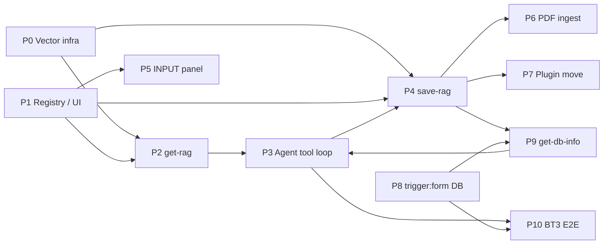

# RAG Workflow — Kế hoạch chia phase coding (Cursor)

> **Mục đích:** Hướng dẫn triển khai từng session Cursor — scope nhỏ, test được, tránh trộn refactor + feature.  
> **Spec liên quan:** [`agent.md`](./agent.md) · [`service.md`](./service.md) · [`vectorize.md`](./vectorize.md) · [`saveRag.md`](./saveRag.md) · [`getRag.md`](./getRag.md) · [`rag-recipes.md`](./rag-recipes.md)  
> **Kiến trúc:** [`workflow-node-plugin-architecture.md`](../workflow-node-plugin-architecture.md)

---

## 1. Nguyên tắc chia phase

| # | Nguyên tắc | Lý do |
|---|------------|-------|
| 1 | **Một session = một deliverable test được** | Cursor diff ổn định hơn khi có acceptance criteria rõ (~5–15 file) |
| 2 | **Foundation trước, feature sau** | Gom embed / query / upsert trước khi làm tool RAG |
| 3 | **Không trộn refactor plugin + runtime RAG** | Tránh regression trên executor monolith |
| 4 | **Vertical slice theo bài toán** | BT2 (Q&A, read-only) trước BT1 (ingest, write) |
| 5 | **Mỗi phase có prompt copy-paste** | Giảm scope creep giữa các lần chat |

### Không làm trong bất kỳ phase RAG nào (trừ khi phase riêng)

- Refactor toàn bộ `engine/executor.ts` (đang migrate từ switch-case monolith)
- Gộp `workflow-chat.ts` với graph execute
- Đổi schema D1 `agent_workflows.definition`
- Migration plugin folder (Phase 7) song song với runtime RAG

---

## 2. Bản đồ phụ thuộc



---

## 3. Thứ tự đề xuất

| Ưu tiên | Phase | Giá trị | Effort | Milestone |
|---------|-------|---------|--------|-----------|
| 1 | **P0** Vector infra | Unblock mọi phase sau | S | Test pass, behavior giữ nguyên |
| 2 | **P1** Registry / UI | Lưu graph recipe trên editor | S | Save/load JSON khớp recipes |
| 3 | **P2** get-rag | Retrieve độc lập | M | Unit test snippets |
| 4 | **P3** Agent tool loop | **BT2 E2E** (Q&A) | M | Webhook → câu trả lời grounded |
| 5 | **P4** save-rag | **BT1 E2E** (text ingest) | M | Save → get lại được |
| 6 | **P5** INPUT panel | UX khớp agent.md §4 | S | Upstream tree trên panel |
| 7 | **P6** PDF ingest | BT1 đầy đủ (binary PDF) | L | PDF upload → vector store |
| 8 | **P7** Plugin move | Maintainability | L | Module hóa, không đổi behavior |
| 9 | **P8** trigger:form DB | Fan-out n executions | M | List tables → n jobs |
| 10 | **P9** get-db-info | BT3a introspect | M | Schema + 10 rows + 10 SQL |
| 11 | **P10** BT3 E2E | **Text-to-SQL** | M | Ingest n bảng → ask-sql |

**BT3 phụ thuộc BT1/BT2 infra:** P0 → P1 → P4 → P8 → P9 → P3 → P10 (có thể song song P6).

**Song song được:** P5 (frontend) có thể chạy song song P2–P3 nếu dùng agent / developer khác nhau.

---

## 4. Chi tiết từng phase

### Phase 0 — Vector RAG infra

**Mục tiêu:** Một module dùng chung; bỏ duplicate giữa `nodes/agent/execute.ts` và `execution/agent-runtime.ts`.

| Làm | Không làm |
|-----|-----------|
| Tạo `rag-vector.ts`: `embedText()`, `queryCollection()`, `upsertVectors()` | Tool node execute |
| Unit test mock `env.AI` + Vectorize | Thay đổi UX editor |
| Refactor call sites — **behavior giữ nguyên** | |

**File đích:**

```
workers/auth-worker/src/features/member/workflows/
├── rag-vector.ts              # NEW (planned)
├── nodes/agent/execute.ts     # refactor
├── execution/agent-runtime.ts # refactor
└── rag-vector.test.ts         # NEW
```

**Acceptance criteria:**

- [ ] `embedText`, `queryCollection`, `upsertVectors` có unit test
- [ ] `executeAgent` implicit RAG vẫn hoạt động như trước
- [ ] `retrieveMemory` / `buildMemoryTool` dùng module chung

**Prompt Cursor:**

```
Implement shared RAG vector module per docs/workflow-nodes/vectorize.md:

- Create workers/auth-worker/src/features/member/workflows/rag-vector.ts
  (embedText, queryCollection, upsertVectors)
- Refactor nodes/agent/execute.ts and execution/agent-runtime.ts to use it
- Add unit tests. No behavior change for existing workflows.
```

---

### Phase 1 — Registry + config UI (không runtime)

**Mục tiêu:** Editor lưu được graph theo [`rag-recipes.md`](./rag-recipes.md); chưa cần chạy RAG.

| Làm | Không làm |
|-----|-----------|
| `toolKind`: `save-rag`, `get-rag` trong `builtins.ts` | Backend execute |
| Vectorize fields: `namespace`, `dimensions`, `metric` | Agent tool loop |
| Đổi label **Chat Model → Service** (`field_service`) | PDF parsing |
| Defaults: `toolName`, `topK`, `chunkSize`, … | |

**File đích:**

```
packages/workflow-nodes/src/nodes/builtins.ts
workers/web/messages/en-US.json
workers/web/messages/vi-VN.json
workers/web/src/lib/n8n-workflow/descriptions/tool-node.ts   # optional fields
workers/web/src/lib/n8n-workflow/descriptions/memory-node.ts
```

**Acceptance criteria:**

- [ ] Palette / add-node có Save RAG, Get RAG (tool kind)
- [ ] Memory node hiển thị collection + namespace
- [ ] Save workflow → JSON khớp mẫu trong `rag-recipes.md`
- [ ] Không regression node hiện có (`http-request`, `code` tools)

**Prompt Cursor:**

```
Phase 1 registry/UI only per docs/workflow-nodes/service.md, vectorize.md,
saveRag.md, getRag.md:

- Extend packages/workflow-nodes builtins: toolKind save-rag/get-rag, vectorize fields
- i18n: field_service (rename Chat Model → Service)
- No backend execute changes.
```

---

### Phase 2 — Tool `get-rag`

**Mục tiêu:** Tool đọc Vectorize hoạt động độc lập (harness / unit test); chưa bắt buộc full agent loop.

| Làm | Không làm |
|-----|-----------|
| `nodes/tool/get-rag.ts` theo [`getRag.md`](./getRag.md) | save-rag |
| `buildRagToolset()` đọc `tool_node` + `toolKind: get-rag` | PDF |
| Resolve `collection` / `namespace` từ `resolveAgentResources()` | Refactor executor |

**File đích:**

```
workers/auth-worker/src/features/member/workflows/
├── nodes/tool/get-rag.ts
├── execution/agent-runtime.ts   # buildRagToolset()
└── nodes/tool/get-rag.test.ts
```

**Acceptance criteria:**

- [ ] `get_rag({ query })` trả `{ snippets, count }` với mock Vectorize
- [ ] Filter `namespace` từ memory node config
- [ ] Embed query dùng `rag-vector.ts` + service từ agent resources

**Prompt Cursor:**

```
Implement get-rag tool per docs/workflow-nodes/getRag.md:

- workers/auth-worker/.../nodes/tool/get-rag.ts
- Extend execution/agent-runtime buildRagToolset() for tool_node toolKind get-rag
- Use rag-vector.ts + resolveAgentResources for collection/namespace
- Unit tests only; do not wire full graph execute yet.
```

---

### Phase 3 — Agent tool-calling trong graph execute

**Mục tiêu:** `executeAgent` gọi AI SDK tools khi agent có tool RAG — **hoàn thiện Bài toán 2**.

| Làm | Không làm |
|-----|-----------|
| Tool loop (`streamText` + tools, `stepCountIs(5)`) khi có `get-rag` | save-rag |
| Tắt implicit `queryVectorMemory` khi `get-rag` đã nối | workflow-chat |
| Billing qua `billAgentUsage` | |

**Tham chiếu graph:** [`rag-recipes.md` — Bài toán 2](./rag-recipes.md#bài-toán-2-hỏi-đáp--retrieve--generate)

**Acceptance criteria:**

- [ ] Webhook `{ question }` → Agent → `get_rag` → câu trả lời có grounding
- [ ] Không double-fetch (implicit + explicit cùng lúc)
- [ ] Shared workflow billing vẫn ghi `workflowAttribution`

**Prompt Cursor:**

```
Wire agent graph tool-calling per docs/workflow-nodes/agent.md, getRag.md,
and rag-recipes.md BT2:

- executeAgent: use buildRagToolset when tool_node get-rag connected
- Disable implicit queryVectorMemory when get-rag tool present
- Max 5 tool steps. Keep billing via billAgentUsage.
Use rag-recipes.md graph JSON for manual test setup.
```

**Milestone 1:** Bài toán 2 chạy E2E (text question, chưa PDF).

---

### Phase 4 — Tool `save-rag`

**Mục tiêu:** Upsert chunk + vector — **hoàn thiện Bài toán 1 (text ingest)**.

| Làm | Không làm |
|-----|-----------|
| `nodes/tool/save-rag.ts`: chunk, embed, upsert | PDF binary |
| Đăng ký trong `buildRagToolset` | `pipeline_auto` |
| Metadata: `source`, `documentId`, `namespace`, `chunkIndex` | |

**Tham chiếu graph:** [`rag-recipes.md` — Bài toán 1](./rag-recipes.md#bài-toán-1-ingest-pdf--vectorize)

**Acceptance criteria:**

- [ ] Agent gọi `save_rag({ content, documentId, source })` → vectors trong index
- [ ] BT2 đọc lại nội dung vừa save (cùng `collection` + `namespace`)
- [ ] Chunk size / overlap từ `node.data`

**Prompt Cursor:**

```
Implement save-rag tool per docs/workflow-nodes/saveRag.md:

- chunk + embed via service from resolveAgentResources + rag-vector upsert
- Register in buildRagToolset
- Unit + manual: save then get-rag retrieves same content
Follow rag-recipes.md BT1 with plain text body first (no PDF).
```

**Milestone 2:** Ingest text qua webhook + Q&A trên cùng KB.

---

### Phase 5 — Agent INPUT panel (upstream output)

**Mục tiêu:** UX khớp [`agent.md`](./agent.md) §4.1 — INPUT = output node trước.

| Làm | Không làm |
|-----|-----------|
| Tree Schema / Table / JSON từ parent last execution | Runtime RAG |
| Ghi chú refresh sau execute | Refactor registry |

**File đích:**

```
workers/web/.../panels/node-config/workflow-node-config-panel.tsx
workers/web/.../panels/node-config/node-config-io-panel.tsx
(+ hook lấy upstream output từ execution / test step)
```

**Acceptance criteria:**

- [ ] Agent sau Webhook → INPUT hiển thị `headers`, `body`, …
- [ ] Tab Schema / Table / JSON hoạt động
- [ ] Empty state khi chưa có execution

**Prompt Cursor:**

```
Agent config INPUT panel per docs/workflow-nodes/agent.md section 4.1:

- Show upstream node output in NodeConfigIoPanel (schema tree from last execution)
- Webhook → Agent case from rag-recipes.md
Frontend only unless minimal API needed for last step output.
```

---

### Phase 6 — PDF ingest (tách 6a / 6b)

#### Phase 6a — Webhook binary → structured output

| Làm |
|-----|
| Parse `webhookOptions.binary_field` |
| Output webhook: `{ files: [{ filename, mimeType, data }] }` |
| Document shape cho Agent INPUT |

**Prompt 6a:**

```
Webhook binary PDF handling for rag-recipes BT1:

- Parse binary_field in webhook trigger output shape
- Document output schema for agent INPUT
No save-rag changes.
```

#### Phase 6b — PDF text extract + ingest

| Làm |
|-----|
| Extract text từ PDF (Workers AI hoặc parser) |
| Agent prompt + `save_rag` với extracted text |
| E2E: upload PDF → searchable qua BT2 |

**Prompt 6b:**

```
PDF text extraction + save_rag ingest per rag-recipes.md BT1:

- Extract text from webhook files[] payload
- Wire into agent ingest flow (prompt or pre-step)
- E2E: PDF upload → get_rag finds content
```

**Milestone 3:** Bài toán 1 đầy đủ với PDF.

---

### Phase 7 — Module hóa plugin (optional)

**Chỉ sau P0–P4 ổn định.**

| Làm |
|-----|
| Move definitions sang `packages/workflow-nodes/src/nodes/{service,vectorize,tool}/` |
| Backend `nodes/<name>/index.ts`, frontend `nodes/<name>/` |
| Re-export shims — **không đổi behavior** |

**Prompt Cursor:**

```
Organize RAG-related nodes per workflow-node-plugin-architecture.md:

Move service/memory/tool definitions to packages/workflow-nodes modules.
Re-export shims only. No behavior changes. Reference agent.md file map.
```

---

### Phase 8 — Trigger form database + per-table fan-out

**Mục tiêu:** [`trigger.md`](./trigger.md) — form khai báo DB, spawn **n executions** (1 / bảng).

| Làm | Không làm |
|-----|-----------|
| `triggerKind: form`, `formKind: database` registry | get-db-info execute |
| Credential + connectionType config UI | schema.md generation |
| `form-trigger-runner.ts`: listTables → enqueue n jobs | |

**Acceptance criteria:**

- [ ] Form save/load JSON khớp `rag-recipes.md` BT3a
- [ ] Run workflow với 3 bảng → 3 execution logs, mỗi log có `tableName` khác nhau
- [ ] Failed table không chặn bảng còn lại

**Prompt Cursor:**

```
Implement trigger:form database per docs/workflow-nodes/trigger.md:

- Registry triggerKind form, formKind database
- form-trigger-runner: listTables + per_table fan-out (n executions)
- Pass trigger output { dbId, tableName, limits } to executeWorkflowGraph
No get-db-info tool yet.
```

---

### Phase 9 — Tool `get-db-info` + artifact templates

**Mục tiêu:** [`getDBInfo.md`](./getDBInfo.md) + [`schema.md`](./schema.md) + [`sqlexample.md`](./sqlexample.md).

| Làm | Không làm |
|-----|-----------|
| `nodes/tool/get-db-info.ts` | Text-to-SQL query workflow |
| save_rag metadata: `docType`, `tableName`, `dbId` | Full fan-out (P8) |
| Agent prompt templates trong docs (verify manual) | |

**Acceptance criteria:**

- [ ] `get_db_info` trả columns, 10 sample rows, 10 sql history
- [ ] save_rag lưu 2 docs với `docType: schema` | `sqlexample`
- [ ] get_rag filter theo `docType` + `namespace=dbId`

**Prompt Cursor:**

```
Implement get-db-info per docs/workflow-nodes/getDBInfo.md:

- Tool execute with read-only DB introspection + sample SELECT
- Extend save-rag metadata for docType schema/sqlexample (schema.md, sqlexample.md)
- Unit tests with mock DB
Reference rag-recipes.md BT3a single-table flow.
```

---

### Phase 10 — BT3 E2E (ingest n bảng + Text-to-SQL)

**Mục tiêu:** Hoàn thiện [`rag-recipes.md` §3](./rag-recipes.md#bài-toán-3-db-schema-ingest--text-to-sql).

| Làm | Không làm |
|-----|-----------|
| BT3a: P8 fan-out + P9 tools + Agent + save_rag | PDF (P6) |
| BT3b: webhook ask-sql + get_rag + SQL output | DML execution |

**Acceptance criteria:**

- [ ] Sync DB 5 bảng → 10 vector docs (schema+sqlexample × 5)
- [ ] `ask-sql` question → valid read-only SQL grounded in schema
- [ ] SQL cite `public.table` qualification

**Prompt Cursor:**

```
BT3 E2E per rag-recipes.md section 3:

- Wire BT3a ingest: trigger form fan-out + get_db_info + agent + save_rag
- Wire BT3b query: webhook ask-sql + get_rag + agent SQL output
Requires P3 agent tool loop, P4 save-rag, P8 fan-out, P9 get-db-info.
Manual test with 2-table DB.
```

**Milestone 4:** Bài toán 3 production-ready (read-only SQL).

---

## 5. Shortcut MVP (demo nhanh)

BT2 **gần chạy được ngay** với code hiện tại — **không cần P2–P3**:

```
Webhook ──► Agent + memory_node (vectorize) + service_node
```

`executeAgent` đã có implicit `queryVectorMemory` khi memory nối agent.

| Bước | Việc cần làm |
|------|----------------|
| 1 | P1 — lưu graph BT2 (bỏ tool get-rag khỏi recipe) |
| 2 | Manual test webhook + question |
| 3 | Sau đó P2–P3 thay implicit bằng explicit `get_rag` theo spec |

---

## 6. Gap hiện tại vs spec

| Tính năng | Code hiện tại | Phase |
|-----------|---------------|-------|
| Resource wiring Service / Memory / Tool | ✅ | — |
| Agent implicit vector query | ✅ | P3 tắt khi có get-rag |
| `toolKind` save-rag / get-rag | ❌ | P1 registry, P2/P4 execute |
| Agent tool-calling trong graph | ❌ | P3 |
| INPUT panel upstream tree | ⚠️ partial | P5 |
| Chat Model → Service label | ❌ doc only | P1 |
| PDF binary + extract | ❌ | P6 |
| trigger:form database | ❌ | P8 |
| get-db-info tool | ❌ | P9 |
| per_table fan-out (n executions) | ❌ | P8 |
| schema.md / sqlexample.md via save_rag | ❌ | P9 |
| BT3 Text-to-SQL | ❌ | P10 |

---

## 7. Checklist mỗi session Cursor

Copy vào đầu mỗi task:

```markdown
## Session checklist

- [ ] Đọc spec: agent.md + <node>.md (+ section rag-recipes nếu E2E)
- [ ] Scope = đúng 1 phase trong rag-implementation-phases.md
- [ ] ≤ 15 file thay đổi (trừ i18n/generated)
- [ ] Có unit test HOẶC manual steps trong PR
- [ ] Không sửa workflow-chat
- [ ] Không refactor executor monolith
- [ ] Không đổi D1 agent_workflows schema
```

---

## 8. Liên kết recipe ↔ phase

| Bài toán | Graph spec | Phases cần |
|----------|------------|------------|
| **BT1** Ingest PDF → Vectorize | [rag-recipes §1](./rag-recipes.md#bài-toán-1-ingest-pdf--vectorize) | P0 → P1 → P3 → P4 → P6 |
| **BT2** Hỏi đáp RAG | [rag-recipes §2](./rag-recipes.md#bài-toán-2-hỏi-đáp--retrieve--generate) | P0 → P1 → P2 → P3 (hoặc MVP implicit) |
| **BT3** DB → Text-to-SQL | [rag-recipes §3](./rag-recipes.md#bài-toán-3-db-schema-ingest--text-to-sql) | P0 → P1 → P4 → P8 → P9 → P3 → P10 |
| **UX** Config panel | [agent §4](./agent.md#4-config-panel--3-cột) | P5 (song song) |

---

## Changelog

| Version | Date | Changes |
|---------|------|---------|
| 0.2 | 2026-06-13 | P8–P10 Bài toán 3 (trigger form, get-db-info, Text-to-SQL) |
| 0.1 | 2026-06-13 | Initial — 8 phases + MVP shortcut + Cursor prompts |
