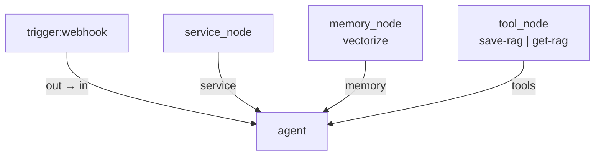
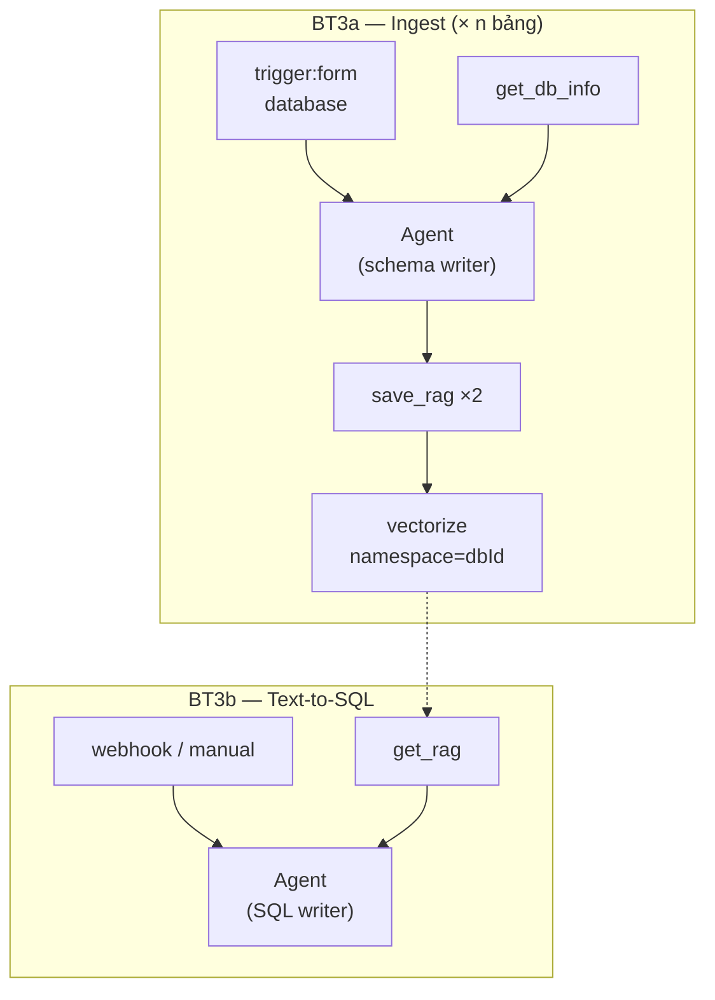

# RAG Workflow Recipes

> Cấu hình graph mẫu cho **3 bài toán RAG** — dùng cùng bộ resource node với [`agent.md`](./agent.md).  
> **Trạng thái:** Draft — runtime RAG + BT3 cần implement theo [`rag-implementation-phases.md`](./rag-implementation-phases.md).

| # | Bài toán | Trigger | Artifact / Output |
|---|----------|---------|-------------------|
| 1 | Ingest PDF | Webhook | Vectors (PDF text) |
| 2 | Q&A RAG | Webhook | Câu trả lời natural language |
| 3 | DB catalog → Text-to-SQL | [`trigger:form`](./trigger.md) + Webhook | [`schema.md`](./schema.md) + [`sqlexample.md`](./sqlexample.md) → SQL |

---

## Tổng quan wiring

Mọi recipe dùng **cùng pattern resource**:



| Node | Spec |
|------|------|
| Agent | [`agent.md`](./agent.md) |
| Service | [`service.md`](./service.md) |
| Vectorize | [`vectorize.md`](./vectorize.md) |
| Save RAG | [`saveRag.md`](./saveRag.md) |
| Get RAG | [`getRag.md`](./getRag.md) |

**Quy tắc:**

- Chỉ **Webhook → Agent** là data-flow edge liền nét.
- Service / Vectorize / Tool chỉ nối **resource handles** (đứt nét) xuống Agent.
- Agent INPUT = output Webhook; Agent không phải entry point.

---

## Bài toán 1: Ingest PDF → Vectorize

**Mục tiêu:** Webhook nhận PDF → Agent xử lý → embed qua Service → `save_rag` lưu vào Vectorize.

### Canvas

```
[Webhook] ----data-flow----> [Agent]
                                ^
        [Service] ----service---|
        [Vectorize] ---memory---|
        [Save RAG] ----tools----|
```

### Graph JSON

```json
{
  "nodes": [
    {
      "id": "wh_pdf",
      "type": "trigger",
      "position": { "x": 0, "y": 120 },
      "data": {
        "label": "PDF Upload",
        "triggerKind": "webhook",
        "httpMethod": "POST",
        "webhookPath": "ingest-pdf",
        "webhookAuth": "none",
        "webhookRespond": "when_last_node",
        "webhookOptions": { "binary_field": "files" }
      }
    },
    {
      "id": "agent_ingest",
      "type": "agent",
      "position": { "x": 320, "y": 120 },
      "data": {
        "label": "Ingest Agent",
        "promptSource": "define_below",
        "prompt": "Extract text from the uploaded PDF files in the input. For each document, call the save_rag tool with documentId, source filename, and full text content.",
        "systemPrompt": "You ingest documents into the knowledge base. Always call save_rag after extracting text.",
        "requireOutputFormat": false,
        "enableFallbackModel": false
      }
    },
    {
      "id": "svc_embed",
      "type": "service_node",
      "position": { "x": 320, "y": 280 },
      "data": {
        "label": "Embed Service",
        "endpoint": "/dashboard/assistant/embed",
        "catalogId": "cf-bge-base-en",
        "capabilities": ["embed"]
      }
    },
    {
      "id": "mem_kb",
      "type": "memory_node",
      "position": { "x": 480, "y": 280 },
      "data": {
        "label": "PDF Knowledge Base",
        "memoryKind": "vectorize",
        "collection": "vectorize-default",
        "namespace": "pdf-ingest"
      }
    },
    {
      "id": "tool_save",
      "type": "tool_node",
      "position": { "x": 640, "y": 280 },
      "data": {
        "label": "Save RAG",
        "toolKind": "save-rag",
        "toolName": "save_rag",
        "toolDescription": "Save extracted document text into the vector knowledge base.",
        "chunkSize": 800,
        "chunkOverlap": 120,
        "documentIdField": "{{ $json.body.documentId }}",
        "contentField": "{{ $json.body.text }}",
        "sourceField": "{{ $json.body.files[0].filename }}"
      }
    }
  ],
  "edges": [
    { "id": "e1", "source": "wh_pdf", "target": "agent_ingest", "sourceHandle": "out", "targetHandle": "in" },
    { "id": "e2", "source": "svc_embed", "target": "agent_ingest", "sourceHandle": "service", "targetHandle": "service" },
    { "id": "e3", "source": "mem_kb", "target": "agent_ingest", "sourceHandle": "memory", "targetHandle": "memory" },
    { "id": "e4", "source": "tool_save", "target": "agent_ingest", "sourceHandle": "tools", "targetHandle": "tools" }
  ]
}
```

### Webhook request mẫu

```http
POST /hooks/workflows/{workflowId}/ingest-pdf
Content-Type: application/json
X-Client-ID: {ownerId}
Authorization: Bearer {api_token}

{
  "documentId": "q1-report-2026",
  "files": [
    { "filename": "report-q1.pdf", "mimeType": "application/pdf", "data": "<base64>" }
  ]
}
```

### Luồng runtime (mục tiêu)

| Bước | Thành phần | Hành vi |
|------|------------|---------|
| 1 | Webhook | Parse body + binary → output `{ body, headers, ... }` |
| 2 | Agent INPUT | Hiển thị tree webhook output |
| 3 | Agent | Extract PDF text (model hoặc pre-step Phase 3) |
| 4 | Service | Embed chunks (`@cf/baai/bge-base-en-v1.5` hoặc catalog) |
| 5 | save_rag | Upsert vectors + metadata vào `mem_kb.collection` |
| 6 | Agent OUTPUT | `{ text: "Saved 12 chunks", saved: 12 }` |

### Agent config checklist

- [ ] Data-flow: Webhook `out` → Agent `in`
- [ ] Service node nối handle **Service** (embed capability)
- [ ] Vectorize node `memoryKind: vectorize`, `namespace: pdf-ingest`
- [ ] Save RAG tool `toolKind: save-rag`
- [ ] Prompt yêu cầu gọi `save_rag` sau extract

---

## Bài toán 2: Hỏi đáp — Retrieve + Generate

**Mục tiêu:** Webhook nhận câu hỏi → Agent gọi `get_rag` trên Vectorize → Service chat model trả lời có grounding.

### Canvas

```
[Webhook] ----data-flow----> [Agent]
                                ^
        [Service] ----service---|
        [Vectorize] ---memory---|
        [Get RAG] -----tools----|
```

### Graph JSON

```json
{
  "nodes": [
    {
      "id": "wh_ask",
      "type": "trigger",
      "position": { "x": 0, "y": 120 },
      "data": {
        "label": "Ask Question",
        "triggerKind": "webhook",
        "httpMethod": "POST",
        "webhookPath": "ask",
        "webhookAuth": "none",
        "webhookRespond": "when_last_node"
      }
    },
    {
      "id": "agent_qa",
      "type": "agent",
      "position": { "x": 320, "y": 120 },
      "data": {
        "label": "Q&A Agent",
        "promptSource": "from_input",
        "prompt": "{{ $json.body.question }}",
        "systemPrompt": "Answer using the knowledge base. Always call get_rag first with the user question, then answer only from retrieved snippets. Cite sources when possible.",
        "requireOutputFormat": false,
        "enableFallbackModel": false
      }
    },
    {
      "id": "svc_chat",
      "type": "service_node",
      "position": { "x": 320, "y": 280 },
      "data": {
        "label": "Chat Service",
        "endpoint": "/dashboard/assistant/chat",
        "capabilities": ["chat", "embed"]
      }
    },
    {
      "id": "mem_kb",
      "type": "memory_node",
      "position": { "x": 480, "y": 280 },
      "data": {
        "label": "PDF Knowledge Base",
        "memoryKind": "vectorize",
        "collection": "vectorize-default",
        "namespace": "pdf-ingest"
      }
    },
    {
      "id": "tool_get",
      "type": "tool_node",
      "position": { "x": 640, "y": 280 },
      "data": {
        "label": "Get RAG",
        "toolKind": "get-rag",
        "toolName": "get_rag",
        "toolDescription": "Search the knowledge base for relevant passages.",
        "topK": 5,
        "scoreThreshold": 0.65,
        "querySource": "from_tool_args"
      }
    }
  ],
  "edges": [
    { "id": "e1", "source": "wh_ask", "target": "agent_qa", "sourceHandle": "out", "targetHandle": "in" },
    { "id": "e2", "source": "svc_chat", "target": "agent_qa", "sourceHandle": "service", "targetHandle": "service" },
    { "id": "e3", "source": "mem_kb", "target": "agent_qa", "sourceHandle": "memory", "targetHandle": "memory" },
    { "id": "e4", "source": "tool_get", "target": "agent_qa", "sourceHandle": "tools", "targetHandle": "tools" }
  ]
}
```

### Webhook request mẫu

```http
POST /hooks/workflows/{workflowId}/ask
Content-Type: application/json

{
  "question": "What were the main risks mentioned in the Q1 report?"
}
```

### Luồng runtime (mục tiêu)

| Bước | Thành phần | Hành vi |
|------|------------|---------|
| 1 | Webhook | `{ body: { question } }` → Agent INPUT |
| 2 | Agent | `promptSource: from_input` → user message = câu hỏi |
| 3 | get_rag | Embed query + Vectorize top-K trong `pdf-ingest` namespace |
| 4 | Agent | Merge snippets vào context |
| 5 | Service | Chat model generate answer |
| 6 | Agent OUTPUT | `{ text: "...", sources: [...] }` |

### Agent config checklist

- [ ] `promptSource: from_input` hoặc `prompt: {{ $json.body.question }}`
- [ ] System prompt bắt buộc gọi `get_rag` trước khi trả lời
- [ ] Vectorize **cùng** `collection` + `namespace` với bài toán 1 (shared KB)
- [ ] Get RAG tool thay Save RAG
- [ ] Service chat endpoint (khác embed-only nếu catalog tách)

---

## Dùng chung KB giữa 2 workflow

| Field | Ingest (BT1) | Q&A (BT2) | Ghi chú |
|-------|--------------|-----------|---------|
| `collection` | `vectorize-default` | `vectorize-default` | Cùng index |
| `namespace` | `pdf-ingest` | `pdf-ingest` | Filter metadata |
| Service | embed-heavy | chat + embed | Có thể 1 hoặc 2 service node |

Có thể gộp cả ingest + Q&A vào **một workflow** với 2 webhook path khác nhau — mỗi webhook vẫn nối **Agent riêng** hoặc dùng IF/switch phân nhánh (spec ngoài phạm vi file này).

---

## Bài toán 3: DB schema ingest → Text-to-SQL

**Mục tiêu:** Form trigger kết nối DB → **mỗi bảng = 1 execution** → introspect → Agent sinh `schema.md` + `sqlexample.md` → Vectorize → user hỏi → sinh SQL (như BT2 nhưng output là SQL).

**Specs:** [`trigger.md`](./trigger.md) · [`getDBInfo.md`](./getDBInfo.md) · [`schema.md`](./schema.md) · [`sqlexample.md`](./sqlexample.md)

### 3.1 Kiến trúc tổng thể



| Giai đoạn | Executions | Mô tả |
|-----------|------------|-------|
| **BT3a Ingest** | **n** (1 / bảng) | Fan-out từ [`trigger.md`](./trigger.md) `executionMode: per_table` |
| **BT3b Query** | 1 / câu hỏi | Giống BT2; retrieve `schema` + `sqlexample`; output SQL |

---

### 3.2 BT3a — Graph ingest (một execution = một bảng)

```
[Form DB Trigger] ----> [Agent]
                            ^
    [Service] ----service---|
    [Vectorize] ---memory---|
    [Get DB Info] ---tools--|
    [Save RAG] ----tools----|  (cùng handle tools hoặc agent gọi save 2 lần)
```

**Lưu ý wiring:** Agent có thể nối **2 tool nodes** (`get-db-info` + `save-rag`) qua handle `tools` (allowMultiple).

### Graph JSON (ingest)

```json
{
  "nodes": [
    {
      "id": "trg_db",
      "type": "trigger",
      "position": { "x": 0, "y": 120 },
      "data": {
        "label": "DB Catalog Sync",
        "triggerKind": "form",
        "formKind": "database",
        "credentialKey": "cred_analytics_pg",
        "connectionType": "hyperdrive",
        "databaseId": "analytics-db",
        "schemaName": "public",
        "executionMode": "per_table",
        "tableFilter": "*",
        "sampleRowLimit": 10,
        "sqlHistoryLimit": 10
      }
    },
    {
      "id": "agent_schema",
      "type": "agent",
      "position": { "x": 320, "y": 120 },
      "data": {
        "label": "Schema Writer",
        "promptSource": "define_below",
        "prompt": "Call get_db_info for the table in input. Then produce schema.md and sqlexample.md per docs/workflow-nodes/schema.md and sqlexample.md. Call save_rag twice with the correct documentIds.",
        "systemPrompt": "You catalog database tables for Text-to-SQL. Output only via save_rag tool calls."
      }
    },
    {
      "id": "svc_chat",
      "type": "service_node",
      "position": { "x": 320, "y": 280 },
      "data": {
        "label": "Chat Service",
        "endpoint": "/dashboard/assistant/chat"
      }
    },
    {
      "id": "mem_db",
      "type": "memory_node",
      "position": { "x": 480, "y": 280 },
      "data": {
        "label": "DB Knowledge",
        "memoryKind": "vectorize",
        "collection": "vectorize-default",
        "namespace": "analytics-db"
      }
    },
    {
      "id": "tool_dbinfo",
      "type": "tool_node",
      "position": { "x": 640, "y": 240 },
      "data": {
        "label": "Get DB Info",
        "toolKind": "get-db-info",
        "toolName": "get_db_info",
        "sampleRowLimit": 10,
        "sqlHistoryLimit": 10
      }
    },
    {
      "id": "tool_save",
      "type": "tool_node",
      "position": { "x": 640, "y": 320 },
      "data": {
        "label": "Save RAG",
        "toolKind": "save-rag",
        "toolName": "save_rag"
      }
    }
  ],
  "edges": [
    { "id": "e1", "source": "trg_db", "target": "agent_schema", "sourceHandle": "out", "targetHandle": "in" },
    { "id": "e2", "source": "svc_chat", "target": "agent_schema", "sourceHandle": "service", "targetHandle": "service" },
    { "id": "e3", "source": "mem_db", "target": "agent_schema", "sourceHandle": "memory", "targetHandle": "memory" },
    { "id": "e4", "source": "tool_dbinfo", "target": "agent_schema", "sourceHandle": "tools", "targetHandle": "tools" },
    { "id": "e5", "source": "tool_save", "target": "agent_schema", "sourceHandle": "tools", "targetHandle": "tools" }
  ]
}
```

### Trigger output (execution cho bảng `orders`)

```json
{
  "dbId": "analytics-db",
  "schemaName": "public",
  "tableName": "orders",
  "limits": { "sampleRowLimit": 10, "sqlHistoryLimit": 10 },
  "executionIndex": 2,
  "executionTotal": 15
}
```

### Luồng runtime (một bảng)

| Bước | Thành phần | Hành vi |
|------|------------|---------|
| 1 | trigger:form | Fan-out → execution với `tableName=orders` |
| 2 | get_db_info | Schema + 10 rows + 10 SQL history |
| 3 | Agent | Sinh nội dung [`schema.md`](./schema.md) + [`sqlexample.md`](./sqlexample.md) |
| 4 | save_rag ×2 | `documentId`: `analytics-db.public.orders.schema` và `.sqlexample` |
| 5 | Vectorize | `namespace=analytics-db`, metadata `docType`, `tableName` |

**Sau khi sync xong n bảng:** index chứa **2n documents** (schema + sqlexample mỗi bảng).

---

### 3.3 BT3b — Graph query (Text-to-SQL)

Dùng lại pattern BT2; khác **output** và **metadata filter**.

```json
{
  "nodes": [
    {
      "id": "wh_sql",
      "type": "trigger",
      "data": {
        "triggerKind": "webhook",
        "webhookPath": "ask-sql",
        "httpMethod": "POST"
      }
    },
    {
      "id": "agent_sql",
      "type": "agent",
      "data": {
        "label": "SQL Generator",
        "promptSource": "from_input",
        "prompt": "{{ $json.body.question }}",
        "systemPrompt": "You generate read-only SQL. Call get_rag with docType schema and sqlexample. Return SQL in a fenced code block. dbId=analytics-db."
      }
    },
    {
      "id": "mem_db",
      "type": "memory_node",
      "data": {
        "memoryKind": "vectorize",
        "collection": "vectorize-default",
        "namespace": "analytics-db"
      }
    },
    {
      "id": "tool_get",
      "type": "tool_node",
      "data": {
        "toolKind": "get-rag",
        "toolName": "get_rag"
      }
    },
    {
      "id": "svc_chat",
      "type": "service_node",
      "data": {
        "endpoint": "/dashboard/assistant/chat"
      }
    }
  ]
}
```

### Webhook request

```json
{
  "dbId": "analytics-db",
  "question": "Total revenue by day last 30 days from orders"
}
```

### Agent OUTPUT (ví dụ)

````markdown
```sql
SELECT date_trunc('day', created_at) AS day,
       SUM(total) AS revenue
FROM public.orders
WHERE created_at >= now() - interval '30 days'
GROUP BY 1
ORDER BY 1;
```
````

---

### 3.4 Fan-out: n bảng = n executions

| DB | Bảng | Executions ingest |
|----|------|-------------------|
| `analytics-db` | 15 tables | **15** workflow runs |
| Mỗi run | 1 `tableName` | 2 vectors docs (schema + sqlexample) |
| Tổng vectors mới | | **30** upserts |

Orchestrator (`form-trigger-runner`) chịu trách nhiệm:

1. `LIST TABLES` một lần
2. Enqueue job `{ workflowId, dbId, tableName }` × n
3. Retry / log per table (bảng lỗi không block bảng khác)

---

### 3.5 Checklist BT3

**Ingest (BT3a):**

- [ ] trigger:form + credential + `executionMode: per_table`
- [ ] get-db-info + save-rag + service + vectorize (`namespace=dbId`)
- [ ] Agent prompt tham chiếu schema.md + sqlexample.md templates
- [ ] Verify: sau n runs, get_rag tìm được schema cho mọi bảng

**Query (BT3b):**

- [ ] Webhook `ask-sql` + get-rag + agent
- [ ] Cùng `namespace` với ingest
- [ ] System prompt: read-only SQL, qualify schema

---

## Gap so với code hiện tại

| Tính năng | Trạng thái |
|-----------|------------|
| Resource wiring Service/Memory/Tool | ✅ |
| Agent implicit vector query | ✅ `executeAgent` |
| Tool `save-rag` / `get-rag` execute | ❌ Phase 2 |
| Agent tool-calling trong graph execute | ❌ Phase 2 |
| PDF extract trong webhook payload | ⚠️ `binary_field` config có; extract text cần bổ sung |
| trigger:form database | ❌ | P8 |
| get-db-info tool | ❌ | P9 |
| schema.md / sqlexample.md templates trong save_rag | ❌ | P9 |
| per_table fan-out runner | ❌ | P8 |
| BT3 Text-to-SQL query workflow | ❌ | P3 + P10 |

---

## Changelog

| Version | Date | Changes |
|---------|------|---------|
| 0.2 | 2026-06-13 | Bài toán 3 — DB ingest + Text-to-SQL |
| 0.1 | 2026-06-13 | Recipes BT1 ingest + BT2 Q&A |
