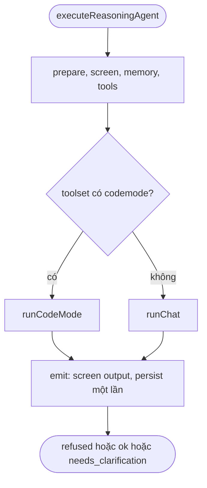
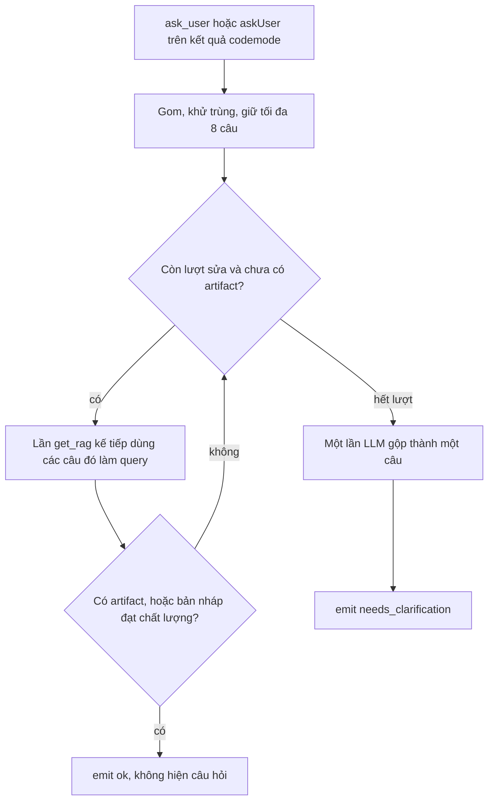

# Spec: Reasoning Agent — đường chạy code mode và chat

> **Trạng thái:** Draft — hợp đồng implement, chưa code  
> **Phiên bản:** 0.3  
> **Ngày:** 2026-09-29  
> **0.3:** Màn chat không hiện JSON của node. Kết quả tốt thì bubble là một câu SQL dán vào là chạy. Chưa đủ thì một câu hỏi đúng ngôn ngữ user.  
> **0.2:** `ask_user` không cắt chat ngay. Nội dung được đưa vào query của lần `get_rag` tiếp theo. Chỉ khi chất lượng vẫn lòng vòng thì gộp các lần hỏi thành một câu trên màn chat.
> **Đọc kèm:** [`reasoning-agent.md`](./reasoning-agent.md) · [`code.md`](./code.md) · [`agent.md`](./agent.md)  
> **Không thay thế:** shape output và option đã có trong `reasoning-agent.md`. Spec này đổi **đường chạy** của `executeReasoningAgent`.  
> **Không đụng:** `tools_agent` / `executeAgent`. Điều kiện collapse Code Mode trong `agent-runtime.ts`. Monitor Logs (credit). Kho log D1/R2.

Mục tiêu: reasoning agent tới đích bằng ít bước LLM hơn và gọi đúng tool. `ask_user` là manh mối cho lần `get_rag` tiếp theo, không phải một lượt chat. Chat chỉ nhận một câu hỏi đã gộp, và chỉ khi các lần retrieve sau đó vẫn không làm câu trả lời tốt hơn. Code mode và chat tách một lần sau khi toolset đã dựng. Phần chung phía trước và phía sau không biết mình đang ở đường nào.

---

## 1. Mục tiêu

1. Có tool `codemode` thì đường chạy không còn frame LLM, plan, chấm điểm hai lần, hay reflect rewrite.
2. `ask_user` không mở thêm một step LLM tự do. Các câu hỏi được gom và thành query của lần `get_rag` kế tiếp. Hết ngân sách sửa mà vẫn không có artifact thì một lần gọi LLM gộp chúng thành một câu trên chat.
3. Mỗi đường chỉ ghi session / simple memory / semantic episode ở một chỗ (`emit`).
4. `status`, citation, safety hai lớp, và kiểm tra ví giữ nguyên nghĩa hiện tại.
5. Toggle `traceCodeMode` tắt thì im. Bật thì mỗi step code mode có một dòng trên Workers Logs của auth-worker.
6. Màn chat hiện một câu SQL chạy được khi kết quả tốt, hoặc một câu hỏi đúng ngôn ngữ user khi chưa đủ. Không hiện JSON của node.

---

## 2. Hiện trạng (không giữ)

`executeReasoningAgent` dùng một vòng `for` cho cả hai đường. `usingCodeMode` được hỏi lại ở frame, plan, số vòng, reflect và prompt.

| Chỗ | Hành vi hiện tại | Hệ quả |
|-----|------------------|--------|
| Chọn đường | `codeModeToolName(baseTools)` sau collapse | Đúng hướng, nhưng cờ bị rải khắp hàm |
| Frame LLM, plan | Bỏ qua khi code mode | Vẫn nằm trong cùng hàm, dễ gọi nhầm |
| `ask_user` | Luôn có trong toolset outer. Prompt bảo gọi khi thiếu chi tiết | Model gọi giữa act |
| `ask_user.execute` | Echo `{ questions, why, status: 'needs_clarification' }` | `generateText` đưa object đó cho step sau. Không ai đọc `status` |
| Dừng hỏi user | Chỉ sau khi act xong, và chỉ khi `toolResults[].result.questions` có phần tử | Step sau đã tốn token. Đọc không ra `questions` thì câu hỏi thành observation và reflect chạy tiếp |
| Act code mode | `stopSteps` mặc định 2. `toolChoice` buộc `codemode` ở bước đầu | Bước 2 nuốt kết quả tool (kể cả `ask_user`) làm context |
| Reflect | Heuristic + `scoreDraft`, rồi LLM reflect có thể rewrite và chấm lại | Vòng sửa thứ hai. Sandbox đã sửa tối đa 3 lần trong script |
| Ghi nhớ | Refuse đầu, clarification, `ask_user`, và `finish` mỗi nơi một kiểu | Dễ persist nhầm bản refused, hoặc quên persist clarification |
| Log | `console.warn` khi collapse thiếu `LOADER` hoặc memory lỗi | Không thấy prompt → tool → kết quả → step sau |

Code mode **không** có option bật tắt. Tool `codemode` chỉ xuất hiện khi đủ cả bốn điều kiện collapse (giữ nguyên, không thêm cờ):

1. Agent nối một tool node `kind: code`.
2. Cùng agent nối ít nhất một tool lớp `retrieve` và một tool lớp `validate` (thường là `get-rag` và `check-sql`), và các tool đó tạo được definition.
3. Có ít nhất hai inner tool.
4. Worker có binding `LOADER`.

Thiếu một điều kiện thì toolset giữ từng tool riêng. Đó là đường chat.

---

## 3. Đường chạy đích



`runCodeMode` và `runChat` trả `ReasoningResult` cộng observation. Chúng không ghi session, không gọi `toNodeOutput`.

### 3.1 Phần chung phía trước

Giữ thứ tự hiện tại, dừng sớm như hiện tại:

1. Resolve resource, user text, prefetch RAG, PDF, options.
2. `ruleClassify`. `refuse` → `emit` refused. Không gọi LLM, không ghi nhớ.
3. Không có `deps.llm` và không có endpoint → throw `Agent node missing serviceEndpoint`.
4. Không có `deps.llm` → `ensureWalletBalance`, resolve service, `assertTextGenerationModel`.
5. Safety `review` → LLM classifier. `refuse` → `emit` refused. Không ghi nhớ.
6. Session, simple memory, semantic retrieve, dựng tool, collapse.

Hết bước 6 mới được rẽ nhánh.

### 3.2 `runCodeMode`

Một act là **một** bước tool (`stopSteps = 1`). `toolChoice` là `{ type: 'tool', toolName: codemode }`. Toolset của act **chỉ** có `codemode`. Không có `ask_user`, không có retrieve/validate outer (collapse đã gỡ chúng).

System prompt của đường này là một khối, không ghép câu "gọi `ask_user` khi thiếu chi tiết":

- Viết một async arrow JavaScript qua `codemode`.
- Trong script: retrieve trước, nháp chỉ từ kết quả đó, validate. `ok: false` thì retrieve lại theo lỗi, sửa, validate lại, tối đa 3 lần.
- Chỉ `return { ok: true, ... }` khi validate `ok: true`. Không bịa identifier.
- Thiếu dữ liệu thì gọi `get_rag` lại với chính khoảng trống đó làm query, rồi mới `return { ok: false, error, askUser: ["..."] }`. `askUser` là các câu còn thiếu sau lần retrieve đó, không phải tin nhắn gửi user.

Act 1 xong:

| Kết quả | Việc làm |
|---------|----------|
| Có artifact đã validate (`codeModeSucceeded`) | `emit` `ok`. Bọc artifact vào draft như hiện tại (SQL thì fence `sql` khi draft chưa có fence). Bỏ `askUser` |
| `maxReflectRetries === 0` và không có `askUser` | `emit` `ok` với draft hiện có. Không act lần hai |
| `maxReflectRetries === 0` và có `askUser` | Không act lần hai. Gộp một câu theo §4, `emit` `needs_clarification` |
| Còn lại | **Một** act nữa. User message = câu user + lỗi sandbox đã cắt + các câu trong `askUser` (đã khử trùng). Prompt bắt script gọi `get_rag` trước, query lấy từ các câu đó. Vẫn `stopSteps = 1`, vẫn chỉ tool `codemode` |

Act 2 có artifact thì `emit` `ok`. Act 2 vẫn không có artifact và danh sách `askUser` không rỗng thì gộp câu theo §4 rồi `emit` `needs_clarification`. Act 2 không có artifact và không có câu `askUser` nào thì `emit` `ok` với draft act 2. Không LLM reflect. Không `scoreDraft`. Không rewrite.

`maxReflectRetries` trên đường này chỉ nghĩa là "có được sửa một lần ở outer hay không". Trần vẫn là một lần, kể cả khi option lớn hơn 1. Vòng sửa 3 lần nằm trong script.

### 3.3 `runChat`

Giữ frame, `shouldAskClarification`, plan, policy tool, vòng act/reflect và `ask_user`. Đây là đường khi không collapse.

Có tool retrieve (`get_rag` hoặc tool lớp retrieve khác): `ask_user` trong act không trả chat ngay. Câu hỏi thành query của lần retrieve kế tiếp, cùng quy tắc gom ở §4. Hết `maxReflectRetries` hoặc `shouldStopImproving` mà bản nháp vẫn không đạt, và đã có ít nhất một `ask_user`, thì gộp thành một câu rồi `emit` `needs_clarification`.

Không có tool retrieve: `ask_user` và clarification trước vòng lặp vẫn trả `needs_clarification` ngay, vì không có `get_rag` để chạy tiếp. Cả hai đi qua `emit`, không tự `saveSessionMemory`.

Rút reflect của đường chat còn một lần chấm (bỏ rewrite + `scoreDraft` lần hai) là **phase 2**. Phase 1 không đổi công thức điểm của chat.

### 3.4 `emit`

Một hàm. Mọi lối ra của cả hai đường đi qua đây.

| `status` | Safety output | Persist |
|----------|----------------|---------|
| `refused` | Đã refuse từ input, hoặc `ruleClassify` trên text đầu ra | Không session, không simple memory, không semantic |
| `needs_clarification` | Không | Session + simple memory. Không semantic episode |
| `ok` | `ruleClassify` trước khi ghi. Refuse thì rơi xuống hàng `refused` và không ghi | Session, simple memory, semantic episode khi có `memoryCollection` |

`toNodeOutput` chỉ được gọi trong `emit`. `sql` / `artifact` vẫn lấy từ observation đã validate khi `evaluationMode === 'sql'`, đúng như `finish` hiện tại.

---

## 4. `ask_user`

`ask_user` là manh mối retrieve, rồi mới là câu trên chat. Một lần gọi không được mở thêm step trong cùng `generateText`: outer act vẫn `stopSteps = 1`. Host đọc câu hỏi sau act và tự đưa vào lần `get_rag` sau, thay vì để model nhận echo của tool rồi gọi tiếp.



**Gom.** Mỗi câu lấy từ `ask_user.questions` hoặc từ `askUser` trên kết quả `codemode`. Cắt trắng, bỏ rỗng, khử trùng không phân biệt hoa thường, giữ tối đa 8. `why` giữ kèm câu cuối cùng, cắt 400 ký tự. `status` trên payload tool không phải tín hiệu điều khiển.

**Đưa vào `get_rag`.** Lần retrieve kế tiếp nhận các câu đã gom làm query, kèm lỗi validate nếu có. Code mode: act sau bắt script gọi `get_rag` với query đó trước khi nháp. Đường chat có retrieve: lần gọi retrieve tiếp theo dùng cùng query, không trả chat ở attempt hiện tại. Có artifact đã validate, hoặc đường chat có bản nháp qua `shouldStopImproving` với `pass`, thì bỏ túi câu hỏi và `emit` `ok`.

**Lòng vòng.** Hết ngân sách mà vẫn không có artifact (code mode) hoặc bản nháp không đạt và không cải thiện (chat, `shouldStopImproving`):

| Túi câu hỏi | Kết quả |
|-------------|---------|
| Rỗng | `emit` `ok` với draft tốt nhất. Không bịa câu hỏi |
| Có ít nhất một câu | Một lần LLM purpose `ask`, `maxTokens` 200. Input là các câu đã gom, `why`, và lỗi tool cuối. Output JSON `{ "question": "..." }` |

Câu gộp là một câu người dùng trả lời được trên chat, không phải danh sách thô. Parse thất bại thì dùng câu xuất hiện nhiều nhất, hòa thì câu đầu tiên sau khi khử trùng. `emit` `needs_clarification` với `questions: [câu đó]`. Các câu gốc không hiện thành bullet. Nội dung bubble và ngôn ngữ nằm ở §4.1.

LLM purpose `ask` chỉ chạy đúng một lần, tại lúc hết ngân sách. Không reflect thêm sau câu gộp. Prompt của lần gọi này nhận nguyên câu user và bắt model viết `question` **cùng ngôn ngữ với câu đó**. User hỏi tiếng Việt thì câu trả về tiếng Việt. User hỏi tiếng Anh thì câu trả về tiếng Anh. Không bọc bằng mẫu tiếng Anh kiểu "I need a bit more information".

---

## 4.1 Màn chat

Bubble chat là một chuỗi người đọc được. Không phải `JSON.stringify` của output node (`status`, `citations`, `plan`, `snippets`, …).

Graph và log vẫn giữ object đầy đủ. `sql` trên node vẫn là field riêng cho node phía sau. Hai mặt chat chỉ hiển thị chuỗi ở dưới:

| Mặt | Chỗ lấy chuỗi |
|-----|----------------|
| Chat trong editor (`createReasoningChatResponse`) | `output.text` |
| Chat trigger (`postChatTriggerMessage`, `extractChatReply`) | Cùng quy tắc. Object có `text` hoặc `sql` thì lấy chuỗi đó. Không stringify cả object |

`emit` ghi `text` theo `status`:

| `status` | `text` trên chat |
|----------|------------------|
| `ok` và có SQL đã validate, hoặc `extractSql` ra một câu | Đúng một câu SQL. Không prose, không fence ` ``` `, không JSON. Cắt trắng, một dấu `;` ở cuối nếu chưa có. Dán vào client SQL là chạy được. `sql` trên node bằng câu đó, không có `;` thừa ở giữa |
| `needs_clarification` | Đúng một câu hỏi ở §4, cùng ngôn ngữ với câu user vừa gửi |
| `refused` | Một câu từ chối ngắn, cùng ngôn ngữ với câu user. Không object lỗi |
| `ok` nhưng không có SQL | Đoạn trả lời thường trong `text`. Vẫn là chữ, không phải object node |

SQL chỉ lấy từ artifact validate khi `evaluationMode` là `sql`, hoặc từ `extractSql` khi câu đó đã có trong câu trả lời. Không bịa SQL khi validate chưa `ok`. Không có SQL mà status vẫn `ok` thì không biến bubble thành câu hỏi. Câu hỏi chỉ khi `status` là `needs_clarification`.

Ví dụ bubble, không kèm field khác:

- User: "cho tôi doanh thu tháng này" và check SQL đạt → `SELECT ... FROM ...;`
- User: "show revenue this month" và hết lượt, chưa có SQL → `Which month should the revenue cover?`
- User: "doanh thu theo tháng" và hết lượt, chưa có SQL → `Bạn muốn doanh thu của tháng nào?`

---

## 5. Option `traceCodeMode`

| | |
|--|--|
| Key | `traceCodeMode` |
| UI | Toggle trên config Reasoning Agent, cùng nhóm option kind `reasoning_agent` |
| Default | `false` trong `REASONING_AGENT_DEFAULTS` |
| Đọc | `resolveConfiguredFlag`, cùng kiểu `requireCitations` |

Tắt, hoặc lần chạy không có `codemode`: không dòng log, không dựng chuỗi script để ghi.

Bật và đang ở `runCodeMode`: logger JSON sẵn có, `service: auth-worker`, `component: reasoning-agent`. Hiện trên Workers Logs, `wrangler tail`, và invocation của màn admin Cloudflare logs. Không ghi Monitor Logs. Không persist D1/R2.

| `event` | Khi nào | Field |
|---------|---------|--------|
| `code_mode.start` | Đầu act 1 và đầu act 2 | `attempt` (1 hoặc 2), đoạn hướng dẫn code mode đã cắt, tên tool outer, `toolChoice`, `stopSteps` |
| `code_mode.step` | Sau bước tool | `attempt`, tên tool, đối số cắt, kết quả cắt, `fedToNextStep` (`true` chỉ khi còn một act outer nữa dùng kết quả này) |
| `code_mode.end` | Trước `emit` | `reason`: `artifact` \| `ask_fed_to_rag` \| `ask_synthesized` \| `retry_exhausted` \| `retries_disabled`. Kèm `askCount` |

Với tool `codemode`, `code_mode.step` kèm log sandbox đã trả về (`get_rag` / `check_sql` / lỗi validate), cắt cùng trần. Không gắn logger vào Worker sandbox.

Trần mỗi field chuỗi: **400 ký tự**. Logger hiện tại vẫn redact key dạng secret. Câu hỏi user và SQL có thể nằm trong đoạn cắt — vì vậy default là tắt.

Option này không đổi control flow, prompt, hay số lần gọi LLM.

---

## 6. Prompt code mode (để gọi tool đúng)

Khối hướng dẫn trong §3.2 là nguồn duy nhất mô tả vòng tool của đường code mode. Không ghép thêm plan, citation block, hay RAG snippet vào system prompt của act — script tự retrieve trong sandbox. Session summary và history của simple memory vẫn được gắn, cắt như các field prompt khác đang làm, để lần chạy sau không mất ngữ cảnh hội thoại.

Act 2 không nhận bản reflect. Nó nhận lỗi thật của act 1 và các câu `askUser` đã gom. Câu đó là query của `get_rag` trong script, không phải tin nhắn chat.

---

## 7. File

| File | Việc |
|------|------|
| `nodes/agent/execute-reasoning.ts` | Tách `runCodeMode`, `runChat`, `emit`. Xóa các `if (usingCodeMode)` trong frame, plan và vòng reflect |
| `nodes/agent/reasoning/tools.ts` | Khối prompt §3.2 và §4. Act code mode không gọi `ask_user` như một step outer; script trả `askUser` để host đưa vào `get_rag` |
| `packages/workflow-nodes` `REASONING_AGENT_DEFAULTS` | `traceCodeMode: false` |
| `workers/web` config panel agent + i18n | Toggle, chỉ `reasoning_agent` |
| `execute-reasoning.test.ts` | Các ca ở §8 |
| `collab/workflow-chat.ts` | Stream đúng `text` của §4.1 |
| `triggers/chat-submission.ts` `extractChatReply` | Object reasoning lấy `text` hoặc `sql`. Không `JSON.stringify` cả node |
| `chat-trigger-conversation.tsx` `postChatTriggerMessage` | Cùng quy tắc khi `output` là object |
| `shared/logger.ts` | Dùng `createLogger`, không logger mới |

Không sửa `collapseToCodeModeTool`. Không thêm field chọn code mode.

---

## 8. Tiêu chí chấp nhận

1. Collapse đủ điều kiện: không gọi LLM purpose `frame` hoặc `plan`. Số lần `purpose: 'act'` là 1 khi có artifact hoặc khi `maxReflectRetries` là 0, và là 2 khi act 1 không có artifact và retries ≥ 1.
2. Mỗi act code mode có `stopSteps === 1` và `toolChoice` trỏ đúng tên `codemode`. Cùng một `generateText` không có step thứ hai sau `ask_user`.
3. Act 1 trả artifact validate: không có act 2, không gọi purpose `ask`. Output `ok`, `sql` lấy từ artifact khi evaluation mode là `sql`. Các câu `askUser` đi kèm bị bỏ.
4. Act 1 trả `askUser` không rỗng và chưa có artifact, `maxReflectRetries` ≥ 1: act 2 chạy, query `get_rag` chứa các câu đã gom. Act 2 có artifact thì `ok`. Act 2 vẫn không có artifact thì đúng một lần purpose `ask`, rồi `needs_clarification` với một phần tử trong `questions`. `maxReflectRetries` là 0 và đã có `askUser`: không act 2, gộp câu ngay. Câu gộp cùng ngôn ngữ với câu user.
5. Chat trigger và chat editor, khi `ok` có SQL: bubble đúng bằng câu SQL có `;` cuối, không chứa `{` mở của object node. Khi `needs_clarification`: bubble đúng bằng câu hỏi, không chứa `status` hay `citations`. User tiếng Việt không nhận câu hỏi tiếng Anh từ mẫu cố định.
6. `traceCodeMode` tắt: không gọi logger `code_mode.*`. Bật: đúng một `start` và một `end` mỗi act, một `step` mỗi bước tool, field chuỗi ≤ 400 ký tự.
7. Refuse input và refuse output: không `saveSessionMemory`, không `persistSemanticEpisode`, không `simpleMemory.persist`.
8. `ok`: cả ba persist đó chạy một lần. `needs_clarification`: session + simple memory, không semantic.
9. Không có `codemode` trong toolset: vẫn frame / clarify / plan / reflect như trước phase này. `tools_agent` không đổi.

---

## 9. Thứ tự code

**Phase 1 (spec này).** Tách `runCodeMode` + `emit` + đưa `ask_user` / `askUser` vào lần `get_rag` kế tiếp + gộp một câu khi lòng vòng + bubble chat theo §4.1 + `traceCodeMode`. Chat không có retrieve thì vẫn hỏi ngay. Chat có retrieve thì dùng §4. Vòng reflect của chat giữ nguyên.

**Phase 2.** Đường chat: reflect chỉ trả issues, act sau sửa, `shouldStopImproving` một lần mỗi attempt. Không rewrite, không `scoreDraft` lần hai.

Phase 2 không được làm trong cùng thay đổi với phase 1.

---

## 10. Ngoài phạm vi

- Thêm option để user chọn code mode hay chat. Đường đi vẫn là kết quả collapse.
- Đổi điều kiện `LOADER` / retrieve / validate.
- Sửa prompt Text-to-SQL của đường chat.
- Ghi trace vào `workflow_executions` hoặc Monitor Logs.
- Hiện danh sách thô mọi `ask_user` lên chat. User chỉ thấy câu đã gộp.
- Thêm nút chạy SQL trên bubble. Bubble chỉ cần là câu SQL để user tự dán.
- Dịch câu hỏi theo locale trình duyệt. Ngôn ngữ lấy từ câu user vừa gửi.
- Gọi purpose `ask` nhiều hơn một lần trong một lần chạy node.
