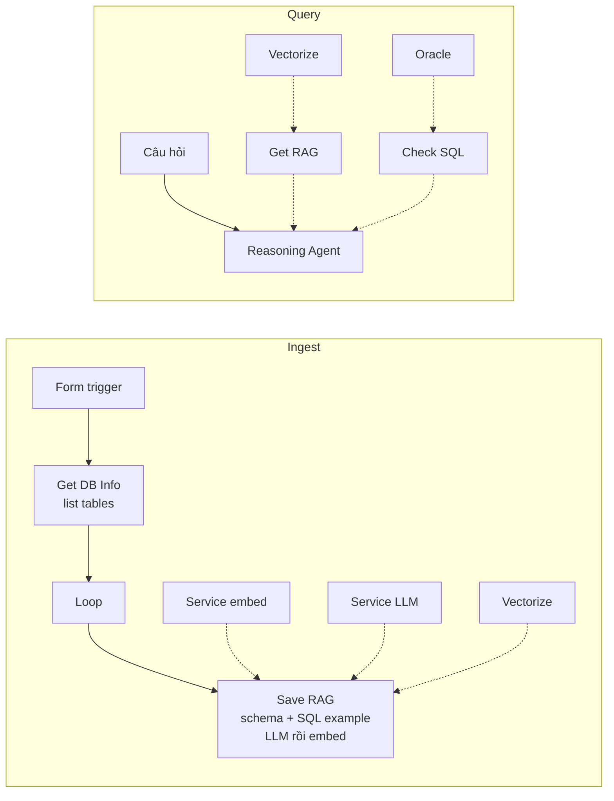

# Tool nodes — kiến trúc và ranh giới

> **Trạng thái:** Draft (thay spec cũ của save-rag / get-rag / get-db-info)  
> **Ngày:** 2026-09-22  
> **Phạm vi:** `tool_node` trên data-flow và tool gắn vào Reasoning Agent  
> **Spec từng tool:** [`getDBInfo.md`](./getDBInfo.md) · [`saveRag.md`](./saveRag.md) · [`getRag.md`](./getRag.md) · [`check-sql.md`](./check-sql.md)

Spec này là hợp đồng cho bốn tool Oracle/RAG. Code hiện tại chưa khớp: Save RAG import thẳng `introspectTablesToRagDocuments` từ Get DB Info, và Get DB Info vừa liệt kê bảng vừa giữ schema, sample row, SQL history, `schema.md`, `sqlexample.md`.

---

## 1. Vì sao tách

Mỗi tool làm một việc. Tool này không import folder tool kia. Việc hai tool cùng cần (nối Oracle, embed, Vectorize, expression trên INPUT) nằm trong `nodes/tool/shared/`.

Hệ quả của code hiện tại:

| Chỗ lệch | Hệ quả |
|----------|--------|
| `save-rag/execute.ts` gọi `get-db-info/execute.ts` | Đổi “liệt kê bảng” làm vỡ ingest schema |
| `get-db-info/documents.ts` sinh artifact RAG | Document thuộc Save RAG nhưng sống trong folder tool khác |
| `execute.ts` và `buildRagToolset` là `if (kind === …)` | Tool mới phải sửa dispatcher và agent runtime |
| `classifyToolName` đoán class bằng regex tên tool | Policy reasoning agent phụ thuộc chuỗi, không phụ thuộc module |

---

## 2. Bốn tool

| Tool | `toolKind` | Việc duy nhất | Không làm |
|------|------------|---------------|-----------|
| Get DB Info | `get-db-info` | Liệt kê tên bảng | Introspect cột, sample, SQL history, gọi LLM, ghi Vectorize |
| Save RAG | `save-rag` | Lấy schema một bảng từ Oracle, LLM viết mô tả cột và SQL example, embed cả hai document vào Vectorize | PDF, text tự do, liệt kê mọi bảng, gọi module Get DB Info |
| Get RAG | `get-rag` | Embed câu hỏi, query Vectorize, trả schema + SQL example cho Reasoning Agent viết SQL | Ghi vector, chạy SQL, introspect Oracle |
| Check SQL | `check-sql` | Chạy một câu SELECT Oracle, trả thành công hoặc lỗi Oracle | Sinh SQL, retrieve, ghi/sửa dữ liệu |
| Code Mode | `code` | Outer tool: model viết JS; sandbox gọi get_rag/check_sql | Transform data-flow (`core:code`); eval tùy ý |

Luồng ingest và luồng hỏi tách nhau. Reasoning Agent chỉ có mặt ở luồng hỏi. Code Mode chỉ trên luồng hỏi.



Form trigger fan-out `per_table` (nếu còn) cũng chỉ cần danh sách bảng. Hàm liệt kê bảng nằm ở `shared/db`, không nằm trong Get DB Info để trigger khỏi import một tool.

---

## 3. Quy tắc phụ thuộc

```
nodes/tool/<kind>/     →  được import shared/ và engine
nodes/tool/<kind>/     →  cấm import nodes/tool/<kind-khác>/
nodes/tool/shared/     →  cấm import bất kỳ folder tool nào
agent runtime          →  chỉ gọi registry, không import execute của từng tool
```

`shared/` gồm:

| Module | Việc |
|--------|------|
| `shared/pipeline.ts` | Expression, flatten payload, `pipelineItems` (giữ như hiện tại) |
| `shared/rag-context.ts` | Collection, namespace, embed model, billing (giữ như hiện tại) |
| `shared/db/connect-config.ts` | User / password / connect string từ INPUT. Chuyển từ `get-db-info/connect-config.ts` |
| `shared/db/oracle-client.ts` | `listTables`, `introspectTables`, `executeReadOnly`. Gộp `oracle.ts` + `oracle-proxy-client.ts` |
| `shared/registry.ts` | Danh sách `ToolModule`. Dispatcher và agent toolset chỉ đọc file này |

Introspect cột và markdown schema thuộc **Save RAG** (`save-rag/schema-document.ts`), vì đó là tài liệu ghi vào Vectorize. Get DB Info không export các hàm đó nữa.

Oracle vẫn đi qua `services/oracle-proxy`. Worker không mở TCP Oracle. Action mới trên proxy: `executeQuery` (xem [`check-sql.md`](./check-sql.md)). `listTables` / `introspectTable(s)` giữ nguyên.

---

## 4. Hợp đồng `ToolModule`

Mỗi kind export một module. Thêm tool = thêm folder + một dòng trong registry. Không thêm nhánh trong `execute.ts` hay `buildRagToolset`.

```ts
type ToolClass = 'retrieve' | 'persist' | 'validate' | 'other';

type ToolModule = {
  kind: string;
  toolClass: ToolClass;
  /** Data-flow. Bỏ qua nếu tool chỉ gắn Agent. */
  executePipeline?: (ctx: NodeContext) => Promise<NodeOutput>;
  /** AI SDK tool. Bỏ qua nếu tool chỉ chạy pipeline. */
  createAgentTool?: (bind: AgentToolBindContext) => { name: string; tool: Tool };
};
```

| Kind | `toolClass` | Pipeline | Agent tool |
|------|-------------|----------|------------|
| `get-db-info` | `retrieve` | Có — emit `items[]` cho Loop | Có — trả danh sách bảng |
| `save-rag` | `persist` | Có — schema + SQL example của một bảng | Không — không nhận text/PDF từ Agent |
| `get-rag` | `retrieve` | Có — prefetch từ câu hỏi upstream | Có — `query` là câu hỏi user |
| `check-sql` | `validate` | Không | Có — bắt buộc trên Reasoning Agent (hoặc inner của Code Mode) |
| `code` | `delegate` | Không | Có — Code Mode; cần get-rag + check-sql link kèm |

`toolClass` khai báo trên module. `classifyToolName` không đoán bằng regex.

- `retrieve` và `validate`: Reasoning Agent luôn được gọi.
- `persist`: chỉ khi plan cho phép ghi (giữ policy hiện tại).
- `validate` thất bại trả `{ ok: false, error }` cho model. Không throw ra khỏi tool loop.

`executeToolNode` trở thành: tìm module theo `toolKind`, gọi `executePipeline`, không có module thì skip như hiện tại.

`buildRagToolset` đổi tên thành `buildLinkedAgentTools`: với mỗi tool nối vào agent, gọi `createAgentTool` của module tương ứng.

---

## 5. Thêm một tool sau này

1. Thêm kind vào `TOOL_KINDS` (`packages/workflow-nodes`).
2. Definition riêng nếu panel khác factory (`TOOL_OVERRIDE_KINDS`); không thì factory đủ.
3. Tạo `nodes/tool/<kind>/module.ts` export `ToolModule`. Folder này không import tool khác.
4. Thêm module vào mảng `TOOL_MODULES` trong `shared/registry.ts` — một dòng.
5. Catalog `WORKFLOW_AGENT_BUILTIN_TOOLS` + i18n, nếu tool hiện trên add-node.
6. Test nằm trong folder kind đó. Mock `shared/db` và LLM, không mock execute của tool anh em.

Dispatcher, reasoning controller, và `classifyToolName` không sửa cho tool thường. Tool `validate` cần Reasoning Agent đọc `ok` / `error` — hợp đồng đó nằm ở [`check-sql.md`](./check-sql.md) và [`reasoning-agent.md`](./reasoning-agent.md), không nhân bản trong từng tool mới.

---

## 6. Artifact đưa vào Vectorize

Một bảng → hai document, cùng do Save RAG dựng sau một lần LLM:

| `docType` | Nội dung | Mẫu |
|-----------|----------|-----|
| `schema` | Cột Oracle + mô tả VI/EN + alias | [`schema.md`](./schema.md) |
| `sqlexample` | Câu trong `ADMIN.DBTOOLS$EXECUTION_HISTORY` của bảng, cộng SELECT thông thường do LLM viết | [`sqlexample.md`](./sqlexample.md) |

Embed service vector hóa cả hai. Get RAG retrieve cả hai theo câu hỏi. Get DB Info không đọc history; Save RAG gọi `fetchOracleSqlHistoriesDirect` qua `shared/db`.

---

## 7. Pha lập trình

Bốn pha. Pha 2 giao một lượt: Get DB Info bỏ introspect trước khi Save RAG nhận việc đó thì ingest đang chạy sẽ gãy.

| Pha | Việc | Xong khi |
|-----|------|----------|
| **1. Nền** | `shared/db` (connect, list, introspect, history, chỗ trống `executeReadOnly`). `ToolModule` + `TOOL_MODULES`. `executeToolNode` và toolset của agent chỉ đọc registry. `toolClass` khai báo trên module | **Done** — ba tool cũ chạy qua registry; hành vi graph giữ. Save RAG không import Get DB Info (`table-docs` + `documents` nằm trong save-rag) |
| **2. Ingest** | Get DB Info chỉ liệt kê bảng. Save RAG: introspect bảng, đọc `ADMIN.DBTOOLS$EXECUTION_HISTORY`, một lần LLM (mô tả cột + typical query), embed schema và sqlexample. Handle `llm`. Bỏ đường PDF/text | **Done** — Form → Get DB Info → Loop → Save RAG ghi hai document / bảng; handle `llm` + embed + Vectorize; test suite tool không gọi `get-db-info/execute` từ Save RAG |
| **3. Hỏi** | Get RAG gom theo bảng, trả đủ schema rồi SQL example cho Reasoning Agent | **Done** — dual query schema+sqlexample; hydrate bắt buộc cả hai docType; snippet có `schemaName`; bỏ `get_rag` khi đã prefetch |
| **4. Kiểm SQL** | Kind `check-sql`, proxy `executeQuery`, tool class `validate`. Reasoning Agent gọi lại khi `ok: false` | **Done** — guard từ chối DML; `executeQuery` + `executeReadOnly`; output `sql` chỉ từ `check_sql` ok |


Pha 3 đọc index pha 2 đã ghi. Pha 4 không cần đợi đổi nội dung document, chỉ cần agent đã có snippet từ pha 3.

---

## Changelog

| Version | Date | Changes |
|---------|------|---------|
| 0.7 | 2026-09-22 | Pha 4 Done — Check SQL validate + oracle-proxy executeQuery |
| 0.6 | 2026-09-22 | Pha 3 Done — Get RAG dual docType + schema trước sqlexample |
| 0.5 | 2026-09-22 | Pha 2 Done — Get DB Info list-only; Save RAG LLM+history+embed; handle `llm` |
| 0.4 | 2026-09-22 | Bốn pha lập trình |
| 0.3 | 2026-09-22 | SQL example: history `ADMIN.DBTOOLS$EXECUTION_HISTORY` + logic thông thường |
| 0.2 | 2026-09-22 | Save RAG: schema DB → LLM → schema mới + SQL example → embed. Bỏ PDF |
| 0.1 | 2026-09-22 | Tách ranh giới bốn tool, `ToolModule`, mô tả cột song ngữ, Check SQL |
