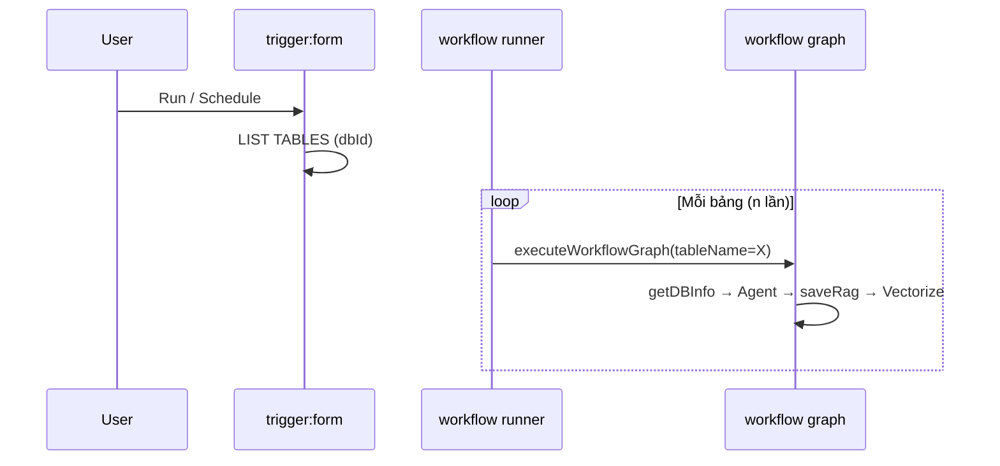

# Node: Database Form Trigger (`trigger:form`)

> **Trạng thái:** Draft (review)  
> **Runtime type:** `trigger` · **Kind:** `triggerKind: "form"` · **Form variant:** `formKind: "database"`  
> **Liên kết:** [`getDBInfo.md`](./getDBInfo.md) · [`schema.md`](./schema.md) · [`sqlexample.md`](./sqlexample.md) · [`rag-recipes.md`](./rag-recipes.md#bài-toán-3-db-schema-ingest--text-to-sql)  
> **Spec chính:** [`workflow-node-plugin-spec.md`](../workflow-node-plugin-spec.md)

Trigger **form** khai báo kết nối database và tham số chạy workflow. Với **Bài toán 3**, mỗi **bảng** trong DB tạo **một execution** riêng — output trigger truyền `dbId`, `tableName`, connection context xuống Agent và tool [`getDBInfo`](./getDBInfo.md).

---

## 1. Tóm tắt

| Thuộc tính | Giá trị |
|------------|---------|
| **ID** | `trigger:form` (database variant) |
| **Category** | `trigger` |
| **Vai trò** | Entry point — cấu hình DB + fan-out theo bảng |
| **Loại plugin** | Trigger + form config UI |
| **Khác webhook** | Không HTTP public — chạy từ editor / schedule / API nội bộ |
| **Fan-out** | `executionMode: per_table` → **n executions** cho n bảng |

---

## 2. Graph representation

```json
{
  "id": "trg_db",
  "type": "trigger",
  "position": { "x": 0, "y": 120 },
  "data": {
    "label": "DB Catalog Sync",
    "triggerKind": "form",
    "formKind": "database",
    "credentialKey": "cred_prod_pg",
    "connectionType": "hyperdrive",
    "databaseId": "analytics-db",
    "schemaName": "public",
    "executionMode": "per_table",
    "tableFilter": "*",
    "sampleRowLimit": 10,
    "sqlHistoryLimit": 10
  }
}
```

**Edge data-flow:**

```json
{
  "id": "e_trg_agent",
  "source": "trg_db",
  "target": "agent_schema",
  "sourceHandle": "out",
  "targetHandle": "in"
}
```

---

## 3. Handles

| Handle | Type | connectionType | Mô tả |
|--------|------|----------------|-------|
| `out` | source | main | Payload `{ dbId, tableName, connection, limits, … }` |

---

## 4. Config panel — Parameters

### 4.1 Kết nối database

| Field UI | `node.data` key | Type | Mô tả |
|----------|-----------------|------|-------|
| **Label** | `label` | text | Tên canvas |
| **Trigger kind** | `triggerKind` | select | `"form"` |
| **Form kind** | `formKind` | select | `"database"` |
| **Credential** | `credentialKey` | credential-picker | Workflow credential (DSN / token) — [`workflow credentials`](../workflow-how-it-works.md) |
| **Connection type** | `connectionType` | select | `d1` \| `hyperdrive` \| `postgres` \| `mysql` |
| **Database ID** | `databaseId` | text | Logical id (namespace Vectorize + audit) |
| **Schema name** | `schemaName` | text | `public`, `dbo`, … |

### 4.2 Fan-out & limits

| Field UI | `node.data` key | Type | Default | Mô tả |
|----------|-----------------|------|---------|-------|
| **Execution mode** | `executionMode` | select | `per_table` | `once` \| `per_table` |
| **Table filter** | `tableFilter` | text | `"*"` | Glob / CSV bảng; `*` = tất cả |
| **Sample rows** | `sampleRowLimit` | number | `10` | Truyền sang getDBInfo |
| **SQL history** | `sqlHistoryLimit` | number | `10` | Số query lịch sử / bảng |

**Execution mode:**

| Value | Hành vi |
|-------|---------|
| `per_table` | Liệt kê bảng → spawn **n workflow executions** (mỗi run 1 `tableName`) |
| `once` | Một execution; Agent/tool tự lặp bảng (không khuyến nghị BT3) |

---

## 5. Trigger output (mỗi execution)

Khi `executionMode: per_table`, **mỗi execution** output:

```json
{
  "triggerKind": "form",
  "formKind": "database",
  "dbId": "analytics-db",
  "schemaName": "public",
  "tableName": "orders",
  "connection": {
    "type": "hyperdrive",
    "credentialKey": "cred_prod_pg",
    "resolvedBinding": "HYPERDRIVE_ANALYTICS"
  },
  "limits": {
    "sampleRowLimit": 10,
    "sqlHistoryLimit": 10
  },
  "executionIndex": 3,
  "executionTotal": 12
}
```

Agent INPUT hiển thị object này ([`agent.md`](./agent.md) §4.1). Tool [`getDBInfo`](./getDBInfo.md) đọc `tableName` + connection từ đây.

---

## 6. Fan-out orchestration



| Thành phần | Trách nhiệm |
|------------|-------------|
| **Trigger runner** | `listTables(dbId)` → queue n jobs |
| **Mỗi job** | Cùng graph; `input` override `tableName` |
| **Vectorize namespace** | `{dbId}` — mọi bảng chung index, metadata `tableName` |

**Lưu ý:** n bảng = **n executions độc lập** (billing, log, retry per table). Không gom n bảng trong một Agent call.

---

## 7. Runtime (mục tiêu)

| Bước | File đích |
|------|-----------|
| Form validate + list tables | `nodes/trigger/form-database.ts` |
| Spawn per-table executions | `triggers/triggers.ts` hoặc `form-trigger-runner.ts` |
| Credential resolve | `storage/credentials.ts` |

**Hiện tại:** `triggerKind` trong registry chỉ có `manual` \| `webhook` \| `schedule` — cần thêm `form`.

---

## 8. Liên kết BT3

| Giai đoạn | Node / artifact |
|-----------|-----------------|
| Ingest (per table) | trigger → getDBInfo → Agent → [`schema.md`](./schema.md) + [`sqlexample.md`](./sqlexample.md) → saveRag |
| Query (NL → SQL) | webhook/manual → getRag → Agent → SQL output (như BT2) |

Chi tiết graph: [`rag-recipes.md` §3](./rag-recipes.md).

---

## Changelog

| Version | Date | Changes |
|---------|------|---------|
| 0.1 | 2026-06-13 | Draft — trigger form database + per_table fan-out |
