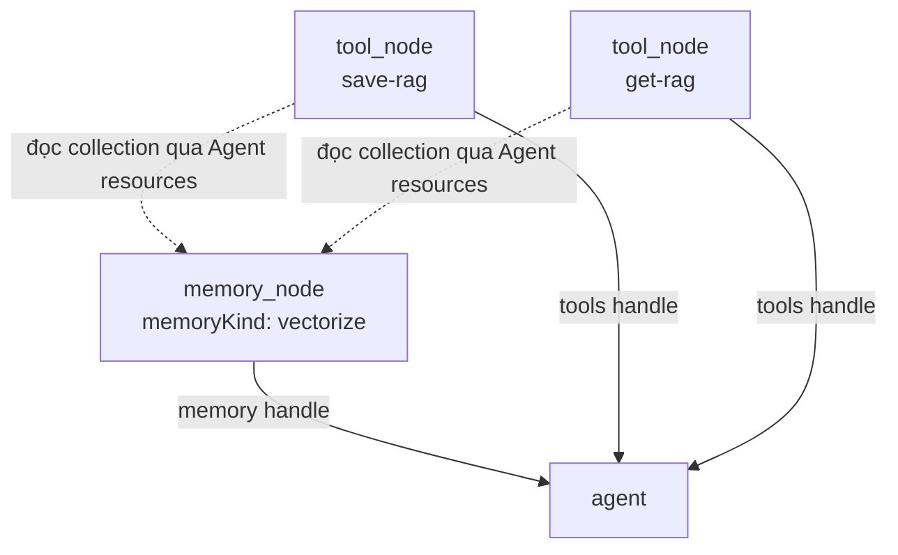

# Node: Vectorize (`memory_node:vectorize`)

> **Trạng thái:** Draft (review)  
> **Runtime type:** `memory_node` · **Kind:** `memoryKind: "vectorize"`  
> **Liên kết:** [`agent.md`](./agent.md) · [`service.md`](./service.md) · [`saveRag.md`](./saveRag.md) · [`getRag.md`](./getRag.md) · [`rag-recipes.md`](./rag-recipes.md)

Vectorize là **memory resource node** — khai báo index Vectorize mà Agent và các tool RAG (`saveRag`, `getRag`) dùng chung. Node **không** execute trên main chain.

---

## 1. Tóm tắt

| Thuộc tính | Giá trị |
|------------|---------|
| **ID** | `memory_node` (variant `vectorize`) |
| **Category** | `resource` |
| **Vai trò** | Binding + collection name cho read/write vector store |
| **Loại plugin** | Resource only (`skipExecution: true`) |
| **Nối tới Agent** | `memory_node.memory` → `agent.memory` (đứt nét, khuyến nghị cho RAG) |
| **Backend** | Cloudflare Vectorize (`env.VECTORIZE` hoặc binding theo `collection`) |

---

## 2. Graph representation

```json
{
  "id": "mem_kb",
  "type": "memory_node",
  "position": { "x": 480, "y": 280 },
  "data": {
    "label": "Knowledge Base",
    "memoryKind": "vectorize",
    "collection": "vectorize-default",
    "namespace": "pdf-ingest",
    "dimensions": 768,
    "metric": "cosine"
  }
}
```

**Edge tới Agent:**

```json
{
  "id": "edge_mem_agent",
  "source": "mem_kb",
  "target": "agent_1",
  "sourceHandle": "memory",
  "targetHandle": "memory",
  "style": { "strokeDasharray": "6 4" }
}
```

---

## 3. Handles

| Handle | Type | connectionType | Vị trí | Mô tả |
|--------|------|----------------|--------|-------|
| `memory` | source | resource | Trên (diamond) | Nối vào handle **Memory** của Agent |

---

## 4. Config panel — Parameters

| Field UI | `node.data` key | Type | Default | Mô tả |
|----------|-----------------|------|---------|-------|
| **Label** | `label` | text | `"Memory"` | Tên canvas |
| **Memory kind** | `memoryKind` | select | `"vectorize"` | Phải là `vectorize` cho spec này |
| **Collection** | `collection` | text | `"vectorize-default"` | Tên binding Vectorize trên Worker (`env[collection]`) |
| **Namespace** | `namespace` | text | `""` | Prefix metadata `namespace` — tách nhiều KB trong cùng index |
| **Dimensions** | `dimensions` | number | `768` | Chiều vector (khớp embedding model) |
| **Metric** | `metric` | select | `"cosine"` | `cosine` \| `euclidean` \| `dot-product` |

**Alias runtime:** `memoryCollection` = `collection` (Agent `node.data` có thể mirror giá trị này).

---

## 5. Runtime

| Hành vi | Trạng thái |
|---------|------------|
| Node tự execute | ❌ `skipExecution: true` |
| Inject collection vào Agent | ✅ `resolveAgentResources` → `memoryCollection`, `memoryKind` |
| Agent pre-fetch RAG (implicit) | ✅ `executeAgent` → `queryVectorMemory` khi có collection |
| Tool save/get RAG | ⚠️ Phase 2 — đọc cùng collection từ Agent memory edge |

**Metadata vector (chuẩn RAG):**

| Metadata key | Mô tả |
|--------------|-------|
| `text` / `content` | Chunk text (retrieve trả về) |
| `source` | URL / filename PDF |
| `documentId` | ID document |
| `chunkIndex` | Thứ tự chunk |
| `namespace` | Từ config node |

**Vectorize metadata (BT1 PDF / BT3 DB):**

| Key | BT1 | BT3 |
|-----|-----|-----|
| `namespace` | `pdf-ingest` | `{dbId}` |
| `docType` | — | `schema` \| `sqlexample` |
| `tableName` | — | bảng hiện tại |
| `source` | filename | `{dbId}.{table}.schema.md` |

Chi tiết artifact: [`schema.md`](./schema.md) · [`sqlexample.md`](./sqlexample.md)

---

## 6. Liên kết Agent ↔ Vectorize ↔ Tools



Tool RAG **không** nối trực tiếp dashed edge tới Vectorize — lấy `memoryCollection` + `namespace` từ `resolveAgentResources(agentId)`.

---

## 7. File map

| File | Vai trò |
|------|---------|
| `packages/workflow-nodes/src/nodes/builtins.ts` | Registry `memory_node` |
| `workers/web/.../nodes/workflow-nodes.tsx` | `MemoryWorkflowNode` |
| `workers/web/src/lib/n8n-workflow/descriptions/memory-node.ts` | n8n properties |
| `workers/auth-worker/.../engine/graph-helpers.ts` | Resolve memory |
| `workers/auth-worker/.../nodes/agent/execute.ts` | `queryVectorMemory` |
| `workers/auth-worker/.../agent-runtime.ts` | `retrieveMemory` |

---

## Changelog

| Version | Date | Changes |
|---------|------|---------|
| 0.1 | 2026-06-13 | Draft — Vectorize variant của memory_node |
