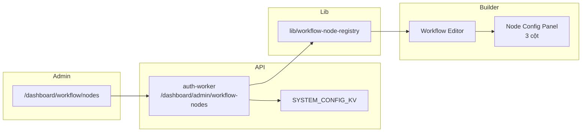

# Workflow — Kiến trúc & Hướng dẫn bảo trì

Tài liệu mô tả giải pháp workflow của AIAgentsHub: builder (React Flow), **Node Registry** (schema-driven), admin quản lý node, và API backend.

## Tổng quan

Hệ thống gồm **hai khu vực UI** và **một nguồn sự thật** cho định nghĩa node:

| Khu vực | Route | Vai trò |
|---------|-------|---------|
| **Workflow Builder** | `/dashboard/build/workflows` | Soạn thảo graph, chạy workflow, chat agent |
| **Workflow Admin** | `/dashboard/workflow/nodes` | Admin CRUD + thiết kế trường Input / Parameters / Output |
| **Node Registry** | API + KV | Lưu override admin, merge với defaults |



## Node Registry — Mô hình dữ liệu

Mỗi node trong registry có **3 phần** (theo phong cách n8n):

| Phần | `section.id` | Mục đích |
|------|--------------|----------|
| **Input** | `input` | Dữ liệu upstream, biến ngữ cảnh (`$now`, `$vars`, `$execution`, …) |
| **Parameters** | `parameters` | Cấu hình hành vi node (prompt, HTTP URL, toggle, …) |
| **Output** | `output` | Kết quả sau execute, mock data, nút Execute step |

### Loại trường (`WorkflowNodeFieldType`)

| Type | Mô tả |
|------|--------|
| `text` | Input một dòng |
| `textarea` | Văn bản nhiều dòng |
| `select` | Dropdown (có `options`) |
| `toggle` | Bật/tắt |
| `number` | Số |
| `json` | JSON editor |
| `expression` | Biểu thức (hỗ trợ `fx`) |
| `info` | Chỉ hiển thị, không nhập |
| `options-group` | Nhóm tham số tuỳ chọn |
| `resource-link` | Liên kết resource trên canvas (service / memory / tools) |

### Node built-in vs custom

- **Built-in** (`isBuiltin: true`): 12 node mặc định (agent, trigger, flow, core, …). Admin **không xoá** được, chỉ **mở rộng thêm trường** hoặc **tắt** (`isActive: false`).
- **Custom** (`isBuiltin: false`): Admin tạo mới hoàn toàn, có thể xoá.

Schema TypeScript: `workers/web/src/lib/workflow-node-registry/types.ts`

Defaults: `workers/web/src/lib/workflow-node-registry/default-nodes.ts`

**Agent node** có schema đầy đủ (prompt source, prompt fx, toggles, Chat Model / Memory / Tools) — tham chiếu layout n8n AI Agent.

## API Backend

**Worker:** `workers/auth-worker`  
**Route prefix:** `/dashboard/admin/workflow-nodes`  
**Lưu trữ:** `SYSTEM_CONFIG_KV`, key `aiagents-hub-workflow-node-registry`

| Method | Path | Quyền | Mô tả |
|--------|------|-------|--------|
| `GET` | `/` | Auth (mọi user) | Lấy registry đã merge defaults + overrides |
| `POST` | `/` | Admin | Tạo node custom |
| `PUT` | `/:id` | Admin | Cập nhật node (built-in → lưu override) |
| `DELETE` | `/:id` | Admin | Xoá node custom |

Code backend:

```
workers/auth-worker/src/features/admin/workflow-nodes/
├── domain.ts          # Zod schema
├── default-nodes.ts   # Defaults (mirror frontend)
├── infrastructure.ts  # KV load/save + merge
├── application.ts     # CRUD logic
└── presentation.ts    # Hono routes
```

Đăng ký route trong `workers/auth-worker/src/index.ts`.

## Admin UI

**Trang:** `/dashboard/workflow/nodes`  
**Yêu cầu:** role `admin` + step-up (xem `sensitive-step-up.ts`)

```
workers/web/src/app/(main)/dashboard/workflow/
├── nodes/page.tsx
└── _components/
    ├── node-management-page.tsx   # Danh sách + CRUD
    ├── node-form-dialog.tsx       # Form metadata + 3 tab section
    └── node-field-editor.tsx      # Thêm/sửa/xoá trường trong section
```

**Thao tác admin:**

1. **Sửa node built-in** — mở form → tab Input / Parameters / Output → thêm trường → Lưu.
2. **Tạo node custom** — nút «Thêm node» → khai báo `id`, `runtimeType`, category → thiết kế trường.
3. **Xoá** — chỉ node custom.

i18n namespace: `WorkflowNodeRegistry` (+ `WorkflowEditorPage` cho tên node có sẵn).

## Workflow Builder

### Cấu trúc thư mục `_components/`

```
_components/
├── catalogs/          # Danh mục add-node (core, flow, trigger, tool, memory, …)
│   └── index.ts
├── nodes/             # React Flow node components
│   ├── workflow-nodes.tsx
│   └── workflow-sticky-note-node.tsx
├── hooks/             # State, undo, collab, node registry
│   ├── use-workflow-canvas-state.ts
│   └── use-workflow-node-registry.ts
├── panels/
│   └── node-config/   # Panel cấu hình 3 cột
│       ├── workflow-node-config-panel.tsx
│       ├── node-config-io-panel.tsx
│       └── node-config-field-renderer.tsx
└── workflow-*.ts(x)   # Canvas, editor shell, edges, layout, …
```

Các file re-export ở root `_components/` (vd. `workflow-nodes.tsx` → `./nodes/workflow-nodes`) giữ **tương thích import cũ**.

### Node Config Panel (editor)

Khi user **double-click** node hoặc chọn menu **Open** trên node toolbar:

- **Trái:** INPUT (Schema / Table / JSON)
- **Giữa:** Parameters + Settings, nút **Execute step**
- **Phải:** OUTPUT

Panel đọc schema từ `useWorkflowNodeRegistry()` → `resolveNodeDefinition(runtimeType, kind)`.

File chính: `panels/node-config/workflow-node-config-panel.tsx`  
Tích hợp trong: `workflow-canvas.tsx`.

### Runtime vs UI catalog

| Lớp | Nguồn |
|-----|--------|
| **Executor** (`auth-worker`) | `node.type` + một số field trong `node.data` |
| **Registry / Config panel** | Schema từ Node Registry |
| **Add-node drawer** | `catalogs/*` (hardcoded, chưa đồng bộ 100% với registry) |

> **Lưu ý:** Một số sub-kind UI (vd. `coreKind: "http_request"` trên `type: "core"`) có thể khác `runtimeType` executor (`http_request`). Khi mở rộng, ưu tiên align `runtimeType` + `kind` trong registry.

## Thư viện dùng chung (frontend)

```
workers/web/src/lib/workflow-node-registry/
├── types.ts
├── default-sections.ts
├── default-nodes.ts
├── merge.ts           # Merge KV overrides + defaults
├── api.ts             # Client fetch CRUD
└── index.ts
```

Hook cache: `hooks/use-workflow-node-registry.ts` (prefetch khi mở editor).

## Lưu workflow (graph)

Workflow graph **không** lưu trong Node Registry. Mỗi workflow lưu JSON `definition` trên bảng `agent_workflows`:

```json
{
  "nodes": [{ "id", "type", "position", "data": {} }],
  "edges": [{ "id", "source", "target" }]
}
```

Node types hợp lệ (Zod): `workers/auth-worker/src/features/member/workflows/domain.ts` → `WorkflowNodeTypeSchema`.

## Hướng dẫn mở rộng

### Thêm trường cho node built-in (admin)

1. Vào `/dashboard/workflow/nodes` → chọn node → Sửa.
2. Tab tương ứng → **Thêm trường** → khai báo `id`, `type`, `labelKey`.
3. Thêm key i18n vào `messages/en-US.json` và `vi-VN.json` (namespace `WorkflowNodeRegistry`).
4. Lưu — override ghi vào KV, merge khi `GET` registry.

### Thêm node custom mới

1. Admin tạo node với `runtimeType` trùng executor (hoặc mở rộng executor trước).
2. Thiết kế 3 section trong form.
3. (Tuỳ chọn) Thêm React component canvas trong `nodes/workflow-nodes.tsx` + đăng ký `workflowNodeTypes`.

### Thêm node built-in mặc định (code)

1. Bổ sung entry trong `default-nodes.ts` (web **và** auth-worker).
2. Thêm `WorkflowNodeTypeSchema` nếu là type executor mới.
3. Implement case trong `executor.ts`.
4. Thêm i18n + component canvas nếu cần.

## Deploy

Cần deploy **cả hai**:

- `workers/auth-worker` — API `/dashboard/admin/workflow-nodes`
- `workers/web` — Admin UI + Node Config Panel

KV `SYSTEM_CONFIG_KV` đã dùng cho system-config; node registry dùng key riêng, **không cần migration D1**.

## Roadmap gợi ý

- [ ] Đồng bộ add-node drawer (`catalogs/`) với Node Registry API
- [ ] Execute step thật theo từng node (hiện mới có UI)
- [ ] Align `coreKind` / `flowKind` UI với `runtimeType` executor
- [ ] Gói shared types vào `packages/` để tránh duplicate `default-nodes` web ↔ auth-worker

## Liên quan

| Thành phần | Đường dẫn |
|------------|-----------|
| Workflow API (graph CRUD, execute) | `workers/auth-worker/src/features/member/workflows/` |
| Admin tools / memory (catalog tĩnh) | `/dashboard/workflow/tools`, `/memory` |
| Service management (CRUD thật) | `/dashboard/workflow/services` |
